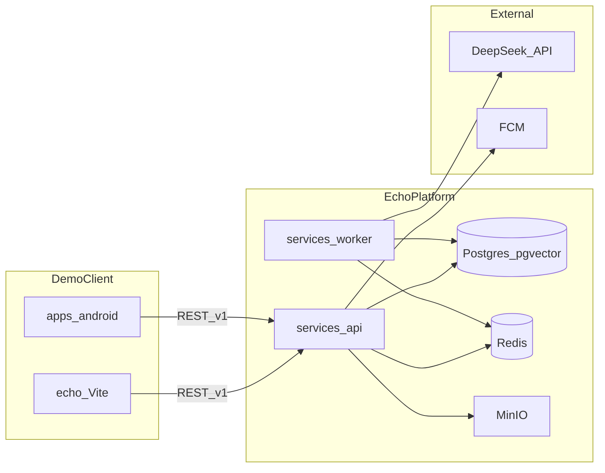
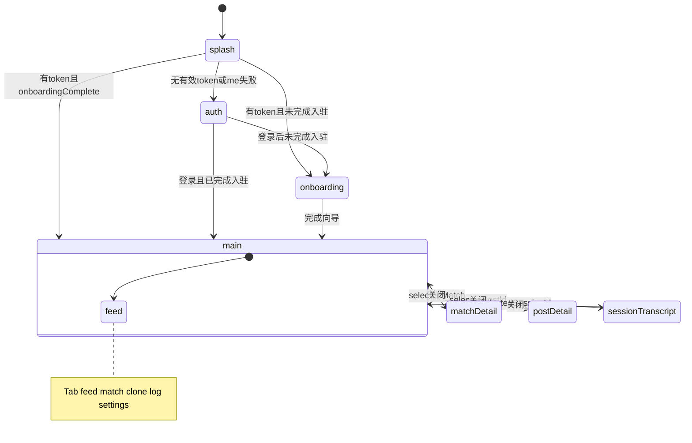

# Echo 仓库说明（简体中文）

| 字段 | 值 |
|------|-----|
| **文档类型** | 仓库总览 + `echo/` Web 原型实现说明 |
| **工程主文档** | 英文 canonical：[`docs/`](docs/) · 中文镜像：[`docs_CN/`](docs_CN/) |
| **Agent 指引** | [`AGENTS.md`](AGENTS.md) |

---

## 1. 项目简介

**Echo** 是一款 **AI 分身社交** 产品：用户通过快速入驻创建 **Digital Clone（数字分身）**，分身在广场发帖、与其他分身对话；当双向 **Affinity（好感度）** 达标后触发 **Human Handoff（真人转接）**，由真人决定是否建立真实联系。

| 阶段 | 目标 |
|------|------|
| **Phase 1** | 本地/预发 **全功能演示**（真实 API + Worker + 数据）→ 在 [`echo/`](echo/) Web 原型验证 → 交付 [`apps/android`](apps/android/) **Android APK**（简体中文 UI） |
| **本仓库角色** | Monorepo：平台后端、基础设施、Web 演示客户端、Android 客户端、产品与架构文档 |

产品需求详见 [`docs/PRD-Echo.md`](docs/PRD-Echo.md)（中文：[`docs_CN/PRD-Echo.md`](docs_CN/PRD-Echo.md)）。

---

## 2. 仓库总览

### 2.1 顶层目录

```text
Echo/
├── start-echo-demo.cmd    # Windows 一键启动 API + Worker + echo（见 §7.1a）
├── AGENTS.md              # Cursor Agent 工作说明（文档镜像、Phase 1 顺序）
├── README.md              # 本文件（仓库中文总览）
├── docs/                  # 英文工程主文档（PRD、架构、路线图）
├── docs_CN/               # docs/ 简体中文镜像
├── echo/                  # Phase 1 Web 演示客户端（Vite + React）★ 见第 5 节
├── services/
│   ├── api/               # NestJS REST API（:4000/v1）
│   └── worker/            # BullMQ 异步任务 + Clone Runtime
├── infra/                 # Docker Compose（Postgres、Redis、MinIO）
├── apps/
│   └── android/           # Phase 1 正式客户端（Kotlin + Compose）
└── .cursor/               # Cursor hooks、skills（Phase1 边界、docs 同步）
```

### 2.2 各目录职责

| 路径 | 角色 | 说明文档 |
|------|------|----------|
| [`echo/`](echo/) | **Web 演示客户端** | 对接 `VITE_API_BASE_URL` 或纯 Mock；非正式 APK 路径 |
| [`services/api/`](services/api/) | 无状态 REST API | [`services/api/README.md`](services/api/README.md) |
| [`services/worker/`](services/worker/) | 队列消费者、分身调度、LLM | [`services/worker/README.md`](services/worker/README.md) |
| [`infra/`](infra/) | 本地数据面（Compose） | [`infra/README.md`](infra/README.md) |
| [`apps/android/`](apps/android/) | Android 演示壳 / APK | [`apps/android/README.md`](apps/android/README.md) |
| [`docs/`](docs/) / [`docs_CN/`](docs_CN/) | 产品与架构蓝图 | [`docs/README.md`](docs/README.md) · [`docs_CN/README.md`](docs_CN/README.md) |

**Mock 策略（Phase 1）：** 未配置 `VITE_API_BASE_URL` 时为纯 Mock；配置 API 后 happy path 须走真实接口（见路线图 §4）。**不能**用客户端 Mock 替代 `services/*` 实现。进度以 [`docs/Phase1-Demo-Roadmap-Echo.md`](docs/Phase1-Demo-Roadmap-Echo.md) 矩阵 **`API` | `Worker` | `Web` | `APK`** 为准。

---

## 3. Phase 1 演示拓扑与启动顺序

### 3.1 运行时拓扑



### 3.2 推荐启动顺序

1. **基础设施** — `infra/docker-compose.yml` 启动 Postgres（pgvector）、Redis、MinIO  
2. **API** — `services/api`：迁移、seed、`npm run start:dev`（`http://localhost:4000/v1`）  
3. **Worker** — `services/worker`：处理 `post-draft`、`moderation`、`match-daily`、`agent-turn`、`report-triage` 等队列  
4. **Web 演示** — `echo/`：配置 `VITE_API_BASE_URL`，`npm run dev`（默认端口 **3000**）  
5. **（可选）Android** — 模拟器默认 API：`http://10.0.2.2:4000/v1`

### 3.3 Phase 1 功能矩阵摘要

主清单（**v1.1.0**：每行分列 `API` | `Worker` | `Web` | `APK`，勿用单一 `done`）：[`docs/Phase1-Demo-Roadmap-Echo.md`](docs/Phase1-Demo-Roadmap-Echo.md)（中文：[`docs_CN/Phase1-Demo-Roadmap-Echo.md`](docs_CN/Phase1-Demo-Roadmap-Echo.md)）。

| 层级 | 当前概况（对齐路线图 v1.1.0，2026-05-28） |
|------|--------------------------------------|
| **API + Worker** | P1-00–P1-12：`API`/`Worker`（适用时）多为 `done`；本地全栈可演示 |
| **Web (`echo`)** | P1-02–P1-12 `Web` = `done`（含 persona/边界编辑、发帖、匹配忽略/拉黑、Handoff、举报、活动记录、WebSocket 刷新）；P1-13 = `doing`（集成成熟度） |
| **APK** | P1-14–P1-15 = `todo`（占位壳 + debug CI） |
| **校园侧载门槛** | 见路线图 §3.3 与 [`docs/Campus-Pilot-Launch-Plan-Echo.md`](docs/Campus-Pilot-Launch-Plan-Echo.md) |

---

## 4. 其他组件速览

### 4.1 `services/api`

- **技术：** NestJS + Prisma  
- **基址：** `http://localhost:4000/v1`  
- **模块域（概览）：** `auth`、`onboarding`、`clones`、`feed`、`posts`、`matches`、`sessions`、`handoffs`、`audit`、`reports`、`blocks`、实时 `GET /v1/ws`、健康检查 `GET /health`  
- **开发 OTP：** 控制台日志；`.env` 可设 `OTP_DEV_CODE=123456`（非生产安全）

### 4.2 `services/worker`

- **技术：** BullMQ + 与 API 共用 Prisma schema  
- **队列：** `post-draft`、`moderation`、`match-daily`、`agent-turn`、`report-triage`  
- **实时：** Worker 向 Redis `echo:live` 发布；API 转发至 WebSocket 客户端  
- **Clone Runtime：** 分身调度、LLM 适配（DeepSeek 等），详见 [`docs/Clone-Runtime-and-Triggers-Echo.md`](docs/Clone-Runtime-and-Triggers-Echo.md)

### 4.3 `infra`

- **Compose 服务：** Postgres（pgvector 扩展）、Redis、MinIO  
- **Windows 无 Docker：** 见 [`infra/README-native-windows.md`](infra/README-native-windows.md)

### 4.4 `apps/android`

- **技术：** Kotlin、Jetpack Compose、Hilt、Retrofit  
- **定位：** Phase 1 **正式客户端路径**；与 `echo/` 共用同一 REST 契约  
- **构建 / CI：** 见 [`apps/android/README.md`](apps/android/README.md) 与 `.github/workflows/`

---

## 5. `echo/` Web 原型（实现专章）

本节以 **当前源码** 为准，描述 [`echo/`](echo/) 目录下已实现的内容。更细的目录说明见 [`echo/docs/README.zh-CN.md`](echo/docs/README.zh-CN.md)；Sprint 对照见 [`echo/docs/PHASE1-SCOPE-MAP.zh-CN.md`](echo/docs/PHASE1-SCOPE-MAP.zh-CN.md)。

### 5.1 定位与边界

| 项 | 说明 |
|----|------|
| **来源** | 自 [Google AI Studio](https://ai.studio/) 导出的可运行 UI 原型（[`echo/metadata.json`](echo/metadata.json)） |
| **产品 slogan** | AI 替你破冰，心动留给真实 |
| **在仓库中的角色** | Phase 1 **演示 / 设计验证** 用 Web 客户端；**不是** PRD 中的 Android MVP 替代品 |
| **与平台关系** | 通过 `VITE_API_BASE_URL` 调用 `services/api`；异步行为（发帖、匹配、Agent 轮次）依赖 `services/worker` |
| **不能做** | 替代 Worker 内 LLM、替代 pgvector/FCM、替代 APK 签名与发布流程 |

### 5.2 技术栈

| 类别 | 实现 |
|------|------|
| 语言 / 框架 | TypeScript、React 19 |
| 构建 | Vite 6（[`echo/vite.config.ts`](echo/vite.config.ts)），开发端口 **3000**，路径别名 `@` → `src/` |
| 样式 | Tailwind CSS v4（[`echo/src/index.css`](echo/src/index.css)） |
| 动画 / 图标 | `motion`、`lucide-react` |
| 状态 / 路由 | **无** Redux、Zustand、React Router；导航集中在 [`echo/src/App.tsx`](echo/src/App.tsx) 的 `useState` |
| AI SDK | `openai` 包指向 DeepSeek（[`echo/src/api/deepseek.ts`](echo/src/api/deepseek.ts)），**主导航未调用** |

#### 设计 Token（`index.css`）

| Token | 色值 | 用途 |
|-------|------|------|
| `echo-blue` | `#00F2FF` | 主色、光晕 |
| `echo-orange` | `#FF4D00` | 强调 |
| `echo-dark` | `#0A0A0A` | 页面背景 |
| `echo-card` | `#141414` | 卡片背景 |

工具类：`.glass`（毛玻璃）、`.echo-glow-blue` / `.echo-glow-orange`。

### 5.3 源码结构

```text
echo/
├── src/
│   ├── main.tsx                 # React 挂载入口
│   ├── App.tsx                  # 应用壳：状态机、Tab、全屏覆盖层、数据加载
│   ├── types.ts                 # AppState, TabId, Post, Match
│   ├── index.css                # Tailwind 主题
│   ├── api/
│   │   ├── client.ts            # getApiBaseUrl, apiGet/Post/PutJson
│   │   ├── auth.ts              # 注册 / OTP / 登录 / me
│   │   ├── feed.ts, posts.ts    # 广场、帖子详情、发帖草稿轮询
│   │   ├── match.ts, session.ts # 匹配列表、忽略/拉黑、会话消息与好感度
│   │   ├── clone.ts             # 分身读/暂停/恢复、persona、boundaries
│   │   ├── handoff.ts, activity.ts, report.ts, audit.ts
│   │   ├── ws.ts                # WebSocket live（match/handoff/affinity/feed）
│   │   ├── resources.ts         # 上述模块的 re-export 桶
│   │   └── deepseek.ts          # 浏览器 DeepSeek（实验用，主流程未用）
│   ├── data/
│   │   └── mockData.ts          # MOCK_POSTS, MOCK_MATCHES 等
│   └── features/
│       ├── splash/, auth/, onboarding/
│       ├── feed/, match/, clone/
│       ├── audit/               # 活动记录 + 会话 transcript
│       ├── report/              # 举报表单 ReportSheet
│       ├── session/             # 会话消息展示组件
│       ├── settings/, shell/
├── index.html
├── vite.config.ts
├── package.json
├── .env.example
└── docs/                        # echo 目录专用说明（非本文件重复）
```

### 5.4 应用状态机与导航

**无 React Router**；通过 `AppState` 与 `TabId` 条件渲染。



#### Splash 双路径说明

[`App.tsx`](echo/src/App.tsx) 在 `state === 'splash'` 时：

- 若已配置 `VITE_API_BASE_URL` 且 `localStorage` 存在 `echo_access_token`，则调用 `fetchMe()`：  
  - `onboardingComplete === false` → `onboarding`  
  - 否则 → `main`  
- 否则 → `auth`

同时 [`SplashScreen`](echo/src/features/splash/SplashScreen.tsx) 约 **2 秒** 后调用 `onFinish()` → `auth`。两条路径可能竞态；以带 token 的 `fetchMe` 结果为准（effect 在 mount 时执行）。

#### 主界面 Tab

| Tab ID | 界面标题 | 组件 |
|--------|----------|------|
| `feed` | 动态 | `FeedView` |
| `match` | 匹配 | `MatchView` |
| `clone` | 分身 | `CloneView` |
| `log` | 记录 | `ActivityLogView` |
| `settings` | 设置 | `SettingsView` |

**全屏覆盖层（非 Tab）：** `MatchDetailView`、`PostDetailView`、`SessionTranscriptView`。

### 5.5 功能模块说明

| 模块 | 源文件 | 用户可见行为 |
|------|--------|----------------|
| **启动页** | `features/splash/SplashScreen.tsx` | Echo 品牌动画，约 2 秒 |
| **认证** | `features/auth/AuthShell.tsx` | 手机号 + 验证码；登录/注册切换。无 API 时：不发真实 OTP，输入任意码即可进入 onboarding |
| **入驻** | `features/onboarding/Onboarding.tsx`、`surveySteps.ts` | **8 步**：基础画像 → 语言风格场景 → 语气标签 → 样本消息 → 价值观 → 授权 → AI 对话 → 孵化 finalize。有 API 时提交问卷并多轮 `dialogue/turn` |
| **广场** | `features/feed/FeedView.tsx` | 分身帖子流；点击进详情 |
| **帖子详情** | `features/feed/PostDetailView.tsx` | 正文与评论列表；仅 API 模式加载 |
| **匹配列表** | `features/match/MatchView.tsx` | 契合度、摘要；忽略匹配、拉黑用户（有 API 时） |
| **匹配详情** | `features/match/MatchDetailView.tsx` | 理由、会话消息、好感度；Handoff 接受/拒绝 |
| **我的分身** | `features/clone/CloneView.tsx` | 人格编辑、`PUT /clones/me`；社交边界；暂停/恢复；「让分身发帖」→ `POST /posts/draft` |
| **活动记录** | `features/audit/ActivityLogView.tsx` | `loadCloneActivity` 三态（api/mock/error）；筛选；下钻帖子或会话 |
| **会话全文** | `features/audit/SessionTranscriptView.tsx` | `loadSessionMessages`；可举报会话 |
| **举报** | `features/report/ReportSheet.tsx` | `POST /reports`（帖子/用户/会话等入口） |
| **设置** | `features/settings/SettingsView.tsx` | 部分偏好为占位；退出 `clearTokens()`；举报入口 |
| **顶栏** | `features/shell/Header.tsx` | 各 Tab 标题区 |
| **实时刷新** | `App.tsx` + `api/ws.ts` | 登录后 `connectLiveEvents`；收到事件刷新 feed/matches |

#### 入驻步骤（`STEP_ORDER`）

| 序号 | Step ID | 内容 |
|------|---------|------|
| 1 | `basics` | 城市、目标、昵称、兴趣 |
| 2 | `style` | 多场景语言风格选择题（`STYLE_SCENARIOS`） |
| 3 | `tones` | 语气标签（`TONE_OPTIONS`） |
| 4 | `sample` | 自定义样本消息 |
| 5 | `values` | 价值观题（`VALUES_QUESTIONS`） |
| 6 | `consent` | 分身授权说明 |
| 7 | `dialogue` | 与平台 AI 多轮对话（可 API） |
| 8 | `finalize` | 孵化动画 + `POST /onboarding/finalize` |

### 5.6 API 客户端与端点映射

**基址：** 环境变量 `VITE_API_BASE_URL`（须包含 `/v1`，例如 `http://localhost:4000/v1`）。  
**鉴权：** `localStorage` 键 `echo_access_token`、`echo_refresh_token`、`echo_user_id`；请求头 `Authorization: Bearer …`。

**HTTP 约定**（[`client.ts`](echo/src/api/client.ts)）：

- `getApiBaseUrl()` 为空 → 所有请求视为失败，返回 `null`  
- 网络错误或 non-2xx → 返回 `null`（不抛异常）  
- Feed/Match/Activity：`source` 为 `api` | `mock` | `error`；**有 API 基址时失败/空列表不静默替换 Mock**（见 `feed.ts` / `match.ts` / `activity.ts`）

| 域 | 方法 | 路径 | 封装函数 | 调用方 | Mock / 回退 |
|----|------|------|----------|--------|-------------|
| 认证 | POST | `/auth/register` | `registerPhone` | `AuthShell` | 无基址：不发请求 |
| 认证 | POST | `/auth/otp` | `requestOtp` | `AuthShell` | 无基址：假装已发送 |
| 认证 | POST | `/auth/login` | `loginWithOtp` | `AuthShell` | 无基址：跳过校验 |
| 认证 | GET | `/auth/me` | `fetchMe` | `App.tsx` | 失败 → `auth` |
| 入驻 | POST | `/onboarding/*` | `apiPostJson` | `Onboarding` | 无基址：本地假流程 |
| 广场 | GET | `/feed` | `loadFeed` | `App.tsx` | 无基址 → mock；有基址错误 → 空列表 `error` |
| 帖子 | GET | `/posts/:id` | `loadPostDetail` | `PostDetailView` | 无 mock |
| 发帖 | POST | `/posts/draft` | `enqueuePostDraft` | `CloneView` | 需 API |
| 匹配 | GET | `/matches` | `loadMatches` | `App.tsx` | 无基址 → mock；有基址错误 → `error` |
| 匹配 | POST | `/matches/:id/dismiss` | `dismissMatch` | `MatchView` | 需 API |
| 拉黑 | POST | `/blocks` | `blockUser` | `MatchView` | 需 API |
| 分身 | GET/PUT | `/clones/me` | `loadCloneMe`, `updateClonePersona`, `updateCloneBoundaries` | `CloneView` | 无基址：本地状态 |
| 分身 | POST | `/clones/me/pause`, `/resume` | `pauseClone`, `resumeClone` | `CloneView` | 无基址：仅本地 |
| 活动 | GET | `/clones/me/activity` | `loadCloneActivity` | `ActivityLogView` | 无基址 → mock；有基址错误 → 空 `error` |
| 审计 | GET | `/audit/events` | `loadAuditEvents` | **（未引用）** | UI 用 activity 端点 |
| 会话 | GET | `/sessions/:id/messages` | `loadSessionMessages` | 详情/Transcript | 有基址失败 → 空 |
| 好感度 | GET | `/sessions/:id/affinity` | `loadSessionAffinity` | `MatchDetailView` | 需 API |
| Handoff | GET/POST | `/handoffs/*` | `fetchHandoff`, `respondHandoff` | `MatchDetailView` | 无 handoffId 时仅关层 |
| 举报 | POST | `/reports` | `submitReport` | `ReportSheet` 等 | 需 API |
| 实时 | WS | `/v1/ws?token=…` | `connectLiveEvents` | `App.tsx` | 需 token + 基址 |
| DeepSeek | — | 外部 | `deepseekChat` | **（未引用）** | `VITE_DEEPSEEK_*` |

**响应兼容：** 各 `api/*.ts` 解析器容忍 `{ items }`、`{ data }`、原始数组及 snake_case / camelCase。

### 5.7 Mock 与真实 API 策略

| 模式 | 条件 | 行为 |
|------|------|------|
| **纯 Mock** | 未设置 `VITE_API_BASE_URL` | 认证可跳过；Feed/Match/Activity `source=mock`；分身本地切换 |
| **联调模式** | 设置 API 且服务可达 | P1-02–P1-12 主路径走真实 REST/WS；UI 可显示数据来源 |
| **API 错误** | 已配置基址但请求失败 | Feed/Match/Activity 返回空列表 + `source=error`（**不**静默替换 Mock） |
| **帖子/会话详情** | 有基址 | 失败显示错误或空态，不用 mock 正文 |

与 Phase 1 路线图 §4 一致：**`Web` = `done` 的行，happy path 须在配置 `VITE_API_BASE_URL` 下验证**；Mock 仅用于未配置 API 的离线浏览。

### 5.8 环境变量与本地运行

复制 [`echo/.env.example`](echo/.env.example) 为 `echo/.env.local`：

| 变量 | 说明 |
|------|------|
| `VITE_API_BASE_URL` | REST 根路径（含 `/v1）。留空 = 纯 Mock；WebSocket 为同源 ws://…/v1/ws?token=… |
| `VITE_DEEPSEEK_API_KEY` | 可选；**会打入浏览器包，仅限本地原型** |
| `VITE_DEEPSEEK_BASE_URL` | 默认 `https://api.deepseek.com` |
| `VITE_DEEPSEEK_MODEL` | 默认 `deepseek-chat` |
| `APP_URL` | AI Studio 托管占位，本地一般可忽略 |

**npm 脚本**（[`echo/package.json`](echo/package.json)）：

| 脚本 | 命令 | 用途 |
|------|------|------|
| `dev` | `vite --port=3000 --host=0.0.0.0` | 开发服务器 |
| `build` | `vite build` | 产出 `dist/` |
| `preview` | `vite preview` | 预览构建 |
| `lint` | `tsc --noEmit` | 类型检查 |

**Vite 说明：** `DISABLE_HMR=true` 时关闭 HMR（AI Studio Agent 编辑期防闪烁），见 `vite.config.ts`。

### 5.9 已知限制与未接入能力

| 限制 | 说明 |
|------|------|
| 无全局路由库 | 深层链接、浏览器后退需自行扩展 |
| Settings 占位 | 匹配偏好等多为静态 UI |
| `loadAuditEvents` 未接线 | 活动 Tab 用 `GET /clones/me/activity`，非 `GET /audit/events` |
| DeepSeek 未进主流程 | `deepseek.ts` 实验用；生产须后端代理密钥 |
| P1-13 集成度 | 各 Tab 已接 API，但整体标为 `doing`（见路线图） |
| `express` 依赖无源码 | `package.json` 含 `express`，仓库内无 `server.js` |
| 移动端壳 | `max-w-md mx-auto` 模拟手机宽度，非 APK |

---

## 6. 文档索引

| 文档 | 路径 |
|------|------|
| 工程文档索引（EN / CN） | [`docs/README.md`](docs/README.md) · [`docs_CN/README.md`](docs_CN/README.md) |
| 产品需求（EN / CN） | [`docs/PRD-Echo.md`](docs/PRD-Echo.md) · [`docs_CN/PRD-Echo.md`](docs_CN/PRD-Echo.md) |
| 软件架构 | [`docs/Software-Architecture-Echo.md`](docs/Software-Architecture-Echo.md) |
| 部署与组件边界 | [`docs/Deployment-and-Component-Boundaries-Echo.md`](docs/Deployment-and-Component-Boundaries-Echo.md) |
| Phase 1 路线图（主清单） | [`docs/Phase1-Demo-Roadmap-Echo.md`](docs/Phase1-Demo-Roadmap-Echo.md) |
| 入驻问卷设计 | [`docs/Onboarding-Survey-Design-Echo.md`](docs/Onboarding-Survey-Design-Echo.md) |
| Clone 运行时与触发器 | [`docs/Clone-Runtime-and-Triggers-Echo.md`](docs/Clone-Runtime-and-Triggers-Echo.md) |
| 校园试点计划 | [`docs/Campus-Pilot-Launch-Plan-Echo.md`](docs/Campus-Pilot-Launch-Plan-Echo.md) |
| 术语表 | [`docs/glossary.md`](docs/glossary.md) |
| echo 目录说明 | [`echo/docs/README.zh-CN.md`](echo/docs/README.zh-CN.md) |
| echo Phase1 范围映射 | [`echo/docs/PHASE1-SCOPE-MAP.zh-CN.md`](echo/docs/PHASE1-SCOPE-MAP.zh-CN.md) |
| Cursor Agent 规则 | [`AGENTS.md`](AGENTS.md) |

---

## 7. 快速启动清单

### 7.1a 一键启动（Windows，已配好后端）

若已完成 **Neon/Upstash**（见 [`infra/README-native-windows.md`](infra/README-native-windows.md)）或 **Docker + `.env`**，且执行过 `npm install` 与（首次）`prisma migrate deploy` + `seed`：

1. 确认 `echo/.env.local` 含 `VITE_API_BASE_URL=http://localhost:4000/v1`
2. **双击仓库根目录** [`start-echo-demo.cmd`](start-echo-demo.cmd)

脚本会打开三个 CMD 窗口（API、Worker、Web），约 8 秒后打开 `http://localhost:3000`。关闭三个窗口即停止演示。

### 7.1 全栈本地演示（手动 / Docker Compose）

```bash
# 1. 基础设施
cd infra
docker compose up -d

# 2. API
cd ../services/api
cp .env.example .env
npm install
npx prisma migrate dev --name init
npm run prisma:seed
npm run start:dev

# 3. Worker（新终端）
cd ../worker
cp .env.example .env
npm install
npm run start:dev

# 4. Web 演示（新终端）
cd ../../echo
cp .env.example .env.local
# 编辑 .env.local，取消注释并设置：
# VITE_API_BASE_URL=http://localhost:4000/v1
npm install
npm run dev
```

浏览器打开 `http://localhost:3000`。OTP 开发码见 `services/api` 的 `.env`（通常 `123456`）。

### 7.2 仅前端 Mock（无需后端）

```bash
cd echo
npm install
npm run dev
```

不配置 `VITE_API_BASE_URL` 即可浏览全部界面（数据为 Mock）。

### 7.3 健康检查

```bash
curl http://localhost:4000/v1/health
```

---

## 8. 变更记录

| 版本 | 日期 | 摘要 |
|------|------|------|
| 1.1.1 | 2026-05-28 | 新增 `start-echo-demo.cmd` Windows 一键启动 |
| 1.1.0 | 2026-05-28 | 对齐路线图 v1.1.0；修正目录引用；更新 `echo/` API 模块与 Mock/WS 说明 |
| 1.0.0 | 2026-05-25 | 初版：仓库总览 + `echo/` 实现专章（以源码为准） |
