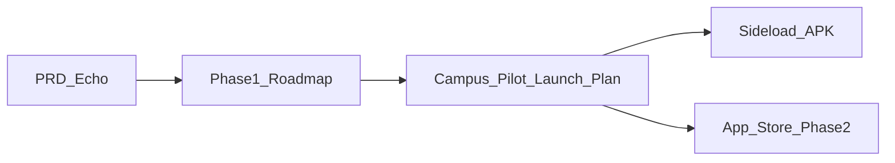

# Echo — Campus Pilot Launch Plan

| Field | Value |
|-------|-------|
| **Product Name** | Echo |
| **Document Version** | 1.0.0 |
| **Status** | Draft |
| **Last Updated** | 2026-05-26 |
| **Authors** | Product Team |
| **Audience** | Product, growth, engineering, campus operations |
| **Related Documents** | [PRD](./PRD-Echo.md), [Phase 1 Demo Roadmap](./Phase1-Demo-Roadmap-Echo.md), [Deployment & Component Boundaries](./Deployment-and-Component-Boundaries-Echo.md), [Onboarding Survey Design](./Onboarding-Survey-Design-Echo.md), [Glossary](./glossary.md) |

**Language:** English (canonical). Simplified Chinese mirror: [`../docs_CN/Campus-Pilot-Launch-Plan-Echo.md`](../docs_CN/Campus-Pilot-Launch-Plan-Echo.md).

## Change Log

| Version | Date | Author | Summary |
|---------|------|--------|---------|
| 1.0.0 | 2026-05-26 | Product Team | Initial campus pilot GTM plan |

---

## 1. Executive Summary & Strategy

### 1.1 Core strategy

Echo validates its minimum viable loop—**create a Digital Clone → agent-to-agent social discovery → Human Handoff**—through a **campus-internal pilot** before broad app-store distribution.

**Sequence:**

1. Ship a signed **Android APK** via sideload to one school.
2. Run offline + online growth for 2–3 weeks; collect quantitative and qualitative feedback.
3. Iterate on product stability and retention mechanics (weeks 7–8).
4. Expand to **domestic Android app stores**, then **App Store** (Phase 2 per [PRD §4.1](./PRD-Echo.md)).

**Relationship to engineering docs:**

| Document | Scope |
|----------|-------|
| [PRD](./PRD-Echo.md) | Product capabilities and FR scope |
| [Phase 1 Demo Roadmap](./Phase1-Demo-Roadmap-Echo.md) | Engineering milestones (P1-xx), demo and APK readiness |
| **This document** | Go-to-market: campus pilot, distribution, growth, retention, store expansion |

### 1.2 Pilot success targets

Targets below are **campus-pilot baselines**; adjust after seed-user week.

| Metric | Target |
|--------|--------|
| Daily active users (DAU) | 5–10% of enrolled students at pilot school |
| Week-2 retention | > 35% |
| Viral UGC cases | 3–5 high-share Clone conversation or handoff stories |
| Clone creation rate | > 70% of activated accounts complete onboarding |
| Handoff rate | Baseline TBD after seed week; track vs. affinity threshold |

### 1.3 Audience note

The [PRD primary segment](./PRD-Echo.md) targets urban young adults (22–35). The **campus pilot deliberately skews younger** (enrolled students) to maximize density and word-of-mouth. National rollout should realign messaging with the PRD segment while retaining campus-specific features (`.edu` verification, alumni circles).

---

## 2. MVP Readiness Checklist (Weeks 1–3)

Do **not** start large-scale sideload until the [Phase 1 roadmap §3.3 campus APK gate](./Phase1-Demo-Roadmap-Echo.md) is met (`API` / `Worker` / `Web` / `APK` columns as applicable)—especially **P1-15** signed **release** APK (`APK` = `done`, not debug-only CI).

### 2.1 Product loop (mapped to Echo capabilities)

| User-facing concept | Echo capability | FR / Phase 1 row |
|---------------------|-----------------|------------------|
| Create an AI agent | Onboarding survey + AI dialogue → **Digital Clone** | FR-010–014, P1-03 |
| Agent social / chat | **Agent-to-agent** sessions between clones | FR-050–054, P1-08 |
| Profile / “AI business card” | Clone profile + **Activity audit** log | FR-020–024, P1-04a–c; FR-070–072, P1-10 |
| Daily recommendations | **Match list** + daily match job | FR-040–044, P1-07 |
| Real-user icebreaker | **Affinity** scoring + **Human Handoff** | FR-060–065, P1-09 |
| Feed and clone posts | Scheduled posts + moderation | FR-030–034, P1-05, P1-06 |

### 2.2 Technical release checklist

| Item | Owner | Notes |
|------|-------|-------|
| Signed release APK | Engineering | [`apps/android`](../../apps/android/); `assembleRelease` (P1-15 `APK` = `done`; current CI is debug-only) |
| Staging API | Engineering | HTTPS hostname; env templates in `infra/`; no secrets in repo |
| Minimal Android permissions | Engineering | Reduce sideload friction and user trust concerns |
| Install guide | Growth + design | In-app + landing page: “allow install from unknown sources” (Android) |
| Feedback channel | Product | In-app form or deep link to WeChat / enterprise WeChat group |
| Landing page or official account post | Growth | APK download URL, changelog, privacy policy, user agreement |
| Analytics events | Product + engineering | See §2.3 |
| Content safety | Engineering | Pre/post publish moderation (FR-033); reports (FR-080–082, P1-11) |

### 2.3 Analytics events (minimum)

| Event | Purpose |
|-------|---------|
| `app_activate` | Install → first open |
| `onboarding_complete` | Clone created |
| `agent_message_sent` | Agent session engagement depth |
| `match_view` / `match_dismiss` | Discovery funnel |
| `handoff_view` / `handoff_respond` | Human transition funnel |
| `share_card_generated` | Viral loop (when implemented) |
| `d1_return` / `d7_return` | Retention cohorts |

---

## 3. Seed User Program (Week 3)

### 3.1 Cohort

| Parameter | Value |
|-----------|-------|
| Size | 20–50 users |
| Composition | Multiple faculties, years, gender mix |
| Profile | Early adopters; willing to spend ~15 min/week on survey or short interview |

### 3.2 Incentives

- Limited-edition Clone decorations or persona templates
- Exclusive in-app title (“Founding Clone Trainer” / 创始驯养师)
- Direct access to product feedback group (WeChat)

### 3.3 Cadence

- **2–3 rapid APK builds** during seed week
- Weekly sync: top bugs, top feature requests → feeds §5 iteration backlog
- Gate: no campus-wide launch until crash-free session rate acceptable on seed devices

---

## 4. Campus Pilot Launch (Weeks 4–6)

### 4.1 Pre-launch warm-up (3–5 days)

| Tactic | Detail |
|--------|--------|
| Teaser posters | Campus walls, Moments, class groups: “Your second self is coming” / “Let your Clone socialize for you” |
| Seed user leaks | Screenshots of funny Clone ↔ Clone chats with youth-native copy |
| Reservation form | Collect phone numbers; promise launch-day exclusive persona pack |
| Countdown | App name + launch date on all touchpoints |

### 4.2 APK rollout (2–3 weeks)

**Offline — first-touch experience**

| Tactic | Detail |
|--------|--------|
| Locations | Cafeteria entrances, library lobbies, main teaching building halls |
| Timing | Lunch and evening peak foot traffic |
| Demo devices | 2–3 phones: create Clone on the spot; run live agent-to-agent chat with a friend’s Clone |
| Swag | Stickers, keychains with Clone avatar QR codes |
| On-site contest | “Best Clone” vote → milk-tea / meal vouchers |
| Campus ambassadors | 1–2 per faculty; referral codes; rewards per verified install + Clone creation |

**Online — Clone as growth engine**

| Tactic | Detail |
|--------|--------|
| Share cards | One-tap export of chat highlights to Moments / Weibo / Xiaohongshu; watermark + download QR |
| “Confess for me” campaign | User A’s Clone chats User B’s Clone first; AI-generated icebreaker → nudge toward Handoff when both registered |
| Clone beauty / debate contest | Themed votes (“most comforting Clone”); winners get rewards; builds UGC pool |
| Ambassador content | Short videos of Clone “social drama” with APK link |

### 4.3 Retention drivers

| Mechanic | Detail |
|----------|--------|
| 7-day onboarding quest | Daily tasks (e.g. 5 Clone chats, join a group session); unlock cosmetics |
| Official user community | Daily digest of best Clone dialogues; encourage “show your Clone” culture |
| Weekly content drops | New persona templates or social “script” scenarios |

---

## 5. Metrics & Iteration (Weeks 7–8)

### 5.1 Quantitative review

| Metric | Action if below target |
|--------|------------------------|
| New installs / activations | Revise channels; ambassador incentives |
| Clone creation rate | Shorten onboarding; fix drop-off steps |
| Messages per DAU | Improve match quality; add quests |
| Share rate | Improve share card UX and default copy |
| D1 / D7 retention | Tune push, quests, weekly templates |
| Handoff rate | Review affinity threshold and notification copy |

### 5.2 Qualitative review

- Aggregate feedback forms, community chat, and 5–10 user interviews
- Prioritize next version: multi-clone group chat, Clone “Moments” feed, voice (all out of MVP scope per PRD §4.2)

### 5.3 Stability and cost

- Fix startup time, battery drain, crashes (block store submission if severe)
- Monitor LLM token usage on staging; enforce daily dialogue quotas if needed (see §8)

### 5.4 Store asset preparation

- 5+ screenshots emphasizing Clone social loop
- ≤ 90 s demo video
- User testimonials from pilot (with consent)
- Privacy policy and user agreement URLs live

---

## 6. App Store Expansion (Week 9+, Phase 2)

Per [PRD §4.2](./PRD-Echo.md), iOS and Play distribution are **Phase 2**. Pilot learnings inform store listings and compliance.

### 6.1 Developer accounts

| Platform | Stores / portals |
|----------|------------------|
| Android (China) | Huawei, Xiaomi, OPPO, vivo, Tencent App Gallery (应用宝) |
| iOS | Apple Developer Program → App Store |

### 6.2 Listing requirements

| Asset | Requirement |
|-------|-------------|
| Icon | Store guidelines compliant |
| Screenshots | ≥ 5; highlight Clone creation, agent chat, Handoff |
| Video | ≤ 90 s product demo |
| Legal | Privacy policy, user agreement, AI/content disclaimers |
| Moderation | Document report flow and review queue (FR-080–082) |

### 6.3 Rollout strategy

1. **Android stores first** (1–2 weeks): stabilize ratings and crash reports before iOS.
2. **Featured placement**: pitch “new social” / “AI companion” slots where available.
3. **Short-video amplification**: edit pilot UGC (funny Clone replies, Handoff stories) for Douyin / Bilibili / Xiaohongshu with store links.
4. **KOC matrix**: promote 10–20 campus ambassadors to creators; commission on installs.
5. **iOS launch** after Android metrics stable.

### 6.4 Beyond one campus

- Retain **campus verification** entry; expand **alumni circle** and interest circles
- **AI club program**: support student-led Echo clubs at other universities with event kits; replicate pilot playbook nationally

---

## 7. Timeline Summary

| Week | Phase | Key tasks | Engineering gate |
|------|-------|-----------|------------------|
| 1–3 | Product prep & seed recruitment | MVP verification, signed APK, feedback + analytics, recruit 20–50 seed users | Roadmap §3.3 local demo gate; P1-15 `APK` = `done` (release) |
| 3 | Seed test | 2–3 iteration builds; seed feedback | Crash / P0 bugs resolved |
| 4 | Warm-up | Posters, reservations, seed screenshots | — |
| 5–6 | Campus APK rollout | Offline booths, ambassadors, online campaigns | Staging API stable under load |
| 7–8 | Review & iterate | Metrics, interviews, stability, store assets | Release candidate APK |
| 9–10 | Android store launch | Submit to major CN Android stores; content ads | Store compliance pass |
| 11+ | iOS & scale | App Store, KOC, multi-campus replication | Phase 2 iOS client (PRD) |

---

## 8. Risks & Mitigations

| Risk | Impact | Mitigation |
|------|--------|------------|
| APK install friction | Lower conversion | Step-by-step install guide; trusted download page; ambassador assisted install |
| AI content compliance | Regulatory / reputational | Sensitive-word filters; user reports; moderation queue (FR-033, FR-080–082); clear ToS |
| LLM compute cost | Burn rate | Daily Clone dialogue quota; unlock via tasks or invites |
| Novelty decay | Retention drop | Weekly persona templates; social scripts; roadmap UGC Clone workshop |
| Campus vs. PRD demographic mismatch | Messaging drift at scale | Pilot = students; national GTM realigns to 22–35 urban segment |
| Server overload at launch | Outages during peak signups | Load test staging; rate limits; queue agent turns |
| Negative social incidents | PR risk | Handoff requires bilateral consent (FR-060–065); audit log transparency (FR-070–072) |

---

## 9. Out of Scope (this document)

- Marketing copy and visual design assets (posters, stickers)
- New FR definitions or PRD scope changes
- Phase 1 engineering matrix status updates

For implementation status of platform features, see [Phase 1 Demo Roadmap §3](./Phase1-Demo-Roadmap-Echo.md).
