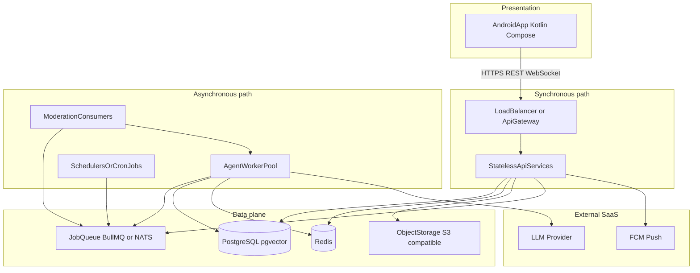

# Echo — Deployment Topology and Component Boundaries

| Field | Value |
|-------|-------|
| **Product Name** | Echo |
| **Document Version** | 1.0.0 |
| **Status** | Draft |
| **Last Updated** | 2026-05-20 |
| **Related Documents** | [PRD](./PRD-Echo.md), [Software Architecture](./Software-Architecture-Echo.md), [Phase 1 Demo Roadmap](./Phase1-Demo-Roadmap-Echo.md), [Glossary](./glossary.md) |

**Language:** English (canonical). Simplified Chinese mirror: [`../docs_CN/Deployment-and-Component-Boundaries-Echo.md`](../docs_CN/Deployment-and-Component-Boundaries-Echo.md).

**See also:** [Phase 1 Demo Roadmap](./Phase1-Demo-Roadmap-Echo.md) (feature matrix, APK sequencing); web scope summary: [`../echo/docs/PHASE1-SCOPE-MAP.md`](../echo/docs/PHASE1-SCOPE-MAP.md) (简体中文: [`../echo/docs/PHASE1-SCOPE-MAP.zh-CN.md`](../echo/docs/PHASE1-SCOPE-MAP.zh-CN.md)).

---

## 1. Purpose

This document complements the [Software Architecture](./Software-Architecture-Echo.md) blueprint by answering **deployment and modularization** questions:

1. How the overall system is structured at runtime.
2. Which parts fit **Docker** (or container orchestration) well.
3. What “**running directly in the background**” means in practice—**managed cloud backends** versus **non-container OS daemons**—and when each applies.
4. What should be exposed as **HTTP/WebSocket APIs** to clients versus **async job contracts**.
5. What should be a **separate project or deployable unit** for release velocity and scaling.

It does **not** prescribe a specific cloud vendor, Kubernetes manifests, or Terraform.

---

## 2. System Structure (Runtime View)

Echo Phase 1 is an **Android APK** talking to an **Echo Platform** backend. The architecture separates a **synchronous request path** (user-driven REST/WebSocket) from an **asynchronous path** (scheduled matching, social drafts, agent chat turns, moderation).

**Mapping to architecture sections:** C4 containers (Software Architecture §4), application services (§6), API sketch (§10), deployment (§14).

---

## 3. Docker: Good Fits

| Component | Rationale |
|-----------|-----------|
| **Stateless API processes** (User & Auth, Onboarding, Digital Clone, Social Feed, Match & Push, Agent Chat coordination, Affinity, Notification, Activity Audit) | Horizontally scalable; configuration via env; no local disk state. Fits container images and rolling deploys. |
| **Agent Worker pool** | CPU- and latency-sensitive LLM workload; often needs **different replica count and resource limits** than the API tier. Separate image or same image with `worker` command is common. |
| **Moderation queue consumers** | Same pattern as workers: scale with moderation backlog. |
| **Local dev stack** | Software Architecture §14: `dev` uses **Docker Compose** for PostgreSQL, Redis, MinIO—repeatable laptops and CI agents. |
| **Optional scheduler as CronJob** | Jobs such as daily match ranking (`SocialScheduler`, match pipeline §8.4) or batch drift checks (§11) can run as a small **scheduled container** that enqueues work rather than executing LLM turns inline. |

### 3.1 What not to self-host in Docker for production (typical)

| Item | Recommendation |
|------|----------------|
| **Primary PostgreSQL** | Prefer **managed** RDS-class service: backups, HA, patching. |
| **Primary Redis** | Prefer **managed** cache/queue backing service for HA and ops. |
| **FCM, LLM vendor** | External APIs; configure secrets and egress, do not “containerize” them. |

You *can* run Postgres/Redis in Compose for **dev/staging**; production usually trades container self-management for managed services.

---

## 4. “Background” deployment: Two meanings

The phrase **直接放在后台** is ambiguous. Below are both interpretations and how Echo maps to them.

### 4.1 Managed cloud backends (recommended for production data plane)

| Component | Role |
|-----------|------|
| PostgreSQL + pgvector | System of record, embeddings |
| Redis | Sessions, affinity snapshots, rate limits, queue backing |
| Object storage (e.g. Aliyun OSS, MinIO in dev) | Avatars, optional media |
| FCM | Match and handoff push |

These run **as vendor-managed services**, not as your own Dockerized primary databases in production.

### 4.2 Non-container OS processes (bare VM / systemd)

The same **API** and **Worker** binaries can run as **systemd units** on one or a few VMs—useful for **early MVP**, constrained ops, or regulated environments where Kubernetes is deferred.

Trade-offs: less elastic scaling, more manual patching; upgrade path is later packaging the same artifacts into containers.

### 4.3 Scheduled and batch work

| Pattern | Use when |
|---------|----------|
| **CronJob container** or **K8s CronJob** | Cloud-native scheduling; job only enqueues. |
| **Dedicated scheduler process** | Long-lived poller next to API in small deployments. |
| **Cloud Scheduler → internal HTTP** | Vendor timer invokes `POST /internal/jobs/match-daily` with auth. |

Examples from architecture: scheduled posts (§8.3), daily match job (§8.4), clone drift batch (§11).

---

## 5. What should be an API

### 5.1 Public (mobile-facing) API

Align with Software Architecture **§10 API Sketch** (`https://api.echo.example/v1`). All **Real User** interactions from the Android app should go through **HTTPS** (and optional **WebSocket** for live affinity/match events).

| Domain | Example surface | PRD trace |
|--------|-----------------|-----------|
| Auth | `POST /auth/register`, `/auth/otp`, `/auth/login`, `/auth/refresh` | FR-001–004 |
| Onboarding | `POST /onboarding/survey`, `/onboarding/dialogue/turn`, `/onboarding/finalize` | FR-010–014 |
| Clone | `GET/PUT /clones/me`, pause/resume | FR-020–024 |
| Feed | `GET /feed`, `GET /posts/{id}` | FR-030–034 |
| Matches | `GET /matches`, dismiss, blocks | FR-040–044 |
| Agent chat (read) | `GET /sessions`, `GET /sessions/{id}/messages` | FR-050–054 |
| Handoff | `GET /handoffs/{id}`, `POST /handoffs/{id}/respond` | FR-060–065 |
| Audit | `GET /audit/events` | FR-070–072 |
| Reports | `POST /reports` | FR-080 |

**Principle:** anything that mutates user-visible state or reads **PII** belongs behind authenticated APIs, not inside workers callable from the public internet without gates.

### 5.2 Internal synchronous boundaries (evolutionary)

| Phase | Approach |
|-------|----------|
| **MVP monolith** | Modules (services from §6) as packages inside one deployable; **in-process** calls. |
| **Split services** | Introduce **internal HTTP or gRPC** between deployables when teams or SLOs diverge. |

### 5.3 Async boundaries (job contracts)

Clone posting, comments, likes, agent turns, and moderation are **queue-driven** (Software Architecture §4, §8.3–§8.5). Treat payloads as **versioned job contracts** with **idempotency keys** per agent turn—not as ad-hoc shared memory.

---

## 6. Separate projects and deployable units

| Unit | Recommendation | Rationale |
|------|----------------|-----------|
| **Android application** | **Separate Gradle project** (own repo or monorepo module) | APK signing, Play policy (Phase 2), store assets, lifecycle unlike server. |
| **Backend API + Worker** | **Monorepo** with shared domain **or** two images (`api`, `worker`) from one build | Shared entities (`User`, `DigitalClone`, `AgentSession`); **independent horizontal scale** at deploy time. |
| **Moderation** | **In-process** in MVP; **separate service** when compliance load, model updates, or isolation requirements grow | Architecture already shows `ModerationService` and queue feedback to workers. |
| **Observability stack** | **Separate Helm chart / ops repo** | Prometheus, Grafana, OpenTelemetry Collector change on a different cadence than product code (§13). |
| **Web UI prototype (`echo/` in this repo)** | **Separate product** from production backend | PRD §4.2: Web client out of scope for Phase 1; prototype is for design/experimentation only. |
| **Phase 2 iOS** | **New client project**, same public API | Software Architecture §15 Option A/B. |

---

## 7. Summary matrix

| Component | Docker-friendly | Typical production hosting | Public API | Separate repo or deployable |
|-----------|-----------------|-----------------------------|--------------|------------------------------|
| Android APK | No (artifact is APK) | User device | Consumes API | Yes — client project |
| API Gateway / LB | Often (ingress image or managed LB) | Managed LB or K8s Ingress | Terminates TLS | Infra config, not app logic |
| Stateless API services | Yes | Containers or VM systemd | Yes — REST/WS | Optional split later |
| Agent Worker | Yes | Containers or VM systemd | No — internal + queue | Same repo, **separate deploy** |
| Moderation consumer | Yes | Same as workers | No | Optional future service |
| Schedulers / cron | Yes (lightweight) | CronJob or managed trigger | Internal only | Small deployable or bundled |
| PostgreSQL | Dev: yes; Prod: avoid self-managed | Managed RDS-class | No | N/A (infra) |
| Redis | Dev: yes; Prod: managed preferred | Managed cache | No | N/A (infra) |
| Object storage | Dev: MinIO in Compose | Managed OSS/S3 | Presigned URLs via API | N/A (infra) |
| LLM / FCM | N/A | SaaS | Outbound from platform | N/A |
| Web prototype `echo/` | Yes for local Vite | Static or Studio | N/A to MVP | Yes — not Phase 1 client |

---

## 8. Change Log

| Version | Date | Summary |
|---------|------|---------|
| 1.0.0 | 2026-05-20 | Initial deployment topology and boundary guidance |
