# Echo — Matching Algorithm Redesign (v1.0: Ideal Partner Profile + Bidirectional Matching)

| Field | Value |
|-------|-------|
| **Doc Version** | 1.1.0 |
| **Status** | Proposal |
| **Related Docs** | [System Design](./system_design.md), [Onboarding Survey Redesign](./Onboarding-Survey-Redesign-Proposal.md), [Agent Behavior & Mechanics](./Agent-Behavior-and-Mechanics-Echo.md) |
| **Scope** | Replace current "embedding similarity unilateral matching" with "Ideal Partner Profile + Bidirectional Mutual Matching" architecture |

---

## 1. Problem Diagnosis: Why "Find Someone Like Me" Fails in Dating

### 1.1 How the Current Matching Works

```
Onboarding Finalize
   → buildTextForEmbedding(profile)        # Constructs text describing "who I am"
   → DeepSeek embed → 1536-dim vector
   → INSERT INTO profile_embeddings

Daily Match Job (match-bridge.ts:runDailyMatchJob)
   → pgvector cosine similarity (self embedding vs all other embeddings)
   → gender/age/city/block filters
   → same city +0.05 / shared interests +0.05 / same relationship intent +0.10
   → ≤ 3 MatchPushes per user
```

In one sentence: **Take your self-portrait embedding, compute cosine similarity against everyone else's self-portrait embedding, pick the most similar.**

### 1.2 Structural Flaw

| Scenario | Match Result | Real-World Consequence |
|----------|-------------|----------------------|
| Two high neuroticism (N=0.9) | embeddings highly similar → high score | Both sensitive and anxious, emotional resonance amplifies, mutual exhaustion |
| Two high avoidance attachment (avoidance=0.8) | embeddings highly similar → high score | Neither initiates, both avoid intimacy; chat dies after "hello" |
| Two high conscientiousness (C=0.9) | embeddings highly similar → high score | Both crave control and planning; covert power struggles over trivial logistics |
| Two high extraversion (E=0.9) | embeddings highly similar → high score | Surface chemistry but potential competition over "who is the social center" |

**Root cause**: `buildTextForEmbedding` describes "who I am", and pgvector cosine similarity finds "who is closest to me in embedding space." This assumes **"someone like me = a good partner"** — an assumption that does not hold up in relationship psychology.

### 1.3 Psychological Evidence

- **Markey & Markey (2007)**: Personality similarity only consistently predicts relationship satisfaction on Agreeableness; on other dimensions, complementarity outperforms similarity.
- **Luo & Klohnen (2005)**: Attachment style complementarity (secure × anxious) in newlyweds predicts marital satisfaction at one year better than personality similarity.
- **Eastwick & Finkel (2008)**: In speed-dating experiments, the correlation between participants' written "ideal partner traits" and actual dating choices was near **r ≈ 0**. The gap between **stated preference** and **revealed preference** is severe.

**Conclusion**: Ranking matches solely by self-portrait similarity systematically produces matches that "look alike but don't work together."

---

## 2. Solution Overview: Ideal Partner Profile + Bidirectional Matching

### 2.1 Core Architecture

```


```mermaid
graph TD
    A[Phase 0: Registration 12 fields] --> B[Phase 1: 15 self-portrait scenario cards]
    B --> C[Phase 1.5: Persona Sketch]
    C --> D["Phase 1.6a: 3 ideal partner probe cards"]
    D --> E["Phase 1.6b: Ideal Partner Sketch &#9733;"]
    E --> F[Phase 2: 4-role Roleplay]
    F --> G[Finalize → self_embedding + ideal_embedding]
    G --> H[Daily Match: Bidirectional Matching]
```

The key addition: Phase 1.5 shows "who I am" (self-portrait), Phase 1.6 shows "who I need" (ideal partner profile). Both Sketches accept user feedback. See §3.7 for details.

Core data flow:

```
Onboarding Phase 1 (15 self-portrait cards + 3 ideal partner probes)
   ├── embed_self  ← buildTextForEmbedding(profile)       # Unchanged: "who I am"
   └── embed_ideal ← buildTextForIdealEmbedding(survey)   # New: "what kind of partner I need"

Matching (bidirectional mutual matching)
   A.score = cosine(embed_self_A, embed_ideal_B)  # Does A match B's expectations?
   B.score = cosine(embed_self_B, embed_ideal_A)  # Does B match A's expectations?

   Threshold filter: if min(A.score, B.score) < 0.3 → reject
   Compatibility score = sqrt(A.score × B.score)   # Geometric mean
```

### 2.2 Design Rationale

| Design Decision | Rationale |
|----------------|-----------|
| **Bidirectional (not gender-directed)** | No dependency on "male matches female" gender assumptions; always mutually evaluate compatibility regardless of gender combination |
| **Geometric mean over arithmetic mean** | When one side scores 0.9 and the other 0.1, arithmetic mean = 0.5 (looks "okay"), geometric mean = 0.3 (exposes the asymmetry) — exactly the penalty we want |
| **Threshold 0.3 (cosine)** | cosine < 0.3 means "the partner's ideal type and your real self differ too much" — roughly "not each other's type." 0.3 is the "not actively repelled" floor |
| **Indirect probes for ideal partner profile** | Directly asking "what type do you like?" yields social desirability, not real preferences. Indirect scenario projection bypasses the stated-vs-revealed preference gap |

### 2.3 Integration with Existing Mechanism

```
Old Flow                              New Flow
─────────────────────────────────    ─────────────────────────────────
pgvector cosine(self, self)          pgvector cosine(self_A, ideal_B)
       ↓                                    ↓
Rule bonuses (city/interests/intent)  pgvector cosine(self_B, ideal_A)
       ↓                                    ↓
Rank → MatchPush                      Threshold filter (min ≥ 0.3)
                                             ↓
                                      Geometric mean → compatibility
                                             ↓
                                      Rule bonuses (city/interests/intent)
                                             ↓
                                      Rank → MatchPush
```

All existing logic — bidirectional block exclusion, active session count limits, autoMatchEnabled checks — remains unchanged. Only the scoring logic is replaced.

---

## 3. Three Ideal Partner Probe Cards: Full Specification

### 3.1 Design Principles

These three cards share the same UX format as the existing 15 scenario cards (full-screen scene + 3-4 options + optional free text), but differ fundamentally in measurement target:

- **Existing 15 cards**: Measure "who you are" (Big Five, MFT, attachment, attribution, etc.)
- **New 3 cards**: Measure "what kind of partner you need" (attachment needs, intimacy pace, conflict style)

To avoid the stated-preference-vs-revealed-preference gap, all three cards use **projective scenarios** — never directly asking about ideal partner traits, but indirectly exposing real needs through behavioral choices.

### 3.2 Card 16: Unexpected Breakfast (Attachment Needs — Comfort with Being Loved)

> **Psychology Source**: ECR-R Attachment Theory (Bowlby, 1969; Fraley et al., 2011) — comfort with being loved is a direct behavioral indicator of attachment type. Securely attached individuals naturally accept and reciprocate intimacy; anxious individuals feel "indebted" or "need to repay"; avoidant individuals experience being loved as "intrusion."

| Field | Value |
|------|-------|
| **cardId** | `unexpected_breakfast` |
| **Scenario** | "Your partner, without you asking, woke up early and made your favorite breakfast, beautifully plated. Your first reaction is—" |
| **allowCustomText** | true |
| **customTextMaxLength** | 20 |
| **requiredFreeText** | false |
| **sources** | ECR-R (Fraley et al., 2011), Bowlby Attachment Theory |
| **measuredDimensions** | `needEmotionalSafety`, `needSpaceRespect` |

| Option | Text | dimensionContributions | Psychological Meaning |
|--------|------|----------------------|----------------------|
| A | "So touched! I'll do the same for them next time." | needEmotionalSafety: -0.3, needSpaceRespect: -0.3 | Secure: accepts intimacy naturally, no burden |
| B | "A bit embarrassed... do they expect something in return?" | needEmotionalSafety: 0.7, needSpaceRespect: -0.4 | Anxious: feels indebted when loved, needs repeated confirmation of no strings attached |
| C | "Sweet, but I prefer we each handle our own breakfasts." | needEmotionalSafety: -0.3, needSpaceRespect: 0.7 | Avoidant: intimate gestures experienced as loss of autonomy |
| D | "Take a photo, post on social media, show off this treatment." | needEmotionalSafety: 0.4, needSpaceRespect: -0.2 | Anxious + social display: needs external social validation |

### 3.3 Card 17: Silent Night (Intimacy Pace Preference)

> **Psychology Source**: Gottman Repair Attempts Theory + ECR-R Attachment Anxiety dimension. In intimate silence, different attachment types experience radically different emotions: secure types experience "connection in stillness"; anxious types experience "silence = rejection"; avoidant types experience "finally, peace." This card measures **how much verbal interaction density is needed in an intimate relationship.**

| Field | Value |
|------|-------|
| **cardId** | `silent_night` |
| **Scenario** | "You and your partner are sitting on the couch. It's been 20 minutes and nobody has spoken. How do you feel?" |
| **allowCustomText** | true |
| **customTextMaxLength** | 20 |
| **requiredFreeText** | false |
| **sources** | ECR-R (Fraley et al., 2011), Gottman Repair Attempts Theory |
| **measuredDimensions** | `needEmotionalSafety`, `needDirectCommunication`, `needSpaceRespect` |

| Option | Text | dimensionContributions | Psychological Meaning |
|--------|------|----------------------|----------------------|
| A | "Comfortable. Don't need words to know they're there." | needEmotionalSafety: -0.5, needSpaceRespect: -0.2, needDirectCommunication: -0.3 | Secure: silence = connection |
| B | "Are they mad at me?" | needEmotionalSafety: 0.8, needDirectCommunication: 0.5, needSpaceRespect: 0.0 | Anxious: silence = rejection signal, needs partner to actively clarify |
| C | "Finally, some quiet time to scroll my phone." | needEmotionalSafety: -0.3, needDirectCommunication: -0.5, needSpaceRespect: 0.8 | Avoidant: silence = relief |
| D | "Find a topic to break the silence." | needEmotionalSafety: 0.3, needDirectCommunication: 0.4, needSpaceRespect: -0.3 | Moderate anxiety + socially proactive: insecurity drives interaction |

### 3.4 Card 18: Song Choice (Conflict Handling Style)

> **Psychology Source**: Gottman's Four Horsemen of the Apocalypse + Thomas-Kilmann Conflict Mode Instrument. On a 3-hour drive, one partner plays a song the other despises — this scenario simultaneously activates "aesthetic conflict" and "shared space pressure," serving as a micro-laboratory for observing conflict handling style.

| Field | Value |
|------|-------|
| **cardId** | `song_choice` |
| **Scenario** | "You're on a 3-hour road trip together, taking turns picking songs. Their fourth pick is a song you absolutely hate. What do you do?" |
| **allowCustomText** | true |
| **customTextMaxLength** | 20 |
| **requiredFreeText** | false |
| **sources** | Gottman Four Horsemen, Thomas-Kilmann Conflict Mode Instrument |
| **measuredDimensions** | `needDirectCommunication`, `needConflictResolution` |

| Option | Text | dimensionContributions | Psychological Meaning |
|--------|------|----------------------|----------------------|
| A | "Skip it, say 'I really can't do this one.'" | needDirectCommunication: 0.7, needConflictResolution: 0.8 | Direct confrontation: needs partner who can handle "I have an issue with you" straight up |
| B | "Suffer through it, but stay annoyed the whole rest of the trip." | needDirectCommunication: -0.5, needConflictResolution: -0.8 | Passive aggressive: needs partner to magically guess "you're upset" |
| C | "Laugh and say 'I'm reporting this song,' half-jokingly switch it." | needDirectCommunication: 0.4, needConflictResolution: -0.2 | Humor buffer: needs partner who reads the truth behind the joke |
| D | "Silently put on headphones." | needDirectCommunication: -0.7, needConflictResolution: -0.6 | Retreat: needs partner to proactively detect and repair the rupture |

### 3.5 Ideal Partner Dimension Overview

The three new cards jointly profile four ideal partner dimensions:

| Dimension Key | Full Name | Meaning | Measured By Cards |
|--------------|-----------|---------|-------------------|
| `needEmotionalSafety` | Emotional Safety Need | How much repeated reassurance is needed from partner ("I am safe, I won't abandon you") (-1=not needed, +1=extremely needed) | 16, 17 |
| `needSpaceRespect` | Space Respect Need | How much the partner must respect alone time and personal space (-1=not needed, +1=extremely needed) | 16, 17 |
| `needDirectCommunication` | Direct Communication Preference | How directly the partner should express opinions and emotions (-1=indirect hints, +1=straight talk) | 17, 18 |
| `needConflictResolution` | Conflict Resolution Expectation | What approach is preferred from partner during conflicts (-1=avoid/self-digest, +1=resolve on the spot) | 18 |

These four dimensions are **not the user's self-described personality**, but rather **the relationship capabilities the user needs in a partner**. For example, `needEmotionalSafety=0.8` does not mean "I am an anxious person" — it means "I need a partner who can provide emotional security." This signal should be cross-referenced against the partner's `neuroticism`, `conscientiousness`, `agreeableness` self-portrait dimensions during matching.

### 3.6 Relationship with Existing 15 Cards

The existing attachment-related cards (Card 14 Midnight Call, Card 5 Saturday Energy, etc.) already capture `attachAvoidance` and `attachAnxiety` signals. The three new cards do not duplicate these measurements — they measure **the behavioral consequence of attachment style**: "Because you are a secure/anxious/avoidant type, what capabilities do you need in a partner?"

This ensures the ideal partner profile is not built from "what you say you want" but rather from "what your behavior reveals you need."

### 3.7 Phase 1.6: Ideal Partner Sketch Display Page ⭐

> **This is the key addition in v1.1.** The v1.0 design had a significant UX gap: after answering the 3 ideal partner probe cards, there was no page telling users "here's what the system thinks you need in a partner." This mirrors Phase 1.5's Persona Sketch — users need to see both "who I am" and "who I need."

#### 3.7.1 Design Goals

| Goal | Description |
|------|-------------|
| **Closed-loop feedback** | After completing the probe cards, the system should immediately provide readable, concrete feedback — "Based on your answers, you likely need a partner who is XXX" |
| **Correction opportunity** | System judgment may be inaccurate (the inherent limitation of 3 cards). Users should be able to directly correct — not by redoing the cards, but by adjusting on the display page |
| **Trust building** | If the system shows "how it understands your needs" before matching, users will trust subsequent match results more — even if no match works, they at least know "the system understood me wrong" rather than "the system never tried to understand me" |
| **Symmetry with Persona Sketch** | Phase 1.5 shows "who I am," Phase 1.6 shows "who I need." Both Sketches use the same UX paradigm (LLM synthesis → card display → user fine-tuning) |

#### 3.7.2 UX Layout

```
┌──────────────────────────────────────────┐
│  ← What kind of person do you need?      │
│                                          │
│  ┌──────────────────────────────────────┐│
│  │                                      ││
│  │   Based on your choices about        ││
│  │   breakfast, silence, and music...   ││
│  │   your ideal partner looks like:     ││
│  │                                      ││
│  └──────────────────────────────────────┘│
│                                          │
│  ┌─── Relationship Style ────────────────┐│
│  │                                     ││
│  │   You need someone who...            ││
│  │   "moves fluidly between closeness   ││
│  │    and independence. You don't feel  ││
│  │    indebted when loved, anxious when ││
│  │    silent, or hesitant in conflict — ││
│  │    so you need a partner who is      ││
│  │    emotionally steady, never uses    ││
│  │    the silent treatment, and can     ││
│  │    handle straight talk."            ││
│  │                                     ││
│  └─────────────────────────────────────┘│
│                                          │
│  ┌─── What They're Probably Like ────────┐│
│  │   Emotional Stability   ████████░░  ││
│  │   Communication         ████████░░  ││
│  │   Independence          ██████░░░░  ││
│  │   Nurturing             ████░░░░░░  ││
│  └─────────────────────────────────────┘│
│                                          │
│  ┌─── Is this accurate? ─────────────────┐│
│  │  "Actually I need someone more..."    ││
│  │  [free text, 100 chars max]           ││
│  │                                     ││
│  │  ☐ Not sure, I'll adjust later      ││
│  └─────────────────────────────────────┘│
│                                          │
│  [ Looks right → ]                       │
└──────────────────────────────────────────┘
```

#### 3.7.3 LLM Synthesizer Design

Symmetrical to Phase 1.5 Persona Sketch, a new LLM synthesizer translates ideal partner dimension scores into natural language:

```
Input (structured scores):
  needEmotionalSafety: 0.7       // → needs security
  needSpaceRespect: -0.3         // → doesn't need much independence
  needDirectCommunication: 0.8   // → prefers direct talk
  needConflictResolution: 0.6    // → wants on-the-spot resolution

  attachmentStyle: preoccupied
  trustView: "I can't trust someone who never actively shows vulnerability"
  happinessView: "Happiness isn't joy every day, it's waking at 2am with someone there"
  relationshipIntent: "seeking long-term relationship"

Output (LLM synthesis, 200-400 words):
  "Based on your answers, you need a 'predictable and steady' partner.
   You need someone who keeps their word, no hot-and-cold — being cared
   for makes you feel indebted, so your partner needs to make you believe
   'I'm good to you simply because I want to be,' with no strings attached.
   
   In conflict you prefer resolve-it-now over mutual silence, so the person
   you're with should be someone who can handle a straight ball — when
   you say 'I don't like this,' they won't get defensive or withdraw.
   
   Your trust is built on 'exposing vulnerability together' — you don't
   trust someone who never shows weakness, so your partner should be
   able to take off their armor in front of you."
```

#### 3.7.4 IdealPartnerSketch Data Structure

```typescript
// survey-schema.ts — new addition

export interface IdealPartnerSketch {
  /** LLM-synthesized natural language description (200-400 words) */
  narrative: string;

  /** Radar chart data (for frontend visualization) */
  dimensions: {
    emotionalSafety: number;    // -1 ~ +1
    spaceRespect: number;       // -1 ~ +1
    directCommunication: number; // -1 ~ +1
    conflictResolution: number;  // -1 ~ +1
  };

  /** User feedback (optional correction) */
  userFeedback?: string;

  /** Generation timestamp */
  generatedAt: string;
}
```

#### 3.7.5 Impact of User Feedback

User feedback on the Ideal Partner Sketch page has two uses:

| Feedback Type | Handling |
|-------------|----------|
| **Free text fine-tuning** ("Actually I need someone more...") | Prepended as a prefix to `buildTextForIdealEmbedding` input text, allowing the embedding to capture the user's self-correction signal |
| **"Not sure, adjust later"** | Marks `idealPartnerSketch.userFeedback = 'deferred'`, provides re-entry point on Profile page later |

Feedback does not replace original scores — it **overlays**. Original dimension scores + user correction text jointly form the embedding input. This balances "projective signals are more truthful than stated preferences" with "users have the right to say the system got it wrong."

#### 3.7.6 Integration into Main Flow

```
Phase 1: 15 self-portrait cards + 3 ideal partner probe cards
    ↓
Phase 1.5: Persona Sketch (see "who I am" → fine-tune → confirm)
    ↓
Phase 1.6: Ideal Partner Sketch (see "who I need" → fine-tune → confirm) ⭐ New
    ↓
Phase 2: 4-role Roleplay
    ↓
Finalize: both embeddings generated in parallel
```

Completion validation updates:
- `phase1complete`: 15 cards ≥ 8 + idealPartnerDimensions calculated
- `idealSketchConfirmed`: idealPartnerSketch generated (narrative non-empty) AND user has not marked "deferred"

---

## 4. Ideal Partner Profile Embedding Construction

### 4.1 New Function: `buildTextForIdealEmbedding`

```typescript
// survey-schema.ts — new addition

export function buildTextForIdealEmbedding(
  profile: ProfileForEmbedding | null,
  survey: OnboardingSurveyJson,
  userId: string,
): string {
  const parts: string[] = [];

  // 1. Attachment-derived needs (from existing 15 cards' attachAvoidance / attachAnxiety)
  if (survey.dimensionScores?.attachmentStyle) {
    const style = survey.dimensionScores.attachmentStyle; // 'secure' | 'preoccupied' | 'dismissing' | 'fearful'
    const styleMap: Record<string, string> = {
      secure:      'needs partner who naturally balances intimacy and independence, neither clingy nor cold',
      preoccupied: 'needs partner who provides stable emotional affirmation, consistent and reliable, no hot-and-cold',
      dismissing:  'needs partner who respects personal boundaries, no emotional hostage-taking, gives ample space',
      fearful:     'needs extremely patient partner who tolerates push-pull rhythms, won\'t give up when pushed away',
    };
    parts.push(`attachmentNeed:${styleMap[style] ?? style}`);
  }

  // 2. Ideal partner dimensions (from new cards 16/17/18)
  const idealDims = survey.idealPartnerDimensions;
  if (idealDims) {
    const descs: string[] = [];
    if (idealDims.needEmotionalSafety > 0.3) {
      descs.push('high emotional safety need: requires partner to be stable, reliable, an emotional anchor');
    } else if (idealDims.needEmotionalSafety < -0.3) {
      descs.push('low emotional dependence: does not need frequent relationship status confirmation');
    }
    if (idealDims.needSpaceRespect > 0.3) {
      descs.push('high independence need: requires partner to respect alone time, no intrusion');
    } else if (idealDims.needSpaceRespect < -0.3) {
      descs.push('prefers close connection: wants partner to share most of their time');
    }
    if (idealDims.needDirectCommunication > 0.3) {
      descs.push('prefers direct expression: dislikes guessing, needs partner to speak plainly');
    } else if (idealDims.needDirectCommunication < -0.3) {
      descs.push('prefers gentle expression: wants partner to deliver opinions tactfully');
    }
    if (idealDims.needConflictResolution > 0.3) {
      descs.push('resolve conflicts directly: dislikes silent treatment, needs partner who can handle straight talk');
    } else if (idealDims.needConflictResolution < -0.3) {
      descs.push('digest conflicts individually: prefers partner to give buffer space during conflicts');
    }
    if (descs.length) parts.push(`partnerExpectation:${descs.join('; ')}`);
  }

  // 3. Value alignment signals
  if (survey.trustView?.trim()) {
    parts.push(`trustExpectation:${survey.trustView.trim().slice(0, 60)}`);
  }
  if (survey.happinessView?.trim()) {
    parts.push(`happinessView:${survey.happinessView.trim().slice(0, 60)}`);
  }

  // 4. Relationship intent
  const relationshipIntent =
    survey.goal?.trim() ||
    (typeof profile?.bioJson === 'object' && profile?.bioJson !== null
      ? (profile.bioJson as Record<string, unknown>)?.datingGoal as string
      : undefined);
  if (relationshipIntent) {
    parts.push(`relationshipGoal:${relationshipIntent}`);
  }

  return parts.length > 0 ? parts.join(' | ') : `idealPartnerDefault_${userId}`;
}
```

### 4.2 Ideal Partner Dimension Scorer

Add `calculateIdealPartnerDimensions` function to `dimension-scorer.ts`, following the same algorithm as the existing `calculateDimensionScores` (weighted mean + clamp + consistency check), but processing only the three new cards: `unexpected_breakfast`, `silent_night`, `song_choice`.

### 4.3 Storage: New Column in `profile_embeddings`

```sql
ALTER TABLE profile_embeddings
ADD COLUMN ideal_embedding vector(1536);

-- No HNSW index needed on ideal_embedding.
-- Matching flow: use A.self_embedding with HNSW index to retrieve top-K,
-- then load B.ideal_embedding for reverse check. Never needs full-table scan on ideal_embedding.
```

**Design rationale**: The ideal partner vector does not need an index. Matching always starts with A's self embedding scanning the full table (already HNSW-indexed) to get top-K candidates, then loads candidate ideal embeddings for reverse validation. We never need "scan all ideal profiles to find the closest to a given self."

---

## 5. Matching Algorithm Changes

### 5.1 Revised `runDailyMatchJob` Pseudocode

```
for each active user A:
    // 1. Retrieve top-K candidates using A.self_embedding (same as now)
    candidates = pgvector.search(self_embedding_A, topK=20)
              .filter(gender/age/city/blocks)
    
    // 2. Batch-load all candidates' ideal embeddings
    ideal_embeddings = batchLoad(candidates.map(c => c.user_id))
    
    // 3. Bidirectional mutual matching scoring
    for each candidate B:
        scoreAtoB = cosine(self_embedding_A, ideal_embedding_B)    // Does A meet B's expectations?
        scoreBtoA = cosine(self_embedding_B, ideal_embedding_A)    // Does B meet A's expectations?
        
        if min(scoreAtoB, scoreBtoA) < 0.3:
            continue  // Reject
        
        compatibility = sqrt(scoreAtoB × scoreBtoA)
        candidates_scored.push({ userId: B, compatibility })
    
    // 4. Rule bonuses (same as now)
    for each candidate:
        if sameCity: compatibility += 0.05
        if sharedInterest: compatibility += 0.05
        if sameIntent: compatibility += 0.10
    
    // 5. Rank → top-3 MatchPush
    sort descending → top 3 → create MatchPush
```

### 5.2 Revised `rankCandidatesByRules` Signature

The original function takes `VectorCandidate[]` using `similarity` as base score. The revised version accepts bidirectional scoring results:

```typescript
export type BidirectionalCandidate = {
  user_id: string;
  scoreAtoB: number;
  scoreBtoA: number;
  compatibility: number;  // sqrt(scoreAtoB × scoreBtoA)
};

export function rankCandidatesByRules(
  seeker: SeekerProfile,
  candidates: BidirectionalCandidate[],
  candidateProfiles: CandidateProfile[],
  prefs: MatchPrefs,
  topN: number = FINAL_TOP_N,
): RankedCandidate[] {
  // Use compatibility instead of similarity as base score
  // Rule bonus logic remains unchanged
}
```

### 5.3 Cold Start: What If a New User Has No Ideal Partner Embedding?

New users complete Phase 1, at which point ideal partner dimensions are already calculated, so `buildTextForIdealEmbedding` runs normally and generates the embedding. No cold start gap exists.

Edge case: if a user skips cards 16/17/18 entirely, `idealPartnerDimensions` is empty. `buildTextForIdealEmbedding` degrades to using only attachment style + values + relationship intent to construct the ideal embedding. Accuracy drops but matching flow is not blocked.

### 5.4 Threshold Tuning Strategy

After launch, monitor these metrics to decide on threshold adjustments:

| Metric | Signal if threshold too low (e.g., 0.1) | Signal if threshold too high (e.g., 0.5) |
|--------|---------------------------------------|----------------------------------------|
| Avg daily MatchPush per user | Near 3 (ceiling), meaning almost no one is filtered | Far below 1, meaning many users get no matches |
| MatchPush → session conversion rate | Low conversion, meaning "matched but not suitable" | Sample too small to judge |
| Session day-1 conversation turns | Average < 3 turns, poor match quality | N/A |

Recommended initial launch threshold: **0.3**. Collect one week of data, then run A/B comparison (0.25 / 0.30 / 0.35 three groups).

---

## 6. Files to Modify

### 6.1 Backend (services/api)

| File | Change |
|------|--------|
| `src/onboarding/scenario-cards.ts` | Add `CARD_UNEXPECTED_BREAKFAST`, `CARD_SILENT_NIGHT`, `CARD_SONG_CHOICE` definitions; update `ALL_SCENARIO_CARDS`, `DIMENSION_COVERAGE`, `P0_CARD_IDS` (optional) |
| `src/onboarding/dimension-scorer.ts` | Add `calculateIdealPartnerDimensions()`, `IdealPartnerDimensions` type |
| `src/onboarding/survey-schema.ts` | Add `buildTextForIdealEmbedding()`; add `IdealPartnerSketch` type; add `idealPartnerDimensions` and `idealPartnerSketch` fields to `OnboardingSurveyJson` |
| `src/onboarding/onboarding.service.ts` | Add `generateIdealPartnerSketch()` method (LLM synthesis of ideal partner description); call `calculateIdealPartnerDimensions()` in `submitPhase1()`; call `buildTextForIdealEmbedding()` + `llm.embed()` in `finalize()` to write `profile_embeddings.ideal_embedding` |
| `src/onboarding/onboarding.dto.ts` | Add `IdealPartnerSketchDto`, `IdealPartnerAdjustDto` (user fine-tuning feedback) |

### 6.2 Backend (services/worker)

| File | Change |
|------|--------|
| `src/clone-runtime/match-bridge.ts` | Add `BidirectionalCandidate` type; refactor `runDailyMatchJob()` with bidirectional matching; refactor `rankCandidatesByRules()` to use `compatibility` as base score; add `IDEAL_MATCH_THRESHOLD = 0.3` constant |

### 6.3 Database

| Operation | SQL |
|-----------|-----|
| New column | `ALTER TABLE profile_embeddings ADD COLUMN ideal_embedding vector(1536);` |
| Backfill historical data | Re-run `calculateIdealPartnerDimensions()` + `buildTextForIdealEmbedding()` + embed for existing users' Phase 1 answers (use degraded strategy if cards 16/17/18 have no answers) |

### 6.4 Frontend (Echo)

| File | Change |
|------|--------|
| `src/features/onboarding/surveySteps.tsx` | Insert 3 ideal partner probe cards after the 15 scenario cards, before Persona Sketch |
| `src/features/onboarding/surveySteps.tsx` | **New** IdealPartnerSketch display page (card-based display like Persona Sketch + radar chart + free text fine-tuning entry) |
| `src/features/onboarding/Onboarding.tsx` | Update progress display to "X/18"; add `idealSketchConfirmed` completion state |
| `src/features/onboarding/types.ts` | Add `IdealPartnerSketch` type definition (aligned with backend) |

### 6.5 Documentation

| Operation | File |
|-----------|------|
| Create | `docs/Matching-Algorithm-Redesign-Echo.md` (this document) |
| Mirror | `docs_CN/Matching-Algorithm-Redesign-Echo.md` |
| Update | `docs/Onboarding-Survey-Redesign-Proposal.md` — §5 Phase 1 card count from 15 → 18, append new card definitions |
| Update | `docs/Onboarding-Survey-Design-Echo.md` — reflect new card insertion position in flow description |
| Update | `docs/system_design.md` — update matching section to bidirectional mutual matching algorithm |

---

## 7. Implementation Roadmap

### Phase 1: Backend Core (est. 3-4 days)

| Step | Content |
|------|---------|
| 1.1 | Add three new card definitions in `scenario-cards.ts` + unit tests for dimension contributions |
| 1.2 | Add `calculateIdealPartnerDimensions()` in `dimension-scorer.ts` + unit tests |
| 1.3 | Add `buildTextForIdealEmbedding()` + `IdealPartnerSketch` type + `idealPartnerDimensions`/`idealPartnerSketch` fields in `survey-schema.ts` |
| 1.4 | Add `generateIdealPartnerSketch()` LLM synthesis method + wire ideal embedding generation in `submitPhase1()` and `finalize()` in `onboarding.service.ts` |
| 1.5 | Add `IdealPartnerSketchDto`, `IdealPartnerAdjustDto` in `onboarding.dto.ts` |
| 1.6 | Database migration: add `ideal_embedding` column to `profile_embeddings` |
| 1.7 | Historical data backfill script |

### Phase 2: Worker Matching Refactor (est. 1-2 days)

| Step | Content |
|------|---------|
| 2.1 | Add bidirectional matching logic + `BidirectionalCandidate` type in `match-bridge.ts` |
| 2.2 | Signature change for `rankCandidatesByRules` to use `compatibility` as base score |
| 2.3 | Integration test: create 10 test users, run daily match job with `force=true`, verify bidirectional matching output |

### Phase 3: Frontend Adaptation (est. 1-2 days)

| Step | Content |
|------|---------|
| 3.1 | Insert 3 new cards + IdealPartnerSketch display page in `surveySteps.tsx` |
| 3.2 | Radar chart component (reuse Persona Sketch radar chart, bind to `idealPartnerSketch.dimensions`) |
| 3.3 | User fine-tuning entry (free text + "adjust later" option) |
| 3.4 | Progress update + completion validation |
| 3.5 | End-to-end test: new user goes through full onboarding → verify both self_embedding and ideal_embedding written |

### Phase 4: Documentation & Launch Observation (est. 1 day)

| Step | Content |
|------|---------|
| 4.1 | Sync `docs/` and `docs_CN/` updates |
| 4.2 | Deploy to staging, validate match quality with 10-20 test users |
| 4.3 | Post-launch: monitor §5.4 metrics, decide threshold adjustment after one week |

---

## 8. Risks and Mitigations

| Risk | Probability | Impact | Mitigation |
|------|------------|--------|------------|
| Ideal embedding quality insufficient (3 cards + attachment-derived signals not enough) | Medium | Match precision may not improve | Post-launch compare old vs new match overlap rate; if top-3 overlap > 80%, signal is not differentiated enough → add more cards |
| Threshold 0.3 causes too few matches | Medium | Poor user experience, no matches | Monitor first-week avg daily MatchPush; if per-user < 1, lower to 0.2 |
| Geometric mean over-penalizes asymmetric pairs | Low | Miss some "one side extremely satisfied, other side moderately satisfied" but actually viable pairs | Sample and manually evaluate high-scoring one-way pairs rejected by geometric mean (A→B=0.8, B→A=0.25) to check false negatives |
| Card count increase from 15 to 18 + IdealPartnerSketch page adds 3-5 minutes | High | Onboarding completion rate drops | Mark cards 16/17/18 as "recommended" not "required"; add skip button on IdealPartnerSketch page; show "these 3 cards affect match quality" as incentive |
| Historical users lack ideal embedding | High | Existing users cannot participate in bidirectional matching | Phase 1 backfill script with degraded strategy; prompt existing users to supplement 3 new cards on next app open |
| IdealPartnerSketch LLM synthesis quality is poor | Medium | User sees a description that doesn't match their self-perception → trust erodes | Synthesis prompt must strictly constrain output format (no hallucinations, no inventing unmeasured traits); always keep "Is this accurate? Tell us the truth" entry at the bottom of the display page |

---

## 9. Appendix: Ideal Partner Profile Embedding Example

A complete `buildTextForIdealEmbedding` output example:

```
attachmentNeed:needs partner who provides stable emotional affirmation, consistent and reliable, no hot-and-cold |
partnerExpectation:high emotional safety need: requires partner to be stable, reliable, an emotional anchor; prefers direct expression: dislikes guessing, needs partner to speak plainly |
trustExpectation:I cannot trust someone who never actively shows vulnerability |
happinessView:happiness is not being joyful every day, it's waking up at 2am and knowing someone is there |
relationshipGoal:seeking long-term relationship
```

Once embedded by DeepSeek, this text will be closer in vector space to self-portrait embeddings of users with "low neuroticism + high conscientiousness + high agreeableness + direct communication style" — precisely the type of partner this user implicitly needs.

---

**Maintainer**: Echo Engineering Team  
**Last Updated**: 2026-07-02  
**Next Review**: One week post-launch
