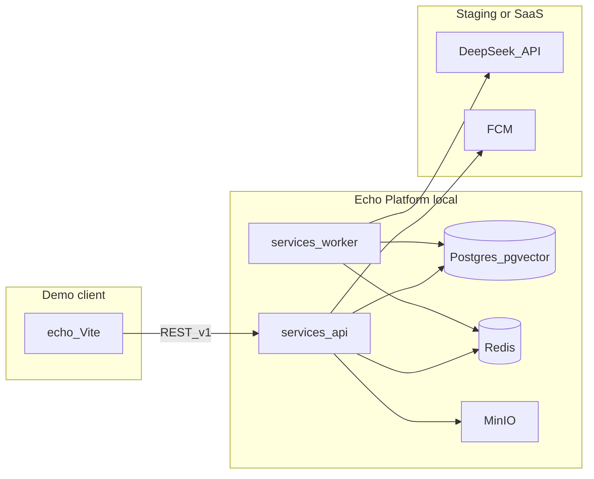

# Echo — Phase 1 Full-Function Demo Roadmap

| Field | Value |
|-------|-------|
| **Document Version** | 1.1.0 |
| **Status** | Active |
| **Last Updated** | 2026-05-28 |
| **Related Documents** | [PRD](./PRD-Echo.md), [Software Architecture](./Software-Architecture-Echo.md), [Deployment & Component Boundaries](./Deployment-and-Component-Boundaries-Echo.md), [Campus Pilot Launch Plan](./Campus-Pilot-Launch-Plan-Echo.md), [Glossary](./glossary.md) |

**Language:** English (canonical). Simplified Chinese mirror: [`../docs_CN/Phase1-Demo-Roadmap-Echo.md`](../docs_CN/Phase1-Demo-Roadmap-Echo.md).

---

## 1. Goal and sequence

1. **Full-function demo** — Local and/or staging stack with **real API + data + workers** (not mock-only). Debug client: [`echo/`](../echo/) via `VITE_API_BASE_URL`, then [`apps/android`](../apps/android/).
2. **Validate** — Product and design on the demo; update **per-layer** status columns in §3 (`API`, `Worker`, `Web`, `APK`) as work lands.
3. **APK** — Campus sideload / store release only after §3.3 **release gate** rows are `done` on every layer that applies (not merely “API exists”).

**Single source of truth for “one feature at a time”:** the matrix in §3. [`echo/docs/PHASE1-SCOPE-MAP.md`](../echo/docs/PHASE1-SCOPE-MAP.md) links here for sprint-level summary only.

> **v1.1.0 honesty note:** Earlier versions used a single `done` column that overstated client and APK readiness. Status is now split by deployable layer (audit: 2026-05-26).

---

## 2. Runtime topology (local demo)

**Local:** `infra/docker-compose.yml` — `docker compose up -d` for Postgres, Redis, MinIO; run `services/api` and `services/worker` on host or in containers.

**Online (staging):** HTTPS API hostname, Firebase (FCM), LLM keys on worker/API — env templates only; never commit secrets.

---

## 3. Feature matrix

Implement **one row at a time**. Update only the columns that changed.

### 3.1 Status columns (per layer)

| Column | Scope | `done` means |
|--------|--------|--------------|
| **API** | `services/api` REST (+ DB) | Happy path implemented and verifiable locally/staging (e.g. `curl` or integration test). |
| **Worker** | `services/worker` jobs | Queue/cron path runs against real Postgres + Redis + LLM (or documented stub). Use `n/a` if the row has no async work. |
| **Web** | [`echo/`](../echo/) prototype | With `VITE_API_BASE_URL` set, primary UX uses real API; mock fallback only when API unreachable or empty response (see §4). |
| **APK** | [`apps/android`](../apps/android/) | User-facing flow on device/emulator against real API. Use `n/a` for platform-only rows. |

**Values:** `todo` | `doing` | `done` | `blocked` | `n/a`

**Deprecated:** a single row-wide `done` — do not use for new updates.

### 3.2 Capability rows

| ID | Capability | FR | Client (demo) | Sync API | Async / worker | Implementation | API | Worker | Web | APK | Notes |
|----|------------|-----|---------------|----------|----------------|----------------|-----|--------|-----|-----|-------|
| P1-00 | Dev infrastructure | — | — | — | — | `infra/` | done | n/a | n/a | n/a | `docker-compose.yml`: Postgres, Redis, MinIO |
| P1-01 | API shell + schema | FR-001+ | — | `GET /health` | — | `services/api` | done | n/a | n/a | n/a | Prisma migrations |
| P1-02 | Auth register / OTP / login | FR-001–004 | `echo` auth shell | `POST /auth/*`, `GET /auth/me` | — | `services/api`, `echo` | done | n/a | done | n/a | Web requires `VITE_API_BASE_URL` |
| P1-03 | Onboarding survey + dialogue + finalize | FR-010–014 | `echo` wizard | `POST /onboarding/*` | LLM in API | `services/api`, `echo` | done | n/a | done | n/a | See [Onboarding Survey Design](./Onboarding-Survey-Design-Echo.md) |
| P1-04a | Clone read + pause / resume | FR-020, FR-023–024 | `echo` clone tab | `GET /clones/me`, pause/resume | — | `services/api`, `echo` | done | n/a | done | n/a | Web: pause/resume wired; persona shown read-only |
| P1-04b | Edit persona prompt | FR-021–022 | `echo` clone tab | `PUT /clones/me` (`personaText`) | — | `services/api`, `echo` | done | n/a | done | n/a | `updateClonePersona` + clone tab editor |
| P1-04c | Configure social boundaries | FR-021–022 | `echo` clone tab | `GET/PUT /clones/me` (`boundaries`) | boundaries in LLM prompts | `services/api`, `services/worker`, `echo` | done | done | done | n/a | `forbiddenWords` + `topicsToAvoid`; Worker `formatBoundariesClause` |
| P1-05 | Feed read | FR-030–034 | `echo` feed | `GET /feed`, `GET /posts/{id}` | — | `services/api`, `echo` | done | n/a | done | n/a | `loadFeed()` — mock only without `VITE_API_BASE_URL`; empty/error do not substitute mock |
| P1-06 | Scheduled posts + moderation | FR-030–034, FR-033 | feed + detail | — | `post-draft`, `moderation` | `services/worker`, `echo` | n/a | done | done | n/a | `POST /posts/draft` + Clone「让分身发帖」+ feed poll; activity `moderation_status` |
| P1-07 | Match list + dismiss + block | FR-040–044 | `echo` match tab | `GET /matches`, dismiss, `POST /blocks` | `match-daily` | `services/api`, `services/worker` | done | done | done | n/a | `loadMatches()` + MatchView dismiss/block; list excludes blocks |
| P1-08 | Agent sessions + messages (read) | FR-050–054 | match / activity | `GET /sessions`, `GET /sessions/{id}/messages` | `agent-turn` | `services/*`, `echo` | done | done | done | n/a | `session_id` on matches; real transcript in detail + activity; `is_self` on messages |
| P1-09 | Affinity + handoff | FR-060–065 | `echo` match detail | `GET/POST /handoffs/*` | affinity per turn | `services/*`, `echo` | done | done | done | n/a | `GET /sessions/:id/affinity`; accept/decline handoff; session affinity in detail |
| P1-10 | Activity audit log | FR-070–072 | `echo` activity tab | `GET /audit/events`, `GET /clones/me/activity` | audit writes | `services/api`, `echo` | done | done | done | n/a | `loadCloneActivity` tri-state source; no silent mock on API path |
| P1-11 | Reports | FR-080–082 | settings / report | `POST /reports` | mod queue (planned) | `services/api`, `echo` | done | todo | done | n/a | `submitReport`; Settings + post/comment/user report UI |
| P1-12 | WebSocket live updates (optional) | — | `echo` optional | `wss://.../v1/ws` | Redis pub/sub | `services/api` | todo | n/a | todo | n/a | Optional; not started |
| P1-13 | Demo client API integration | — | `echo` all tabs | via `VITE_API_BASE_URL` | — | `echo/src/api/*` | n/a | n/a | doing | n/a | Per-tab maturity varies; heavy mock when env unset |
| P1-14 | Android shell + navigation | — | APK | same REST as API | — | `apps/android` | n/a | n/a | n/a | todo | `MainActivity` placeholder text only; no tabs |
| P1-15 | Hardening + signed release APK | — | release APK | — | — | `apps/android`, CI | n/a | n/a | n/a | todo | CI builds **debug** APK only (`.github/workflows/android-apk.yml`) |

### 3.3 Release gates (do not mark “campus ready” until these are `done`)

| Gate | Rows | All applicable columns |
|------|------|-------------------------|
| **Local full-stack demo** | P1-00–P1-11 (except P1-12) | `API` + `Worker` (if not `n/a`) = `done` |
| **Web product walkthrough** | P1-02–P1-11, P1-13 | `Web` = `done` (no silent mock on happy path per §4) |
| **Campus sideload APK** | P1-04a–c, P1-07–P1-11, P1-14, P1-15 | `APK` = `done`; P1-15 = signed **release** artifact, not debug-only |

---

## 4. Mock policy (demo phase)

| Allowed | Not allowed for `Web` = `done` |
|---------|--------------------------------|
| Mock when API unreachable (documented in client) | Entire feature only mock with no `services/*` implementation |
| Mock when API returns empty list (temporary; track in Notes) | Production secrets in `echo` `VITE_*` builds |
| Seed data in local Postgres | Labeling a row `Web` = `done` while primary screens still use hardcoded demo data |

When **API** = `done`, the platform happy path must hit real local (or staging) endpoints for that row. When **Web** = `done`, set `VITE_API_BASE_URL` and verify the main screen without mock substitution.

---

## 5. Governance (Agent / CI)

| Layer | What it does |
|-------|----------------|
| Skill **echo-deployment-boundaries** | Deployment topology + Phase 1 demo rules |
| Hook **phase1-context-nudge.py** | Reminds after writes under `echo/`, `services/`, `infra/`, `apps/`, roadmap docs |
| **This file** | Update `API` / `Worker` / `Web` / `APK` when implementing a feature |
| Future CI (optional) | Fail if campus gate rows lack `APK` = `done`; block production web builds with committed `VITE_*` secrets |

Hooks and skills **do not** enforce compliance automatically; PR reviewers should check §3.2–3.3.

---

## 6. Change log

| Version | Date | Summary |
|---------|------|---------|
| 1.1.9 | 2026-05-26 | P1-11 Web done: report sheet + Settings/post/match report → `POST /reports` |
| 1.1.8 | 2026-05-26 | P1-10 Web done: activity tab real API, loading/error/empty, no silent mock |
| 1.1.7 | 2026-05-26 | P1-09 Web done: session affinity + handoff accept/decline in match detail |
| 1.1.6 | 2026-05-26 | P1-08 Web done: session messages in match detail + transcript; `session_id` / `is_self` |
| 1.1.5 | 2026-05-26 | P1-07 Web done: match list API path, dismiss/block UI, `candidate_user_id` on list |
| 1.1.4 | 2026-05-26 | P1-06 Web done: Clone post draft UI, feed poll after queue, activity pending label |
| 1.1.3 | 2026-05-26 | P1-05 Web done: `loadFeed()` + feed empty/error/mock UI; `PostDetailView` `initialPost` |
| 1.1.2 | 2026-05-28 | P1-04c: boundaries API/Web/Worker + clone tab editor |
| 1.1.1 | 2026-05-27 | P1-04b Web done: persona editor in `echo` clone tab |
| 1.1.0 | 2026-05-26 | Split status into API / Worker / Web / APK; split P1-04 into a/b/c; honest audit vs codebase |
| 1.0.0 | 2026-05-20 | Initial feature matrix for full-function demo before APK |
