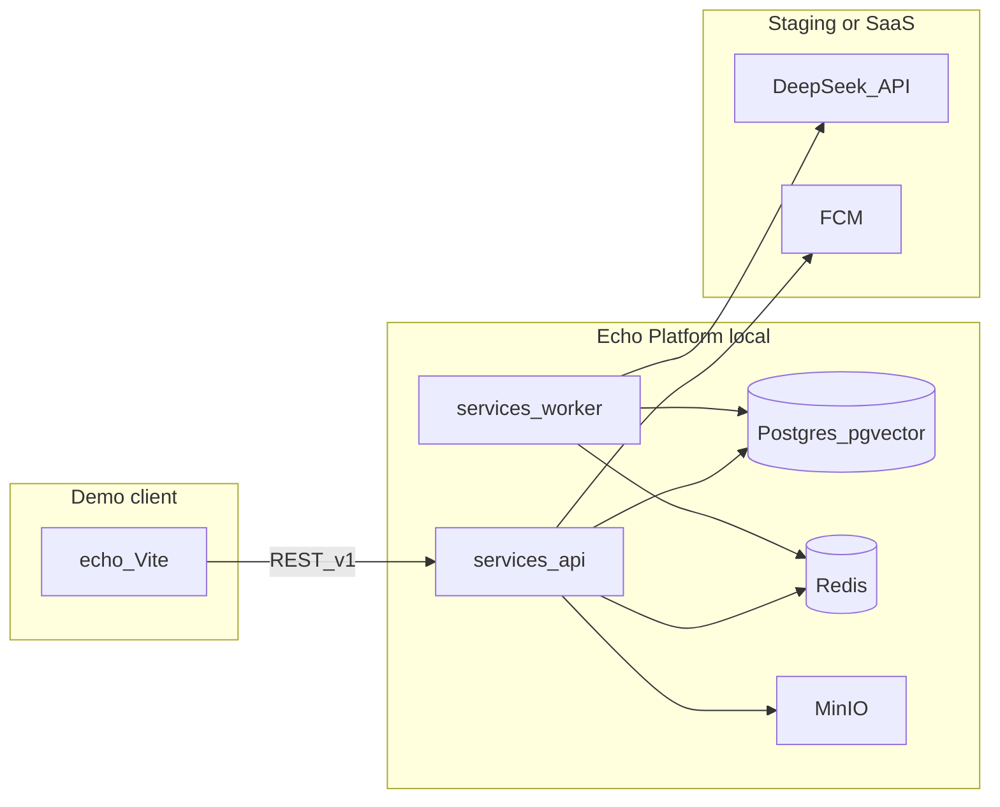

# Echo — Phase 1 Full-Function Demo Roadmap

| Field | Value |
|-------|-------|
| **Document Version** | 1.0.0 |
| **Status** | Active |
| **Last Updated** | 2026-05-20 |
| **Related Documents** | [PRD](./PRD-Echo.md), [Software Architecture](./Software-Architecture-Echo.md), [Deployment & Component Boundaries](./Deployment-and-Component-Boundaries-Echo.md), [Glossary](./glossary.md) |

**Language:** English (canonical). Simplified Chinese mirror: [`../docs_CN/Phase1-Demo-Roadmap-Echo.md`](../docs_CN/Phase1-Demo-Roadmap-Echo.md).

---

## 1. Goal and sequence

1. **Full-function demo** — Local and/or staging stack with **real API + data + workers** (not mock-only). Client for debugging: [`echo/`](../echo/) web prototype via `VITE_API_BASE_URL`, then optional Android debug build.
2. **Validate** — Product and design on the demo; update this matrix (`status` column) per feature.
3. **APK** — Start [`apps/android`](../apps/android/) release work only after demo rows needed for MVP are `done` and signed off (see row **P1-09**).

**Single source of truth for “one feature at a time”:** the matrix in §3. [`echo/docs/PHASE1-SCOPE-MAP.md`](../echo/docs/PHASE1-SCOPE-MAP.md) links here for sprint-level summary only.

---

## 2. Runtime topology (local demo)

**Local:** `infra/docker-compose.yml` (planned) — `docker compose up -d` for Postgres, Redis, MinIO; run `services/api` and `services/worker` on host or in containers.

**Online (staging):** HTTPS API hostname, Firebase project for FCM, DeepSeek (or other) API keys on worker/API — document secrets in env templates, never commit keys.

---

## 3. Feature matrix

Implement **one row at a time**. Set `status` to `doing` when started, `done` when demo-verified with real API (mock fallback only documented for offline dev).

| ID | Capability | FR | Client (demo) | Sync API | Async / worker | Data | Local | Staging / online | Implementation | Status |
|----|------------|-----|-----------------|----------|----------------|------|-------|------------------|----------------|--------|
| P1-00 | Dev infrastructure | — | — | — | — | Postgres, Redis, MinIO | `infra/docker-compose.yml`; `docker compose up -d` | Optional managed DB later | `infra/` | done |
| P1-01 | API shell + schema | FR-001+ | — | Health `GET /health` | — | Migrations in `services/api` | API on `localhost:4000` | Staging deploy | `services/api` | done |
| P1-02 | Auth register / OTP / login | FR-001–004 | `echo` auth shell | `POST /auth/register`, `/auth/otp`, `/auth/login`, `/auth/refresh` | — | `users` | Local API + JWT | Same API on staging | `services/api` | done |
| P1-03 | Onboarding survey + dialogue + finalize | FR-010–014 | `echo` onboarding wizard | `POST /onboarding/survey`, `/dialogue/turn`, `/finalize`; `GET /auth/me` skip | LLM via `LlmAdapter` | `profiles`, embeddings, `onboarding_sessions` | See [Onboarding Survey Design](./Onboarding-Survey-Design-Echo.md) | Staging | `services/api` | done |
| P1-04 | Digital clone CRUD + pause/resume | FR-020–024 | `echo` clone tab | `GET/PUT /clones/me`, pause/resume | — | `digital_clones`, `persona_prompts` | Local | Staging | `services/api` | done |
| P1-05 | Feed read | FR-030–034 | `echo` feed | `GET /feed`, `GET /posts/{id}` | — | `posts` | Local | Staging | `services/api` | done |
| P1-06 | Scheduled posts + moderation | FR-030–034, FR-033 | feed + post detail | — | `post-draft` + triggers in [Clone Runtime](./Clone-Runtime-and-Triggers-Echo.md) | `posts`, queue, Redis meta | Worker + DeepSeek | Staging | `services/worker` | done |
| P1-07 | Match list + dismiss + block | FR-040–044 | `echo` match tab | `GET /matches`, dismiss, `POST /blocks` | Daily match job | `match_pushes`, pgvector | Local PG + cron/scheduler | Staging + FCM | `services/api`, `services/worker` | done |
| P1-08 | Agent sessions + messages (read) | FR-050–054 | match detail / future session UI | `GET /sessions`, `GET /sessions/{id}/messages` | Agent turn loop | `agent_sessions`, `agent_messages` | Worker + LLM local | Staging | `services/worker`, `services/api` | done |
| P1-09 | Affinity + handoff | FR-060–065 | `echo` handoff UI | `GET /handoffs/{id}`, `POST /handoffs/{id}/respond` | Affinity per turn | `affinity_scores`, `handoffs` | Local | Staging + FCM notify | `services/api`, `services/worker` | done |
| P1-10 | Activity audit log | FR-070–072 | `echo` activity tab | `GET /audit/events` | `AuditEvent` on clone actions | `audit_events` | Local | Staging | `services/api` | done |
| P1-11 | Reports / moderation reports | FR-080–082 | settings / report entry | `POST /reports` | Mod queue | — | Local | Staging | `services/api` | done |
| P1-12 | WebSocket live updates (optional) | — | `echo` optional | `wss://.../v1/ws` | — | Redis pub/sub | Local | Staging | `services/api` | todo |
| P1-13 | Demo client wired to API | — | `echo` all tabs | All above via `VITE_API_BASE_URL` | — | — | `http://localhost:4000/v1` | Staging URL | `echo/src/api/*` | done |
| P1-14 | Android shell + navigation | — | APK | Same REST as §10 | — | — | Emulator + local API | Staging API | `apps/android` | done |
| P1-15 | Hardening + signed APK | — | release APK | — | — | — | CI local | Play/sideload | `apps/android`, `.github/workflows/` | done |

**Status values:** `todo` | `doing` | `blocked` | `done`

---

## 4. Mock policy (demo phase)

| Allowed | Not allowed for “done” |
|---------|-------------------------|
| Mock when API unreachable (explicit fallback in client) | Entire feature only mock with no `services/*` implementation |
| Seed data in local Postgres | Production secrets in `echo` `VITE_*` builds |

When a row is `done`, the **happy path** must hit the real local (or staging) API documented in that row.

---

## 5. Governance (Agent / CI)

| Layer | What it does |
|-------|----------------|
| Skill **echo-deployment-boundaries** | Deployment topology + Phase 1 demo rules |
| Hook **phase1-context-nudge.py** | Reminds after writes under `echo/`, `services/`, `infra/`, `apps/`, roadmap docs |
| **This file** | Update `status` when implementing a feature |
| Future CI (optional) | Block release if roadmap P1-13 not `done`; no `VITE_*` secrets in production web build |

Hooks and skills **do not** enforce compliance automatically; they reduce mistakes. Reviewers should check this matrix on PRs.

---

## 6. Change log

| Version | Date | Summary |
|---------|------|---------|
| 1.0.0 | 2026-05-20 | Initial feature matrix for full-function demo before APK |
