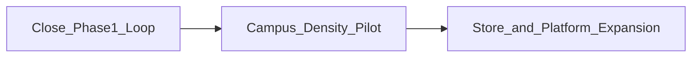
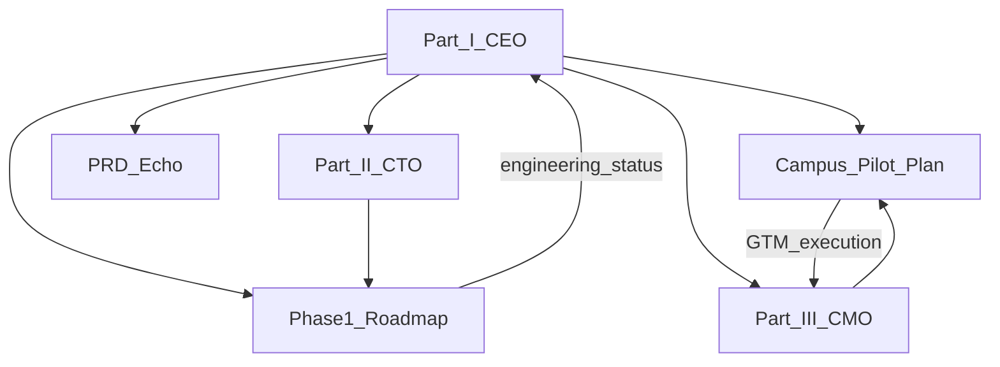
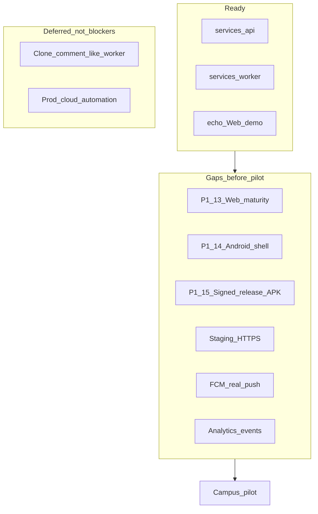
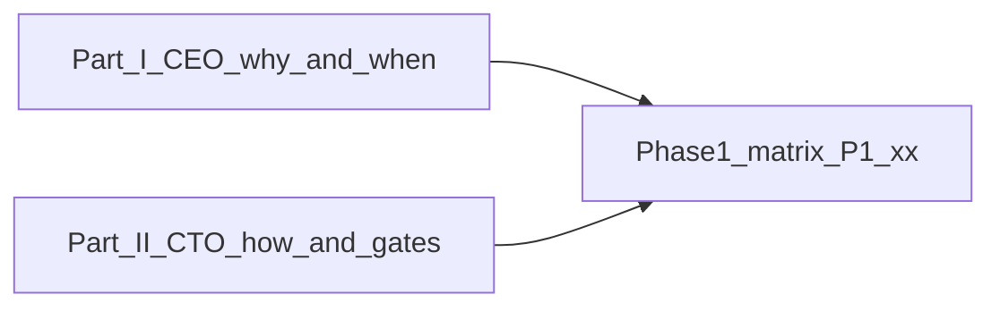
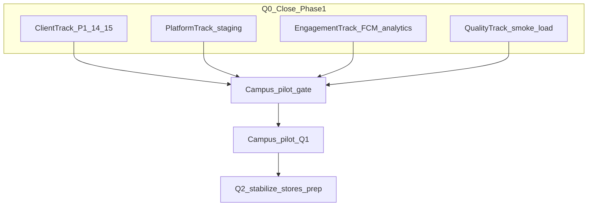
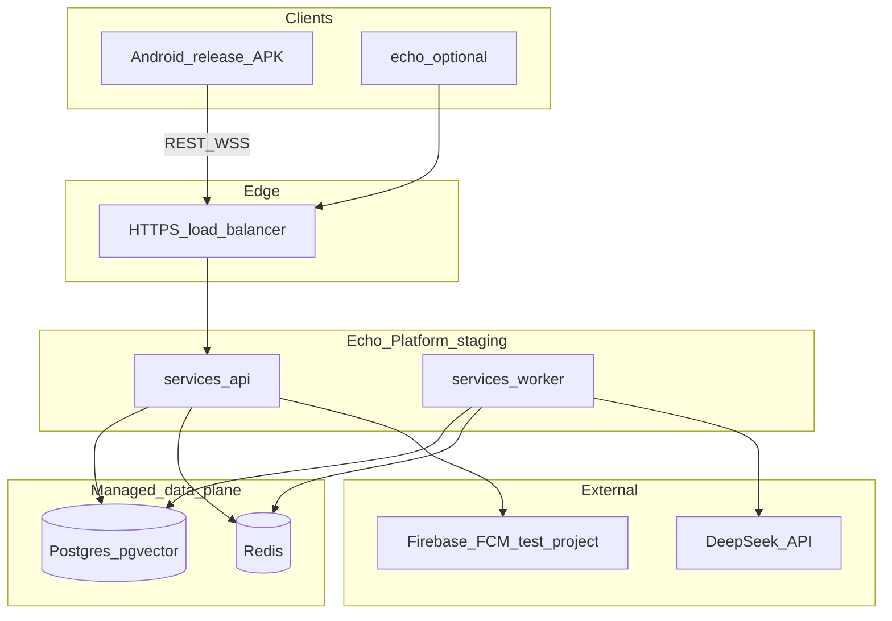
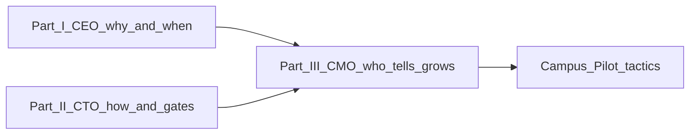
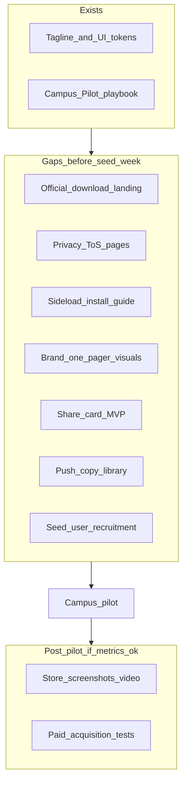
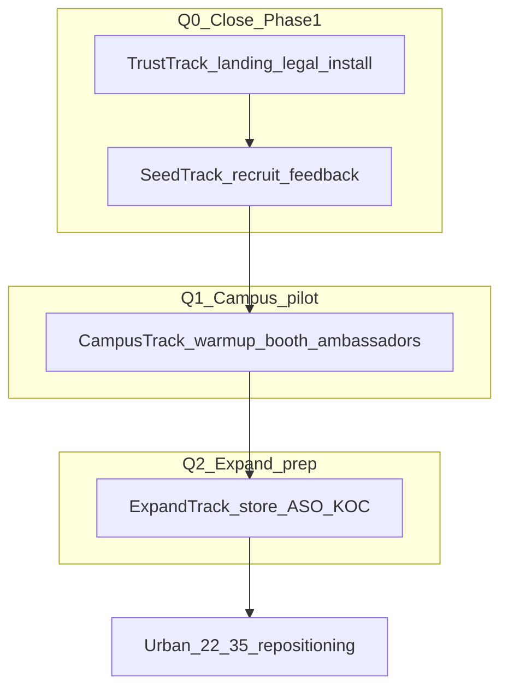
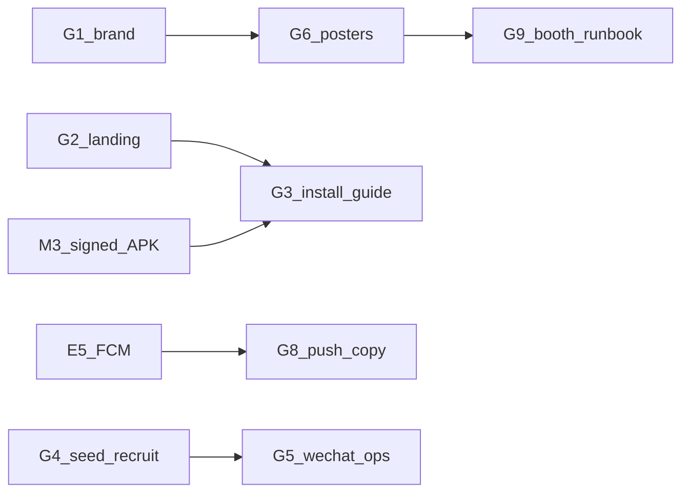

# Echo — Strategic Update Plan

| Field | Value |
|-------|-------|
| **Product Name** | Echo |
| **Document Version (Part I)** | 1.1.0 |
| **Status** | Active |
| **Last Updated** | 2026-05-29 |
| **Authors** | Executive / Product Leadership (Part I); CTO (Part II); CMO (Part III) |
| **Audience** | Founders, product, engineering, growth, investors |
| **Related Documents** | [PRD](./PRD-Echo.md), [Phase 1 Demo Roadmap](./Phase1-Demo-Roadmap-Echo.md), [Campus Pilot Launch Plan](./Campus-Pilot-Launch-Plan-Echo.md), [Software Architecture](./Software-Architecture-Echo.md), [Deployment & Component Boundaries](./Deployment-and-Component-Boundaries-Echo.md), [Glossary](./glossary.md) |

**Language:** English (canonical). Simplified Chinese mirror: [`../docs_CN/Strategic-Update-Plan-Echo.md`](../docs_CN/Strategic-Update-Plan-Echo.md).

### Document structure

| Part | Sections | Perspective |
|------|----------|-------------|
| **Part I** | §1–§13 | CEO — why, sequencing, gates, cross-functional risks |
| **Part II** | §14–§26 | CTO — how to deliver, engineering blockers, technical gates |
| **Part III** | §27–§41 | CMO — market readiness, GTM, growth loops, expansion gates |

---

## 1. Executive Summary

**Tagline:** *AI breaks the ice; real connection stays human.*（AI 替你破冰，心动留给真实）

Echo is an **AI-clone social discovery** product. Users create a **Digital Clone** through fast onboarding; clones post on the feed, match with other clones, and converse agent-to-agent. When mutual **Affinity** crosses a threshold, **Human Handoff** invites both Real Users to decide whether to connect offline.

### 1.1 Where we are (May 2026)

| Dimension | Assessment |
|-----------|------------|
| **Technology validation** | Past inflection point — local full-stack demo works (`services/api`, `services/worker`, [`echo/`](../echo/) with `VITE_API_BASE_URL`) |
| **Product validation** | Not started — no signed release APK, no real users, no staging environment |
| **Strategic position** | Late Phase 1 — platform locally demonstrable; **three readiness axes** must close before a meaningful campus pilot |

**Three readiness axes (CEO view):**

| Axis | Current state | Detail |
|------|---------------|--------|
| **Engineering delivery** | Platform demo-ready; not pilot-ready | APK, staging HTTPS, FCM, and analytics not yet complete — see Part II §15 |
| **Market readiness** | Not market-ready | No official landing page, legal URLs, or sideload install guide — see Part III §28 |
| **Measurable pilot** | Not yet measurable at scale | M3 + M4 must land together before seed week is meaningful — see Part II §15.3 |

### 1.2 Strategic through-line

1. **Close the loop** — Ship a signed Android APK that runs the full MVP against real API.
2. **Validate on campus** — Prove retention and Handoff mechanics with 20–50 seed users, then one school.
3. **Expand** — Domestic Android stores, then iOS (Phase 2); monetization and depth features (Phase 3) only after product-market signal.

**Part I** of this document is the **CEO-level master plan** for the next **6–18 months**. It does **not** replace the [Phase 1 feature matrix](./Phase1-Demo-Roadmap-Echo.md) for day-to-day engineering status; it provides **why, in what order, and how we measure success**. Engineering and marketing execution detail live in **Part II** and **Part III** respectively.

---

## 2. Document Roles in the Stack

| Document | Role | What this plan adds |
|----------|------|---------------------|
| [PRD](./PRD-Echo.md) | Product capabilities, `FR-xxx` scope | Progress vs. scope; phase gates |
| [Phase 1 Demo Roadmap](./Phase1-Demo-Roadmap-Echo.md) | Engineering checklist (`P1-xx`, per-layer `API` \| `Worker` \| `Web` \| `APK`) | Strategic priority above individual rows |
| [Campus Pilot Launch Plan](./Campus-Pilot-Launch-Plan-Echo.md) | GTM: sideload, growth, retention, store expansion | Go / kill criteria tied to engineering gates |
| [Software Architecture](./Software-Architecture-Echo.md) §15 | Phase 2/3 bullet list | Resource order and decision principles |
| **Part I (this document)** | Cross-functional strategy | Sequencing, metrics, risks, org principles |
| **Part II (§14–§26)** | CTO engineering outlook | Delivery workstreams, technical debt, E1–E8 tasks |
| **Part III (§27–§41)** | CMO market outlook | Brand, trust, channels, G1–G10 tasks |

---

## 3. Honest State Assessment

Aligned with [Phase 1 Demo Roadmap §3.2](./Phase1-Demo-Roadmap-Echo.md) (v1.1.0, 2026-05-28).

### 3.1 What is ready

| Layer | Status | Evidence |
|-------|--------|----------|
| **Infrastructure** | `done` | `infra/docker-compose.yml`; Neon/Upstash path for Windows |
| **API** | P1-00–P1-12 `API` = `done` | Auth, onboarding, clones, feed, matches, sessions, handoffs, audit, reports, WebSocket |
| **Worker** | Applicable rows `done` | Queues: `post-draft`, `moderation`, `match-daily`, `agent-turn`, `report-triage`; Clone Runtime + LLM |
| **Web demo** | P1-02–P1-12 `Web` = `done` | [`echo/`](../echo/) wired to REST + `/v1/ws`; P1-13 = `doing` |

**Strengths:** End-to-end loop demonstrable locally; agent mechanics documented ([Agent Behavior](./Agent-Behavior-and-Mechanics-Echo.md), [Clone Runtime](./Clone-Runtime-and-Triggers-Echo.md)); one-click Windows demo (`start-echo-demo.cmd`).

### 3.2 Critical gaps

| Gap | Impact | Owner |
|-----|--------|-------|
| **P1-14** Android shell (`APK` = `todo`) | No Phase 1 client; campus sideload blocked | Engineering |
| **P1-15** Signed release APK (`APK` = `todo`) | CI builds debug only; no trustworthy distribution | Engineering + DevOps |
| **P1-13** Web integration maturity (`Web` = `doing`) | Demo polish; not a pilot blocker if APK is primary | Engineering |
| **Staging HTTPS** | No shared pre-prod for seed users off localhost | Engineering + Infra |
| **FCM** | Handoff push is stub; weak re-engagement | Engineering |
| **Analytics** | Cannot measure pilot success without event pipeline | Product + Engineering |
| **Clone comments/likes (Worker)** | PRD scope; feed schema exists but no generation logic | Engineering (post-pilot or parallel if capacity) |
| **Market trust pack** | Low sideload conversion without official touchpoints | Growth + design — see Part III §28.2 |
| **Share card MVP** | Viral loop cannot start; ambassador KPIs blind | Product + engineering — see Part III §33 (CMO P0) |
| **Engineering debt register** | Regression and scale risk if unmanaged | Engineering — see Part II §21 |

### 3.3 Non-negotiable principles

| Principle | Rationale |
|-----------|-----------|
| **Do not substitute Web for APK** | PRD Phase 1 client is Android; [`echo/`](../echo/) is design/demo only ([Deployment Boundaries §6](./Deployment-and-Component-Boundaries-Echo.md)) |
| **Do not substitute client Mock for `services/*`** | Platform must be real before labeling layers `done` ([Phase 1 §4](./Phase1-Demo-Roadmap-Echo.md)) |
| **One feature at a time** | Avoid parallel scope creep; update roadmap columns per row |
| **Campus gate before scale** | No broad sideload until [Phase 1 §3.3](./Phase1-Demo-Roadmap-Echo.md) campus APK gate is met |
| **Pilot start is cross-functional** | Campus pilot requires engineering gate (§5.3), platform pack (M4), and market trust minimum (§5.4) — not APK alone |

---

## 4. Strategic Priorities (Next Four Quarters)

### 4.1 Phase overview

| Phase | Timeframe | Goal | Key deliverables | Tracking doc |
|-------|-----------|------|------------------|--------------|
| **Q0: Close Phase 1** | Now – 4 weeks | Sideloadable signed APK | P1-13 `done`; P1-14/15 `done`; staging API | [Phase 1 §3.3](./Phase1-Demo-Roadmap-Echo.md) |
| **Q1: Campus pilot** | Weeks 4–10 | Validate core loop + retention | 20–50 seed users; analytics; feedback loop | [Campus Pilot](./Campus-Pilot-Launch-Plan-Echo.md) |
| **Q2: Stabilize & expand** | Weeks 10–20 | Retention iteration + CN stores prep | Play compliance; FCM + analytics mature; match tuning | This plan §6 + future Phase 2 checklist |
| **Q3+: Phase 2** | 6+ months | Stores + iOS | AAB; APNs; iOS client choice | [Software Architecture §15](./Software-Architecture-Echo.md) |

### 4.2 Resource focus order (CEO decision)

Two tracks run **in parallel from day 1**; both must complete before campus week 5 peak.

**Engineering track (blocks pilot):**

1. **Android client** — Only Phase 1 production client path ([`apps/android`](../apps/android/))
2. **Staging + release pipeline** — Prerequisite for sideload and pilot
3. **Push + analytics** — Handoff and retention touchpoints (M4)

**Market track (blocks conversion):**

1. **Brand one-pager + landing / legal URLs** — Trust foundation (parallel with M3)
2. **Sideload install guide** — After M3 signed APK (maps to Part III G3)
3. **Seed recruitment (20–50)** — Fills cohort before seed week (maps to Part III G4)

**Product negotiation (CMO P0, not `echo/` scope expansion):**

- **Share card MVP** — Schedule with Android before seed week; spec in Part III §33

**Unchanged priorities:**

4. **Web demo** — Design and API contract reference only; **no scope expansion** (Part II §16.1)
5. **Phase 2 iOS** — Start only after campus data supports go criteria (§6.3)

### 4.3 Explicitly not prioritized (next 12 months)

Per [PRD §4.2](./PRD-Echo.md):

- Video / voice calls
- Production Web client
- Advertising-led monetization
- Government ID verification (Phase 3)
- iOS before Android pilot learnings

---

## 5. Phase 1 Close-Out Plan

Engineering detail stays in the [Phase 1 matrix](./Phase1-Demo-Roadmap-Echo.md). CEO milestones:

### 5.1 Milestones

| ID | Milestone | Success criteria | Target |
|----|-----------|------------------|--------|
| M1 | **P1-13 Web maturity** | All main tabs verified with `VITE_API_BASE_URL`; known limits documented in roadmap Notes | Week 1–2 |
| M2 | **P1-14 Android shell** | Tab navigation + auth → onboarding → feed / match / clone / log / settings; REST parity with `echo/` | Week 2–4 |
| M3 | **P1-15 Release APK** | `assembleRelease` + signing; CI artifact; privacy policy + ToS URLs live | Week 3–4 |
| M4 | **Pilot platform pack** | Staging HTTPS; FCM wired for handoff/match; minimum analytics ([Campus Pilot §2.3](./Campus-Pilot-Launch-Plan-Echo.md)) | Week 4 |

### 5.2 P1-14 scope guidance

**Full target:** Feature parity with [`echo/`](../echo/) happy paths for P1-02–P1-11.

**Minimum viable pilot (if schedule slips):**

- 3 tabs: feed, match, clone
- Auth + onboarding + Handoff in match detail
- Activity log and settings can follow in seed-week builds ([Campus Pilot §3.3](./Campus-Pilot-Launch-Plan-Echo.md): 2–3 rapid APK iterations)

### 5.3 Release gate (non-negotiable)

From [Phase 1 §3.3](./Phase1-Demo-Roadmap-Echo.md) — **campus sideload** requires:

| Rows | Requirement |
|------|-------------|
| P1-04a–c, P1-07–P1-11, P1-14, P1-15 | `APK` = `done` |
| P1-15 specifically | Signed **release** artifact, not debug-only CI |

### 5.4 Cross-functional campus pilot start gate (CEO decision)

All rows below must be met before entering the **seed-test peak** in §6.2 (week 3 onward at scale). This gate **supplements** §5.3; it does not replace Part II or Part III detail.

| Dimension | Gate | Authority |
|-----------|------|-----------|
| **Client** | P1-14/15 `APK` = `done` (signed release) | §5.3 |
| **Platform** | Staging HTTPS + FCM + minimum analytics (M4) | Part II §15.2, §20 |
| **Market** | Landing page + privacy / ToS URLs + sideload install guide + 20–50 seed queue | Part III §28.2, §40 (G1–G4) |
| **Quality** | Staging smoke pass; load test before campus week 5 | Part II §20.4 |

**Cross-reference:** CEO §11 #7 (legal pages) and Part III **G2** are the same deliverable. §11 #8 (seed recruitment) aligns with **G4**.

---

## 6. Campus Pilot — Product Validation

Execution detail: [Campus Pilot Launch Plan](./Campus-Pilot-Launch-Plan-Echo.md).

### 6.1 North Star metrics

| Metric | Why it matters |
|--------|----------------|
| **Handoff conversion** | Proves AI-proxy discovery leads to human intent |
| **Week-2 retention** | Proves novelty is not the only driver |
| **Clone creation rate** | Proves onboarding + clone quality |
| **Messages per DAU** | Proves agent sessions are engaging |

Baseline targets: [Campus Pilot §1.2](./Campus-Pilot-Launch-Plan-Echo.md) (e.g. Week-2 retention > 35%, clone creation > 70% of activated accounts).

**Full funnel (awareness → Handoff):** Part III §36. **Server-side audit rules** for key events: Part II §20.2.

### 6.2 Pilot sequence

| Week | Activity | Gate |
|------|----------|------|
| 1–3 | MVP verification, recruit 20–50 seed users | M3 + M4 complete |
| 3 | Seed test, 2–3 APK builds | Acceptable crash-free rate on seed devices |
| 4 | Warm-up (posters, reservations) | — |
| 5–6 | Campus rollout (offline + online) | Staging stable under load |
| 7–8 | Metrics review, interviews, store assets | Release candidate APK |

### 6.3 Go / kill criteria (end of pilot review)

| Outcome | Condition | Action |
|---------|-----------|--------|
| **Kill / pivot** | Onboarding completion < 50% **or** Week-2 retention < 20% | Prioritize onboarding and clone fidelity; **do not** expand schools or start Phase 2 iOS |
| **Iterate** | Metrics mixed but above kill floor | Tune affinity threshold, push copy, quests ([Campus Pilot §4.3](./Campus-Pilot-Launch-Plan-Echo.md)) |
| **Go** | Meets §1.2 baselines **and** install → onboarding → Handoff funnel observable for 7+ consecutive days | Begin domestic Android store prep; match algorithm iteration; plan Phase 2 roadmap doc |

---

## 7. Phase 2 and Phase 3 Direction

Detailed engineering checklists for Phase 2+ **do not exist yet**; this section sets **strategic priority** pending campus data.

### 7.1 Phase 2 — Store & iOS

Per [Software Architecture §15](./Software-Architecture-Echo.md) and [PRD §4.2](./PRD-Echo.md):

| Initiative | Priority | Notes |
|------------|----------|-------|
| Google Play AAB + data safety form | High | After pilot stability |
| Major CN Android stores (Huawei, Xiaomi, OPPO, vivo, 应用宝) | High | [Campus Pilot §6](./Campus-Pilot-Launch-Plan-Echo.md) |
| APNs (symmetric to FCM) | High | Required for iOS Handoff |
| iOS client | Medium (after Go) | **Lean Option B** (native SwiftUI, same REST API) unless KMP shared modules already exist from Android work |
| Privacy / AI content disclaimers for stores | High | Align with moderation + report flow (FR-080–082) |

**Deliverable to create after Go criteria:** `Phase2-Roadmap-Echo.md` with same per-layer discipline as Phase 1.

### 7.2 Phase 3 — Depth & monetization

| Initiative | Timing | PRD reference |
|------------|--------|---------------|
| Real-user in-app messaging post-Handoff | After Handoff loop proven | Phase 1.5 optional → formal |
| Identity verification provider | When scale requires trust | Out of scope v1 |
| Subscription billing | After retention proven | Out of scope v1 |

### 7.3 Product bets to validate in pilot

| Hypothesis | How we learn |
|------------|--------------|
| AI-proxy social reduces friction vs. traditional dating apps | Handoff rate vs. industry baselines; qualitative interviews |
| Transparency (audit log) builds trust | Weekly audit log view rate (G3 in PRD) |
| Campus density beats broad launch | DAU % of enrolled students at pilot school |

---

## 8. Organization & Operating Principles

### 8.1 Engineering governance

| Practice | Mechanism |
|----------|-----------|
| One row at a time | [Phase 1 matrix](./Phase1-Demo-Roadmap-Echo.md) §3.2 |
| Deployment boundaries | Skill **echo-deployment-boundaries**; [Deployment doc](./Deployment-and-Component-Boundaries-Echo.md) |
| Status honesty | Per-layer `API` \| `Worker` \| `Web` \| `APK` — no single row-wide `done` |
| Demo sequence | Real API + Worker → validate on `echo/` → ship `apps/android` APK |

### 8.2 Monorepo structure (unchanged)

| Unit | Rationale |
|------|-----------|
| `services/api` + `services/worker` | Shared Prisma schema; independent scale at deploy |
| `apps/android` | Separate Gradle module; APK signing lifecycle |
| `echo/` | Non-production demo; do not merge into APK scope creep |

### 8.3 Documentation governance

| Change type | Update |
|-------------|--------|
| Feature landed | Phase 1 matrix columns only |
| Strategic shift | This plan + PRD version if scope changes |
| GTM tactic | Campus Pilot Launch Plan |
| New phase | New roadmap doc (e.g. Phase 2) when phase starts |

### 8.4 Compliance before sideload

- Privacy policy and user agreement URLs (public)
- Content moderation + `report-triage` demonstrable (P1-06, P1-11)
- Clear Digital Clone consent in onboarding (FR-010–014)
- Bilateral Handoff consent (FR-060–065)

---

## 9. Risks & Mitigations

| Risk | Impact | Mitigation |
|------|--------|------------|
| Android delivery slips | Pilot blocked; strategy stalls | Minimum P1-14 scope (§5.2); weekly milestone review |
| LLM cost / latency | Poor agent UX | Worker concurrency limits; prompt optimization; pilot daily dialogue quotas |
| Campus cold start | Insufficient density | Seed program + ambassadors ([Campus Pilot §3–4](./Campus-Pilot-Launch-Plan-Echo.md)) |
| Sideload trust friction | Low install rate | Install guide; KOL-assisted install; move to stores quickly |
| Regulatory / content safety | Takedown, reputational harm | Moderation queues; report triage; human review before wide rollout |
| Server overload at launch | Outages during signup spikes | Staging load test; rate limits; queue backpressure on `agent-turn` |
| Campus vs. PRD demographic skew | Messaging drift at national scale | Pilot = students; national GTM realigns to 22–35 urban segment ([Campus Pilot §1.3](./Campus-Pilot-Launch-Plan-Echo.md)) |
| Android / `echo/` contract drift | Dual-client bugs; wasted engineering | P1-13 audit; shared REST contract — Part II §24 |
| Sideload without trust touchpoints | Low install conversion despite ready APK | Official landing + install guide — Part III §38 |
| No share card in product | Broken viral loop; blind ambassador spend | P0 alignment before seed week — Part III §33 |

---

## 10. Success Definition by Stage

| Stage | Definition of success |
|-------|----------------------|
| **Phase 1 close** | Signed release APK passes campus gate; seed users complete full loop on **staging** (not localhost); official download path live |
| **Campus pilot** | Week-2 retention and Handoff baselines met; 3–5 viral UGC stories (or 3–5 authorized screenshot/leak cases if share card MVP not yet shipped — Part III §33); stable crash rate |
| **Store expansion** | CN Android stores live with acceptable ratings; LLM cost per DAU within budget |
| **Phase 2** | iOS parity on core loop; APNs + FCM operational |
| **Phase 3** | Paid conversion hypothesis tested without harming Handoff trust |

---

## 11. Immediate Next Actions (30 days)

CEO-level actions below. Granular engineering tasks: **Part II §25 (E1–E8)**. Granular marketing tasks: **Part III §40 (G1–G10)**. Weekly joint review agendas: Part II §23.1 and Part III §39.2.

| # | Action | Owner | Depends on | Maps to |
|---|--------|-------|------------|---------|
| 1 | Mark P1-13 `Web` = `done` after integration audit | Engineering | — | E1 |
| 2 | Implement Android navigation shell (P1-14) | Engineering | REST client in `apps/android` | E2 |
| 3 | Configure release signing + CI `assembleRelease` (P1-15) | Engineering | Keystore secrets (not in repo) | E3 |
| 4 | Stand up staging HTTPS API | Engineering / Infra | Env templates in `infra/` | E4 |
| 5 | Wire FCM for match + handoff events | Engineering | Firebase project | E5 |
| 6 | Implement minimum analytics events | Product + Engineering | [Campus Pilot §2.3](./Campus-Pilot-Launch-Plan-Echo.md) | E6 (with E5/E4) |
| 7 | Publish privacy policy + ToS landing page | Legal / Growth | — | G2 |
| 8 | Recruit 20–50 seed users | Growth / Product | M3 in progress | G4 |

**Delegation:** Do not duplicate Part II/III task tables in sprint tools — link to **E1–E8** and **G1–G10** as the assignable source of truth.

---

## 12. Change Log

| Version | Date | Summary |
|---------|------|---------|
| 1.1.0 | 2026-05-29 | CEO Part I revised for cross-functional alignment with Part II/III; Part II and Part III unchanged |
| 1.0.0 | 2026-05-29 | Initial strategic update plan (CEO view); aligns with Phase 1 roadmap v1.1.0 |

---

## 13. Out of Scope (Part I — CEO sections)

Part I does **not** expand execution detail for the items below. That is **not** the same as “no company work required.”

| Out of scope in Part I | Where to read |
|------------------------|---------------|
| Marketing creative **execution checklists and templates** (posters, stickers, video edits) | Part III §28–§40 |
| Engineering **runbooks, CI steps, and API reference** | Part II §14–§25; `services/*/README.md` |
| New `FR-xxx` definitions or PRD scope changes | [PRD](./PRD-Echo.md) |
| Per-feature implementation status | [Phase 1 Demo Roadmap §3.2](./Phase1-Demo-Roadmap-Echo.md) |

---

# Part II — CTO Engineering Outlook

| Field | Value |
|-------|-------|
| **Perspective** | Chief Technology Officer |
| **Document Version (Part II)** | 1.1.0 |
| **Last Updated** | 2026-05-29 |
| **Audience** | Engineering, infra, Android, backend, product partners |
| **Status** | Active — appended; Part I (§1–§13) unchanged |

---

## 14. How to Read the CTO View

Part I (§1–§13) is the **CEO master plan**: sequencing, resource focus, campus Go/Kill criteria, and cross-functional risks. Part II is the **CTO engineering outlook**: how we deliver, what blocks release, technical debt order, and engineering gates.

**Alignment:** The CTO endorses the CEO through-line — close Phase 1 → campus pilot → store expansion. Where this part adds value is **implementation detail**, **parallel workstream boundaries**, and **when technical debt must be paid** before scaling.

**Source of truth for row-level status:** [Phase 1 Demo Roadmap §3.2](./Phase1-Demo-Roadmap-Echo.md). This part does not replace per-layer `API` \| `Worker` \| `Web` \| `APK` updates.

| Question | Read Part I | Read Part II |
|----------|-------------|--------------|
| Should we run a campus pilot? | §6 | §15–§16 (readiness) |
| What ships in the next 4 weeks? | §5, §11 | §18, §25 |
| When do we start iOS? | §7.1 | §22 |
| How do we measure pilot success? | §6.1 | §20 (SLO + analytics plumbing) |

---

## 15. Technical State Assessment

Aligned with CEO §3 and [Phase 1 Demo Roadmap](./Phase1-Demo-Roadmap-Echo.md) v1.1.0. This section goes deeper on **code-level evidence** and **engineering blockers**.

### 15.1 Validated technical assets

| Asset | Evidence | CTO assessment |
|-------|----------|----------------|
| **Synchronous API** | `services/api` — auth, onboarding, clones, feed, matches, sessions, handoffs, audit, reports, WebSocket | Production-shaped for MVP; happy paths verifiable locally |
| **Async platform** | `services/worker` — `post-draft`, `moderation`, `match-daily`, `agent-turn`, `report-triage` | Core clone loop operational |
| **Live updates** | Redis `echo:live` → `GET /v1/ws` | Validated on [`echo/`](../echo/); Android should adopt in W4 |
| **Agent mechanics** | [Agent Behavior](./Agent-Behavior-and-Mechanics-Echo.md), [Clone Runtime](./Clone-Runtime-and-Triggers-Echo.md) | As-built docs exist; MVP vs target gaps explicit |
| **Local demo ergonomics** | `infra/docker-compose.yml`, `start-echo-demo.cmd`, Neon/Upstash path | Strong for dev; not a substitute for staging |

### 15.2 Engineering blockers (CTO view)

| Item | Evidence | CTO verdict | Pilot blocker? |
|------|----------|-------------|----------------|
| **P1-14 Android shell** | [`MainActivity.kt`](../apps/android/app/src/main/java/com/echo/app/MainActivity.kt) — placeholder text only | **P0** — no production client | **Yes** |
| **P1-15 signed release** | [`.github/workflows/android-apk.yml`](../.github/workflows/android-apk.yml) — `assembleDebug` only | Campus gate unmet | **Yes** |
| **Staging HTTPS** | `infra/` — local Compose + native Windows guide; no staging deploy runbook | Seed users cannot leave localhost | **Yes** |
| **FCM** | `handoffs.service.ts` — `[FCM stub]` console log | Handoff re-engagement broken | **Yes** (M4) |
| **Analytics pipeline** | Campus Pilot §2.3 events not wired end-to-end | Cannot measure CEO §6.1 metrics reliably | **Yes** (M4) |
| **Integration tests** | No `*.spec.ts` / `*.test.ts` under `services/*` | APK iteration regression risk | No (mitigate with smoke scripts) |
| **FR-032 comments/likes** | Feed schema exists; no Worker generation | Social density hypothesis untested | No (evaluate by pilot week 3) |
| **Affinity / matching stubs** | [Agent Behavior §5.5](./Agent-Behavior-and-Mechanics-Echo.md) — linear turn formula, list vs session score split | Tuning limited; not a launch blocker | No |

### 15.3 CTO summary vs CEO §3.2

The CEO correctly identifies **client delivery as the bottleneck**. The CTO adds: the platform is **demo-ready, not pilot-ready** until **signed APK + staging + FCM + minimum analytics** land together (CEO M3 + M4). Treating any one of these as optional will produce a pilot we cannot measure or re-engage.

---

## 16. Engineering Workstreams (Q0–Q2)

Four workstreams run in parallel with explicit dependencies. CEO §4.2 resource order maps to **ClientTrack** and **PlatformTrack** first; **EngagementTrack** and **QualityTrack** must complete before campus week 5.

| Workstream | Scope | Primary paths | Exit criteria |
|------------|-------|---------------|---------------|
| **ClientTrack** | P1-14 navigation + REST parity; P1-15 release | [`apps/android`](../apps/android/) | Campus APK gate rows `APK` = `done` |
| **PlatformTrack** | Staging HTTPS, env templates, secrets hygiene | `infra/`, `services/api`, `services/worker` | Shared API URL for seed devices |
| **EngagementTrack** | Real FCM; minimum analytics events | `services/api`, Android client | Handoff push E2E; §2.3 events flowing |
| **QualityTrack** | Smoke tests, staging load test, queue backpressure | `services/*`, CI | Smoke green on staging; load test report before week 5 |

### 16.1 CTO supplements to CEO decisions

| CEO position (Part I) | CTO position (Part II) |
|-----------------------|------------------------|
| Web demo — no scope expansion (§4.2) | **Agree.** Freeze `echo/` feature scope. Complete **P1-13 integration audit checklist** and treat [`echo/src/api/*`](../echo/src/api/) as the **single REST contract** for Android — prevents dual-client drift. |
| Comments/likes deferred (§3.2) | **Agree for launch.** Re-evaluate by **pilot week 3**: if feed engagement is flat, prioritize `post-comment` / `post-like` Worker jobs before store expansion. |
| Phase 2 iOS after Go (§4.2) | **Agree.** Default **Option B** — native SwiftUI consuming same REST ([Software Architecture §15](./Software-Architecture-Echo.md)). Do not start KMP extraction until Android `data/` layer is stable (§22). |
| One feature at a time (§3.3) | **Agree for matrix rows.** Exception: **PlatformTrack + EngagementTrack** may proceed in parallel with ClientTrack because they touch different deployables and are both M4 prerequisites. |

---

## 17. Platform Architecture & Staging

Follow [Deployment & Component Boundaries](./Deployment-and-Component-Boundaries-Echo.md): managed Postgres and Redis in staging/prod; stateless API and Worker pools scale independently; LLM and FCM remain external SaaS.

### 17.1 Staging minimum topology

### 17.2 Staging deliverables (engineering)

| Deliverable | Owner | Notes |
|-------------|-------|-------|
| Staging env template | Infra | e.g. `infra/staging.env.example` — connection strings, public API URL, feature flags; **no secrets in repo** |
| OTP policy | Backend | Disable `OTP_DEV_CODE` on staging; use real SMS provider or invite-only allowlist for seed cohort |
| JWT secrets | Infra | Rotated from local dev; separate signing keys per environment |
| Worker limits | Worker | Env vars: `agent-turn` concurrency cap, per-clone daily turn quota, `LLM_TIMEOUT_MS` |
| Deploy runbook | Infra | Document API + Worker start order; health check `GET /v1/health` |

### 17.3 Security baseline (pre-sideload)

- No production LLM keys in client builds (`echo` `VITE_*` is dev-only per deployment boundaries).
- Structured logs must not include OTP codes, refresh tokens, or full persona prompts.
- Rate limits on auth and onboarding endpoints before campus week 5 traffic.

---

## 18. Android Delivery Technical Plan

Target structure per [Software Architecture §16](./Software-Architecture-Echo.md). **Do not port** React/Vite code from [`echo/`](../echo/). **Reuse** REST paths and response shapes from [`echo/src/api/`](../echo/src/api/).

### 18.1 Four-week delivery schedule

| Week | Focus | Deliverables |
|------|-------|--------------|
| **W1** | Data layer + auth | Hilt modules; Retrofit + OkHttp; `BuildConfig.API_BASE_URL`; token storage; `POST /auth/*`, `GET /auth/me` on emulator |
| **W2** | Core tabs | Feed (`GET /feed`), Match (`GET /matches`, dismiss, block), Clone (`GET/PUT /clones/me`, pause/resume, `POST /posts/draft`) |
| **W3** | Full loop | Onboarding 8 steps; match detail + affinity + Handoff; activity log; report sheet; settings (logout) |
| **W4** | Release hardening | `assembleRelease` + signing; optional WebSocket live; crash reporting hook; zh-CN UI strings |

### 18.2 API base URL strategy

| Build | `API_BASE_URL` |
|-------|----------------|
| Local emulator | `http://10.0.2.2:4000/v1` |
| Staging | HTTPS hostname via `build.gradle.kts` product flavor or `buildConfigField` |
| Release sideload | Same as staging until prod cutover |

### 18.3 CI upgrade (P1-15)

| Current | Target |
|---------|--------|
| `assembleDebug` artifact | `assembleRelease` signed APK |
| Unsigned debug upload | Keystore via GitHub Actions secrets |
| Artifact name `echo-debug-apk` | `echo-release-{short_sha}.apk` |

### 18.4 Minimum viable pilot scope (CEO §5.2 — engineering view)

If schedule slips, ship **in this order** (each layer must hit real API):

1. Auth + onboarding finalize → clone exists
2. Feed read + match list
3. Match detail + Handoff respond
4. Clone pause + manual post draft
5. Activity log, settings, WebSocket — **fast-follow** builds during seed week

---

## 19. Worker & Agent Runtime Evolution

Roadmap derived from [Agent Behavior §5.5](./Agent-Behavior-and-Mechanics-Echo.md) and [Clone Runtime](./Clone-Runtime-and-Triggers-Echo.md). CEO §9 names LLM cost risk; this section defines **implementation**.

### 19.1 Priority matrix

| Priority | Item | Timing | Rationale |
|----------|------|--------|-----------|
| **P0** | Replace FCM stub; Handoff + match push | Before M4 | Re-engagement for CEO north-star metrics |
| **P0** | `agent-turn` backpressure + timeout enforcement | Before M4 | Prevents queue collapse at signup spikes |
| **P1** | Configurable affinity threshold + match tuning env | Seed week 1–2 | CEO §6.3 Iterate path |
| **P1** | Persona prompt versioning (`persona_prompts` audit trail) | Seed week 2–3 | Safe rollback when clone quality regresses |
| **P2** | Real pgvector embeddings for match list | After Go | Replace MVP embedding stub |
| **P2** | Multi-signal Affinity Engine (architecture §8.6) | Phase 2 prep | Beyond linear turn-count formula |
| **P3** | `post-comment` / `post-like` Worker jobs (FR-032) | After feed density data | CEO deferred; CTO gates on week-3 metrics |

### 19.2 LLM cost governance

| Control | Mechanism |
|---------|-----------|
| Concurrency cap | Worker env — max parallel `agent-turn` jobs |
| Per-clone daily quota | Scheduler skips enqueue when quota exceeded |
| Retry policy | Exponential backoff; dead-letter after N failures |
| Budget alert | Daily token/spend estimate logged; alert if > pilot budget per DAU |

### 19.3 Bilateral Handoff (BR-001)

Current implementation uses a single `Handoff` record with one `respond` path. **Pilot acceptable** if product copy is clear. **Pay down before store expansion**: per-user acceptance state so one party cannot accept on behalf of both.

---

## 20. Observability, Analytics & SRE

CEO §6.1 defines **what** to measure. This section defines **how** engineering instruments it.

### 20.1 Pilot-minimum observability

| Layer | Minimum |
|-------|---------|
| **API** | Structured JSON logs with `request_id`, `user_id`; `GET /health` |
| **Worker** | Log per job: `queue`, `job_id`, `clone_id`, `duration_ms`, `outcome` |
| **Client** | Crash-free session rate; network error surface to user (no silent mock on API path) |

Full OpenTelemetry + Prometheus stack per [Software Architecture](./Software-Architecture-Echo.md) is **deferred until Go** — pilot runs on lightweight logs + manual dashboards.

### 20.2 Analytics implementation

Align with [Campus Pilot §2.3](./Campus-Pilot-Launch-Plan-Echo.md):

| Event | Emit from | Notes |
|-------|-----------|-------|
| `app_activate` | Android | First open after install |
| `onboarding_complete` | API (authoritative) + client | Server event prevents client-only lying |
| `agent_message_sent` | Worker or API read model | Session depth |
| `match_view` / `match_dismiss` | Android | Discovery funnel |
| `handoff_view` / `handoff_respond` | Android + API | Handoff funnel |
| `d1_return` / `d7_return` | Derived from `app_activate` cohort | Retention |

**CTO rule:** At least **onboarding_complete** and **handoff_respond** must have server-side audit records before seed week.

### 20.3 SLO drafts (staging → pilot)

| SLO | Target |
|-----|--------|
| API p95 latency (non-LLM paths) | < 500 ms |
| `agent-turn` job success rate | > 95% over 24 h |
| Staging signup spike | 100 concurrent registrations without 5xx |
| WebSocket connect success | > 99% with valid token |

### 20.4 Load test gate

Execute on staging **before campus week 5**:

1. Burst registration (100 users in 10 min)
2. `match-daily` batch for full cohort
3. Concurrent `agent-turn` at worker concurrency cap

Document results; if SLOs fail, reduce concurrency and enqueue delays before widening sideload.

---

## 21. Technical Debt Register

Central register for items CEO §3.2 mentions but does not expand. Each item tagged for **pilot block** vs **pay before scale**.

| ID | Debt | Pilot block? | Pay before |
|----|------|--------------|------------|
| TD-01 | No automated API integration tests | No | First store submission |
| TD-02 | FCM stub | **Yes** | M4 |
| TD-03 | Affinity — linear turn stub vs §8.6 multi-signal | No | Phase 2 |
| TD-04 | Match list embedding vs session affinity score mismatch | No | Match tuning sprint (Q1) |
| TD-05 | Bilateral Handoff (BR-001) — single respond path | No | Domestic store prep |
| TD-06 | `POST /internal/jobs/match-daily` not implemented; Worker self-schedules | No | When external cron needed |
| TD-07 | Clone comment/like Worker missing (FR-032) | No | Week-3 feed metric review |
| TD-08 | Redis `affinity:{sessionId}` cache not implemented | No | Phase 2 |
| TD-09 | `echo/` — no router, Settings placeholder | No | **Will not fix** (non-production) |
| TD-10 | Zero `assembleRelease` CI | **Yes** | P1-15 |

---

## 22. Phase 2 Engineering Gates

Translates CEO §7.1 into **engineering start conditions**. Do not open Phase 2 rows until gates pass.

| Gate | Start condition |
|------|-----------------|
| **`Phase2-Roadmap-Echo.md` created** | Campus Go (CEO §6.3) + 4 consecutive weeks stable staging |
| **Google Play AAB** | `assembleRelease` pipeline succeeded ≥ 3 times; privacy policy URL live |
| **CN Android stores** | Moderation + report flow demonstrable; signed release history; data safety answers drafted |
| **APNs** | FCM production path verified on Android first |
| **iOS client** | **Default Option B** — SwiftUI + same REST API. Revisit KMP Option A only if Android `data/` repositories are extracted and stable |
| **Real-user messaging post-Handoff** | Handoff conversion baseline met; new matrix rows in Phase 2 doc |

---

## 23. Team & Execution Model

### 23.1 Weekly engineering review (CTO cadence)

| Agenda item | Source |
|-------------|--------|
| Phase 1 matrix delta | [Roadmap §3.2](./Phase1-Demo-Roadmap-Echo.md) |
| Blockers on M1–M4 | CEO §5.1 |
| LLM cost vs pilot budget | §19.2 |
| TD register movement | §21 |
| Seed-week crash reports | Android + API logs |

### 23.2 Suggested roles (may be part-time at current stage)

| Role | Focus |
|------|-------|
| **Android engineer** | P1-14, P1-15, client analytics |
| **Backend / Worker engineer** | FCM, queues, affinity tuning, API smoke tests |
| **Infra / DevOps** | Staging, CI signing, load test |
| **Web (`echo/`)** | P1-13 audit + contract reference only — not feature expansion |

### 23.3 Definition of Done (engineering)

A roadmap row is **engineering-done** when:

1. Applicable layer column = `done` in the matrix
2. Verified on **staging** (not only localhost) with recorded steps
3. For `APK` rows: physical device smoke pass against staging API
4. No known P0 crashes on the happy path

---

## 24. Engineering Risks (CTO Lens)

Supplements CEO §9 with system-level mitigations.

| Risk | Impact | CTO mitigation |
|------|--------|----------------|
| **Android / `echo/` contract drift** | Divergent bugs, double implementation | P1-13 audit checklist; shared endpoint table; consider OpenAPI export from NestJS post-pilot |
| **LLM vendor single point** | Outage stops all agent chat | `LlmAdapter` abstraction in Worker; document fallback provider env (no code switch required for pilot) |
| **BullMQ depth growth** | Delayed agent replies; bad UX | Monitor queue depth; dynamic lower concurrency; alert threshold |
| **Sideload no hot-update** | Slow bug-fix loop | Automate release CI; plan 2–3 seed-week builds (CEO §6.2) |
| **Staging ≠ prod topology** | False confidence at scale | Load test on staging with managed PG/Redis, not laptop Compose |
| **PII in logs** | Compliance incident | Log scrubbing review before seed week; no persona text in info-level logs |

---

## 25. CTO Immediate Actions (30 Days)

Granular engineering tasks mapped to CEO §11. IDs **E1–E8** are assignable work items.

| # | Action | Output | Owner | Depends on |
|---|--------|--------|-------|------------|
| E1 | P1-13 integration audit | Checklist: each `echo/` tab with `VITE_API_BASE_URL`, `source=api` on happy path | Backend + Web | — |
| E2 | Android `data/` + auth module | Login → `GET /auth/me` on emulator + one physical device | Android | — |
| E3 | Release signing + CI | `assembleRelease` artifact in GitHub Actions | Android + Infra | Keystore secrets |
| E4 | Staging first deploy + runbook | Public HTTPS API base URL documented | Infra | Managed PG/Redis |
| E5 | FCM replace stub | Handoff push E2E on staging | Backend | Firebase project |
| E6 | API smoke test script | Covers P1-02–P1-11 happy paths against staging | Backend | E4 |
| E7 | `agent-turn` rate limits + queue depth logging | Env documented in Worker README | Worker | — |
| E8 | Privacy / compliance tech checklist | Minimal Android permissions; log redaction; audit retention note | Android + Backend | Legal URLs (CEO #7) |

**Sequencing:** E4 and E2 can start day 1 in parallel. E5 and E6 require E4. E3 can proceed with local signing before E4 completes. E1 should finish before W2 Android feature work.

---

## 26. Change Log (CTO Append)

| Version | Date | Summary |
|---------|------|---------|
| 1.1.0 | 2026-05-29 | CTO engineering outlook (Part II §14–§26); Part I (CEO §1–§13) unchanged |

---

# Part III — CMO Market & Growth Outlook

| Field | Value |
|-------|-------|
| **Perspective** | Chief Marketing Officer |
| **Document Version (Part III)** | 1.2.0 |
| **Last Updated** | 2026-05-29 |
| **Audience** | Growth, brand, design, campus ops, product partners |
| **Status** | Active — appended; Part I (§1–§13) and Part II (§14–§26) unchanged |

---

## 27. How to Read the CMO View

Part I (§1–§13) is the **CEO master plan**: sequencing, resource focus, campus Go/Kill criteria, and cross-functional risks. Part II (§14–§26) is the **CTO engineering outlook**: delivery, release blockers, and technical gates. Part III is the **CMO market and growth outlook**: brand foundation, distribution trust, channel strategy, viral loops, and expansion readiness.

**Alignment:** The CMO endorses the CEO through-line — close Phase 1 → campus pilot → store expansion. Where this part adds value is **market readiness**, **growth product dependencies**, and **when GTM can scale** without wasting acquisition spend.

**Source of truth for row-level engineering status:** [Phase 1 Demo Roadmap §3.2](./Phase1-Demo-Roadmap-Echo.md). **Tactical GTM execution** (posters, booth scripts, weekly cadence): [Campus Pilot Launch Plan](./Campus-Pilot-Launch-Plan-Echo.md).

| Question | Read Part I | Read Part II | Read Part III |
|----------|-------------|--------------|---------------|
| Should we run a campus pilot? | §6 | §15–§16 (readiness) | §28, §31 (market readiness) |
| What ships in the next 4 weeks? | §5, §11 | §18, §25 | §29, §40 (G1–G10) |
| When do we expand to stores? | §7.1 | §22 | §35 (marketing gates) |
| How do we measure pilot success? | §6.1 | §20 (SLO + analytics) | §36 (full funnel) |
| What creative assets are missing? | §13 (out of scope) | — | §28–§29, §40 |

---

## 28. Market State Assessment

Aligned with CEO §3.2 and CTO §15.2. This section assesses **GTM readiness** — what marketing must build before and during the campus pilot.

### 28.1 What exists today

| Dimension | Current state | CMO assessment |
|-----------|---------------|----------------|
| **Brand assets** | Tagline *AI breaks the ice; real connection stays human.*（AI 替你破冰，心动留给真实）; design tokens in [`echo/`](../echo/) (`echo-blue`, `echo-orange`, dark UI) | **No** brand guidelines, store creatives, or unified visual system |
| **Distribution infrastructure** | No public landing page; privacy policy / ToS URLs pending (CEO §11 #7) | **Sideload conversion blocker** — users cannot trust or complete install without official touchpoints |
| **Growth productization** | [Campus Pilot §2.3](./Campus-Pilot-Launch-Plan-Echo.md) lists `share_card_generated`; **not implemented** in product | Viral loop cannot start |
| **Community operations** | WeChat feedback group and ambassador plan documented in Campus Pilot; **no ops SOP** | Cold start depends on ad-hoc effort; not replicable |
| **Channel validation** | Zero real users; zero paid or organic channel data | All channel hypotheses untested |
| **Audience narrative** | Campus pilot skews younger than [PRD §5.1](./PRD-Echo.md) (22–35 urban); intentional per [Campus Pilot §1.3](./Campus-Pilot-Launch-Plan-Echo.md) | **Dual messaging track** required before national expansion |

### 28.2 Critical marketing gaps (before seed week)

| Gap | Impact | Owner |
|-----|--------|-------|
| **Official download landing + install guide** | Low sideload conversion; trust friction | Growth + design |
| **Privacy policy + ToS live URLs** | Cannot recruit seed users credibly; store submission blocked | Legal / Growth (CEO #7) |
| **Brand one-pager + dual messaging** | Inconsistent copy across posters, push, and social | CMO / brand |
| **Share card MVP** | No organic amplification; ambassador KPIs unmeasurable | Product + engineering + growth |
| **Push copy library** | FCM ships without optimizable messaging | Growth (depends on E5) |
| **Seed cohort (20–50)** | No qualitative signal during APK iteration | Growth / product |
| **Store marketing pack** | Delays post-Go store submission | Design + growth (Q2) |

### 28.3 CMO summary vs CEO §3.2 / CTO §15.3

The CEO and CTO correctly identify **client delivery** and **M3 + M4 platform pack** as bottlenecks. The CMO adds: the product is **demo-ready but not market-ready** until the **trust and distribution minimum pack** lands in parallel — landing page, legal URLs, install guide, seed recruitment, and brand baseline. An APK without these touchpoints will not convert seed users reliably.

---

## 29. Brand & Positioning Foundation (Q0)

### 29.1 Positioning statement (internal)

**Echo** is an **AI-proxy social discovery** product — not a generic AI companion chatbot, and not a traditional swipe-to-match dating app.

**One-line value:** Lower the time and emotional cost of meeting compatible people by letting Digital Clones explore and screen on your behalf; Real Users decide offline outcomes via Human Handoff.

### 29.2 Competitive differentiation

| Dimension | Traditional dating apps | AI companion apps | Echo |
|-----------|-------------------------|-------------------|------|
| Discovery | Real users match directly | No real social closure loop | Clone-to-clone chat → Handoff |
| User time cost | High (repetitive small talk) | Low but no offline transition | Low exploration + human decision |
| Trust mechanism | Profile cards | Weak | Activity audit transparency + bilateral consent |
| Control | Variable | N/A for dating | Pause clone; inspect all agent activity |

### 29.3 Q0 brand deliverables (CMO-owned)

Does **not** block M3 (signed APK) but **does** block productive seed week after M4:

| # | Deliverable | Content |
|---|-------------|---------|
| 1 | **Brand one-pager** | Tone of voice; approved claims; **prohibited phrases** (e.g. “AI dates for you”, “automatic matchmaking”, “meet without consent”) |
| 2 | **Visual baseline** | Logo variants; app icon draft; one poster template derived from `echo-blue` / `echo-orange` / dark UI |
| 3 | **Message architecture** | 3 user benefit pillars + 3 trust pillars (transparency, boundaries, bilateral Handoff) |
| 4 | **Dual messaging packs** | `campus` — playful, social experiment, meme-friendly; `urban` — time-saving, efficient, controlled (PRD Personas A/B/C) |

### 29.4 Messaging guardrails (compliance + brand)

| Always emphasize | Never imply |
|------------------|-------------|
| Real users decide; bilateral Handoff consent (FR-060–065) | AI replaces human relationships |
| Full activity audit visibility (FR-070–072) | Automatic offline meetings |
| User-configured clone boundaries (FR-020–024) | Echo speaks without user authorization |
| AI-generated content labeled where required | Guaranteed romantic outcomes |

---

## 30. Marketing Workstreams (Q0–Q2)

Four marketing workstreams run in parallel with explicit dependencies. They align with CTO §16 engineering workstreams — **TrustTrack** and **SeedTrack** must complete before campus week 5 peak.

| Workstream | Scope | Primary owners | Exit criteria |
|------------|-------|----------------|---------------|
| **TrustTrack** | Privacy / ToS pages; AI & content disclaimers; sideload install guide; official download landing | Growth + design + legal | Seed users complete install without ambiguity; clone consent understood |
| **SeedTrack** | Recruit 20–50 users; founding rewards; WeChat feedback group; interview scripts | Growth + campus ops | Cohort full; weekly sync running |
| **CampusTrack** | Warm-up → offline booths → ambassadors → online UGC (tactics in [Campus Pilot §4](./Campus-Pilot-Launch-Plan-Echo.md)) | Campus ops + content | Pilot school DAU in [Campus Pilot §1.2](./Campus-Pilot-Launch-Plan-Echo.md) target band |
| **ExpandTrack** | Store screenshots / video; ASO keywords; short-video edits; KOC matrix ([Campus Pilot §6](./Campus-Pilot-Launch-Plan-Echo.md)) | Growth + design | Submittable CN Android store pack within 2 weeks of Go |

---

## 31. CMO Supplements to CEO / CTO Decisions

| CEO / CTO position | CMO position |
|--------------------|--------------|
| Client delivery is the bottleneck (CEO §3.2) | **Agree.** Sideload distribution and brand trust are **co-equal bottlenecks** — a ready APK without landing page and install guide will not convert |
| Web demo — no scope expansion (CEO §4.2) | **Agree.** [`echo/`](../echo/) is for internal demo recordings only; **not** the primary public distribution channel |
| FCM + analytics are M4 prerequisites (CTO §15.2) | **Agree.** Also require a **push copy library** (Handoff / match / retention) and A/B test plan — engineering push without copy cannot optimize conversion |
| Campus before national scale (CEO §6) | **Agree.** Full **campus messaging** during pilot; complete **urban messaging switch** within 4 weeks of Go to avoid “college toy” brand lock-in |
| `share_card` not yet in product | **Add:** Viral growth is a **P0 marketing dependency**; lock share-card MVP with product before seed week (watermark + QR + default copy + `share_card_generated` event) |
| CEO §13 / Campus Pilot §9 — creative assets out of scope for engineering docs | **Clarify:** Those assets are **out of engineering docs**, not out of company work — they are the largest current market gap |

---

## 32. Campus Pilot — Marketing Decisions (Strategic Layer)

Tactical detail remains in [Campus Pilot Launch Plan](./Campus-Pilot-Launch-Plan-Echo.md). This section records **CMO decisions** that must be locked before week 4 warm-up.

### 32.1 Pilot school selection criteria

| Criterion | Rationale |
|-----------|-----------|
| Single campus (not multi-city) | Density for match quality and word-of-mouth |
| Balanced faculties (STEM + humanities) | Clone diversity; broader UGC appeal |
| Active student clubs / events | Ambassador pipeline; offline booth permission |
| Permits offline tabling | Core first-touch demo requires physical presence |
| Same city as core team (preferred) | On-site support during seed week and launch peak |

### 32.2 Cadence alignment (CEO §6.2)

| Week | Marketing phase | CMO focus |
|------|-----------------|-----------|
| 1–3 | Product prep + seed recruitment | TrustTrack + SeedTrack complete; G4 cohort filling |
| 3 | Seed test | Curated leak content (5–10 authorized Clone chat screenshots); hashtag + watermark |
| 4 | Warm-up | Teaser posters; reservation form; countdown on all touchpoints |
| 5–6 | Campus rollout peak | Offline booths; ambassador referrals; share-card campaigns |
| 7–8 | Review + asset harvest | Testimonials; store screenshot source material; interview synthesis |

### 32.3 Core offline demo script

**Single mandatory first-touch experience** ([Campus Pilot §4.2](./Campus-Pilot-Launch-Plan-Echo.md)):

1. Create a Clone on demo device (~5 min onboarding highlight).
2. Pair with a friend’s Clone on second device — live agent-to-agent chat.
3. Show affinity rising and explain Handoff as “you decide if you meet.”

All booth staff trained on this script; no alternate pitches that imply AI replaces human choice.

### 32.4 Retention marketing (product-linked)

| Mechanic | Marketing role | Product dependency |
|----------|------------------|-------------------|
| 7-day onboarding quest | Daily push + in-community reminders | Quest system ([Campus Pilot §4.3](./Campus-Pilot-Launch-Plan-Echo.md)) |
| Weekly persona templates | “New script Friday” social posts | Template drops from product/content |
| Official user community digest | Highlight best Clone dialogues; “show your Clone” culture | Community ops (WeChat) |
| Founding Clone Trainer title | Seed exclusivity; screenshot-worthy status | Lightweight cosmetic / badge |

---

## 33. Growth Loops & Product Interface

CMO-required **productized growth capabilities**, prioritized for engineering negotiation:

| Priority | Capability | Marketing use | Engineering dependency |
|----------|------------|---------------|------------------------|
| **P0** | Share card export | Moments / Xiaohongshu / Weibo propagation | Client feature + `share_card_generated` analytics event |
| **P0** | Ambassador / invite attribution code | Ambassador KPIs; channel ROI | Simple invite code field or deep link |
| **P1** | Handoff story card | Social proof — “both Clones want you to meet” | Optional share after Handoff success |
| **P1** | Clone cosmetics / titles | Seed incentives; quest rewards | Lightweight cosmetic system |
| **P2** | Alumni / interest circle entry | Multi-campus replication ([Campus Pilot §6.4](./Campus-Pilot-Launch-Plan-Echo.md)) | Phase 2 feature |

**CMO rule:** Do not scale ambassador spend until **P0 share card** ships — otherwise organic amplification and attribution are both blind.

---

## 34. Channel Strategy

### 34.1 Campus pilot (Q1)

| Channel | Role | Primary KPI |
|---------|------|-------------|
| Offline booths | Conversion + trust | On-site install rate; clone creation rate |
| Campus ambassadors / KOC | Density + content | Installs per ambassador; UGC posts |
| WeChat Moments / groups | Propagation | Share card tap-through (when live) |
| Xiaohongshu / Weibo | Teaser + reservation | Form submissions; topic impressions |

**Budget posture:** Near-zero paid media in Q1; optimize for density and curated UGC, not reach.

### 34.2 Store expansion (Q2, post-Go)

| Channel | Role | Notes |
|---------|------|-------|
| CN Android store ASO (Huawei, Xiaomi, OPPO, vivo, 应用宝) | Organic discovery | ≥ 5 screenshots emphasizing Clone loop; AI content compliance copy |
| Douyin / Bilibili short video | Amplify pilot UGC | Edit “Clone dialogue highlights” + store link |
| KOC matrix (10–20 creators) | Paid / barter acquisition | [Campus Pilot §6.3](./Campus-Pilot-Launch-Plan-Echo.md) |
| Campus club partnerships | Multi-school replication | AI club event kits ([Campus Pilot §6.4](./Campus-Pilot-Launch-Plan-Echo.md)) |

### 34.3 National expansion (Phase 2+)

| Shift | From (campus pilot) | To (PRD §5.1–5.2) |
|-------|---------------------|-------------------|
| Messaging | Playful, density, social experiment | Time-saving, controlled, professional |
| Personas | Enrolled students | Busy Lin / Quiet Mei / Pragmatic Jun |
| Channels | Booths, class groups, campus KOC | Zhihu / Maimai content, workplace KOL, light metro / office geo tests |
| Proof points | Funny Clone chats | Handoff efficiency; audit transparency; days-to-handoff |

**Paid acquisition:** Start only after Go criteria (CEO §6.3) with CAC ceiling tied to LLM cost per DAU (CEO §10).

---

## 35. Phase 2 Marketing Gates

Translates CEO §7.1 and CTO §22 into **marketing start conditions**.

| Gate | Start condition |
|------|-----------------|
| **CN Android store listing pack** | 3–5 consented user testimonials; ≤ 90 s demo video; AI disclaimer copy finalized |
| **Urban repositioning** | §29 dual messaging packs complete; campus hashtag separated from national campaign |
| **iOS launch comms** | Android store ratings stable; crash rate acceptable; APNs push copy aligned with Android library |
| **Multi-campus replication** | Single-school playbook documented (time, cost, conversion); 1-page ambassador training |
| **Paid UA test** | Handoff rate and Week-2 retention meet Go; CAC cap defined vs. LLM cost / DAU budget |

**Deliverable to create after Go:** Update [Campus Pilot §6](./Campus-Pilot-Launch-Plan-Echo.md) or a dedicated `Phase2-GTM-Playbook-Echo.md` when national scale begins — not before pilot data exists.

---

## 36. Marketing Metrics & Measurement

CEO §6.1 defines north-star product metrics. This section adds the **full marketing funnel**.

### 36.1 Funnel layers

| Layer | Metric | Source |
|-------|--------|--------|
| **Awareness** | Landing / reservation page UV; social impressions | Landing analytics; platform dashboards |
| **Acquisition** | Download completion; sideload install success | Download page + `app_activate` |
| **Activation** | Onboarding completion; clone creation rate | `onboarding_complete` |
| **Engagement** | Share rate; ambassador-attributed installs | `share_card_generated`; invite codes |
| **Retention** | D1 / D7 return; community activity | Cohort events + WeChat ops |
| **Conversion** | Handoff rate; interview NPS | `handoff_respond`; qualitative interviews |

### 36.2 CMO operating metrics (weekly during pilot)

| Metric | Action if below target |
|--------|------------------------|
| Landing → install conversion | Revise install guide; add video; ambassador assisted install |
| Install → onboarding complete | Shorten onboarding copy; fix drop-off steps with product |
| Onboarding → first agent session | Improve match notifications; push copy A/B |
| Share rate | Ship or improve share card; better default copy |
| Ambassador installs / week | Adjust incentives; refresh KOC brief |
| Handoff rate | Coordinate with product on affinity threshold + notification copy |

### 36.3 CMO rule (aligned with CTO §20.2)

Before seed week, the team must be able to read **install → onboarding → Handoff** as a three-stage funnel. **No channel spend increase** until that funnel is visible and baseline-stable for 7+ days.

---

## 37. Brand Safety & Public Narrative

Supplements CEO §9 and [Campus Pilot §8](./Campus-Pilot-Launch-Plan-Echo.md) with **external messaging discipline**.

### 37.1 Approved narrative frame

- Echo is a **proxy for early exploration**, not a replacement for human relationships.
- **Real Users** always decide whether to connect after Handoff.
- **Transparency** — users can inspect all clone activity at any time.
- **Control** — users can pause or resume their Clone; boundaries are user-configured.

### 37.2 Crisis response (draft posture)

| Scenario | Response |
|----------|----------|
| Negative UGC or harassment report | 24h public acknowledgment template; cite report flow (FR-080–082) and moderation queue |
| “AI dating” media mislabel | Correct to “AI-proxy discovery with human Handoff”; offer spokesperson FAQ |
| Regulatory inquiry | Point to privacy policy, clone consent (FR-010–014), bilateral Handoff (FR-060–065), audit log (FR-070–072) |
| Clone generates offensive content | Reference moderation (FR-033) + user pause; no defensive minimization |

### 37.3 Store and offline compliance copy

- Unified **AI-generated content** labeling on store listings, landing page, and booth materials.
- Privacy policy must explain LLM usage and profile embeddings — aligned with legal (CEO §11 #7) and CTO E8.

---

## 38. Marketing Risks (CMO Lens)

Supplements CEO §9 and CTO §24 with GTM-specific mitigations.

| Risk | Impact | CMO mitigation |
|------|--------|----------------|
| Sideload trust friction | Low install conversion | Official download page; video install tutorial; ambassador 1:1 assist |
| “AI dating” negative label | Brand damage; store review friction | Position “proxy exploration”; transparency narrative |
| Campus brand lock-in | National expansion blocked | Prepare urban asset pack before Go (§29) |
| Low-quality UGC | Viral backlash | Curated seed-week leaks; approved default share copy |
| Competitor fast-follow | Differentiation blur | Lead with Handoff + audit transparency story |
| No share-card product | Broken viral loop | P0 alignment with engineering (§33) |
| Ambassador fraud (fake installs) | Wasted incentives | Attribution codes + clone creation as payout gate |
| Messaging drift campus → urban | Confused national audience | Dual packs; hard switch 4 weeks post-Go |

---

## 39. Team & Operating Model

### 39.1 Suggested roles (may be part-time at current stage)

| Role | Focus |
|------|-------|
| **Growth lead** | Seed recruitment; funnel dashboard; channel ROI |
| **Brand / design** | Icon; posters; store assets; share-card templates |
| **Campus operations** | Ambassadors; offline booths; community digest |
| **Content** | Short-video edits; social calendar; user interviews |
| **Product liaison** | Growth feature prioritization (share card, quests, push copy) |

### 39.2 Weekly marketing review (CMO cadence)

Align with CTO §23.1 engineering review — same weekly slot, separate agenda:

| Agenda item | Source |
|-------------|--------|
| Funnel metrics (§36) | Analytics + landing |
| Ambassador KPIs | Campus ops |
| Asset pipeline (G1–G10 status) | §40 |
| Push copy experiments | Growth + FCM config |
| Community sentiment / PR | Campus ops + content |
| Upcoming campus week activities | [Campus Pilot timeline](./Campus-Pilot-Launch-Plan-Echo.md) §7 |

### 39.3 Definition of Done (marketing)

A marketing milestone is **done** when:

1. Asset or page is **live at a public URL** (or printed / distributed for offline)
2. Linked from landing page or campaign touchpoints as applicable
3. Owner documented in weekly review; no “draft on someone's laptop” at seed week

---

## 40. CMO Immediate Actions (30 Days)

Granular marketing tasks mapped to CEO §11 and CTO §25. IDs **G1–G10** are assignable work items.

| # | Action | Output | Owner | Depends on |
|---|--------|--------|-------|------------|
| G1 | Brand one-pager + dual messaging packs | Internal doc (`campus` + `urban`) | CMO / brand | — |
| G2 | Official download landing page (privacy / ToS link slots) | Public URL | Growth + design | CEO #7 legal copy |
| G3 | Android sideload install guide (text + video) | Landing subpage + in-app help entry | Growth | M3 signed APK |
| G4 | Seed user recruitment post + screening form | 20–50 user queue | Growth | — |
| G5 | WeChat feedback group + weekly sync agenda template | Ops SOP | Campus ops | Seeds enrolled |
| G6 | Warm-up poster + teaser copy (one set) | Print + Moments-ready assets | Design | G1 |
| G7 | Align share-card MVP requirements with product | Spec note in Campus Pilot or product backlog | Growth + product | Engineering capacity |
| G8 | Push copy library v1 (3 variants each: Handoff, match, retention) | Copy doc for FCM configuration | Growth | E5 FCM live |
| G9 | Offline booth runbook (1 page) | Demo script + materials checklist | Campus ops | G6 |
| G10 | Pilot interview script (5–10 users) | Qualitative feedback form | Product + growth | Seed week |

**Sequencing:** G1, G2, and G4 can start day 1 in parallel. G3 requires M3. G8 requires E5. G6 and G9 must complete before week 4 warm-up.

**Cross-functional map:**

---

## 41. Change Log (CMO Append)

| Version | Date | Summary |
|---------|------|---------|
| 1.2.0 | 2026-05-29 | CMO market and growth outlook (Part III §27–§41); Part I (CEO §1–§13) and Part II (CTO §14–§26) unchanged |
