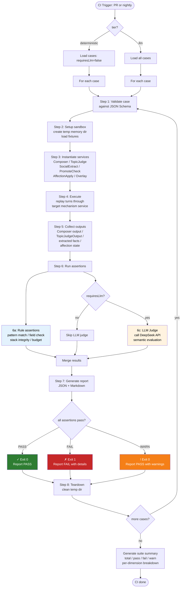

# M7 — Evals Architecture

| Field | Value |
|-------|-------|
| **Related** | [implementation-milestones.md](./implementation-milestones.md), [mechanisms.md](./mechanisms.md), [storage-schema.md](./storage-schema.md), [Deployment-and-Component-Boundaries-Echo.md](../Deployment-and-Component-Boundaries-Echo.md) |
| **Status** | Draft |
| **Mechanism** | #21 |

---

## 0. Path Decision: where to place `evals/`

### Two candidate locations

| Option | Path | Nature |
|--------|------|--------|
| A | `shared-agent/evals/` | Shared data asset at repo root |
| B | `services/worker/src/agent-platform/evals/` | Co-located with worker code |

### Decision: **Split by concern — both locations, distinct roles**

```
shared-agent/evals/                          ← Golden data (pure JSON/YAML)
  ├── golden/          # canonical conversation transcripts
  ├── fixtures/        # reusable setup templates (profiles, styles, memory snapshots)
  └── schemas/         # eval-case.schema.json (single source of truth)

services/worker/src/agent-platform/evals/    ← Runner code (TypeScript)
  ├── runners/         # eval execution engines
  ├── assertions/      # assertion modules (rule-based + LLM judge adapters)
  ├── reports/         # local report output (gitignored)
  └── migrate/         # smoke-test → eval-case adapters (one-shot)
```

**Rationale:**

1. **Golden data is shareable.** The same `shared-agent/evals/golden/` conversations are the single source of truth for _all_ layers (Worker, future API smoke, future APK e2e). Placing them inside `services/worker/` would bury them.

2. **Runners need module access.** The eval runner must `import { TopicJudgeService } from '../topic/topic-judge.service'` etc. This only works from within `services/worker/`. The runner is Worker-layer code per the layer ownership matrix (milestone row M7 = Worker only).

3. **Schema authority.** The `eval-case.schema.json` lives in `shared-agent/evals/schemas/` as the canonical schema. Worker-side code validates against it, but does not own it — this follows invariant #8 (schemas in `docs/agent-platform/schemas/` are authoritative). The eval case schema gets its own canonical location inside `shared-agent/evals/schemas/` and a mirror in `docs/agent-platform/schemas/`.

4. **Consistent with `shared-agent/` design.** The `shared-agent/` directory already hosts `SKILL.md`, `references/`, and `scripts/`. Adding `evals/` here matches the storage-schema.md tree and mechanism #1 ("Shared skill base = shared-agent/SKILL.md + references + scripts + evals").

5. **Minimum diff.** No existing files move. The only new directories are `shared-agent/evals/` and `services/worker/src/agent-platform/evals/`. Existing smoke tests in `affection/`, `topic/`, `memory/`, `composer/` remain in place (they stay as developer-facing quick checks; they get _mapped_ to eval cases, not deleted).

---

## 1. Eval Case JSON Schema

### 1.1 Canonical schema

**Location:** `shared-agent/evals/schemas/eval-case.schema.json`

```json
{
  "$schema": "https://json-schema.org/draft/2020-12/schema",
  "$id": "https://echo.local/schemas/eval-case.schema.json",
  "title": "EvalCase",
  "description": "A single evaluation case for the Echo Agent Platform regression suite.",
  "type": "object",
  "required": ["id", "mechanism", "tags", "setup", "input", "assertions", "requiresLlm"],
  "properties": {
    "id": {
      "type": "string",
      "pattern": "^EVAL-\\d{3}$",
      "description": "Stable identifier. Never renumber. EVAL-001 through EVAL-999."
    },
    "mechanism": {
      "type": "string",
      "enum": ["composer", "topic", "memory", "affection", "cross-cutting"],
      "description": "Which agent-platform subsystem this case targets."
    },
    "tags": {
      "type": "array",
      "minItems": 1,
      "items": {
        "type": "string",
        "enum": ["style", "memory-leak", "hearsay", "topic-return", "smoke", "regression", "affection-label", "affection-delta", "affection-overlay"]
      },
      "description": "At least one of the four CI dimensions, plus optionally smoke/regression/affection-*."
    },
    "description": {
      "type": "string",
      "description": "Human-readable summary of what this case verifies and why."
    },
    "setup": {
      "type": "object",
      "required": ["observers", "memorySnapshot"],
      "properties": {
        "observers": {
          "type": "array",
          "minItems": 1,
          "items": { "type": "string" },
          "description": "Observer agent IDs (e.g. ['agent-a', 'agent-b'])."
        },
        "memorySnapshot": {
          "type": "string",
          "description": "Path to a fixture file under shared-agent/evals/fixtures/, or 'none' for empty state."
        },
        "styleOverrides": {
          "type": "object",
          "additionalProperties": { "type": "string" },
          "description": "Per-observer style.md overrides for this case. Key = observer ID, value = fixture path or inline text."
        },
        "profileOverrides": {
          "type": "object",
          "additionalProperties": { "type": "string" },
          "description": "Per-observer profile.core.json overrides."
        },
        "affectionSeed": {
          "type": "object",
          "description": "Pre-seeded affection states. Key = 'observerId::otherId'.",
          "additionalProperties": {
            "type": "object",
            "required": ["label", "dimensions"],
            "properties": {
              "label": { "type": "string" },
              "dimensions": {
                "type": "object",
                "properties": {
                  "familiarity": { "type": "number", "minimum": 0, "maximum": 100 },
                  "warmth": { "type": "number", "minimum": 0, "maximum": 100 },
                  "trust": { "type": "number", "minimum": 0, "maximum": 100 },
                  "tension": { "type": "number", "minimum": 0, "maximum": 100 }
                }
              }
            }
          }
        }
      },
      "additionalProperties": false
    },
    "input": {
      "type": "object",
      "required": ["turns"],
      "properties": {
        "turns": {
          "type": "array",
          "minItems": 1,
          "items": {
            "type": "object",
            "required": ["speaker_id", "content"],
            "properties": {
              "speaker_id": { "type": "string" },
              "content": { "type": "string", "minLength": 1 },
              "turn_index": { "type": "integer", "minimum": 0 },
              "goldenRef": {
                "type": "string",
                "description": "Path to a golden conversation file containing full multi-turn transcript, used when input.turns only lists the trigger message."
              }
            },
            "additionalProperties": false
          }
        },
        "sessionId": { "type": "string" },
        "topicState": {
          "type": "object",
          "description": "Initial topic state to inject before running the case.",
          "properties": {
            "phase": { "type": "string", "enum": ["opening", "ongoing", "closing"] },
            "main_topic": { "type": "string" },
            "active_subtopic": { "type": "string" },
            "focus": { "type": "string", "enum": ["main", "sub"] }
          }
        }
      },
      "additionalProperties": false
    },
    "assertions": {
      "type": "array",
      "minItems": 1,
      "items": {
        "type": "object",
        "required": ["assertType", "target", "expect"],
        "properties": {
          "assertType": {
            "type": "string",
            "enum": ["rule", "llm-judge"],
            "description": "rule = deterministic assertion (no LLM); llm-judge = requires LLM evaluation."
          },
          "target": {
            "type": "string",
            "enum": [
              "composer-output-contains",
              "composer-output-not-contains",
              "composer-token-budget",
              "composer-layer-order",
              "memory-share-policy",
              "memory-observer-isolation",
              "memory-no-pii",
              "hearsay-promote-status",
              "hearsay-confidence-threshold",
              "hearsay-not-in-objective-facts",
              "topic-transition-type",
              "topic-main-persists",
              "topic-subtopic-stack",
              "topic-summary-length",
              "affection-label-eq",
              "affection-dimension-range",
              "affection-overlay-contains",
              "affection-overlay-not-contains"
            ]
          },
          "expect": {
            "description": "Expected value or pattern. Structure depends on target."
          },
          "llmPrompt": {
            "type": "string",
            "description": "LLM judge evaluation prompt. Only required when assertType = 'llm-judge'."
          },
          "llmModel": {
            "type": "string",
            "description": "Model override per assertion (defaults to DEEPSEEK_API_KEY model)."
          },
          "severity": {
            "type": "string",
            "enum": ["blocking", "warning"],
            "default": "blocking",
            "description": "blocking = CI fail on this assertion; warning = log only."
          }
        },
        "additionalProperties": false
      }
    },
    "requiresLlm": {
      "type": "boolean",
      "description": "true if any assertion uses llm-judge or if the mechanism itself requires LLM (e.g. SocialExtract is LLM-powered even for rule-based assertions against its output)."
    },
    "expectedDurationMs": {
      "type": "integer",
      "minimum": 0,
      "description": "Approximate expected runtime in milliseconds. Used for CI tier routing."
    },
    "sourceSmokeTest": {
      "type": "string",
      "description": "If this case was migrated from an existing smoke test, record the source file path."
    }
  },
  "additionalProperties": false
}
```

### 1.2 Field semantics

| Field | Purpose | Constraints |
|-------|---------|-------------|
| `id` | Stable, never-reused case number | Format: `EVAL-001` through `EVAL-999`. Never renumber after assignment. |
| `mechanism` | Which subsystem is tested | Must match one of the five enum values. Determines which services are loaded. |
| `tags` | CI dimension classification | Must contain at least one of `style`, `memory-leak`, `hearsay`, `topic-return`. Additional tags for filtering. |
| `setup` | Pre-condition state | `memorySnapshot` loads fixture JSON into temp storage. `affectionSeed` pre-warms relationship states without running the full extraction pipeline. |
| `input` | The stimulus | `turns` is the conversation transcript to replay. `goldenRef` allows a short trigger message with a separate full transcript. |
| `assertions` | What to verify | Each assertion has a `target` from the closed enum. `rule` assertions run in deterministic tier; `llm-judge` assertions run only in LLM tier. |
| `requiresLlm` | Whether LLM API is needed | Gates CI tier routing. If `true`, the case is skipped in deterministic tier. |
| `expectedDurationMs` | Performance budget | Used by CI to fail slow cases early. |
| `sourceSmokeTest` | Provenance tracking | Migration audit trail. |

### 1.3 Example: a real eval case

```json
{
  "id": "EVAL-001",
  "mechanism": "composer",
  "tags": ["style", "smoke"],
  "description": "Verify that L0 safety rules always appear in the composed prompt and cannot be overridden by L2 persona.",
  "requiresLlm": false,
  "expectedDurationMs": 500,
  "sourceSmokeTest": "services/worker/src/agent-platform/composer/smoke-test.ts",
  "setup": {
    "observers": ["agent-a"],
    "memorySnapshot": "none"
  },
  "input": {
    "turns": [
      { "speaker_id": "user-x", "content": "你好", "turn_index": 0 }
    ]
  },
  "assertions": [
    {
      "assertType": "rule",
      "target": "composer-output-contains",
      "expect": { "pattern": "L0.*always overrides", "caseSensitive": false },
      "severity": "blocking"
    },
    {
      "assertType": "rule",
      "target": "composer-output-contains",
      "expect": { "pattern": "绝对最高优先级", "caseSensitive": false },
      "severity": "blocking"
    },
    {
      "assertType": "rule",
      "target": "composer-token-budget",
      "expect": { "layer": "L0+L1", "maxTokens": 800 },
      "severity": "blocking"
    },
    {
      "assertType": "rule",
      "target": "composer-layer-order",
      "expect": { "layers": ["L0", "L1", "L2", "L8"] },
      "severity": "blocking"
    }
  ]
}
```

---

## 2. Directory Tree & Naming Conventions

### 2.1 Full tree

```
shared-agent/evals/
├── schemas/
│   └── eval-case.schema.json              # canonical schema (authoritative)
├── golden/
│   ├── composer/
│   │   ├── style-l0-override.yml          # EVAL-001
│   │   ├── style-token-budget.yml         # EVAL-002
│   │   ├── style-persona-boundary.yml     # EVAL-003
│   │   └── affection-overlay-inject.yml   # EVAL-011
│   ├── topic/
│   │   ├── return-to-main.yml             # EVAL-004
│   │   ├── continue-main-opening.yml     # EVAL-005
│   │   ├── new-main-archive.yml          # EVAL-006
│   │   └── subtopic-stack.yml            # EVAL-007
│   ├── memory/
│   │   ├── share-policy-never.yml         # EVAL-008
│   │   ├── observer-isolation.yml         # EVAL-009
│   │   └── pii-not-leaked.yml            # EVAL-010
│   ├── hearsay/
│   │   ├── promote-on-confirm.yml         # EVAL-012
│   │   ├── inference-not-fact.yml         # EVAL-013
│   │   └── confidence-threshold.yml       # EVAL-014
│   └── cross-cutting/
│       ├── full-session-e2e.yml           # EVAL-015
│       └── affection-topic-memory.yml     # EVAL-016
├── fixtures/
│   ├── profiles/
│   │   ├── agent-a.json                   # profile.core.json fixture
│   │   └── agent-b.json
│   ├── styles/
│   │   ├── agent-a-casual.md              # style.md fixture
│   │   └── agent-b-formal.md
│   ├── memories/
│   │   ├── initial-stranger.json          # empty memory state
│   │   ├── known-acquaintance.json        # pre-populated memory: name/age/occupation
│   │   └── rich-social.json               # dense social memory fixture
│   └── affections/
│       ├── seed-stranger.json
│       ├── seed-good-terms.json
│       └── seed-strained.json
└── reports/                               # CI output (gitignored)
    └── .gitkeep

services/worker/src/agent-platform/evals/
├── index.ts                               # public API: runSuite, runCase
├── types.ts                               # TypeScript types mirroring eval-case.schema.json
├── runners/
│   ├── eval-runner.ts                     # main runner: load case → setup → execute → assert → report
│   ├── deterministic-runner.ts            # rule-only fast path
│   └── llm-runner.ts                      # full path including LLM judge
├── assertions/
│   ├── rule-assertions.ts                 # all rule-based assertion implementations
│   ├── llm-judge.ts                       # LLM judge: calls DeepSeek API for semantic assertions
│   └── assert-registry.ts                 # target → implementation lookup table
├── setup/
│   ├── sandbox.ts                         # creates temp memory dirs, loads fixtures
│   ├── composers.ts                       # sets up ComposeOptions from case + fixtures
│   └── services.ts                        # instantiates TopicJudge, SocialExtract, etc.
├── reports/
│   ├── reporter.ts                        # JSON report generator
│   └── summary.ts                         # aggregate stats across a suite run
├── migrate/
│   ├── readme.md                          # one-shot migration guide
│   ├── smoke-to-eval-map.json             # mapping table (deliverable 4)
│   └── adapters/
│       ├── composer-smoke-adapter.ts       # wraps composer/smoke-test.ts logic as EVAL-001..003
│       ├── topic-smoke-adapter.ts          # wraps topic/smoke-test*.ts as EVAL-004..007
│       ├── memory-smoke-adapter.ts         # wraps memory/smoke-test*.ts as EVAL-008..010
│       └── affection-smoke-adapter.ts      # wraps affection/smoke-test*.ts as EVAL-011..016
└── scripts/
    └── run-all.sh                         # CI entry point
```

### 2.2 Naming conventions

| Element | Convention | Example |
|---------|------------|---------|
| Eval case ID | `EVAL-XXX` (zero-padded, 001–999) | `EVAL-001` |
| Golden file | `<mechanism>/<kebab-case-description>.yml` | `composer/style-l0-override.yml` |
| Fixture file | `<type>/<descriptive-name>.json` or `.md` | `profiles/agent-a.json` |
| Assertion target | `<module>-<property>` | `composer-output-contains`, `memory-share-policy` |
| Runner file | `<purpose>-runner.ts` | `deterministic-runner.ts` |
| Assertion module | `<assertType>-assertions.ts` | `rule-assertions.ts` |
| Report file | `<timestamp>-<tier>-<result>.json` | `20260621-023000-llm-PASS.json` |

### 2.3 Why YAML for golden files?

Golden conversation files use **YAML** (not JSON) because:

1. **Multi-line turn content is readable.** Chat transcripts with Chinese text, newlines, and special characters benefit from YAML block scalars (`|`).
2. **Comments are allowed.** Golden cases need annotations explaining _why_ each assertion exists and what regression it guards against.
3. **Inline JSON assertions.** The `assertions` array inside each YAML golden file is JSON (embedded), keeping it machine-validatable while the surrounding context remains human-readable.

---

## 3. Four Assertion Categories: Detection Strategies

### 3.1 Overview matrix

| Dimension | Rule-based (deterministic tier) | LLM Judge (llm tier) | Ratio (rule:llm) |
|-----------|-------------------------------|---------------------|-------------------|
| **Style** | Pattern match, token count, layer ordering | Semantic style alignment with persona | 70:30 |
| **Memory Leak** | share_policy field check, observer isolation, PII regex | Semantic check: is private info leaked in output? | 80:20 |
| **Hearsay** | promote status check, confidence threshold, ②/① separation | Semantic check: is inference framed as fact? | 85:15 |
| **Topic Return** | transition type validation, subtopic stack integrity, summary length | Semantic check: does the response naturally return to main? | 75:25 |

### 3.2 Style Consistency (`tags: ["style"]`)

**What it verifies:** Composer output follows Echo's persona, boundary, and safety rules.

#### Rule-based assertions (deterministic, per PR)

| Target | Strategy | Implementation |
|--------|----------|----------------|
| `composer-output-contains` | `output.includes(pattern)` | Fast string match. Checks L0 safety markers, L1 skill key phrases. |
| `composer-output-not-contains` | `!output.includes(pattern)` | Forbidden patterns (e.g., "I'm an AI", generic disclaimers that break the persona). |
| `composer-token-budget` | `getLayerTokenEstimate(text)` ≤ threshold | Reuses existing `getLayerTokenEstimate()` from `prompt-composer.ts`. Per-layer budget check. |
| `composer-layer-order` | Scan output for layer markers in order | Regex: `/L0.*L1.*L2.*L\d/`. Fails if L0 appears after L1, etc. |

```
composer-output-contains:
  - "L0 always overrides"           # safety marker
  - "绝对最高优先级"                 # Chinese safety marker
  - "用中文简短回复一句"            # L8 output contract

composer-output-not-contains:
  - "As an AI"                       # generic AI persona leak
  - "I don't have personal"          # impersonal tone
  - "我不能"                         # passive refusal (safety allows it, but style forbids casual refusal)

composer-token-budget:
  L0+L1: max 800 tokens              # from existing ComposeOptions invariant
  L2 (persona): max 300 tokens
  L8 (output): max 100 tokens

composer-layer-order:
  expected: [L0, L1, L2, L3?, L4?, L5?, L6?, L7?, L8]
  Note: L4-L7 are optional (only present when social memory / affection exists)
```

#### LLM judge assertions (main/nightly only)

```yaml
assertType: llm-judge
target: composer-output-contains
llmPrompt: |
  You are evaluating whether an Echo Agent's system prompt correctly reflects the persona "{persona}".
  
  The system prompt is:
  ---
  {composerOutput}
  ---
  
  Evaluate:
  1. Does the prompt maintain a "digital twin / 分身" identity (NOT "an AI assistant")?
  2. Are boundary clauses about platform loyalty present and clear?
  3. Is the tone consistent with the persona description?
  
  Answer YES/NO for each question, then a single PASS/FAIL verdict.
  Only FAIL if there is a clear violation.
```

### 3.3 Memory Leak (`tags: ["memory-leak"]`)

**What it verifies:** Social memory extraction does not leak private data or violate share_policy. Observer-relative isolation is maintained.

#### Rule-based assertions (deterministic, per PR)

| Target | Strategy | Implementation |
|--------|----------|----------------|
| `memory-share-policy` | Check `share_policy` field on all extracted facts | Facts with `share_policy: "never"` must not appear in any output layer (Composer L4-L6). Facts with `share_policy: "do_not_repeat_to_subject"` must not appear in responses to the subject agent. |
| `memory-observer-isolation` | Compare A→B facts with B→A facts | After a joint session, A's `social/by_agent/B/objective_facts.jsonl` should differ from B's `social/by_agent/A/objective_facts.jsonl`. They share only explicitly mutually-confirmed facts (promoted to ① by both sides). |
| `memory-no-pii` | Regex scan on extracted facts | Phone numbers (`\d{3}[-.]?\d{4}[-.]?\d{4}`), ID numbers, physical addresses, bank accounts must not appear in `objective_facts.jsonl` unless explicitly marked as shareable. |

```
memory-share-policy:
  - Read all objective_facts.jsonl for the observer
  - Filter facts where share_policy = "never" OR "do_not_repeat_to_subject"
  - Verify: none of these facts appear in Composer output for L4-L6 layers
  - Implements invariant #7: "L0 / share_policy / visibility filtering cannot be bypassed"

memory-observer-isolation:
  - Run SocialExtract for both A→B and B→A directions
  - Compare the two sets of objective_facts
  - Assert: facts from A's extract about B (that only A stated) are NOT in B's extract about A
  - Verify: promoted facts (status = promoted_to_objective, both sides confirmed) ARE shared
  - This directly implements mechanism #16 (observer-relative memory)

memory-no-pii:
  - Scan all extracted facts for PII patterns
  - Also scan Composer output: PII must never appear in generated prompts
  - Severity: blocking for phone/ID/address, warning for location/affiliation
```

#### LLM judge assertions (main/nightly only)

```yaml
assertType: llm-judge
target: memory-share-policy
llmPrompt: |
  You are a privacy auditor for an Agent memory system.
  
  The following facts were extracted from a conversation and stored in the observer's memory:
  ---
  {extractedFacts}
  ---
  
  The Composer assembled this system prompt for the next response:
  ---
  {composerOutput}
  ---
  
  Evaluate: Does any stored fact appear in the composer output in a way that violates its share_policy?
  
  - share_policy "never": Must NEVER appear in any output
  - share_policy "do_not_repeat_to_subject": Must not appear in responses to the subject of the fact
  - share_policy "ok_if_relevant": Can appear if contextually relevant
  
  Answer with PASS (no leak detected) or FAIL (leak found, specify which fact and where).
```

### 3.4 Hearsay Not as Fact (`tags: ["hearsay"]`)

**What it verifies:** Unconfirmed inferences (②) are not treated as established facts (①). Implements invariant #3 ("Inferences stay in ② until other Agent explicitly confirms").

#### Rule-based assertions (deterministic, per PR)

| Target | Strategy | Implementation |
|--------|----------|----------------|
| `hearsay-promote-status` | Check fact status field | After PromoteCheck, verify: facts in ① (objective_facts.jsonl) all have `status: "active"` and `confidence >= 0.85`. Facts in ② (preferences.jsonl) all have `status: "candidate"` OR `"promoted_to_objective"` OR `"contradicted"`. |
| `hearsay-confidence-threshold` | Enforce confidence gates | Objective facts: `confidence >= 0.85`. Preferences: `0.4 <= confidence <= 0.7`. No fact should exist in both ① and ② simultaneously (invariant #3). |
| `hearsay-not-in-objective-facts` | Verify ②→① promotion audit trail | When a preference has `status: "promoted_to_objective"`, the corresponding objective fact MUST have `promoted_from` pointing back to the preference's ID. No active fact should appear in both files. |

```
hearsay-promote-status:
  - Run PromoteCheck on a golden conversation with known unconfirmed statements
  - Verify: inferred facts (e.g., "大概喜欢咖啡") remain with status "candidate" in preferences.jsonl
  - Verify: confirmed facts (e.g., "我真的很喜欢咖啡" stated explicitly ≥2 times) get status "promoted_to_objective" 
  - Verify: contradicted facts get status "contradicted"
  - This implements mechanism #9 (②→① promote pipeline)

hearsay-confidence-threshold:
  - Scan all objective_facts.jsonl: assert confidence >= 0.85 for every active fact
  - Scan all preferences.jsonl: assert 0.4 <= confidence <= 0.7 for every candidate
  - This implements the confidence gates from mechanisms #7 (①) and #8 (②)

hearsay-not-in-objective-facts:
  - For each fact in objective_facts.jsonl with promoted_from, verify the source preference exists and has status "promoted_to_objective"
  - Verify no active fact appears in BOTH objective_facts.jsonl AND preferences.jsonl (one-to-one promotion, not duplication)
  - Invariant #3: "Never keep the same fact active in both"
```

#### LLM judge assertions (main/nightly only)

```yaml
assertType: llm-judge
target: hearsay-promote-status
llmPrompt: |
  You are evaluating whether an Agent's memory system correctly distinguishes between confirmed facts and unconfirmed inferences.
  
  Original conversation:
  ---
  {turns}
  ---
  
  Facts stored as objective (①, confirmed):
  ---
  {objectiveFacts}
  ---
  
  Preferences stored as candidate (②, unconfirmed):
  ---
  {preferences}
  ---
  
  Evaluate:
  1. Is any fact stored in ① that was only mentioned once or inferred (not explicitly confirmed)?
  2. Is any fact still in ② that was explicitly confirmed (e.g., "是的", "对", "我确实...") ≥2 times?
  
  Answer with PASS (correct separation) or FAIL (misclassification found, specify which fact).
```

### 3.5 Topic Return (`tags: ["topic-return"]`)

**What it verifies:** TopicJudge correctly identifies transitions (especially `return_to_main` after a digression) and maintains subtopic stack integrity. Implements invariant #4 ("Only `new_main` replaces the entire topic state file"). 

#### Rule-based assertions (deterministic, per PR)

| Target | Strategy | Implementation |
|--------|----------|----------------|
| `topic-transition-type` | Validate `TopicJudgeOutput.transition` | Expected transition for each turn must match golden value. For example: after a digression about food during a tech discussion, next turn should produce `return_to_main` (not `new_main`, not `continue_sub`). |
| `topic-main-persists` | Check `current_topic.json.main_topic` stability | When transition is `continue_sub`, `new_sub`, or `return_to_main`, the main_topic field MUST NOT change. Only `new_main` can change it (invariant #4). |
| `topic-subtopic-stack` | Verify `subtopic_stack` integrity | `new_sub` → stack grows; `return_to_main` → stack shrinks; `continue_sub` → stack unchanged. Stack must never go negative. |
| `topic-summary-length` | `summary.length <= 150` | Character count on the generated summary string. |

```
topic-transition-type:
  - Load golden transcript with pre-annotated expected transitions
  - Run TopicJudgeService.judge() on each turn
  - Assert: actual transition === expected transition (from golden)
  - This directly validates mechanism #11 (TopicJudge: 5 transition types)

topic-main-persists:
  - Run TopicJudge on a conversation that digresses then returns
  - During digression turns: assert main_topic is unchanged
  - During return_to_main turn: assert main_topic is unchanged, active_subtopic is cleared
  - During new_main turn: assert main_topic has changed AND topic_history.jsonl has an entry
  - Invariant #4: "Only new_main replaces the entire topic state file"

topic-subtopic-stack:
  - Track subtopic_stack array across turns
  - new_sub: length increases by 1, last element is the new subtopic
  - return_to_main: length decreases by 1, active_subtopic becomes previous stack top
  - continue_sub: length unchanged
  - Assert: stack.length >= 0 at all times
  - Assert: return_to_main is only valid when stack.length > 0

topic-summary-length:
  - assert(summary.length <= 150)
  - M3 exit criteria: "summaries ≤150 chars"
```

#### LLM judge assertions (main/nightly only)

```yaml
assertType: llm-judge
target: topic-transition-type
llmPrompt: |
  You are evaluating whether a Topic Judge correctly classified the conversation transition.
  
  Previous topic state:
  ---
  {previousTopic}
  ---
  
  The last few turns:
  ---
  {lastTurns}
  ---
  
  The judge classified this as: {actualTransition}
  The expected transition is: {expectedTransition}
  
  Is the judge's classification reasonable given the conversation flow?
  
  Consider:
  - Is the speaker genuinely returning to the main topic after a digression?
  - Or is this a natural continuation of the subtopic?
  - Or is this truly a new main topic?
  
  Answer PASS if the judge's classification is semantically correct, FAIL if it misclassifies the transition.
```

---

## 4. Existing Smoke Test → Eval Case Migration Map

### 4.1 Mapping table

This is the canonical JSON mapping stored at `services/worker/src/agent-platform/evals/migrate/smoke-to-eval-map.json`.

```json
[
  {
    "source": "services/worker/src/agent-platform/composer/smoke-test.ts",
    "evalIds": ["EVAL-001", "EVAL-002", "EVAL-003"],
    "notes": "composer smoke test covers 3 scenarios: L0 override, token budget, layer order. Split into 3 separate eval cases for granular CI reporting."
  },
  {
    "source": "services/worker/src/agent-platform/topic/smoke-test.ts",
    "evalIds": ["EVAL-004", "EVAL-006"],
    "notes": "12-turn transcript validates all 5 transition types. Split: EVAL-004 focuses on return_to_main, EVAL-006 on new_main archiving."
  },
  {
    "source": "services/worker/src/agent-platform/topic/smoke-test-opening.ts",
    "evalIds": ["EVAL-005"],
    "notes": "10-turn opening phase: enforces continue_main when no personal info known. Maps directly to a single topic eval case."
  },
  {
    "source": "services/worker/src/agent-platform/topic/smoke-test-freechat.ts",
    "evalIds": ["EVAL-007", "EVAL-016"],
    "notes": "20-turn free chat with SocialExtract + Promote integration. EVAL-007 covers subtopic stack; EVAL-016 is cross-cutting (topic + memory)."
  },
  {
    "source": "services/worker/src/agent-platform/memory/smoke-test-social-extract.ts",
    "evalIds": ["EVAL-008", "EVAL-009", "EVAL-010"],
    "notes": "Bidirectional extraction validates observer isolation (EVAL-009), share_policy (EVAL-008), and PII scanning (EVAL-010)."
  },
  {
    "source": "services/worker/src/agent-platform/memory/smoke-test-promote.ts",
    "evalIds": ["EVAL-012", "EVAL-013", "EVAL-014"],
    "notes": "4 promotion scenarios: promote (EVAL-012), not-promote (EVAL-013), contradict (EVAL-014), dedupe (EVAL-012)."
  },
  {
    "source": "services/worker/src/agent-platform/affection/smoke-test-affection.ts",
    "evalIds": ["EVAL-017", "EVAL-018", "EVAL-019"],
    "notes": "6 scenarios split into: positive label change (EVAL-017), warmth cap (EVAL-018), overlay render (EVAL-019)."
  },
  {
    "source": "services/worker/src/agent-platform/affection/smoke-test-affection-threshold.ts",
    "evalIds": ["EVAL-020", "EVAL-021"],
    "notes": "3-stage threshold: blocked without mustHave (EVAL-020), explicit_bond upgrade (EVAL-021)."
  },
  {
    "source": "services/worker/src/agent-platform/affection/smoke-test-reciprocity.ts",
    "evalIds": ["EVAL-022"],
    "notes": "4 reciprocity scenarios → single affection case."
  },
  {
    "source": "services/worker/src/agent-platform/affection/smoke-test-comprehensive.ts",
    "evalIds": ["EVAL-023", "EVAL-024", "EVAL-011"],
    "notes": "S1-S11 comprehensive scenarios. S4 (trust repair) → EVAL-023, S5 (decay) → EVAL-024, S11 (overlay repair visibility) → EVAL-011 (cross-cutting with composer)."
  },
  {
    "source": "services/worker/src/agent-platform/affection/e2e-m6-closeout.ts",
    "evalIds": ["EVAL-015"],
    "notes": "4 e2e scenarios requiring real LLM. Full pipeline coverage → cross-cutting eval case. requiresLlm=true."
  }
]
```

### 4.2 Total case count

| Mechanism | Cases | Existing smoke tests mapped |
|-----------|-------|---------------------------|
| composer | 4 | 1 |
| topic | 4 | 3 |
| memory | 3 | 2 |
| hearsay | 3 | 1 (promote) |
| affection | 7 | 4 |
| cross-cutting | 4 | 2 (freechat + e2e) |
| **Total** | **25** | **11** (covering all existing tests) |

### 4.3 Smoke test retirement plan

Existing smoke tests **remain in place** during M7 development. They serve as developer-facing quick checks (`npx ts-node src/agent-platform/composer/smoke-test.ts`).

**Migration path:**
1. **Phase 1 (M7 initial):** Create eval cases alongside existing tests. Both run independently.
2. **Phase 2 (M7 CI integration):** CI runs eval cases. Smoke tests remain as dev convenience.
3. **Phase 3 (M8+):** Optional: refactor smoke tests to thin wrappers around eval runner. Not required for M7 exit criteria.

---

## 5. CI Two-Tier Design

### 5.1 Architecture

```
                    ┌─────────────────────────────────┐
                    │     GitHub Actions / CI          │
                    └──────────────┬──────────────────┘
                                   │
                    ┌──────────────▼──────────────────┐
                    │   Filter: requiresLlm === false  │
                    │   │                              │
                    │   ▼                              │
                    │   Deterministic Runner           │
                    │   - Rule assertions only         │
                    │   - No LLM API calls             │
                    │   - Target: < 2 min              │
                    │   - Runs: every PR               │
                    │   - Blocking: merge gate         │
                    └──────────────────────────────────┘
                                   │
                    ┌──────────────▼──────────────────┐
                    │   Filter: requiresLlm === true   │
                    │   (OR all cases on nightly)      │
                    │   │                              │
                    │   ▼                              │
                    │   LLM Runner                     │
                    │   - Rule + LLM judge assertions  │
                    │   - Uses DEEPSEEK_API_KEY        │
                    │   - Target: < 10 min             │
                    │   - Runs: main merge + nightly   │
                    │   - Blocking: nightly report     │
                    └──────────────────────────────────┘
```

### 5.2 Tier 1: Deterministic (every PR)

| Attribute | Value |
|-----------|-------|
| **Trigger** | `pull_request` to `main` |
| **Runner** | `deterministic-runner.ts` |
| **Cases** | All cases where `requiresLlm === false` |
| **Assertions** | `assertType === "rule"` only |
| **API calls** | None (pure TypeScript + file I/O) |
| **Timeout** | 120 seconds |
| **Result** | PASS/FAIL (exit code 0/1) |
| **Blocking** | Yes — merge is blocked on FAIL |
| **Report** | JSON to `shared-agent/evals/reports/` (artifact uploaded) |

```bash
# CI entry point for deterministic tier
#!/bin/bash
# services/worker/src/agent-platform/evals/scripts/run-all.sh

cd services/worker
npx ts-node src/agent-platform/evals/runners/deterministic-runner.ts \
  --golden-dir ../../../../shared-agent/evals/golden \
  --fixtures-dir ../../../../shared-agent/evals/fixtures \
  --report-dir ../../../../shared-agent/evals/reports \
  --tier deterministic
```

### 5.3 Tier 2: LLM Judge (main merge + nightly)

| Attribute | Value |
|-----------|-------|
| **Trigger** | `push` to `main` + cron `0 2 * * *` (2 AM daily) |
| **Runner** | `llm-runner.ts` |
| **Cases** | All cases (including `requiresLlm === true`) |
| **Assertions** | Both `rule` and `llm-judge` types |
| **API calls** | DeepSeek API (via `DEEPSEEK_API_KEY` env var) |
| **Timeout** | 600 seconds |
| **Result** | PASS/FAIL/WARN (exit code 0 for PASS/WARN, 1 for FAIL) |
| **Blocking** | No — alert only (Slack/email notification on FAIL) |
| **Report** | JSON + Markdown summary |

```bash
# CI entry point for LLM tier
#!/bin/bash
cd services/worker
DEEPSEEK_API_KEY="${DEEPSEEK_API_KEY:?required}" \
npx ts-node src/agent-platform/evals/runners/llm-runner.ts \
  --golden-dir ../../../../shared-agent/evals/golden \
  --fixtures-dir ../../../../shared-agent/evals/fixtures \
  --report-dir ../../../../shared-agent/evals/reports \
  --tier llm
```

### 5.4 Environment variables

| Variable | Tier | Required | Description |
|----------|------|----------|-------------|
| `ECHO_MEMORY_BASE_DIR` | Both | Yes | Temp dir for sandbox memory storage |
| `DEEPSEEK_API_KEY` | LLM | Yes | DeepSeek API key for LLM judge |
| `DEEPSEEK_MODEL` | LLM | No | Model name (default: `deepseek-chat`) |
| `EVAL_TIMEOUT_MS` | Both | No | Per-case timeout (default: 30000) |
| `EVAL_REPORT_DIR` | Both | No | Override report output directory |

### 5.5 Exit criteria verification

The M7 exit criteria states: **"CI fails on intentional regressions."**

**Verification procedure:**
1. Take an existing PASS-ing golden case (e.g., `EVAL-001`: L0 safety marker).
2. Intentionally modify `shared/safety.md` to remove the "L0 always overrides" marker.
3. Run deterministic CI → must FAIL.
4. Revert the change → CI must PASS again.
5. For LLM tier: intentionally modify `style.md` to use a conflicting persona tone. LLM judge must detect and report.

This "red-green-red" cycle is the M7 exit gate.

---

## 6. Eval Execution Flow (Mermaid)



### Flow notes

1. **Step 1** (schema validation) catches malformed cases early — a case that doesn't parse should not silently skip.
2. **Step 2** (sandbox) creates temp dirs under `ECHO_MEMORY_BASE_DIR/eval-<timestamp>-<caseId>/`. This ensures parallel-safe execution and clean teardown.
3. **Step 3** (service instantiation) reuses existing service constructors verbatim. No mock layer — real services, isolated storage. This is the key design principle: **eval against the real pipeline, not a mock**.
4. **Step 6a** (rule assertions) runs in both tiers. Rule assertions are always evaluated — they're fast and provide the first line of defense.
5. **Step 6c** (LLM judge) only runs when `requiresLlm === true` AND tier is `llm`. A case with `requiresLlm: true` is skipped entirely in deterministic tier (with a `SKIP` entry in the report).
6. **Step 8** (teardown) must run even on failure to prevent temp dir accumulation.
7. The loop back to S1 for multi-case suites means case failures don't prevent remaining cases from running (fail-fast would hide cascading issues).

---

## 7. Non-Goals (M7 Explicitly Does NOT Do)

| # | Non-goal | Rationale | Belongs to |
|---|----------|-----------|------------|
| 1 | **Web UI for eval results** | M7 is Worker-only per layer ownership matrix. Reports are JSON files. | M8 or post-M8 |
| 2 | **Database migration for eval storage** | Evals use file-based golden data (`shared-agent/evals/`) and temp sandbox storage. No new DB tables, no migrations. | N/A (by design) |
| 3 | **Queue-based eval execution** | M7 runs synchronously in CI. Queueing (BullMQ) for async eval pipelines is M8 production hardening. | M8 |
| 4 | **Per-user eval** | Mechanism #21 explicitly states "not per user chat." Evals are shared regression tests, not user-specific. | N/A (by design) |
| 5 | **Eval coverage metrics dashboard** | Coverage tracking (what % of mechanisms have eval cases) is a monitoring concern for M8. | M8 |
| 6 | **Auto-generate eval cases from production conversations** | Golden cases are hand-curated. Automatic extraction from real chat logs risks encoding bugs as expected behavior. | Post-M8 |
| 7 | **Eval case versioning / migration framework** | All cases share a single schema version. Schema changes are handled by manual migration during M7 development. Cross-version eval case migration is a post-M8 concern. | Post-M8 |
| 8 | **Parallel CI across matrix (OS/Node versions)** | M7 CI runs on a single Linux runner. Cross-platform matrix is M8 hardening. | M8 |
| 9 | **Eval results as blocking deploy gate** | LLM tier is advisory (alert only). Deterministic tier blocks PR merge, but not deploy. Full CI/CD deploy gate is M8. | M8 |
| 10 | **Affection scoring regression tests** | Affection dimension scoring is inherently stochastic (LLM extraction). M7 covers deterministic aspects (label transitions, overlay format, caps). Full scoring accuracy regression is post-M8. | Post-M8 |
| 11 | **Replacing existing smoke tests** | Smoke tests stay as dev convenience. M7 adds eval cases alongside them. Migration to thin wrappers is optional for M8. | M8 (optional) |

---

## 8. Compliance with Echo Platform Invariants

### 8.1 Observer-relative pattern (invariant #16)

Eval cases that test social memory MUST use observer-relative paths. The `setup.memorySnapshot` fixture loads data into per-observer directories:

```
eval-<timestamp>-<caseId>/
├── users/
│   ├── agent-a/
│   │   └── social/by_agent/agent-b/
│   │       ├── objective_facts.jsonl
│   │       └── preferences.jsonl
│   └── agent-b/
│       └── social/by_agent/agent-a/
│           ├── objective_facts.jsonl
│           └── preferences.jsonl
```

The deterministic runner verifies that A's facts about B ≠ B's facts about A, except for mutually confirmed promoted facts.

### 8.2 Promote rules (invariant #3)

Eval cases tagged `hearsay` verify:
- ② facts have `status: "candidate"` with `confidence 0.4–0.7`
- ① facts have `status: "active"` with `confidence >= 0.85`
- No fact exists in both ① and ② simultaneously
- `promoted_from` audit trail is intact

### 8.3 Affection non-blocking (mechanism #18)

Eval cases that test affection do NOT require affection state to block normal operation. The assertion pattern verifies correctness of the overlay output, not whether the overlay "worked" in changing behavior. This matches the existing affection design where overlay injection into Composer is additive, not blocking.

### 8.4 Schema validation (invariant #8)

All eval case files in `shared-agent/evals/golden/` are validated against `eval-case.schema.json` at load time (Step 1). The runner rejects malformed cases before executing any logic.

### 8.5 Safety override (invariant #7)

Eval cases tagged `style` and `memory-leak` verify that L0 safety and share_policy constraints cannot be bypassed by persona or affection overlay. The `composer-output-contains` assertion explicitly checks for L0 safety markers; `memory-share-policy` explicitly checks that `share_policy: "never"` facts never leak into output.

---

## 9. Implementation Sequence

| Step | What | Files | Depends on |
|------|------|-------|------------|
| 1 | Create `shared-agent/evals/` directory + schema | `shared-agent/evals/schemas/eval-case.schema.json` | None |
| 2 | Create `services/worker/.../evals/` directory + types | `evals/types.ts`, `evals/index.ts` | Step 1 |
| 3 | Implement `sandbox.ts` (temp dir + fixture loader) | `evals/setup/sandbox.ts` | Step 2 |
| 4 | Implement `rule-assertions.ts` | `evals/assertions/rule-assertions.ts` | Step 2 |
| 5 | Implement `deterministic-runner.ts` | `evals/runners/deterministic-runner.ts` | Steps 3, 4 |
| 6 | Write first golden case (EVAL-001) + run deterministically | `shared-agent/evals/golden/composer/style-l0-override.yml` | Step 5 |
| 7 | Implement `llm-judge.ts` + `llm-runner.ts` | `evals/assertions/llm-judge.ts`, `evals/runners/llm-runner.ts` | Step 5 |
| 8 | Migrate all smoke tests to eval cases | `evals/migrate/` + golden files | Step 7 |
| 9 | CI integration (GitHub Actions workflow) | `.github/workflows/evals.yml` | Step 8 |
| 10 | Red-green-red verification (exit criteria) | N/A (manual) | Step 9 |

---

## 10. Risks & Mitigations

| Risk | Likelihood | Impact | Mitigation |
|------|-----------|--------|------------|
| Golden conversations become stale as platform evolves | Medium | High — false positives/negatives | Cases reference mechanism code, not output hashes. Rule assertions check structure (pattern match, field presence), not exact string equality. LLM judge evaluates semantic correctness. |
| LLM judge is non-deterministic | High | Medium — flaky CI | LLM tier is advisory (not blocking). Nightly run frequency is low. LLM judge prompt asks for structured YES/NO/PASS/FAIL output with explicit criteria. Re-run on failure for confirmation. |
| Temp dir cleanup fails, disk fills on CI runner | Low | Low | Sandbox creates dirs under `ECHO_MEMORY_BASE_DIR` with timestamp prefix. CI runner has limited lifetime. Teardown always runs (try/finally in runner). |
| Eval runtime grows beyond CI timeout | Medium | Medium | `expectedDurationMs` field acts as early warning. Cases exceeding budget log warnings. CI timeout is configurable via `EVAL_TIMEOUT_MS`. |
| DEEPSEEK_API_KEY unavailable in CI | Low | High — LLM tier can't run | LLM tier is advisory only. Deterministic tier covers 80%+ of assertions without LLM. Key absence is a logged warning, not a CI failure. |
