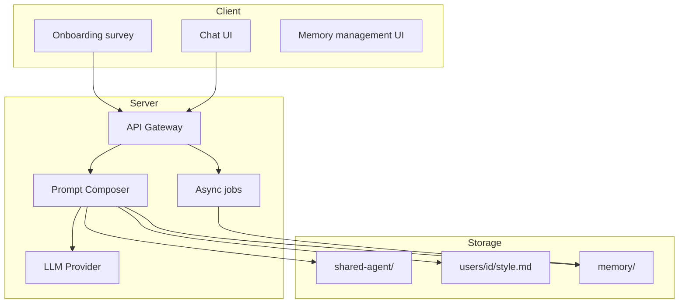
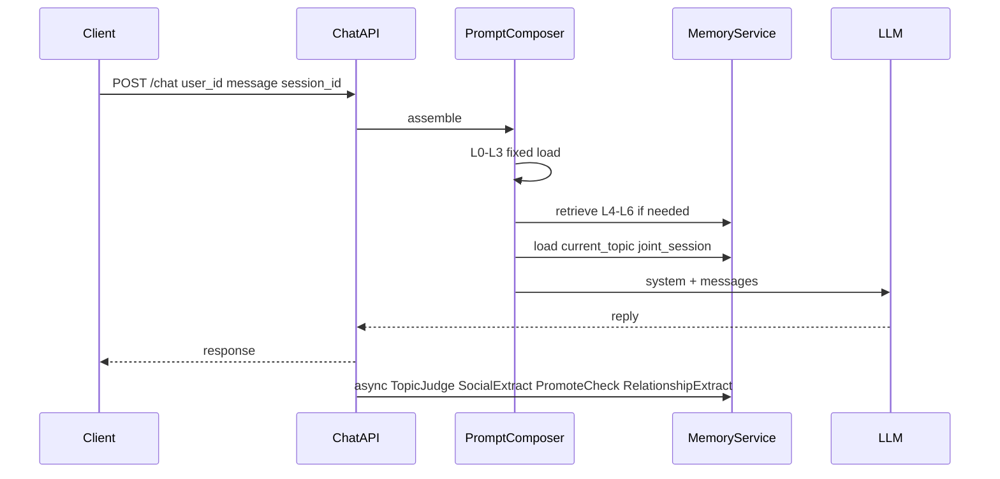
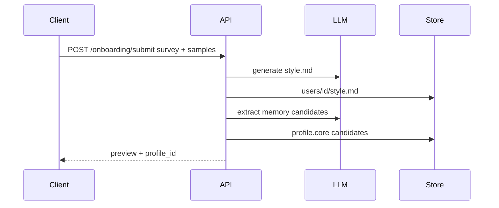
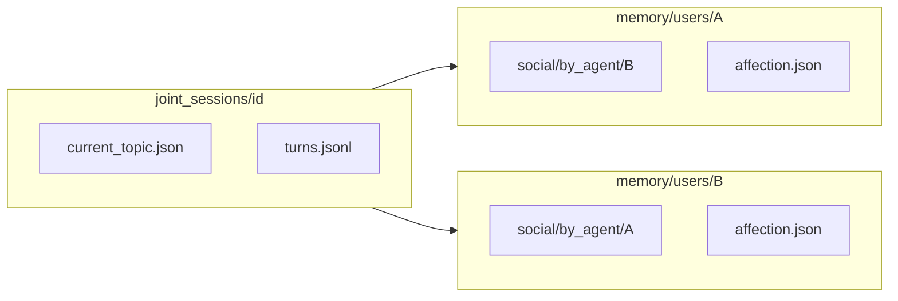

# Agent Platform Architecture

| Field | Value |
|-------|-------|
| **Related** | [README](./README.md), [mechanisms.md](./mechanisms.md), [echo-mapping.md](./echo-mapping.md) |

---

## 1. Three domains

| Domain | Path | Responsibility |
|--------|------|----------------|
| **Shared skill base** | `shared-agent/` | Platform-wide Agent capabilities, safety, protocols, tools, evals |
| **User style** | `users/{id}/style.md` | How this user speaks (tone, vocabulary, few-shots) |
| **User memory** | `memory/users/{id}/`, `memory/joint_sessions/` | What the user knows, social memory, topics, affection |

**Runtime hub:** `Prompt Composer` assembles layered prompts → calls LLM → async jobs update memory, topics, affection.

---

## 2. Design principles

| Principle | Description |
|-----------|-------------|
| **Shared base + per-user overlay** | One `shared-agent/` for all users; per-user only `style.md` + memory |
| **Style vs memory separation** | Style = how to speak; memory = what is known |
| **Observer-relative social memory** | A's knowledge about B is stored under A's namespace |
| **Progressive disclosure** | Fixed small layers + retrieved memory; never load full history |
| **Server-side skill loader** | Read skill files and compose prompts; not IDE auto-discovery |
| **Event-sourced affection** | LLM extracts relationship events; rules apply score deltas |

---

## 3. End-to-end chat flow

---

## 4. Onboarding flow

Style generation runs on the **server** (API keys never on client).

---

## 5. Joint agent session (A ↔ B)

- **One** `current_topic.json` per joint session (shared).
- **Two** observer-relative social memory stores (A about B, B about A).
- **Two** affection snapshots (A→B, B→A).

---

## 6. Code layout (target)

| Component | Suggested path |
|-----------|----------------|
| Shared skill runtime | `services/worker/src/agent-platform/shared/` |
| Prompt Composer | `services/worker/src/agent-platform/composer/` |
| Memory service | `services/api/src/agent-platform/memory/` |
| Topic / affection jobs | `services/worker/src/agent-platform/jobs/` |
| API controllers | `services/api/src/agent-platform/` |

See [echo-mapping.md](./echo-mapping.md) for Phase 1 paths.

---

## 7. Related documents

- [mechanisms.md](./mechanisms.md) — full mechanism list
- [prompt-layers.md](./prompt-layers.md) — L0–L8 assembly
- [storage-schema.md](./storage-schema.md) — on-disk / DB shapes
- [implementation-milestones.md](./implementation-milestones.md) — rollout order
