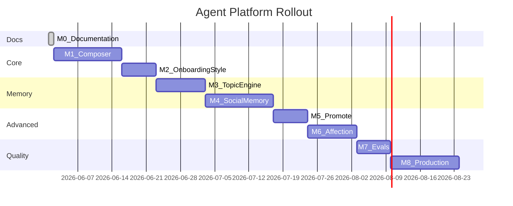

# Implementation Milestones

| Field | Value |
|-------|-------|
| **Related** | [echo-mapping.md](./echo-mapping.md), [mechanisms.md](./mechanisms.md) |

M0–M8 delivery plan. **M0 = this documentation package.**

---

## Overview

(Timeline illustrative — adjust per team capacity.)

---

## M0 — Documentation (complete)

**Deliverables:**

- `docs/agent-platform/` English pack + schemas + ADR
- `docs_CN/agent-platform/` mirror
- `.cursor/skills/agent-platform/`, `.cursor/rules/agent-platform.mdc`

**No application code.**

---

## M1 — Prompt Composer skeleton

**Mechanisms:** 1, 3, 19, 22

**Deliverables:**

- `services/worker/src/agent-platform/shared/SKILL.md` + `safety.md`
- `PromptComposer` with L0, L1, L2 (from persona), L8
- Wire into existing `agent-turn` without breaking Phase 1 behavior

**Exit criteria:** Agent chat uses Composer; output parity with prior prompts in smoke test. A runnable `smoke-test.ts` (no DB/Redis required) is provided under `services/worker/src/agent-platform/composer/`.

---

## M2 — Style as style.md

**Mechanisms:** 2, 20

**Deliverables:**

- Generate markdown style file on finalize (dual-write with `persona_prompts`)
- Template: tone, avoid, few-shots
- `profile.core` candidates from onboarding (not yet full retrieval)

**Exit criteria:** New users get structured style artifact; persona still works.

---

## M3 — Topic engine

**Mechanisms:** 10, 11, 12, 13, 14

**Deliverables:**

- `current_topic.json` in `agent_sessions.metadata_json`
- TopicJudge job (5 transitions)
- `topic_history.jsonl` on `new_main`
- Joint session: single topic file

**Exit criteria:** Main/sub/return demonstrated in test transcript; summaries ≤150 chars.

---

## M4 — Social memory ①②

**Mechanisms:** 5, 6, 7, 8, 15, 16

**Deliverables:**

- Storage for objective_facts + preferences (DB or blob)
- SocialExtract on topic close
- L6 retrieval in Composer (keyword or embedding)
- Observer-relative dual write after joint session
- Integrate L6 social memory retrieval into TopicJudge opening-phase logic to avoid repeat questions on known facts
- **SocialExtract and PromoteCheck use LLM API for extraction and confirmation detection; no hard-coded rules for identifying facts, preferences, or explicit statements.**

**Exit criteria:** After A–B chat, A's store has facts about B; not in B's unless B confirmed.

---

## M5 — Promote pipeline

**Mechanisms:** 9

**Deliverables:**

- PromoteCheck job (LLM-based confirmation detection, no hard-coded rules)
- ② `promoted_to_objective` audit trail
- Contradiction handling

**Exit criteria:** inferred ② promotes to ① only on explicit statement; no duplicate active facts.

---

## M6 — Affection system

**Mechanisms:** 17, 18

**Deliverables:**

- `affection.json` per (observer, other) pair
- RelationshipExtract + AffectionApply
- Relationship overlay in Composer
- trust_confirm / trust_break linked to promote

**Exit criteria:** Labels change after scripted positive/negative joint sessions; caps enforced.

---

## M7 — Evals

**Mechanisms:** 21

**Status:** ✅ Done (2026-06-21)

**Deliverables:**

- `shared-agent/evals/schemas/eval-case.schema.json` — canonical schema
- `services/worker/src/agent-platform/evals/` — runner + assertion engine + sandbox
- `services/worker/src/agent-platform/evals/cases/deterministic/` — 13 deterministic cases
- `services/worker/src/agent-platform/evals/cases/llm/` — 4 LLM cases + 5 negative probes
- `.github/workflows/agent-platform-evals.yml` — CI pipeline (deterministic + LLM)
- `docs/agent-platform/M7-Evals-Architecture.md` — full architecture spec
- `docs/agent-platform/M7-LLM-Judge-Strategy.md` — LLM judge strategy
- `docs/agent-platform/evals-protocol.md` — maintenance & operations guide
- `npm run test:evals` — deterministic suite (13 cases, <10s, zero LLM)
- `npm run test:evals:llm` — full suite (17 cases, ~25s, requires DEEPSEEK_API_KEY)

**Exit criteria:** CI fails on intentional regressions. ✅ Verified via `_EVAL-REGRESSION-PROBE`.

---

## M8 — Production hardening

**Deliverables:**

- Queue backpressure, idempotency, monitoring
- memory-consolidate cron (decay, dedupe)
- Optional Pass2 style rewrite for high-value paths
- Public memory UI (`GET /memory/profile`, confirm, delete)

**Exit criteria:** Load test + campus pilot gates from roadmap.

---

## Layer ownership (Echo monorepo)

| Milestone | API | Worker | Web |
|-----------|-----|--------|-----|
| M1 | — | Composer | — |
| M2 | onboarding | — | optional preview |
| M3 | session metadata | TopicJudge | — |
| M4 | memory CRUD | extract/retrieve | memory UI |
| M5 | — | PromoteCheck | — |
| M6 | — | affection | relationship hint UI |
| M7 | — | eval runner ✅ | — |
| M8 | all | all | all |

Update [Phase1-Demo-Roadmap-Echo.md](../Phase1-Demo-Roadmap-Echo.md) when landing features (per-layer columns).

---

## Out of scope until post-M8

- Per-user full skill directory copies
- Cursor IDE skill auto-discovery on server
- LoRA / fine-tune per user
- agent-skill-creator factory per user
