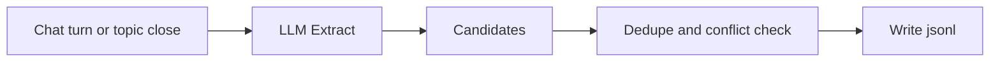

# Memory Lifecycle

| Field | Value |
|-------|-------|
| **Related** | [storage-schema.md](./storage-schema.md), [affection-protocol.md](./affection-protocol.md), [adr/002-observer-relative-social-memory.md](./adr/002-observer-relative-social-memory.md), [adr/003-promote-pipeline-2-to-1.md](./adr/003-promote-pipeline-2-to-1.md) |

How memory is written, promoted, filtered, and injected.

---

## 1. Memory types vs style

| Concern | Storage | Not stored in |
|---------|---------|---------------|
| How to speak | `users/{id}/style.md` | memory jsonl |
| Self facts | profile.core, semantic, episodic | style.md |
| Others' facts/opinions | social ①② | style.md |
| Current topic | current_topic.json | long-term jsonl |

---

## 2. Write pipeline



**Async** after reply is sent. Never block chat on extraction.

---

## 3. Write rules by source

| Source | Default status | Target |
|--------|----------------|--------|
| User explicit statement | `confirmed` | core / semantic / episodic |
| Other Agent explicit statement (observer view) | `active` | ① objective_facts |
| Opinion or complaint | `active` or `candidate` | ② preferences |
| LLM inference | `candidate` | ② only |
| Assistant reply text | **Do not auto-write** | — |

---

## 4. Social memory ① vs ②

| Content | Store | Example |
|---------|-------|---------|
| "I work on an AI product" | ① | explicit_statement |
| "I hate long meetings" | ② | explicit_opinion |
| "Q3 might slip" (uncertain) | ② | implicit_inferred, low confidence |
| "Q3 is definitely delayed" | ① | explicit_statement |
| Third party: "My cousin lives in Shanghai" | ① about speaker | fact_scope=about_third_party |

---

## 5. ②→① Promote pipeline

**Trigger:** PromoteCheck after turns or on `return_to_main` / topic close.

**Condition:** Other Agent makes an **explicit, accurate** statement matching a ② candidate.

**Atomic steps:**

1. Append new row to `objective_facts.jsonl` (`status=active`, link `promoted_from`).
2. Mark ② row `status=promoted_to_objective` (retain audit trail) or delete with `promoted_to` pointer.
3. Optionally bump `trust` via affection (see [affection-protocol.md](./affection-protocol.md)).

**Contradiction:** Mark ② `contradicted`; do not write ①.

See [adr/003-promote-pipeline-2-to-1.md](./adr/003-promote-pipeline-2-to-1.md).

---

## 6. Observer-relative writes

After joint session segment:

| Observer | Writes |
|----------|--------|
| A | A's view of what B said → `memory/users/A/social/by_agent/B/` |
| B | B's view of what A said → `memory/users/B/social/by_agent/A/` |

**No single god's-eye memory file** for both users.

Shared facts both confirm may exist in **both** observers' ① after respective PromoteCheck passes.

---

## 7. share_policy and visibility

| Policy | Behavior |
|--------|----------|
| `never` | Never repeat in any chat |
| `do_not_repeat_to_subject` | Usable in observer private chat; never say to subject Agent |
| `ok_if_relevant` | May mention when relevant with appropriate hedging |
| `public_to_connections` | Rare; both parties may see |

Composer **filters** L6 items before injection based on current participants.

---

## 8. Retrieval (read path)

```
query = embed(message + session_summary)
hits_semantic = search(user.semantic, query, top_k=5)
hits_episodic = search(user.episodic, query, top_k=3)
if other in participants:
  hits_1 = search(social/objective_facts, query, top_k=5)
  hits_2 = search(social/preferences, query, top_k=3)
filter by confidence, visibility, share_policy
format with [confirmed|inferred|opinion] tags
```

---

## 9. Extraction timing

| Event | Actions |
|-------|---------|
| Each turn | TopicJudge only (lightweight) |
| `return_to_main` | SocialExtract on sub segment; PromoteCheck |
| `new_main` | Extract on archived bundle; update session summary |
| Session end | Full summary; RelationshipExtract; affection events |

---

## 10. User corrections

- `POST /memory/confirm` — promote candidate to confirmed.
- `DELETE /memory/{id}` — forget fact/preference.
- User correction **always wins** over extracted memory.

See [api-contracts.md](./api-contracts.md).

---

## 11. Anti-hallucination rules

1. Never promote assistant-generated claims to ①/semantic without user/other confirmation.
2. Inject ② implicit items with uncertainty wording in system block.
3. Style.md must not contain factual claims.
4. Old summaries (L7) carry facts; tone comes from L2, not history mimicry.

## 12. Topic transition timing (M5 integration)

- Each turn: only TopicJudge (lightweight).
- `return_to_main`: SocialExtract on the closed sub segment + PromoteCheck (receives full joint turns).
- `new_main`: SocialExtract + PromoteCheck on the archived bundle.
- PromoteCheck validates that every candidate's `source.turn_ids` are present in the provided turns before LLM judgment.
- Trust events (`trust_confirm` / `trust_break`) are returned by PromoteCheck for M6 AffectionApply.
