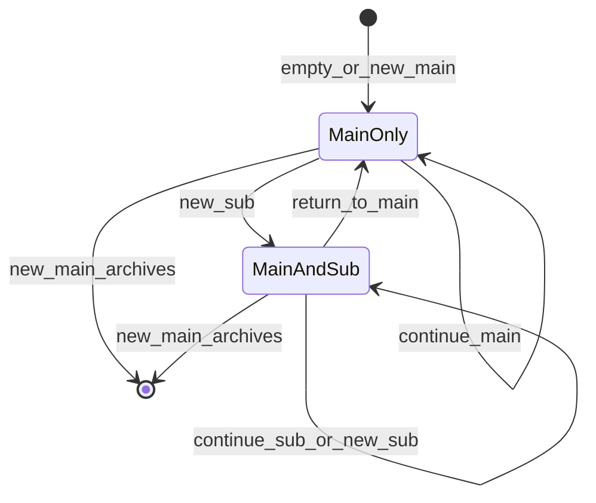

# Topic State Machine

| Field | Value |
|-------|-------|
| **Related** | [storage-schema.md](./storage-schema.md), [schemas/topic_judge_output.schema.json](./schemas/topic_judge_output.schema.json), [adr/004-main-subtopic-not-overwrite.md](./adr/004-main-subtopic-not-overwrite.md) |

Main/sub topic model for human-like conversations with returnable digressions.

---

## 1. Concepts

| Concept | Description |
|---------|-------------|
| **main_topic** | Primary thread (e.g. "weekend homework progress") — persists through digressions |
| **active_subtopic** | Temporary branch (e.g. "homeroom teacher assigns too much homework") |
| **subtopic_history** | Completed subtopics in this session |
| **focus** | `"main"` or `"sub"` — where attention is now |

**Only `new_main` replaces the entire topic file.** Subtopics use push/history/return, not full-file overwrite.

---

## 2. State diagram



---

## 3. Five transitions

| Transition | When | Action |
|------------|------|--------|
| `continue_main` | Still on main line | Update `main_topic.summary` (≤150 chars) |
| `continue_sub` | Still on current subtopic | Update `active_subtopic.summary` |
| `new_sub` | Digression from main (or new sub while on sub — MVP: close prior sub to history) | Set `active_subtopic`; `focus=sub`; main unchanged |
| `return_to_main` | Subtopic naturally ends | Move active_sub → `subtopic_history`; `active_subtopic=null`; `focus=main`; optionally update main summary |
| `new_main` | Entire conversation theme changes | Archive full bundle to `topic_history.jsonl`; reset file with new main |

---

## 4. Default opening state

When `current_topic.json` is empty or session starts:

```json
{
  "main_topic": {
    "topic_id": "main_init",
    "label": "Greeting and opening",
    "phase": "opening",
    "summary": "",
    "subtopics_hint": ["greeting", "self_intro", "opening_chat"]
  },
  "active_subtopic": null,
  "subtopic_history": [],
  "focus": "main"
}
```

---

## 5. Example walkthrough

| Turn | User content | Transition | Result |
|------|--------------|------------|--------|
| 1–3 | Small talk | `continue_main` | main=opening |
| 4 | "How much homework done?" | `new_main` or `continue_main` | main=homework progress |
| 5–8 | "Teacher is annoying, too much work" | `new_sub` | sub=teacher complaint |
| 9–12 | More complaints | `continue_sub` | update sub summary |
| 13 | "Anyway, how much did you finish?" | `return_to_main` | sub→history; focus=main |
| 14+ | Progress answers | `continue_main` | update main summary |

---

## 6. TopicJudge

**Input:** `current_topic.json`, last 3–5 turns, new message.

**Output:** See [schemas/topic_judge_output.schema.json](./schemas/topic_judge_output.schema.json).

```json
{
  "transition": "return_to_main",
  "confidence": 0.91,
  "reason": "User explicitly pivots back to homework question",
  "main_topic_update": { "summary": "Briefly discussed teacher; still asking progress." },
  "subtopic_close": {
    "topic_id": "sub_002",
    "final_summary": "Peer finds homeroom teacher assigns excessive weekend work.",
    "valence": "negative"
  }
}
```

**Run:** After each turn (async) or synchronously before compose if topic block must be current.

---

## 7. Archive rules

| Event | Archive target | Main topic |
|-------|----------------|------------|
| `return_to_main` | active_sub → `subtopic_history` | Kept |
| `new_main` | `{ main, subtopic_history, active_sub }` → `topic_history.jsonl` | Replaced |
| Session end | Merge history + final main → `summary.md` | N/A |

---

## 8. Joint sessions

For Agent A ↔ Agent B:

- **One** `memory/joint_sessions/{id}/current_topic.json` shared by both sides.
- TopicJudge runs once per turn (worker owns write).
- Each clone's **reply** still uses its own L2 style; both read the same topic block.

See [adr/005-joint-session-single-topic-file.md](./adr/005-joint-session-single-topic-file.md).

---

## 9. Extraction hooks

| Timing | Extract |
|--------|---------|
| `return_to_main` | SocialExtract on closed sub turns → ①② |
| `new_main` | SocialExtract on full archived bundle |
| Session end | RelationshipExtract for affection; session summary |

---

## 10. Agent behavior hints (in SKILL.md)

- When `focus=sub`: respond to subtopic but retain `main_topic.label` in mind.
- After `return_to_main`: use a natural bridge back to main ("Speaking of homework…").
- Do not treat subtopic opinions as ① facts unless speaker states them as factual.
