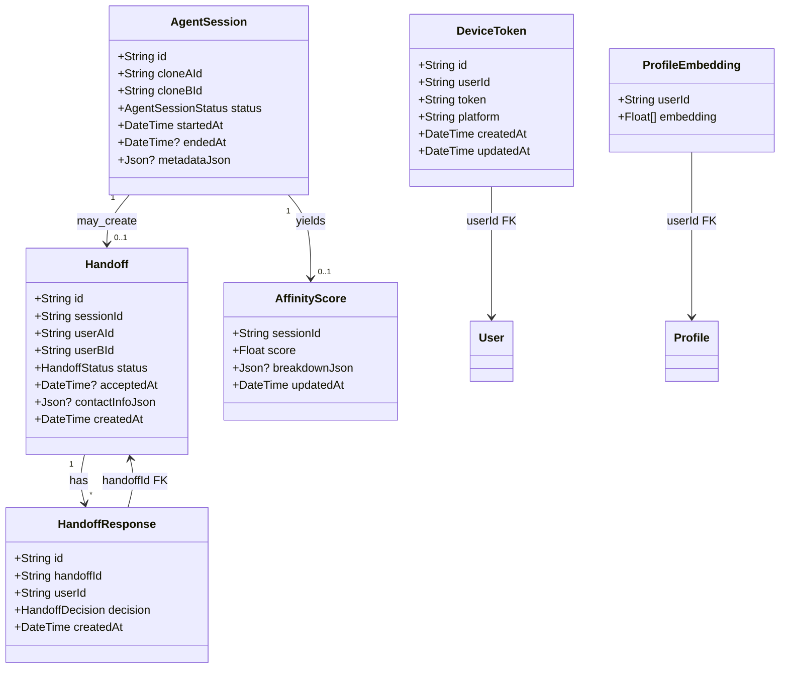
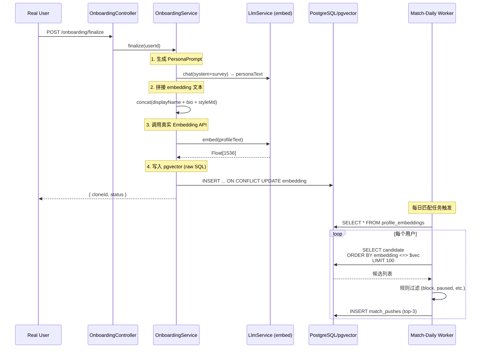
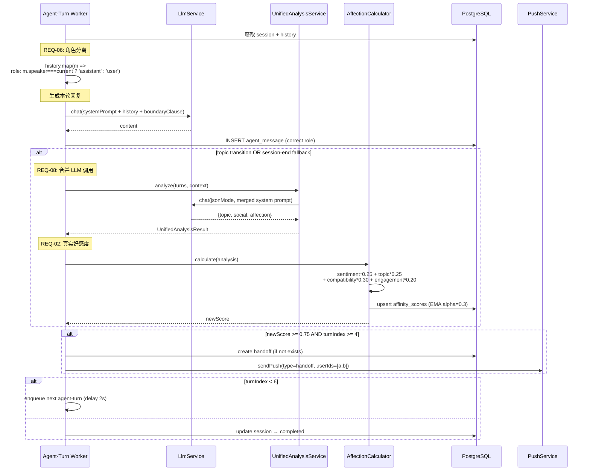
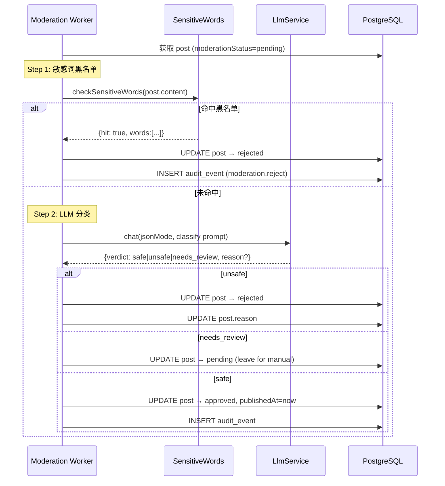
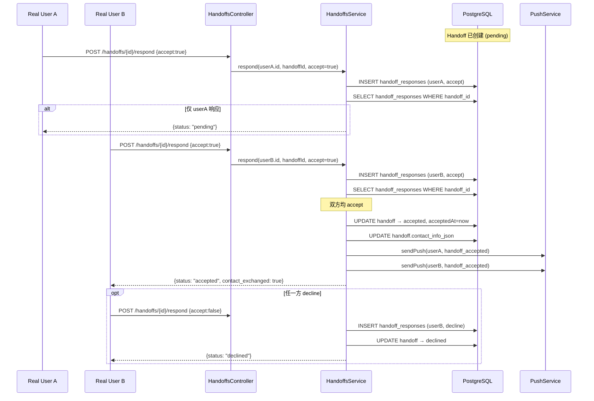
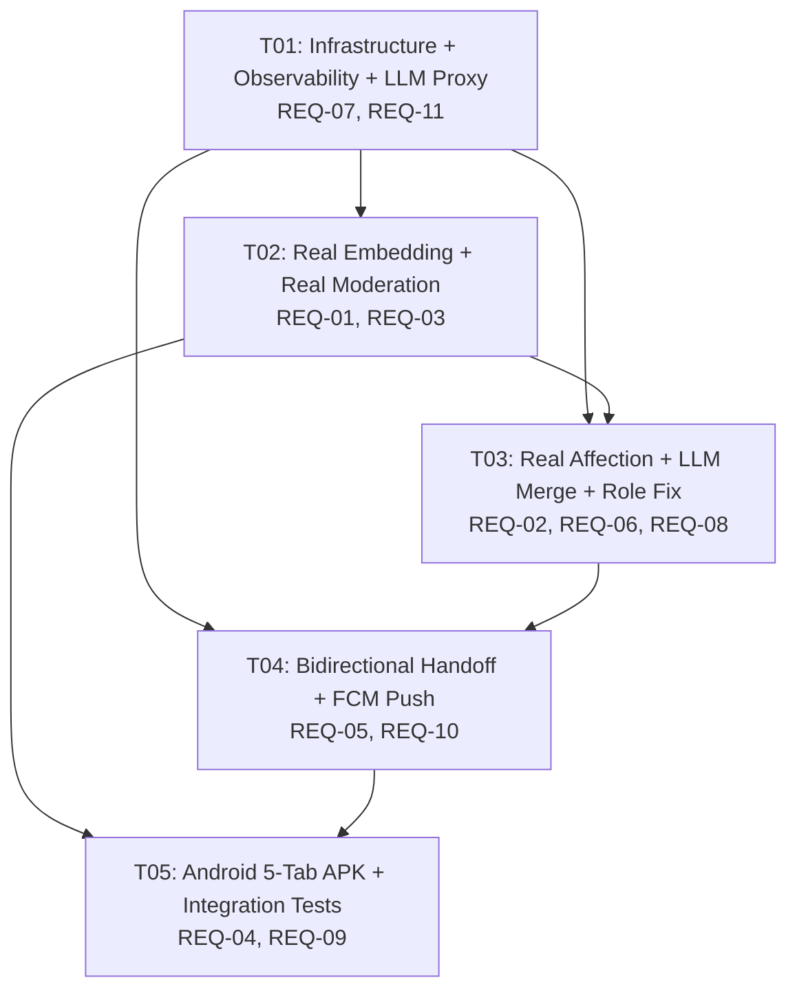

# Echo — System Design & Task Decomposition (缺陷修复)

| Field | Value |
|-------|-------|
| **Document Version** | 2.0.0 |
| **Status** | Draft |
| **Last Updated** | 2026-07-15 |
| **Author** | 高见远 (Architect) |
| **Related Documents** | [Software Architecture 1.0](./Software-Architecture-Echo.md), [PRD (11 项缺陷)](./PRD-Echo-Fixes.md) |

---

# Part A: System Design

## 1. Implementation Approach

### 1.1 REQ-01 — 真实 Embedding

**问题**: `onboarding.service.ts` 的 `fakeEmbedding()` 生成 8 维伪造向量；`match-bridge.ts` 在应用层做 `cosine()`，完全没有用到 pgvector。

**方案**:
- 使用 DeepSeek Embedding API（`deepseek-embed` 或 `text-embedding-3-small` 兼容接口）生成 1536 维真实语义向量
- 将 `profile_embeddings.embedding` 列类型从 `Json` 迁移为 pgvector `vector(1536)`
- 创建 HNSW 索引以加速检索
- `match-bridge.ts` 改为执行原生 SQL：`SELECT ... ORDER BY embedding <=> $target_vec LIMIT 100`
- 嵌入生成在 `OnboardingService.finalize()` 中触发：拼接 profile 文本（displayName + bio + style）→ 调用 embedding API → 写入 pgvector

**技术难点**: Prisma 不原生支持 pgvector 类型，需 raw SQL 写入/查询；DeepSeek embedding 端点可能与 chat 端点不同。

### 1.2 REQ-02 — 真实好感度

**问题**: `main.ts` agent-turn 中 affinity 计算为 `score = Math.min(0.95, 0.5 + turnIndex * 0.05)`——仅依赖轮次数，完全伪造。

**方案**:
- 每轮 agent-turn 结束后调用 LLM 做语义评估（sentiment alignment, topic overlap, compatibility, engagement depth）
- 加权公式（与现有 SA 文档 §8.6 一致）：`affinity = 0.25*sentiment + 0.25*topic_overlap + 0.30*compatibility + 0.20*engagement`
- 使用当前轮次对话内容作为输入，LLM 返回 structured JSON (`{sentiment, topic_overlap, compatibility, engagement, reasoning}`)
- 累积到 session-level affinity（指数移动平均 `alpha=0.3`）
- 写入 `affinity_scores` 表（复用现有 `breakdownJson` 存储分量）
- Handoff 判定条件：`affinity >= 0.75 AND turnIndex >= 4`（保留最低轮次门槛）

### 1.3 REQ-03 — 真实审核

**问题**: moderation worker 直接 `approved` 所有内容，无实际审核逻辑。

**方案**:
- **两层审核**：
  1. **敏感词黑名单直拒** — 内置正则黑名单（中文敏感词/违规词），命中即 `rejected`
  2. **LLM 分类** — 调用 LLM 输出 `safe | unsafe | needs_review`
- `unsafe` → 直接 `rejected`，在 `posts` 表中记录 rejection reason
- `needs_review` → 保持 `pending` 状态（人工队列）
- `safe` → `approved`
- 黑名单正则持久化在 `services/api/src/moderation/sensitive-words.ts`
- moderation worker 改为两个子步骤顺序执行

### 1.4 REQ-04 — Android APK 完整功能

**问题**: 当前仅有 shell `MainActivity.kt`，无实际功能。

**方案**:
- **Jetpack Compose + Material 3**，5 个 Tab：动态(Feed) / 匹配(Match) / 分身(Clone) / 活动(Activity) / 设置(Settings)
- 网络层：**Retrofit + Moshi**（已有依赖）
- DI：**Hilt**
- 对接现有 REST API 端点（已在 SA §10 定义）
- 签名 release APK：`./gradlew assembleRelease`
- 新增依赖：Navigation Compose、Hilt、FCM、Coil（图片加载）

**架构**: MVVM — `data/`(API+Repository) → `domain/`(UseCase) → `ui/`(Screen+ViewModel)

### 1.5 REQ-05 — 双向 Handoff

**问题**: 当前 `Handoff` 表只有一个全局 `status`（accepted/declined），无法准确追踪每个用户独立决策。

**方案**:
- 新增 `HandoffResponse` 表（`handoff_id + user_id` 复合唯一），每条记录存单个用户的 `decision`（accept/decline）
- `Handoff.status` 改为派生字段：
  - `pending` → 无用户响应或仅 1 人响应
  - `accepted` → 双方均 accept
  - `declined` → 任一方 decline
- 双方均 accept 后 worker 交换联系方式（写入 `handoffs.contact_info_json`）
- `POST /handoffs/{id}/respond` 改为写入 `HandoffResponse`，检查并级联更新 `Handoff.status`
- Agent-turn 中 handoff 创建后不再重复创建（现有逻辑已正确处理）

### 1.6 REQ-06 — 对话角色分离

**问题**: `main.ts` agent-turn 中 `history.map(m => ({ role: 'user', content: m.content }))` 将所有历史消息 role 硬编码为 `user`。

**方案**:
- 按消息 speaker 映射角色：
  - 当前轮 speaker → `assistant`
  - 对方（非 speaker）→ `user`
- 在 agent-turn worker 中构建 history 时，对每条 `agent_message` 检查 `speakerCloneId`：
  ```ts
  history.map(m => ({
    role: m.speakerCloneId === speakerId ? 'assistant' : 'user',
    content: m.content
  }))
  ```
- system prompt 保持不变（已通过 `composeSystemPrompt` 正确注入）

### 1.7 REQ-07 — AP 可观测性

**问题**: 多数 catch 块为空或仅 `console.log`，无法追踪生产环境错误。

**方案**:
- 统一 logger 工具 `services/shared/observability.ts`，输出 JSON 结构化日志（含 `correlation_id`, `timestamp`, `level`, `message`, `metadata_json`）
- 所有 catch 块替换为 `logger.warn(message, { error: err.message, ...context })`
- 关键计数指标（Prometheus 兼容）：
  - `echo_llm_calls_total{status, purpose}`
  - `echo_moderation_total{result}`
  - `echo_handoff_total{decision}`
  - `echo_agent_turns_total{session_id}`
  - `echo_errors_total{module, error_type}`
- API 层面：每个 HTTP 请求生成 `correlation_id`（middleware），在响应头返回 `X-Correlation-Id`

### 1.8 REQ-08 — LLM 合并优化

**问题**: 每个 agent-turn 调用 3 次独立 LLM（TopicJudge + SocialExtract + RelationshipExtract），每 session 6 轮最多 18 次调用。

**方案**:
- 合并为单次 LLM `structured output`（JSON mode）调用：`UnifiedAnalysisService`
- 单次调用返回：
  ```json
  {
    "topic": { "main_label": "...", "phase": "...", "transition": "..." },
    "social": { "facts": [...], "tags": [...] },
    "affection": { "sentiment": 0.0-1.0, "topic_overlap": 0.0-1.0, "compatibility": 0.0-1.0, "engagement": 0.0-1.0 }
  }
  ```
- 触发时机不变：仅在 topic transition 或 session-end fallback 时调用
- 每轮 LLM 调用：1（chat 生成消息）+ ≤1（合并分析）= ≤2 次/轮
- 每 session 最多：6×2 = 12 次 LLM 调用

### 1.9 REQ-09 — 集成测试

**问题**: 无自动化测试。

**方案**:
- API 集成测试：`Jest + Supertest`，测试 NestJS 端点
  - Auth: register → login → JWT
  - Onboarding: survey → dialogue → finalize
  - Feed: list → detail
  - Handoff: get → respond → bilateral check
- Worker 集成测试：`Jest` + mock LLM
  - Agent-turn: message generation + affinity calculation
  - Moderation: sensitive word rejection + LLM classify
  - Match-daily: embedding + push creation
- 测试数据库使用独立 PostgreSQL schema 或 SQLite mock

### 1.10 REQ-10 — FCM 推送

**问题**: `handoffs.service.ts` 中有 `[FCM stub]` 注释，未实现实际推送。

**方案**:
- `firebase-admin` SDK 集成
- 三种推送类型：
  1. `match_push` — 每日匹配推送触发
  2. `handoff` — agent session 达到 handoff 阈值
  3. `handoff_accepted` — 双方均接受 handoff
- Android 端集成 FCM SDK，注册 device token → `POST /v1/push/register`
- 新增 `DeviceToken` 表存储用户-设备 token 映射
- `PushService` 封装 `firebase-admin.messaging().send()`

### 1.11 REQ-11 — 移除前端 Key

**问题**: 前端 `deepseek.ts` 使用 `VITE_DEEPSEEK_API_KEY`，API key 暴露在浏览器中。

**方案**:
- 删除前端 `Echo/src/api/deepseek.ts` 中的直接 LLM 调用
- 新增 `POST /v1/llm/proxy` 端点，接受 `{ messages, options }`，服务端代理 LLM 调用
- 前端改为调用 `POST /v1/llm/proxy`
- 移除 `VITE_DEEPSEEK_API_KEY`、`VITE_DEEPSEEK_BASE_URL`、`VITE_DEEPSEEK_MODEL` 环境变量
- 在 API 端添加 rate limiting（per-user）

---

## 2. File List

### 2.1 Schema & Migration

| 相对路径 | 操作 | 说明 |
|----------|------|------|
| `services/api/prisma/schema.prisma` | **修改** | 新增 HandoffResponse/DeviceToken 模型；embedding 列类型标注 |
| `services/api/prisma/migrations/*/migration.sql` | **新增** | pgvector 扩展 + HNSW 索引 + 新表 |

### 2.2 Shared / Infrastructure

| 相对路径 | 操作 | 说明 |
|----------|------|------|
| `services/shared/observability.ts` | **新增** | 统一 JSON logger、correlation_id、Prometheus 计数器 |
| `services/api/src/common/correlation.middleware.ts` | **新增** | HTTP correlation_id 中间件 |
| `services/api/src/common/error.filter.ts` | **新增** | 全局异常过滤器（RFC 7807） |

### 2.3 LLM Proxy & Embedding（REQ-01, REQ-11）

| 相对路径 | 操作 | 说明 |
|----------|------|------|
| `services/api/src/llm/llm-proxy.controller.ts` | **新增** | `POST /v1/llm/proxy` |
| `services/api/src/llm/llm-proxy.guard.ts` | **新增** | Proxy rate limiting |
| `services/api/src/llm/llm.module.ts` | **修改** | 注册 LlmProxyController |
| `services/api/src/llm/llm.service.ts` | **修改** | 新增 `embed()` 方法（DeepSeek embedding API） |
| `services/worker/src/clone-runtime/llm.ts` | **修改** | 新增 `embed()` 导出函数 |
| `Echo/src/api/deepseek.ts` | **删除** | 移除前端直接 LLM 调用 |
| `Echo/src/api/client.ts` | **修改** | 新增 `llmProxy()` |
| `Echo/src/vite-env.d.ts` | **修改** | 移除 VITE_DEEPSEEK_* 声明 |
| `Echo/.env` | **修改** | 移除 VITE_DEEPSEEK_API_KEY |

### 2.4 Onboarding & Embedding（REQ-01）

| 相对路径 | 操作 | 说明 |
|----------|------|------|
| `services/api/src/onboarding/onboarding.service.ts` | **修改** | `finalize()` 中调用真实 embedding API；删除 `fakeEmbedding()` |
| `services/worker/src/clone-runtime/match-bridge.ts` | **修改** | 用 pgvector SQL 替换应用层 `cosine()` |

### 2.5 Moderation（REQ-03）

| 相对路径 | 操作 | 说明 |
|----------|------|------|
| `services/api/src/moderation/sensitive-words.ts` | **新增** | 中文敏感词正则黑名单 |
| `services/api/src/moderation/moderation.service.ts` | **新增** | LLM 分类 + 敏感词检查 |
| `services/api/src/moderation/moderation.module.ts` | **新增** | NestJS 模块 |
| `services/worker/src/main.ts` | **修改** | moderation worker 调用真实审核逻辑 |

### 2.6 Agent Turn & Affection（REQ-02, REQ-06, REQ-08）

| 相对路径 | 操作 | 说明 |
|----------|------|------|
| `services/worker/src/main.ts` | **修改** | agent-turn 角色修复 + 真实好感度 + LLM 合并 |
| `services/worker/src/agent-platform/merged/unified-analysis.service.ts` | **新增** | 合并 TopicJudge+SocialExtract+RelationshipExtract |
| `services/worker/src/agent-platform/merged/types.ts` | **新增** | UnifiedAnalysisResult 类型 |

### 2.7 Handoff Bidirectional（REQ-05）

| 相对路径 | 操作 | 说明 |
|----------|------|------|
| `services/api/src/handoffs/handoffs.service.ts` | **修改** | 双向决策逻辑 + HandoffResponse |
| `services/api/src/handoffs/handoffs.controller.ts` | **修改** | 响应格式更新 |
| `services/worker/src/main.ts` | **修改** | handoff 创建后联系信息交换逻辑 |

### 2.8 FCM Push（REQ-10）

| 相对路径 | 操作 | 说明 |
|----------|------|------|
| `services/api/src/push/push.service.ts` | **新增** | FCM send + device token 管理 |
| `services/api/src/push/push.module.ts` | **新增** | NestJS 模块 |
| `services/api/src/push/push.controller.ts` | **新增** | `POST /v1/push/register` |
| `services/worker/src/main.ts` | **修改** | handoff/match 触发时调用 push |
| `apps/android/app/src/main/java/com/echo/app/data/push/` | **新增** | FCM SDK + token 注册 |

### 2.9 Android APK（REQ-04）

| 相对路径 | 操作 | 说明 |
|----------|------|------|
| `apps/android/app/build.gradle.kts` | **修改** | 新增依赖：Navigation, Hilt, FCM, Coil |
| `apps/android/build.gradle.kts` | **修改** | Hilt 插件 |
| `apps/android/app/src/main/java/com/echo/app/EchoApplication.kt` | **新增** | Application + Hilt |
| `apps/android/app/src/main/java/com/echo/app/di/AppModule.kt` | **新增** | Hilt DI 模块 |
| `apps/android/app/src/main/java/com/echo/app/data/api/EchoApi.kt` | **新增** | Retrofit API 接口 |
| `apps/android/app/src/main/java/com/echo/app/data/api/dto/*.kt` | **新增** | DTO 类 |
| `apps/android/app/src/main/java/com/echo/app/data/repository/*.kt` | **新增** | Repository 层 |
| `apps/android/app/src/main/java/com/echo/app/ui/navigation/EchoNavHost.kt` | **新增** | 5-Tab 导航 |
| `apps/android/app/src/main/java/com/echo/app/ui/feed/*.kt` | **新增** | 动态 Tab |
| `apps/android/app/src/main/java/com/echo/app/ui/match/*.kt` | **新增** | 匹配 Tab |
| `apps/android/app/src/main/java/com/echo/app/ui/clone/*.kt` | **新增** | 分身 Tab |
| `apps/android/app/src/main/java/com/echo/app/ui/activity/*.kt` | **新增** | 活动 Tab |
| `apps/android/app/src/main/java/com/echo/app/ui/settings/*.kt` | **新增** | 设置 Tab |
| `apps/android/app/src/main/java/com/echo/app/ui/theme/Theme.kt` | **新增** | Material 3 主题 |
| `apps/android/app/src/main/res/values-zh-rCN/strings.xml` | **新增** | 中文字符串资源 |
| `apps/android/app/src/main/AndroidManifest.xml` | **修改** | FCM service + internet permission |

### 2.10 Integration Tests（REQ-09）

| 相对路径 | 操作 | 说明 |
|----------|------|------|
| `services/api/test/setup.ts` | **新增** | Jest 全局 setup |
| `services/api/test/auth.integration.spec.ts` | **新增** | Auth 集成测试 |
| `services/api/test/onboarding.integration.spec.ts` | **新增** | Onboarding 集成测试 |
| `services/api/test/handoff.integration.spec.ts` | **新增** | Handoff 集成测试 |
| `services/worker/test/setup.ts` | **新增** | Worker Jest setup |
| `services/worker/test/agent-turn.integration.spec.ts` | **新增** | Agent-turn 集成测试 |
| `services/worker/test/moderation.integration.spec.ts` | **新增** | Moderation 集成测试 |
| `services/api/jest.config.ts` | **新增** | Jest 配置 |
| `services/worker/jest.config.ts` | **新增** | Jest 配置 |

---

## 3. Data Structures and Interfaces

### 3.1 新增/修改的 Prisma 模型（类图）



### 3.2 核心服务类图

```mermaid
classDiagram
    direction TB

    class Observability {
        +createLogger(module: string) Logger
        +incrementCounter(name: string, labels: object) void
        +generateCorrelationId() string
    }

    class LlmService {
        +chat(messages: Message[], options?: ChatOptions) Promise~string~
        +embed(text: string) Promise~number[]~
        +embedBatch(texts: string[]) Promise~number[][]~
    }

    class LlmProxyController {
        +proxy(userId: string, body: ProxyRequest) Promise~ProxyResponse~
    }

    class ModerationService {
        +checkSensitiveWords(text: string) SensitiveResult
        +llmClassify(text: string) Promise~ModerationVerdict~
        +moderate(text: string) Promise~ModerationResult~
    }

    class UnifiedAnalysisService {
        +analyze(turns: Turn[], context: AnalysisContext) Promise~UnifiedAnalysisResult~
    }

    class AffectionCalculator {
        +calculate(analysis: UnifiedAnalysisResult) AffinityComponents
        +updateSessionAffinity(sessionId: string, components: AffinityComponents) Promise~float~
    }

    class PushService {
        +sendPush(userId: string, type: PushType, payload: object) Promise~void~
        +registerToken(userId: string, token: string, platform: string) Promise~void~
    }

    class HandoffsService {
        +getOne(userId: string, id: string) Promise~HandoffDetail~
        +respond(userId: string, id: string, accept: boolean) Promise~HandoffResult~
        +checkBilateral(id: string) Promise~HandoffStatus~
    }

    class OnboardingService {
        +finalize(userId: string) Promise~FinalizeResult~
    }

    LlmService --> Observability : uses
    ModerationService --> LlmService : uses
    UnifiedAnalysisService --> LlmService : uses
    HandoffsService --> PushService : triggers
    OnboardingService --> LlmService : embed()
```



### 3.3 API 端点变更

| 方法 | 路径 | 变更 | 说明 |
|------|------|------|------|
| `POST` | `/v1/llm/proxy` | **新增** | LLM 代理端点 |
| `POST` | `/v1/push/register` | **新增** | 注册 FCM device token |
| `GET` | `/v1/handoffs/{id}` | **修改** | 响应新增 `responses` 数组（per-user 决策） |
| `POST` | `/v1/handoffs/{id}/respond` | **修改** | 创建 HandoffResponse，检查双向 |
| `GET` | `/v1/health` | **修改** | 新增 `metrics` 字段（Prometheus text format） |

---

## 4. Program Call Flow

### 4.1 Embedding 生成 & 匹配流程



### 4.2 Agent-Turn 好感度 & 合并 LLM 流程



### 4.3 审核流程



### 4.4 Handoff 双向流程



---

## 5. Anything UNCLEAR

| # | 事项 | 所做假设 |
|---|------|---------|
| Q1 | Embedding 模型 | 假设 DeepSeek `deepseek-embed` 或 OpenAI 兼容 `text-embedding-3-small`。若 API 不可用，回退方案：使用 `@xenova/transformers` 本地模型 |
| Q2 | pgvector HNSW 参数 | 假设 `m=16, ef_construction=200`，后续可根据性能调优 |
| Q3 | 敏感词黑名单来源 | 假设内置约 500 个中文敏感词正则模式（参考社区维护列表）。需法务 review |
| Q4 | FCM service account JSON | 假设已存在 Google Cloud 项目，`GOOGLE_APPLICATION_CREDENTIALS` 环境变量指向 service-account.json |
| Q5 | Handoff 后联系信息 | 假设交换 `phone` 或 `email`（取 profile 中已填写字段），前端展示 "联系方式已交换" |
| Q6 | 集成测试数据库 | 假设使用 Docker Compose 中的 PostgreSQL 测试实例，独立于开发数据库 |
| Q7 | REQ-08 合并 LLM 的 prompt 设计 | 假设合并后的 prompt 长约 2000 tokens，DeepSeek Chat 上下文窗口足够 |

---

# Part B: Task Decomposition

## 6. Required Packages

### Backend (services/api + services/worker)

```
# 新增依赖
- @prisma/client@^5.22.0: 数据库 ORM（已有，版本锁定）
- prisma@^5.22.0: Schema 管理（已有）
- firebase-admin@^13.0.0: FCM 推送
- pgvector: pgvector 扩展（数据库层）⚠️ 此为 PostgreSQL 扩展，非 npm 包
- openai@^4.70.0: DeepSeek API 客户端（已有）

# 测试依赖
- jest@^30.0.0: 测试框架
- supertest@^7.0.0: HTTP 测试
- ts-jest@^29.0.0: TypeScript Jest 转译
```

### Android

```
# 新增 Gradle 依赖
- androidx.navigation:navigation-compose:2.8.x: 5-Tab 导航
- com.google.dagger:hilt-android:2.52: DI
- androidx.hilt:hilt-navigation-compose:1.2.0: Hilt ViewModel
- com.google.firebase:firebase-messaging:24.x: FCM
- io.coil-kt:coil-compose:2.7.0: 图片加载
- com.squareup.retrofit2:retrofit:2.11.0: HTTP（已有）
- com.squareup.retrofit2:converter-moshi:2.11.0: JSON（已有）
- com.squareup.moshi:moshi-kotlin:1.15.1: Kotlin JSON codegen
```

---

## 7. Task List

### T01 — 项目基础设施 + 可观测性 + LLM 代理

| 属性 | 值 |
|------|-----|
| **Task ID** | T01 |
| **Task Name** | Infrastructure Foundation + Observability + LLM Proxy |
| **涉及 REQ** | REQ-07, REQ-11 |
| **优先级** | P0 |

**Source Files**:
- `services/shared/observability.ts` (NEW) — 统一 JSON logger + Prometheus 计数器
- `services/api/src/common/correlation.middleware.ts` (NEW) — HTTP correlation_id
- `services/api/src/common/error.filter.ts` (NEW) — 全局异常过滤器
- `services/api/src/llm/llm-proxy.controller.ts` (NEW) — `POST /v1/llm/proxy`
- `services/api/src/llm/llm-proxy.guard.ts` (NEW) — Rate limit guard
- `services/api/src/llm/llm.module.ts` (MODIFY) — 注册 proxy controller
- `services/api/src/app.module.ts` (MODIFY) — 注册中间件和过滤器
- `services/api/src/main.ts` (MODIFY) — 启用全局过滤器
- `services/worker/src/main.ts` (MODIFY) — 所有 catch 块替换为 logger.warn
- `services/worker/src/clone-runtime/match-bridge.ts` (MODIFY) — 添加结构化日志
- `Echo/src/api/deepseek.ts` (DELETE) — 移除前端 LLM
- `Echo/src/api/client.ts` (MODIFY) — 新增 llmProxy()
- `Echo/src/vite-env.d.ts` (MODIFY) — 移除 VITE_DEEPSEEK_*
- `Echo/.env` (MODIFY) — 移除 VITE_DEEPSEEK_API_KEY

**Dependencies**: 无（首个任务）
**预估工作量**: 1.5 天

---

### T02 — 真实 Embedding + 真实审核

| 属性 | 值 |
|------|-----|
| **Task ID** | T02 |
| **Task Name** | Real Embedding + Real Moderation |
| **涉及 REQ** | REQ-01, REQ-03 |
| **优先级** | P0 |

**Source Files**:
- `services/api/prisma/schema.prisma` (MODIFY) — embedding 列标注 + 迁移注释
- `services/api/prisma/migrations/*/migration.sql` (NEW) — pgvector + HNSW index
- `services/api/src/llm/llm.service.ts` (MODIFY) — 新增 `embed()` 和 `embedBatch()`
- `services/worker/src/clone-runtime/llm.ts` (MODIFY) — 新增 `embed()` 导出
- `services/api/src/onboarding/onboarding.service.ts` (MODIFY) — 替换 fakeEmbedding → 真实 embedding
- `services/worker/src/clone-runtime/match-bridge.ts` (MODIFY) — pgvector SQL 查询替换 cosine
- `services/api/src/moderation/sensitive-words.ts` (NEW) — 中文敏感词正则黑名单
- `services/api/src/moderation/moderation.service.ts` (NEW) — LLM 分类 + 敏感词检查
- `services/api/src/moderation/moderation.module.ts` (NEW) — NestJS 模块注册
- `services/worker/src/main.ts` (MODIFY) — moderation worker 调用真实审核

**Dependencies**: T01（需 observability logger）
**预估工作量**: 2 天

---

### T03 — 真实好感度 + LLM 合并 + 角色修复

| 属性 | 值 |
|------|-----|
| **Task ID** | T03 |
| **Task Name** | Real Affection + LLM Merge + Role Separation |
| **涉及 REQ** | REQ-02, REQ-06, REQ-08 |
| **优先级** | P0/P1 |

**Source Files**:
- `services/worker/src/agent-platform/merged/types.ts` (NEW) — UnifiedAnalysisResult 类型
- `services/worker/src/agent-platform/merged/unified-analysis.service.ts` (NEW) — 合并 TopicJudge+SocialExtract+RelationshipExtract
- `services/worker/src/main.ts` (MODIFY) — agent-turn 角色分离 + 真实好感度计算 + 合并分析调用
- `services/worker/src/agent-platform/composer/prompt-composer.ts` (MODIFY) — 适配新 affection overlay 格式

**Dependencies**: T01（observability logger）, T02（embedding 可用于好感度 context）
**预估工作量**: 2.5 天

---

### T04 — 双向 Handoff + FCM 推送

| 属性 | 值 |
|------|-----|
| **Task ID** | T04 |
| **Task Name** | Bidirectional Handoff + FCM Push |
| **涉及 REQ** | REQ-05, REQ-10 |
| **优先级** | P1 |

**Source Files**:
- `services/api/prisma/schema.prisma` (MODIFY) — 新增 HandoffResponse + DeviceToken 模型
- `services/api/src/handoffs/handoffs.service.ts` (MODIFY) — 双向决策逻辑
- `services/api/src/handoffs/handoffs.controller.ts` (MODIFY) — 响应格式更新
- `services/api/src/push/push.service.ts` (NEW) — FCM send + token 管理
- `services/api/src/push/push.module.ts` (NEW) — NestJS 模块
- `services/api/src/push/push.controller.ts` (NEW) — `POST /v1/push/register`
- `services/worker/src/main.ts` (MODIFY) — handoff/match 触发 push
- `apps/android/app/src/main/java/com/echo/app/data/push/EchoFirebaseService.kt` (NEW) — Android FCM SDK
- `apps/android/app/src/main/AndroidManifest.xml` (MODIFY) — FCM service 声明

**Dependencies**: T01（observability）, T03（agent-turn 触发 handoff 需好感度）
**预估工作量**: 2 天

---

### T05 — Android APK 完整功能 + 集成测试

| 属性 | 值 |
|------|-----|
| **Task ID** | T05 |
| **Task Name** | Android 5-Tab APK + Integration Tests |
| **涉及 REQ** | REQ-04, REQ-09 |
| **优先级** | P0/P1 |

**Source Files**:
- `apps/android/app/build.gradle.kts` (MODIFY) — Navigation/Hilt/FCM/Coil 依赖
- `apps/android/build.gradle.kts` (MODIFY) — Hilt 插件
- `apps/android/app/src/main/java/com/echo/app/EchoApplication.kt` (NEW) — Hilt Application
- `apps/android/app/src/main/java/com/echo/app/di/AppModule.kt` (NEW) — DI 模块
- `apps/android/app/src/main/java/com/echo/app/data/api/EchoApi.kt` (NEW) — Retrofit 接口
- `apps/android/app/src/main/java/com/echo/app/data/api/dto/*.kt` (NEW) — DTOs
- `apps/android/app/src/main/java/com/echo/app/data/repository/AuthRepository.kt` (NEW)
- `apps/android/app/src/main/java/com/echo/app/data/repository/FeedRepository.kt` (NEW)
- `apps/android/app/src/main/java/com/echo/app/data/repository/MatchRepository.kt` (NEW)
- `apps/android/app/src/main/java/com/echo/app/data/repository/CloneRepository.kt` (NEW)
- `apps/android/app/src/main/java/com/echo/app/ui/navigation/EchoNavHost.kt` (NEW) — 5-Tab 导航
- `apps/android/app/src/main/java/com/echo/app/ui/feed/FeedScreen.kt` (NEW)
- `apps/android/app/src/main/java/com/echo/app/ui/feed/FeedViewModel.kt` (NEW)
- `apps/android/app/src/main/java/com/echo/app/ui/match/MatchScreen.kt` (NEW)
- `apps/android/app/src/main/java/com/echo/app/ui/match/MatchViewModel.kt` (NEW)
- `apps/android/app/src/main/java/com/echo/app/ui/clone/CloneScreen.kt` (NEW)
- `apps/android/app/src/main/java/com/echo/app/ui/activity/ActivityScreen.kt` (NEW)
- `apps/android/app/src/main/java/com/echo/app/ui/settings/SettingsScreen.kt` (NEW)
- `apps/android/app/src/main/java/com/echo/app/ui/theme/Theme.kt` (NEW) — M3 主题
- `apps/android/app/src/main/res/values-zh-rCN/strings.xml` (NEW) — 中文资源
- `apps/android/app/src/main/AndroidManifest.xml` (MODIFY) — 权限 + FCM
- `services/api/test/setup.ts` (NEW)
- `services/api/test/auth.integration.spec.ts` (NEW)
- `services/api/test/onboarding.integration.spec.ts` (NEW)
- `services/api/test/handoff.integration.spec.ts` (NEW)
- `services/api/jest.config.ts` (NEW)
- `services/worker/test/setup.ts` (NEW)
- `services/worker/test/agent-turn.integration.spec.ts` (NEW)
- `services/worker/test/moderation.integration.spec.ts` (NEW)
- `services/worker/jest.config.ts` (NEW)

**Dependencies**: T01, T02, T03, T04（API 契约需稳定）
**预估工作量**: 3 天（Android 2 天 + 测试 1 天）

---

## 8. Shared Knowledge

### 8.1 LLM 调用封装

```ts
// services/shared/observability.ts
export interface LlmCallOptions {
  purpose: string;         // 'chat' | 'embed' | 'classify' | 'analysis'
  model?: string;
  timeoutMs?: number;
  jsonMode?: boolean;
  retries?: number;
}

// 每次 LLM 调用必须传入 purpose，用于 metrics 分类
// 所有 LLM 调用通过 services/api/src/llm/llm.service.ts 或 services/worker/src/clone-runtime/llm.ts
```

### 8.2 错误处理模式

```ts
// 所有 catch 块必须遵循此模式：
try {
  // ...
} catch (err) {
  logger.warn('operation_name failed', {
    error: err instanceof Error ? err.message : String(err),
    stack: err instanceof Error ? err.stack : undefined,
    correlation_id: ctx?.correlationId,
    // 上下文相关字段
  });
  // 非阻塞操作：吞掉异常
  // 阻塞操作：抛出自定义异常（被全局过滤器捕获）
}
```

### 8.3 日志格式

```json
{
  "level": "warn",
  "timestamp": "2026-07-15T10:30:00.000Z",
  "module": "agent-turn",
  "correlation_id": "uuid",
  "message": "LLM chat timed out",
  "metadata_json": {
    "sessionId": "xxx",
    "turnIndex": 3,
    "error": "LLM request timed out",
    "model": "deepseek-chat"
  }
}
```

### 8.4 API 响应格式

所有 API 响应使用统一格式：
```json
{
  "code": 0,
  "data": { /* ... */ },
  "message": "ok"
}
```

### 8.5 Handoff 状态机

```
pending → (userA accept + userB accept) → accepted
pending → (any decline) → declined
accepted → 终端状态（不可变）
declined → 终端状态（不可变）
```

### 8.6 pgvector 操作（Prisma raw SQL）

```ts
// 写入 embedding
await prisma.$executeRaw`
  INSERT INTO profile_embeddings (user_id, embedding)
  VALUES (${userId}, ${vector}::vector)
  ON CONFLICT (user_id) DO UPDATE SET embedding = ${vector}::vector
`;

// HNSW 查询
await prisma.$queryRaw`
  SELECT pe.user_id, 1 - (pe.embedding <=> ${target}::vector) AS similarity
  FROM profile_embeddings pe
  WHERE pe.user_id != ${excludeUserId}
  ORDER BY pe.embedding <=> ${target}::vector
  LIMIT ${limit}
`;
```

### 8.7 FCM 推送 Payload 格式

```json
{
  "token": "device-fcm-token",
  "notification": {
    "title": "Echo 匹配通知",
    "body": "你和 XXX 的分身聊得很投缘！"
  },
  "data": {
    "type": "handoff|match_push|handoff_accepted",
    "handoffId": "uuid",
    "click_action": "OPEN_HANDOFF"
  },
  "android": {
    "priority": "high",
    "channelId": "echo_handoff"
  }
}
```

---

## 9. Task Dependency Graph



**说明**:
- **T01** 是所有任务的基石（observability 必须在其他任务之前建立）
- **T02** 为 T03 提供真实 embedding（可用于好感度 context 增强），同时 moderation 是 agent-turn 的依赖
- **T03** 为 T04 提供真实的 affinity score（handoff 判定依赖）
- **T05** 可以在 T04 完成前开始 Android 开发（API 契约已在设计阶段确定），但集成测试需等所有后端改动完成

**并行化建议**: T05 的 Android 部分可与 T02-T04 并行开发（API 契约已在此文档中定义），仅集成测试部分需等后端完成。

---

## Appendix A — Prisma Schema 变更汇总

### 新增模型

```prisma
enum HandoffDecision {
  accept
  decline
}

model HandoffResponse {
  id        String          @id @default(uuid())
  handoffId String          @map("handoff_id")
  userId    String          @map("user_id")
  decision  HandoffDecision
  createdAt DateTime        @default(now()) @map("created_at")

  handoff Handoff @relation(fields: [handoffId], references: [id], onDelete: Cascade)

  @@unique([handoffId, userId])
  @@map("handoff_responses")
}

model DeviceToken {
  id        String   @id @default(uuid())
  userId    String   @map("user_id")
  token     String
  platform  String   @default("android")
  createdAt DateTime @default(now()) @map("created_at")
  updatedAt DateTime @updatedAt @map("updated_at")

  @@unique([userId, token])
  @@map("device_tokens")
}
```

### 修改模型

```prisma
model Handoff {
  // ... 现有字段不变
  contactInfoJson Json? @map("contact_info_json")  // 新增
  responses       HandoffResponse[]                 // 新增 relation
}
```

### ProfileEmbedding 迁移说明

当前 `embedding Json` 列需通过 raw migration 改为 pgvector 原生类型：
```sql
CREATE EXTENSION IF NOT EXISTS vector;
ALTER TABLE profile_embeddings ALTER COLUMN embedding TYPE vector(1536) USING embedding::text::vector;
CREATE INDEX ON profile_embeddings USING hnsw (embedding vector_cosine_ops) WITH (m = 16, ef_construction = 200);
```
