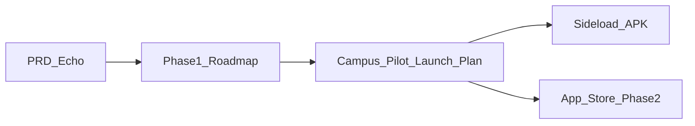

# Echo — 校园试点发布计划

| 字段 | 值 |
|------|-----|
| **产品名称** | Echo |
| **文档版本** | 1.0.0 |
| **状态** | 草稿 |
| **最后更新** | 2026-05-26 |
| **作者** | 产品团队 |
| **读者** | 产品、增长、工程、校园运营 |
| **相关文档** | [PRD](./PRD-Echo.md)、[Phase 1 演示路线图](./Phase1-Demo-Roadmap-Echo.md)、[部署与组件边界](./Deployment-and-Component-Boundaries-Echo.md)、[Onboarding 问卷设计](./Onboarding-Survey-Design-Echo.md)、[术语表](./glossary.md) |

**语言：** 简体中文（镜像）。英文 canonical：[`../docs/Campus-Pilot-Launch-Plan-Echo.md`](../docs/Campus-Pilot-Launch-Plan-Echo.md)。

## 变更记录

| 版本 | 日期 | 作者 | 摘要 |
|------|------|------|------|
| 1.0.0 | 2026-05-26 | 产品团队 | 校园试点 GTM 计划初稿 |

---

## 1. 执行摘要与策略

### 1.1 核心策略

Echo 通过**校内试点**验证最小可行闭环——**创建数字分身（Digital Clone）→ Agent 社交发现 → Human Handoff**——再面向应用商店大规模分发。

**顺序：**

1. 向一所学校通过 **Android APK 侧载** 发布。
2. 线下 + 线上推广 2–3 周，收集定量与定性反馈。
3. 第 7–8 周迭代产品稳定性与留存机制。
4. 扩展至**国内安卓应用商店**，再上架 **App Store**（见 [PRD §4.1](./PRD-Echo.md) Phase 2）。

**与工程文档的分工：**

| 文档 | 范围 |
|------|------|
| [PRD](./PRD-Echo.md) | 产品能力与 FR 范围 |
| [Phase 1 演示路线图](./Phase1-Demo-Roadmap-Echo.md) | 工程里程碑（P1-xx）、演示与 APK 就绪 |
| **本文档** | Go-to-market：校园试点、分发、增长、留存、商店扩展 |

### 1.2 试点成功目标

以下为目标**基线**，种子用户周结束后可调整。

| 指标 | 目标 |
|------|------|
| 日活（DAU） | 试点学校在校人数的 5–10% |
| 次周留存 | > 35% |
| 病毒式 UGC 案例 | 3–5 个高传播 Clone 对话或 Handoff 故事 |
| 分身创建率 | 激活账号中 > 70% 完成 onboarding |
| Handoff 率 | 种子周后定基线；对照 affinity 阈值跟踪 |

### 1.3 受众说明

[PRD 主人群](./PRD-Echo.md) 为都市青年（22–35 岁）。**校园试点刻意面向在校生**，以提升密度与口碑传播。全国化推广时，信息应回归 PRD 人群，同时保留校园特性（`.edu` 认证、校友圈等）。

---

## 2. MVP 就绪清单（第 1–3 周）

在 [Phase 1 路线图 §3.3 校园 APK 门槛](./Phase1-Demo-Roadmap-Echo.md) 满足之前（各适用列 `API` / `Worker` / `Web` / `APK` 为 `done`），**不要**启动大规模侧载——尤其 **P1-15** 签名 **release** APK（`APK` = `done`，非仅 debug CI）。

### 2.1 产品闭环（映射 Echo 能力）

| 用户侧概念 | Echo 能力 | FR / Phase 1 行 |
|------------|-----------|-----------------|
| 创建 AI 智能体 | Onboarding 问卷 + AI 对话 → **Digital Clone** | FR-010–014，P1-03 |
| 智能体社交 / 互聊 | Clone 间 **Agent-to-agent** 会话 | FR-050–054，P1-08 |
| 个人主页 /「AI 名片」 | Clone 资料 + **Activity audit** 日志 | FR-020–024，P1-04a–c；FR-070–072，P1-10 |
| 每日推荐 | **Match list** + 每日匹配任务 | FR-040–044，P1-07 |
| 真人破冰 | **Affinity** 评分 + **Human Handoff** | FR-060–065，P1-09 |
| 动态与分身发帖 | 定时发帖 + 审核 | FR-030–034，P1-05，P1-06 |

### 2.2 技术发布清单

| 项 | 负责方 | 说明 |
|----|--------|------|
| 签名 release APK | 工程 | [`apps/android`](../../apps/android/)；`assembleRelease`（P1-15 `APK` = `done`；当前 CI 仅 debug） |
| Staging API | 工程 | HTTPS 域名；`infra/` 环境模板；密钥不入库 |
| Android 最小权限 | 工程 | 降低侧载摩擦与信任顾虑 |
| 安装引导 | 增长 + 设计 | App 内 + 落地页：「允许安装未知来源应用」（Android） |
| 反馈通道 | 产品 | App 内表单或跳转微信 / 企业微信群 |
| 落地页或公众号 | 增长 | APK 下载、更新日志、隐私政策、用户协议 |
| 埋点事件 | 产品 + 工程 | 见 §2.3 |
| 内容安全 | 工程 | 发布前/后审核（FR-033）；举报（FR-080–082，P1-11） |

### 2.3 埋点事件（最低集）

| 事件 | 用途 |
|------|------|
| `app_activate` | 安装 → 首次打开 |
| `onboarding_complete` | 分身创建完成 |
| `agent_message_sent` | Agent 会话深度 |
| `match_view` / `match_dismiss` | 发现漏斗 |
| `handoff_view` / `handoff_respond` | 真人过渡漏斗 |
| `share_card_generated` | 裂变（实现后） |
| `d1_return` / `d7_return` | 留存 cohort |

---

## 3. 种子用户计划（第 3 周）

### 3.1 队列

| 参数 | 值 |
|------|-----|
| 规模 | 20–50 人 |
| 构成 | 多院系、多年级、性别均衡 |
| 画像 | 尝鲜用户；愿每周约 15 分钟填问卷或短访 |

### 3.2 激励

- 限定版 Clone 装饰或 persona 模板
- 专属 App 内称号（如「创始驯养师」）
- 直接进入产品反馈群（微信）

### 3.3 节奏

- 种子周内 **2–3 次快速 APK 迭代**
- 每周同步：Top bug、Top 需求 → 汇入 §5 迭代 backlog
- 门槛：种子设备上无崩溃会话率达标后，再全校推广

---

## 4. 校园试点启动（第 4–6 周）

### 4.1 预热（3–5 天）

| 手段 | 细节 |
|------|------|
| 悬念海报 | 校园墙、朋友圈、班级群：「你的第二个自我即将上线」「让分身替你去社交」 |
| 种子用户剧透 | Clone ↔ Clone 搞笑对话截图 + 年轻化文案 |
| 预约表单 | 收集手机号；承诺首发专属性格包 |
| 倒计时 | 所有触点露出 App 名与上线日 |

### 4.2 APK 放量（2–3 周）

**线下 — 第一次体验冲击**

| 手段 | 细节 |
|------|------|
| 点位 | 食堂门口、图书馆大厅、教学楼主通道 |
| 时段 | 午、晚高峰 |
| 演示机 | 2–3 台手机：现场创建 Clone；与友人 Clone 实时 Agent 互聊 |
| 周边 | 贴纸、钥匙扣（印 Clone 头像二维码） |
| 现场活动 | 「最美 Clone」票选 → 奶茶 / 餐券 |
| 校园大使 | 每学院 1–2 人；邀请码；按 verified 安装 + 创建 Clone 奖励 |

**线上 — 以 Clone 为增长引擎**

| 手段 | 细节 |
|------|------|
| 分享卡片 | 一键导出聊天高光至朋友圈 / 微博 / 小红书；水印 + 下载 QR |
| 「代我表白」活动 | A 的 Clone 先与 B 的 Clone 聊天；AI 破冰 → 双方注册后推向 Handoff |
| Clone 选美 / 辩论赛 | 主题投票（如「最会安慰人的 Clone」）；胜者奖励；沉淀 UGC |
| 大使内容 | Clone「社交修罗场」短视频 + APK 链接 |

### 4.3 留存驱动

| 机制 | 细节 |
|------|------|
| 7 日 onboarding 任务 | 每日小任务（如 Clone 与 5 人聊天）；解锁装扮 |
| 官方用户群 | 每日精选 Clone 对话；鼓励「晒娃（晒 Clone）」 |
| 周更内容 | 新 persona 模板或社交「剧本」场景 |

---

## 5. 数据复盘与迭代（第 7–8 周）

### 5.1 定量复盘

| 指标 | 低于目标时的动作 |
|------|------------------|
| 新增安装 / 激活 | 调整渠道；大使激励 |
| 分身创建率 | 缩短 onboarding；修复流失步骤 |
| 人均消息数 | 提升匹配质量；加强任务 |
| 分享率 | 优化分享卡片 UX 与默认文案 |
| D1 / D7 留存 | 调 push、任务、周更模板 |
| Handoff 率 | 审视 affinity 阈值与通知文案 |

### 5.2 定性复盘

- 汇总反馈表单、社群聊天、5–10 次用户访谈
- 排下一版优先级：多 Clone 群聊、Clone「朋友圈」、语音等（均超出 MVP，见 PRD §4.2）

### 5.3 稳定性与成本

- 修复启动慢、耗电、闪退（严重则阻塞商店提交）
- 监控 staging LLM token；必要时每日对话配额（见 §8）

### 5.4 上架素材准备

- ≥ 5 张截图，突出 Clone 社交闭环
- ≤ 90 秒演示视频
- 试点用户证言（需 consent）
- 隐私政策与用户协议 URL 可访问

---

## 6. 应用商店扩展（第 9 周起，Phase 2）

按 [PRD §4.2](./PRD-Echo.md)，iOS 与 Play 分发属 **Phase 2**。试点结论用于商店文案与合规。

### 6.1 开发者账号

| 平台 | 商店 / 门户 |
|------|-------------|
| Android（国内） | 华为、小米、OPPO、vivo、腾讯应用宝 |
| iOS | Apple Developer Program → App Store |

### 6.2 上架要求

| 素材 | 要求 |
|------|------|
| 图标 | 符合商店规范 |
| 截图 | ≥ 5 张；突出 Clone 创建、Agent 聊天、Handoff |
| 视频 | ≤ 90 秒产品演示 |
| 法务 | 隐私政策、用户协议、AI/内容免责声明 |
| 审核 | 说明举报流程与审核队列（FR-080–082） |

### 6.3 放量策略

1. **安卓商店先行**（1–2 周）：评分与崩溃稳定后再上 iOS。
2. **争取推荐位**：「社交新品」「AI  companion」等栏目。
3. **短视频放大**：将试点 UGC（神回复 Clone、Handoff 故事）剪辑投 Douyin / Bilibili / 小红书，挂商店链接。
4. **KOC 矩阵**：孵化 10–20 位校园大使为创作者；按安装分佣。
5. **iOS 上线**：安卓指标稳定后。

### 6.4 走出单一校园

- 保留**校园认证**入口；扩展**校友圈**与兴趣圈
- **AI 社团计划**：支持各地学生自发组建 Echo 社团，官方提供活动物料；复制试点 playbook

---

## 7. 时间线总览

| 周 | 阶段 | 关键任务 | 工程门槛 |
|----|------|----------|----------|
| 1–3 | 产品准备与种子招募 | MVP 验收、签名 APK、反馈与埋点、招募 20–50 种子用户 | 路线图 §3.3 本地演示门槛；P1-15 `APK` = `done`（release） |
| 3 | 种子内测 | 2–3 版迭代；种子反馈 | P0 崩溃修复 |
| 4 | 预热 | 海报、预约、种子截图 | — |
| 5–6 | 校园 APK 推广 | 线下 booth、大使、线上活动 | Staging API 负载稳定 |
| 7–8 | 复盘与迭代 | 指标、访谈、稳定性、商店素材 | Release candidate APK |
| 9–10 | 安卓商店首发 | 提交国内主流商店；内容投放 | 商店合规通过 |
| 11+ | iOS 与规模化 | App Store、KOC、多校复制 | Phase 2 iOS 客户端（PRD） |

---

## 8. 风险与应对

| 风险 | 影响 | 应对 |
|------|------|------|
| APK 安装摩擦 | 转化低 | 分步安装引导；可信下载页；大使协助安装 |
| AI 内容合规 | 监管 / 声誉 | 敏感词；用户举报；审核队列（FR-033，FR-080–082）；明确 ToS |
| LLM 算力成本 | 烧钱 | 每日 Clone 对话配额；任务或邀请解锁 |
| 新鲜感衰减 | 留存下降 | 周更 persona 模板；社交剧本；UGC Clone 工坊路线图 |
| 校园 vs PRD 人群差异 | 全国化信息漂移 | 试点 = 在校生；全国 GTM 回归 22–35 都市人群 |
| 上线服务器过载 | 高峰宕机 | Staging 压测；限流；Agent turn 排队 |
| 负面社交事件 | 公关风险 | Handoff 需双方 consent（FR-060–065）；audit 透明（FR-070–072） |

---

## 9. 本文档范围外

- 营销文案与视觉物料（海报、贴纸）
- 新增 FR 或修改 PRD 范围
- Phase 1 工程矩阵 status 更新

平台功能实现状态见 [Phase 1 演示路线图 §3](./Phase1-Demo-Roadmap-Echo.md)。
