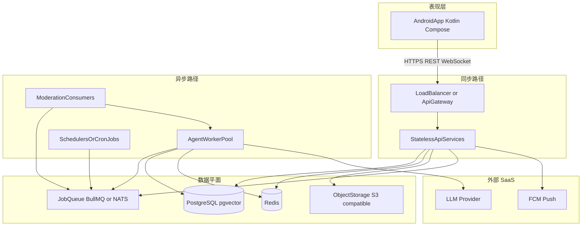

# Echo — 部署拓扑与组件边界

| 字段 | 值 |
|------|-----|
| **产品名称** | Echo |
| **文档版本** | 1.0.0 |
| **状态** | 草案 |
| **最后更新** | 2026-05-28 |
| **相关文档** | [PRD](./PRD-Echo.md)、[软件架构](./Software-Architecture-Echo.md)、[Phase 1 演示路线图](./Phase1-Demo-Roadmap-Echo.md)、[术语表](./glossary.md) |

**语言：** 简体中文（镜像）。英文 canonical：[`../docs/Deployment-and-Component-Boundaries-Echo.md`](../docs/Deployment-and-Component-Boundaries-Echo.md)。

**另见：** [Phase 1 演示路线图](./Phase1-Demo-Roadmap-Echo.md)（功能矩阵、APK 顺序）；Web 范围摘要：[`../echo/docs/PHASE1-SCOPE-MAP.zh-CN.md`](../echo/docs/PHASE1-SCOPE-MAP.zh-CN.md)（English: [`../echo/docs/PHASE1-SCOPE-MAP.md`](../echo/docs/PHASE1-SCOPE-MAP.md)）。

---

## 1. 目的

本文档在 [软件架构](./Software-Architecture-Echo.md) 蓝图之上，回答**部署与模块化**问题：

1. 运行时整体系统如何构成。
2. 哪些部分适合 **Docker**（或容器编排）。
3. 「**直接放在后台**」在工程上常指两类形态：**云托管后台** 与 **非容器的操作系统常驻进程**，各自适用场景。
4. 哪些应对客户端暴露为 **HTTP/WebSocket API**，哪些应通过 **异步 Job 契约** 协作。
5. 哪些宜作为**独立项目或可独立部署单元**，以匹配发布节奏与扩缩需求。

本文**不**规定具体云厂商、Kubernetes 清单或 Terraform。

---

## 2. 系统结构（运行时视角）

Echo Phase 1 为 **Android APK** 对接 **Echo Platform** 后端。架构将**同步请求路径**（用户驱动的 REST/WebSocket）与**异步路径**（定时匹配、社交草稿、分身对话轮次、审核）分开。

**Phase 1 本仓库映射：** BullMQ 队列含 `post-draft`、`moderation`、`match-daily`、`agent-turn`、`report-triage`。Worker 向 Redis 频道 `echo:live` 发布实时事件（`match`、`handoff`、`affinity`、`feed`）；`services/api` 经 `GET /v1/ws` 转发给已认证客户端（见 [`services/api/README.md`](../services/api/README.md)）。Web 演示客户端：[`echo/`](../echo/)。

**与架构章节对应：** C4 容器（软件架构 §4）、应用服务（§6）、API 草图（§10）、部署（§14）。

---

## 3. Docker：适合的场景

| 组件 | 理由 |
|------|------|
| **无状态 API 进程**（User & Auth、Onboarding、Digital Clone、Social Feed、Match & Push、Agent Chat 编排、Affinity、Notification、Activity Audit） | 可水平扩展；通过环境变量配置；无本地磁盘状态。适合容器镜像与滚动发布。 |
| **Agent Worker 池** | CPU 与 LLM 延迟敏感；通常需要与 API **不同的副本数与资源限额**。常见做法为独立镜像或同一镜像以 `worker` 命令运行。 |
| **Moderation 队列消费者** | 与 Worker 同类：按审核积压扩缩。 |
| **本地开发栈** | 软件架构 §14：`dev` 使用 **Docker Compose** 启动 PostgreSQL、Redis、MinIO——笔记本与 CI 环境可重复。 |
| **可选的 CronJob 形态调度器** | 如每日匹配排名（`SocialScheduler`、匹配流水线 §8.4）或批量漂移检测（§11），可做成**仅负责入队**的小型**定时容器**，避免在线执行 LLM 轮次。 |

### 3.1 生产环境通常不宜用自管 Docker 承载的主数据面

| 项目 | 建议 |
|------|------|
| **主 PostgreSQL** | 优先 **托管** RDS 类服务：备份、高可用、补丁。 |
| **主 Redis** | 优先 **托管** 缓存/队列后端以实现高可用与运维减负。 |
| **FCM、LLM 供应商** | 外部 API；配置密钥与出站策略，无需也**不能**将其容器化。 |

**开发/预发**可在 Compose 中运行 Postgres/Redis；**生产**多数团队用托管服务替代自建容器数据库。

---

## 4. 「后台」部署：两种含义

短语 **直接放在后台** 易产生歧义。下面两种含义及 Echo 的映射如下。

### 4.1 云托管后台（生产数据面推荐）

| 组件 | 作用 |
|------|------|
| PostgreSQL + pgvector | 系统事实来源、向量嵌入 |
| Redis | 会话、契合度快照、限流、队列后端 |
| 对象存储（如 Aliyun OSS、开发环境 MinIO） | 头像、可选媒体 |
| FCM | 匹配与 handoff 推送 |

这些以**厂商托管服务**形态运行，而非在生产环境用 Docker 自建主库。

### 4.2 非容器 OS 进程（裸 VM / systemd）

同一套 **API** 与 **Worker** 二进制可在少量 VM 上以 **systemd 单元**常驻——适用于**早期 MVP**、运维人力有限、或暂缓上 Kubernetes 的监管环境。

权衡：弹性扩缩较弱、补丁更偏手工；后续可将相同制品打包进容器平滑演进。

### 4.3 定时与批处理

| 模式 | 适用场景 |
|------|----------|
| **CronJob 容器** 或 **K8s CronJob** | 云原生调度；任务仅入队。 |
| **独立 scheduler 进程** | 小规模部署中与 API 同机长期轮询。 |
| **云 Scheduler → 内部 HTTP** | 厂商定时器调用带鉴权的 `POST /internal/jobs/match-daily` 等。 |

架构中的示例：定时发帖（§8.3）、每日匹配任务（§8.4）、分身漂移批处理（§11）。

---

## 5. 哪些应封装为 API

### 5.1 对外（面向移动端）API

与软件架构 **§10 API Sketch** 对齐（`https://api.echo.example/v1`）。Android 上所有 **Real User** 交互应走 **HTTPS**（以及可选的 **WebSocket** 用于实时契合度/匹配事件）。

| 域 | 示例接口 | PRD 追溯 |
|----|----------|----------|
| Auth | `POST /auth/register`、`/auth/otp`、`/auth/login`、`/auth/refresh` | FR-001–004 |
| Onboarding | `POST /onboarding/survey`、`/onboarding/dialogue/turn`、`/onboarding/finalize` | FR-010–014 |
| Clone | `GET/PUT /clones/me`、pause/resume | FR-020–024 |
| Feed | `GET /feed`、`GET /posts/{id}` | FR-030–034 |
| Matches | `GET /matches`、dismiss、blocks | FR-040–044 |
| Agent chat（只读） | `GET /sessions`、`GET /sessions/{id}/messages` | FR-050–054 |
| Handoff | `GET /handoffs/{id}`、`POST /handoffs/{id}/respond` | FR-060–065 |
| Audit | `GET /audit/events` | FR-070–072 |
| Reports | `POST /reports` | FR-080 |

**原则：** 任何改变用户可见状态或读取 **PII** 的能力，应置于带鉴权的 API 之后，而非通过互联网可无门槛触达的 Worker。

### 5.2 内部同步边界（演进式）

| 阶段 | 做法 |
|------|------|
| **MVP 单体** | §6 中的各服务以包形式存在于同一可部署单元内；**进程内**调用。 |
| **拆分服务** | 当团队或 SLO 分化时，再引入服务间的 **内部 HTTP 或 gRPC**。 |

### 5.3 异步边界（Job 契约）

发帖、评论、点赞、分身轮次与审核为**队列驱动**（软件架构 §4、§8.3–§8.5）。应将消息体视为**带版本号的 Job 契约**，并为每轮分身对话使用架构要求的**幂等键**——而非临时共享内存。

---

## 6. 独立项目与可部署单元

| 单元 | 建议 | 理由 |
|------|------|------|
| **Android 应用** | **独立 Gradle 工程**（独立仓库或 monorepo 模块） | APK 签名、Play 政策（Phase 2）、商店资源，生命周期与服务器不同。 |
| **后端 API + Worker** | **Monorepo** 共享领域 **或** 一次构建产出双镜像（`api`、`worker`） | 共享实体（`User`、`DigitalClone`、`AgentSession`）；部署时**水平扩缩相互独立**。 |
| **Moderation** | MVP **进程内**；合规负载、模型迭代或隔离要求上升后 **独立服务** | 架构已单独展示 `ModerationService` 与队列回写 Worker。 |
| **可观测性栈** | **独立 Helm chart / 运维仓库** | Prometheus、Grafana、OpenTelemetry Collector 与产品代码变更节奏不同（§13）。 |
| **本仓库中的 Web 原型（`echo/`）** | 与生产后端 **不同产品** | PRD §4.2：Phase 1 无 Web 客户端；原型仅供设计与实验。 |
| **Phase 2 iOS** | **新客户端工程**，复用同一公共 API | 软件架构 §15 Option A/B。 |

---

## 7. 总览矩阵

| 组件 | 适合 Docker | 典型生产承载方式 | 对外 API | 独立仓库或可独立部署 |
|------|--------------|-------------------|----------|----------------------|
| Android APK | 否（制品为 APK） | 用户设备 | 消费 API | 是 — 客户端工程 |
| API Gateway / LB | 常见（Ingress 镜像或托管 LB） | 托管 LB 或 K8s Ingress | 终结 TLS | 多为基础设施配置 |
| 无状态 API 服务 | 是 | 容器或 VM systemd | 是 — REST/WS | 可选后续拆分 |
| Agent Worker | 是 | 容器或 VM systemd | 否 — 内部 + 队列 | 同仓库，**独立部署** |
| Moderation 消费者 | 是 | 同 Worker | 否 | 可选未来独立服务 |
| 调度器 / cron | 是（轻量） | CronJob 或托管触发器 | 仅内部 | 小单元或与主进程打包 |
| PostgreSQL | 开发：是；生产：避免自管主库 | 托管 RDS 类 | 否 | N/A（基础设施） |
| Redis | 开发：是；生产：优先托管 | 托管缓存 | 否 | N/A（基础设施） |
| 对象存储 | 开发：Compose 中 MinIO | 托管 OSS/S3 | 经 API 签发预签名 URL | N/A（基础设施） |
| LLM / FCM | 不适用 | SaaS | 平台出站调用 | N/A |
| Web 原型 `echo/` | 本地 Vite 可用容器 | 静态托管或 Studio | 与 MVP 无关 | 是 — 非 Phase 1 客户端 |

---

## 8. 变更记录

| 版本 | 日期 | 摘要 |
|------|------|------|
| 1.0.1 | 2026-05-28 | 补充 `report-triage`、Redis `echo:live`、`/v1/ws` 与 Phase 1 仓库映射 |
| 1.0.0 | 2026-05-20 | 初版：部署拓扑与边界指引 |
