# Echo — 匹配机制改造方案（v1.0：理想型画像 + 双向互匹配）

| 字段 | 值 |
|-------|-------|
| **文档版本** | 1.1.0 |
| **状态** | 提案 |
| **关联文档** | [系统设计](./system_design.md), [入驻问卷重构方案](./Onboarding-Survey-Redesign-Proposal.md), [Agent 行为与机制](./Agent-Behavior-and-Mechanics-Echo.md) |
| **范围** | 替换当前 "embedding 相似性单边匹配"，升级为 "理想型画像 + 双向互匹配" 架构 |

---

## 一、问题诊断：为什么"找相似的人"在交友场景里是错的

### 1.1 当前匹配机制的运作方式

```
Onboarding Finalize
   → buildTextForEmbedding(profile)        # 构造"我是什么样的人"的文本
   → DeepSeek embed → 1536 维向量
   → INSERT INTO profile_embeddings

Daily Match Job (match-bridge.ts:runDailyMatchJob)
   → pgvector cosine similarity (self embedding vs all other embeddings)
   → 性别/年龄/城市/拉黑过滤
   → 同城 +0.05 / 同兴趣 +0.05 / 同关系目标 +0.10
   → 每人 ≤ 3 个 MatchPush
```

一句话总结：**把你的自画像 embedding 和其他所有人的自画像 embedding 做余弦相似度，取最像的。**

### 1.2 结构性缺陷

| 场景 | 匹配结果 | 实际后果 |
|------|---------|---------|
| 两个高神经质 (N=0.9) | embedding 高度相似 → 高分匹配 | 两个都敏感、焦虑，在一起情绪共振放大，互相耗尽 |
| 两个高回避依恋 (avoidance=0.8) | embedding 高度相似 → 高分匹配 | 都不主动、都回避亲密，聊天冷得像两个 AI 互相 say hi 后就没下文 |
| 两个超高尽责 (C=0.9) | embedding 高度相似 → 高分匹配 | 都追求规划和控制，为"周末几点出门"这类小事产生隐性权力斗争 |
| 两个超高外向 (E=0.9) | embedding 高度相似 → 高分匹配 | 表面合拍，但可能为"谁做社交中心"产生竞争感 |

**本质问题**：`buildTextForEmbedding` 描述的是"我是什么样的人"，而 pgvector 余弦相似度找的是"和我在 embedding 空间距离最近的人"。这在交友场景下假设了 **"和自己像的人 = 合适的伴侣"**——这个假设在关系心理学里是站不住脚的。

### 1.3 心理学证据

- **Markey & Markey (2007)**：性格相似性只在宜人性 (Agreeableness) 维度上稳定预测关系满意度；在其他维度上，互补比相似更重要。
- **Luo & Klohnen (2005)**：新婚夫妇的依恋风格互补性（安全型 × 焦虑型）比人格相似性更能预测一年后的婚姻满意度。
- **Eastwick & Finkel (2008)**：speed-dating 实验中，参与者纸上写的"理想伴侣特质"和实际约会对象的选择之间，相关性接近 **r ≈ 0**。人们对理想型的 **自述偏好 (stated preference)** 和 **实际行为选择 (revealed preference)** 严重脱节。

**结论**：匹配系统如果只靠"自画像相似度"做排序，是在系统性制造"看起来像却处不来"的匹配。

---

## 二、方案总览：理想型画像 + 双向互匹配

### 2.1 核心思路

```


```mermaid
graph TD
    A[Phase 0: 注册身份 12 字段] --> B[Phase 1: 15 张自画像情境卡]
    B --> C[Phase 1.5: 人格画像合成 Persona Sketch]
    C --> D["Phase 1.6a: 3 张理想型探针卡"]
    D --> E["Phase 1.6b: 理想型画像展示页 &#9733;"]
    E --> F[Phase 2: 四角色对话 Roleplay]
    F --> G[Finalize → self_embedding + ideal_embedding]
    G --> H[Daily Match: 双向互匹配]
```

这个架构的关键变化：Phase 1.5 让用户看到"我是谁"（自画像），Phase 1.6 让用户看到"我适合谁"（理想型画像）。两个 Sketch 都可以接受用户反馈和微调。具体设计见 §3.7。

核心数据流：

```
Onboarding Phase 1 (15 张自画像卡 + 3 张理想型探针)
   ├── embed_self  ← buildTextForEmbedding(profile)       # 不变：刻画"我是谁"
   └── embed_ideal ← buildTextForIdealEmbedding(survey)   # 新增：刻画"我需要什么样的伴侣"

Matching (双向互匹配)
   A.score = cosine(embed_self_A, embed_ideal_B)  # A 是否符合 B 的期待
   B.score = cosine(embed_self_B, embed_ideal_A)  # B 是否符合 A 的期待

   阈值淘汰：if min(A.score, B.score) < 0.3 → 不匹配
   适配性评分 = sqrt(A.score × B.score)           # 几何平均
```

### 2.2 为什么这样设计

| 设计决策 | 理由 |
|---------|------|
| **双向互匹配（非性别定向）** | 不依赖"男匹配女"的性别假设；无论性别组合，始终互相评估适配性 |
| **几何平均而非算术平均** | 一方极高一方极低（A.score=0.9, B.score=0.1）时，算术均值=0.5 仍看起来"还行"，几何均值=0.3 直接暴露不对称性——这正是我们想要的惩罚 |
| **阈值 0.3（cosine）** | cosine < 0.3 意味着"对方理想型和你的真实样子差异太大"，约等于"彼此不是对方的菜"。0.3 是"不排斥"的底线 |
| **理想型画像用间接问题采集** | 直接问"你喜欢什么样的人"得到的是社交期望，不是真实偏好。间接场景投射能绕过陈述偏好与行为偏好的脱节 |

### 2.3 与原机制的融合

```
原流程                                新流程
─────────────────────────────────    ─────────────────────────────────
pgvector cosine(self, self)          pgvector cosine(self_A, ideal_B)
       ↓                                    ↓
规则加分 (同城/兴趣/关系目标)        pgvector cosine(self_B, ideal_A)
       ↓                                    ↓
排序 → MatchPush                     阈值过滤 (min ≥ 0.3)
                                            ↓
                                     几何平均 → 适配性评分
                                            ↓
                                     规则加分 (同城/兴趣/关系目标)
                                            ↓
                                     排序 → MatchPush
```

原流程的拉黑双向排除、活跃 session 数量限制、autoMatchEnabled 检查等全部保持不变，仅替换评分逻辑。

---

## 三、三张理想型探针卡：完整设计

### 3.1 设计原则

这三张卡与现有的 15 张情境卡共享相同的 UX 形态（全屏场景 + 3-4 选项 + 可选自由文本），但在测量目标上有本质区别：

- **现有 15 张卡**：测量"你是谁"（Big Five、MFT、依恋、归因等）
- **新增 3 张卡**：测量"你需要什么样的伴侣"（依恋需求、亲密节奏、冲突风格）

为了避免 stated preference vs revealed preference 的脱节，三张卡全部使用 **投射式场景**——不直接问理想伴侣特征，而是通过行为选择间接暴露真实需求。

### 3.2 Card 16: 意外早餐（依恋需求——被爱的舒适度）

> **心理学来源**：ECR-R 依恋理论（Bowlby, 1969; Fraley et al., 2011）— 被爱时的舒适度是依恋类型的直接行为指标。安全型依恋的人能自然地接受和回馈亲密行为；焦虑型的人对被爱感到"亏欠"或"需要回报"；回避型的人对被爱感到"被侵入"。

| 字段 | 值 |
|------|-----|
| **cardId** | `unexpected_breakfast` |
| **场景** | "你的伴侣在你没要求的情况下，早起做了你最爱吃的早餐，摆盘很用心。你的第一反应是——" |
| **allowCustomText** | true |
| **customTextMaxLength** | 20 |
| **requiredFreeText** | false |
| **sources** | ECR-R (Fraley et al., 2011), Bowlby Attachment Theory |
| **measuredDimensions** | `needEmotionalSafety`, `needSpaceRespect` |

| 选项 | 文本 | dimensionContributions | 心理含义 |
|------|------|----------------------|---------|
| A | "太感动了，以后我也要对TA这么好" | needEmotionalSafety: -0.3, needSpaceRespect: -0.3 | 安全型：接受亲密无负担 |
| B | "有点不好意思，TA是不是期待什么回报" | needEmotionalSafety: 0.7, needSpaceRespect: -0.4 | 焦虑型：被爱时感到亏欠，需要反复确认无附加条件 |
| C | "挺暖的，但我更喜欢各自管各自的早饭" | needEmotionalSafety: -0.3, needSpaceRespect: 0.7 | 回避型：亲密行为被体验为"失去自主权" |
| D | "拍照发朋友圈，炫耀我有这个待遇" | needEmotionalSafety: 0.4, needSpaceRespect: -0.2 | 焦虑 + 社群炫耀：需要外部的社交确认 |

### 3.3 Card 17: 沉默的夜晚（亲密节奏偏好）

> **心理学来源**：Gottman 冲突理论 + ECR-R 依恋焦虑维度。在亲密的沉默中，不同依恋类型的人体验到截然不同的情绪：安全型体验"连接中的安宁"；焦虑型体验"沉默 = 拒绝"；回避型体验"终于不用社交了"。这张卡测量的是**亲密关系中需要多高密度的语言互动**。

| 字段 | 值 |
|------|-----|
| **cardId** | `silent_night` |
| **场景** | "你和伴侣坐在沙发上，已经 20 分钟没人说话了。你的感觉是——" |
| **allowCustomText** | true |
| **customTextMaxLength** | 20 |
| **requiredFreeText** | false |
| **sources** | ECR-R (Fraley et al., 2011), Gottman Repair Attempts Theory |
| **measuredDimensions** | `needEmotionalSafety`, `needDirectCommunication`, `needSpaceRespect` |

| 选项 | 文本 | dimensionContributions | 心理含义 |
|------|------|----------------------|---------|
| A | "很舒服，不需要说话也知道对方在" | needEmotionalSafety: -0.5, needSpaceRespect: -0.2, needDirectCommunication: -0.3 | 安全型：沉默 = 连接 |
| B | "TA是不是生我气了？" | needEmotionalSafety: 0.8, needDirectCommunication: 0.5, needSpaceRespect: 0.0 | 焦虑型：沉默 = 拒绝信号，需要对方主动澄清 |
| C | "终于能安静刷手机了" | needEmotionalSafety: -0.3, needDirectCommunication: -0.5, needSpaceRespect: 0.8 | 回避型：沉默 = 终于解脱 |
| D | "找个话题打破沉默" | needEmotionalSafety: 0.3, needDirectCommunication: 0.4, needSpaceRespect: -0.3 | 中等焦虑 + 社交主动：不安全感驱动互动 |

### 3.4 Card 18: 选歌（冲突处理风格）

> **心理学来源**：Gottman 婚姻关系四骑士理论（批评/蔑视/防御/冷战）+ Thomas-Kilmann 冲突模式模型。在一段 3 小时的车程里，一方放了一首对方讨厌的歌——这个场景同时激活了"审美冲突"和"空间共享压力"，是观察冲突处理风格的微型实验室。

| 字段 | 值 |
|------|-----|
| **cardId** | `song_choice` |
| **场景** | "你们一起开车 3 小时，车载音乐由你们各选一首轮流放。TA 第四首放了一首你极其讨厌的歌。你会——" |
| **allowCustomText** | true |
| **customTextMaxLength** | 20 |
| **requiredFreeText** | false |
| **sources** | Gottman Four Horsemen, Thomas-Kilmann Conflict Mode Instrument |
| **measuredDimensions** | `needDirectCommunication`, `needConflictResolution` |

| 选项 | 文本 | dimensionContributions | 心理含义 |
|------|------|----------------------|---------|
| A | "切掉，说'这首我真的不行'" | needDirectCommunication: 0.7, needConflictResolution: 0.8 | 直接对抗型：需要对方能接住"我对你有意见"的直球 |
| B | "忍到结束，但后面全程不爽" | needDirectCommunication: -0.5, needConflictResolution: -0.8 | 被动攻击型：需要对方自己猜出"你在生气了" |
| C | "笑说'这歌我要举报了'，半开玩笑换掉" | needDirectCommunication: 0.4, needConflictResolution: -0.2 | 幽默化解型：需要对方懂玩笑背后的真话 |
| D | "默默戴上耳机" | needDirectCommunication: -0.7, needConflictResolution: -0.6 | 撤退型：需要对方主动察觉并修复裂痕 |

### 3.5 理想型维度总览

三张新卡共同刻画四个理想型维度：

| 维度 key | 全称 | 含义 | 测量卡片 |
|---------|------|------|---------|
| `needEmotionalSafety` | 情感安全需求 | 需要在多大程度上被伴侣反复确认"我是安全的、不会抛弃你的"（-1=不需要，+1=极其需要） | 16, 17 |
| `needSpaceRespect` | 空间尊重需求 | 需要在多大程度上被伴侣尊重独处和个人空间（-1=不需要，+1=极其需要） | 16, 17 |
| `needDirectCommunication` | 直接沟通偏好 | 希望伴侣用多直接的方式表达意见和情绪（-1=间接暗示，+1=打直球） | 17, 18 |
| `needConflictResolution` | 冲突解决期待 | 在冲突中希望对方采取什么方式（-1=回避/自己消化，+1=当场解决） | 18 |

这四个维度**不是用户的自述人格，而是用户需要对方具备的关系能力**。例如 `needEmotionalSafety=0.8` 不是说"我是一个焦虑的人"，而是"我需要一个能给我安全感的人"——这个信号在匹配时应该去和对方的 `neuroticism`、`conscientiousness`、`agreeableness` 等自画像维度做 cross-reference。

### 3.6 与现有 15 张卡的关系

现有的依恋相关卡片（Card 14 深夜电话、Card 5 周六电量等）已经有 `attachAvoidance` 和 `attachAnxiety` 的信号。三张新卡不重复测量这些——它们测量的是**依恋风格的行为后果**："因为你是一个安全/焦虑/回避型的人，所以你需要伴侣具备什么样的能力？"

这使得理想型画像不是从"你说你想要什么"构建的，而是从"你的行为暴露了什么需求"推导的。

### 3.7 Phase 1.6：理想型画像展示页（Ideal Partner Sketch）⭐

> **这是 v1.1 新增的关键模块。** v1.0 方案存在一个重大 UX 缺口：用户回答完 3 张理想型探针卡后，没有任何页面告诉他们"系统根据你的回答，判断你大概适合什么样的人"。这与 Phase 1.5 的 Persona Sketch 完全对称——用户既需要看到"我是谁"，也需要看到"我适合谁"。

#### 3.7.1 设计目标

| 目标 | 说明 |
|------|------|
| **闭环反馈** | 用户做完了探针卡，系统应该立刻给一个可读的、具体的反馈——"根据你的回答，你大概需要一个 XXX 类型的伴侣" |
| **纠正机会** | 系统判断可能不准（3 张卡的天生局限）。用户应该能直接修正——不是回退重做卡片，而是在展示页上调整 |
| **信任建立** | 如果系统在匹配前展示了"它对用户需求的理解"，用户会更信任后续的匹配结果——即使匹配不上，至少知道"系统理解我是错的"而不是"系统根本没在理解我" |
| **与 Persona Sketch 对称** | Phase 1.5 展示"我是谁"，Phase 1.6 展示"我适合谁"。两个 Sketch 使用相同的 UX 范式（LLM 合成 → 卡片展示 → 用户微调） |

#### 3.7.2 UX 形态

```
┌──────────────────────────────────────────┐
│  ← 你适合什么样的人？                    │
│                                          │
│  ┌──────────────────────────────────────┐│
│  │                                      ││
│  │   根据你在早餐、沉默、选歌里的选择，  ││
│  │   你的理想伴侣大概长这样：            ││
│  │                                      ││
│  └──────────────────────────────────────┘│
│                                          │
│  ┌─── 关系风格 ─────────────────────────┐│
│  │                                     ││
│  │  你需要一个...                       ││
│  │  "能在亲密和独立之间顺畅切换的人。   ││
│  │   你被爱时不觉得亏欠，沉默时不觉得   ││
│  │   焦虑，冲突时可以直接表达——所以     ││
│  │   你最适合一个情绪稳定、不冷暴力、   ││
│  │   能接住直球的人。"                  ││
│  │                                     ││
│  └─────────────────────────────────────┘│
│                                          │
│  ┌─── 对方大概是这样的人 ───────────────┐│
│  │  情绪稳定性  ████████░░  高          ││
│  │  沟通直接度  ████████░░  高          ││
│  │  独立性      ██████░░░░  中等        ││
│  │  照顾欲      ████░░░░░░  中等偏低    ││
│  └─────────────────────────────────────┘│
│                                          │
│  ┌─── 这个描述准确吗？ ──────────────────┐│
│  │  "其实我需要的人比这个更..."          ││
│  │  [自由输入，限 100 字]                ││
│  │                                     ││
│  │  ☐ 我不确定，以后再调                ││
│  └─────────────────────────────────────┘│
│                                          │
│  [ 看起来挺对的 → ]                      │
└──────────────────────────────────────────┘
```

#### 3.7.3 LLM 合成器设计

与 Phase 1.5 Persona Sketch 对称，新增一个 LLM 合成器将理想型维度分数翻译成自然语言：

```
输入（结构化分数）：
  needEmotionalSafety: 0.7       // → 需要安全感
  needSpaceRespect: -0.3         // → 不需要太多独立空间
  needDirectCommunication: 0.8   // → 偏好直来直去
  needConflictResolution: 0.6    // → 希望当面解决

  attachmentStyle: preoccupied
  trustView: "我没有办法信任一个从不主动暴露脆弱的人"
  happinessView: "幸福不是每天都开心，是半夜醒了发现有人在旁边"
  relationshipIntent: "寻找长期关系"

输出（LLM 合成，200-400 字自然语言）：
  "根据你的回答，你适合一个'可预期的稳定型'伴侣。你需要对方
   说话算话、不忽冷忽热——被照顾时你容易觉得亏欠，所以你的伴侣
   需要让你相信'对你好只是因为想对你好'，没有附加条件。
   
   冲突时你更希望当场解决而不是各自冷着，所以对方最好是一个
   能接住直球的人——你说'我不喜欢这个'，TA 不会防御也不会逃避。
   
   你们的信任建立在'互相暴露脆弱'之上——你不信一个从不示弱
   的人，所以你需要的伴侣能在你面前卸下盔甲。"
```

#### 3.7.4 IdealPartnerSketch 数据结构

```typescript
// survey-schema.ts 新增

export interface IdealPartnerSketch {
  /** LLM 合成的自然语言描述（200-400 字） */
  narrative: string;

  /** 维度雷达图数据（供前端可视化） */
  dimensions: {
    emotionalSafety: number;    // -1 ~ +1
    spaceRespect: number;       // -1 ~ +1
    directCommunication: number; // -1 ~ +1
    conflictResolution: number;  // -1 ~ +1
  };

  /** 用户反馈（可选纠正） */
  userFeedback?: string;

  /** 生成时间戳 */
  generatedAt: string;
}
```

#### 3.7.5 用户反馈的影响

用户在"Ideal Partner Sketch"页面的反馈有两种用途：

| 反馈类型 | 处理方式 |
|---------|---------|
| **自由文本微调**（"其实我需要的人比这个更..."） | 作为前缀追加到 `buildTextForIdealEmbedding` 的输入文本中，让 embedding 捕获用户自我纠正的信号 |
| **"我不确定，以后再调"** | 标记 `idealPartnerSketch.userFeedback = 'deferred'`，后续在 Profile 页提供重新访问的入口 |

反馈不是替代原始得分，而是**叠加**——原始维度分数 + 用户纠正文本共同构成 embedding 的输入。这样可以兼顾"投射信号比自述偏好更真实"和"用户有权利说系统理解错了"。

#### 3.7.6 与主流程的集成

```
Phase 1: 15 张自画像卡 + 3 张理想型探针卡
    ↓
Phase 1.5: Persona Sketch（看到"我是谁" → 微调 → 确认）
    ↓
Phase 1.6: Ideal Partner Sketch（看到"我适合谁" → 微调 → 确认）⭐ 新增
    ↓
Phase 2: 四角色对话
    ↓
Finalize: 两个 embedding 并行生成
```

完成度校验更新：
- `phase1complete`: 15 张卡 ≥ 8 张 + idealPartnerDimensions 已计算
- `idealSketchConfirmed`: idealPartnerSketch 已生成（narrative 非空），且用户未标记 "deferred"

---

## 四、理想型画像 Embedding 的构建

### 4.1 新增函数：`buildTextForIdealEmbedding`

```typescript
// survey-schema.ts 新增

export function buildTextForIdealEmbedding(
  profile: ProfileForEmbedding | null,
  survey: OnboardingSurveyJson,
  userId: string,
): string {
  const parts: string[] = [];

  // 1. 依恋行为衍生（来自现有 15 张卡的 attachAvoidance / attachAnxiety）
  if (survey.dimensionScores?.attachmentStyle) {
    const style = survey.dimensionScores.attachmentStyle; // 'secure' | 'preoccupied' | 'dismissing' | 'fearful'
    const styleMap: Record<string, string> = {
      secure:      '需要伴侣能在亲密和独立之间自然切换，不粘人也不冷漠',
      preoccupied: '需要伴侣能提供稳定的情感确认，不忽冷忽热，说话算话',
      dismissing:  '需要伴侣尊重个人边界，不情绪绑架，给足空间',
      fearful:     '需要伴侣极其耐心，能接受忽近忽远的节奏，不因为被推开就放弃',
    };
    parts.push(`依恋需求:${styleMap[style] ?? style}`);
  }

  // 2. 理想型维度分数（来自新卡 16/17/18）
  const idealDims = survey.idealPartnerDimensions;
  if (idealDims) {
    const descs: string[] = [];
    if (idealDims.needEmotionalSafety > 0.3) {
      descs.push('高情感安全感需求：需要对方稳定、可靠、能提供情绪锚点');
    } else if (idealDims.needEmotionalSafety < -0.3) {
      descs.push('低情感依赖：不需要对方频繁确认关系状态');
    }
    if (idealDims.needSpaceRespect > 0.3) {
      descs.push('高独立空间需求：需要对方尊重独处时间，不轻易闯入');
    } else if (idealDims.needSpaceRespect < -0.3) {
      descs.push('偏好紧密连接：希望对方愿意分享大部分时间');
    }
    if (idealDims.needDirectCommunication > 0.3) {
      descs.push('偏好直接表达：不喜欢猜，需要对方有话直说');
    } else if (idealDims.needDirectCommunication < -0.3) {
      descs.push('偏好柔和表达：希望对方用委婉的方式提意见');
    }
    if (idealDims.needConflictResolution > 0.3) {
      descs.push('当面解决冲突：不喜欢冷战，需要对方能接住直球');
    } else if (idealDims.needConflictResolution < -0.3) {
      descs.push('各自消化冲突：冲突时希望对方给缓冲空间');
    }
    if (descs.length) parts.push(`伴侣期待:${descs.join('；')}`);
  }

  // 3. 价值观对齐信号（冲突时什么最重要）
  if (survey.trustView?.trim()) {
    parts.push(`关系中对伴侣的重要期待:信任观=${survey.trustView.trim().slice(0, 60)}`);
  }
  if (survey.happinessView?.trim()) {
    parts.push(`幸福观=${survey.happinessView.trim().slice(0, 60)}`);
  }

  // 4. 关系目标（已有字段，但放进理想型 embedding 可以提供额外信号）
  const relationshipIntent =
    survey.goal?.trim() ||
    (typeof profile?.bioJson === 'object' && profile?.bioJson !== null
      ? (profile.bioJson as Record<string, unknown>)?.datingGoal as string
      : undefined);
  if (relationshipIntent) {
    parts.push(`关系目标:${relationshipIntent}`);
  }

  return parts.length > 0 ? parts.join(' | ') : `理想型画像缺省_${userId}`;
}
```

### 4.2 理想型维度评分器（配合 dimension-scorer.ts）

在 `dimension-scorer.ts` 中新增 `calculateIdealPartnerDimensions` 函数，逻辑与现有的 `calculateDimensionScores` 一致（加权均值 + 钳位 + 一致性检查），但只处理 `unexpected_breakfast`、`silent_night`、`song_choice` 三张卡。

### 4.3 存储方案：`profile_embeddings` 表新增列

```sql
ALTER TABLE profile_embeddings
ADD COLUMN ideal_embedding vector(1536);

-- 与 self embedding 共享同一个 HNSW 索引类型
-- ideal_embedding 不建索引：匹配时用 <-> 逐对计算，不扫全表
```

**设计理由**：理想型向量不建索引。匹配时是用 A 的 self embedding 扫全表（已有 HNSW 索引）获取 top-K 候选，然后对候选做 A.ideal ↔ B.self 的反向校验。永远不需要"扫描所有理想型找最接近某个 self 的人"。

理想型 embedding 不建索引还有语义原因：理想型向量代表的是"需求"，不是"物品描述"，全表扫描理想型向量来做推荐在语义上不如用 self 向量扫全表合理。

---

## 五、匹配算法改造

### 5.1 改造后的 `runDailyMatchJob` 伪代码

```
for each active user A:
    // 1. 用 A 的 self_embedding 检索 top-K 候选（与现在相同）
    candidates = pgvector.search(self_embedding_A, topK=20)
              .filter(性别/年龄/城市/拉黑)
    
    // 2. 加载所有候选的理想型 embedding（批量查询）
    ideal_embeddings = batchLoad(candidates.map(c => c.user_id))
    
    // 3. 双向互匹配评分
    for each candidate B:
        scoreAtoB = cosine(self_embedding_A, ideal_embedding_B)    // A 是否符合 B 的期待
        scoreBtoA = cosine(self_embedding_B, ideal_embedding_A)    // B 是否符合 A 的期待
        
        if min(scoreAtoB, scoreBtoA) < 0.3:
            continue  // 淘汰
        
        compatibility = sqrt(scoreAtoB × scoreBtoA)
        candidates_scored.push({ userId: B, compatibility })
    
    // 4. 规则加分（与现在相同）
    for each candidate:
        if 同城: compatibility += 0.05
        if 同兴趣: compatibility += 0.05
        if 同关系目标: compatibility += 0.10
    
    // 5. 排序 → top-3 MatchPush
    sort descending → top 3 → create MatchPush
```

### 5.2 改造后的 `rankCandidatesByRules` 签名变更

原函数从 `VectorCandidate[]` 取 `similarity` 字段做 base score。改造后改为接收双向评分结果：

```typescript
export type BidirectionalCandidate = {
  user_id: string;
  scoreAtoB: number;
  scoreBtoA: number;
  compatibility: number;  // sqrt(scoreAtoB × scoreBtoA)
};

export function rankCandidatesByRules(
  seeker: SeekerProfile,
  candidates: BidirectionalCandidate[],
  candidateProfiles: CandidateProfile[],
  prefs: MatchPrefs,
  topN: number = FINAL_TOP_N,
): RankedCandidate[] {
  // 用 compatibility 替代原来的 similarity 作为 base score
  // 规则加分逻辑保持不变
}
```

### 5.3 关于"冷启动"：新用户还没有理想型 embedding 怎么办？

新用户完成 Phase 1 后，理想型维度分数已经计算完毕，所以 `buildTextForIdealEmbedding` 可以正常运行并生成 embedding。不存在冷启动空值问题。

如果遇到极端情况（用户跳过了 16/17/18 三张卡），`idealPartnerDimensions` 为空，`buildTextForIdealEmbedding` 降级为仅使用依恋风格 + 价值观 + 关系目标构造理想型 embedding。虽然精度下降，但不会阻断匹配流程。

### 5.4 阈值 0.3 的调优策略

上线后观察以下指标，决定是否调整阈值：

| 观察指标 | 阈值太低（如 0.1）的信号 | 阈值太高（如 0.5）的信号 |
|---------|----------------------|----------------------|
| 每日人均 MatchPush 数 | 接近 3（上限），说明几乎没人被淘汰 | 远低于 1，说明大量用户无匹配 |
| MatchPush → session 转化率 | 转化率低，说明"匹配但不合适" | 样本太小无法判断 |
| session 首日对话轮次 | 平均 < 3 轮，匹配质量差 | N/A |

建议初始上线时设阈值 **0.3**，收集一周数据后做 A/B 对比（0.25 / 0.30 / 0.35 三组）。

---

## 六、需要改动的文件清单

### 6.1 后端（services/api）

| 文件 | 改动 |
|------|------|
| `src/onboarding/scenario-cards.ts` | 新增 `CARD_UNEXPECTED_BREAKFAST`、`CARD_SILENT_NIGHT`、`CARD_SONG_CHOICE` 三张卡片定义；同步更新 `ALL_SCENARIO_CARDS`、`DIMENSION_COVERAGE`、`P0_CARD_IDS`（可选） |
| `src/onboarding/dimension-scorer.ts` | 新增 `calculateIdealPartnerDimensions()`、`IdealPartnerDimensions` 类型 |
| `src/onboarding/survey-schema.ts` | 新增 `buildTextForIdealEmbedding()`；新增 `IdealPartnerSketch` 类型；在 `OnboardingSurveyJson` 中新增 `idealPartnerDimensions`、`idealPartnerSketch` 字段 |
| `src/onboarding/onboarding.service.ts` | 新增 `generateIdealPartnerSketch()` 方法（LLM 合成理想型画像自然语言描述）；在 `submitPhase1()` 中调用 `calculateIdealPartnerDimensions()`；在 `finalize()` 中调用 `buildTextForIdealEmbedding()` + `llm.embed()` 写入 `profile_embeddings.ideal_embedding` |
| `src/onboarding/onboarding.dto.ts` | 新增 `IdealPartnerSketchDto`、`IdealPartnerAdjustDto`（用户微调反馈） |

### 6.2 后端（services/worker）

| 文件 | 改动 |
|------|------|
| `src/clone-runtime/match-bridge.ts` | 新增 `BidirectionalCandidate` 类型；改造 `runDailyMatchJob()` 增加双向互匹配逻辑；改造 `rankCandidatesByRules()` 使用 `compatibility` 作为 base score；新增 `IDEAL_MATCH_THRESHOLD = 0.3` 常量 |

### 6.3 数据库

| 操作 | SQL |
|------|-----|
| 新增列 | `ALTER TABLE profile_embeddings ADD COLUMN ideal_embedding vector(1536);` |
| 回填历史数据 | 对已有用户的 Phase 1 答案重新运行 `calculateIdealPartnerDimensions()` + `buildTextForIdealEmbedding()` + embed 写入（若 16/17/18 无答案则用降级策略） |

### 6.4 前端（Echo）

| 文件 | 改动 |
|------|------|
| `src/features/onboarding/surveySteps.tsx` | 在 15 张情境卡之后、Persona Sketch 之前，插入 3 张理想型探针卡（复用现有卡片组件） |
| `src/features/onboarding/surveySteps.tsx` | **新增** IdealPartnerSketch 展示页（类似 Persona Sketch 的卡片式展示 + 维度雷达图 + 自由文本微调入口） |
| `src/features/onboarding/Onboarding.tsx` | 进度显示更新为 "X/18"；新增 `idealSketchConfirmed` 完成度状态 |
| `src/features/onboarding/types.ts` | 新增 `IdealPartnerSketch` 类型定义（与后端对齐） |

### 6.5 文档

| 操作 | 文件 |
|------|------|
| 新增 | `docs_CN/Matching-Algorithm-Redesign-Echo.md`（本文档） |
| 镜像 | `docs/Matching-Algorithm-Redesign-Echo.md` |
| 更新 | `docs_CN/Onboarding-Survey-Redesign-Proposal.md` — §五 Phase 1 卡片总数从 15 更新为 18，追加新卡定义 |
| 更新 | `docs_CN/Onboarding-Survey-Design-Echo.md` — 流程描述中反映新卡片的插入位置 |
| 更新 | `docs/system_design.md` — 匹配章节更新为双向互匹配算法描述 |

---

## 七、实现路线图

### Phase 1: 后端核心（预计 3-4 天）

| 步骤 | 内容 |
|------|------|
| 1.1 | `scenario-cards.ts` 新增三张卡片定义 + 单元测试验证维度贡献值 |
| 1.2 | `dimension-scorer.ts` 新增 `calculateIdealPartnerDimensions()` + 单测 |
| 1.3 | `survey-schema.ts` 新增 `buildTextForIdealEmbedding()` + `IdealPartnerSketch` 类型 + `idealPartnerDimensions`/`idealPartnerSketch` 字段 |
| 1.4 | `onboarding.service.ts` 新增 `generateIdealPartnerSketch()` LLM 合成方法；在 `submitPhase1()` 和 `finalize()` 中串联理想型 embedding 生成 |
| 1.5 | `onboarding.dto.ts` 新增 `IdealPartnerSketchDto`、`IdealPartnerAdjustDto` |
| 1.6 | 数据库迁移：`profile_embeddings` 新增 `ideal_embedding` 列 |
| 1.7 | 历史数据回填脚本 |

### Phase 2: Worker 匹配改造（预计 1-2 天）

| 步骤 | 内容 |
|------|------|
| 2.1 | `match-bridge.ts` 新增双向互匹配逻辑 + `BidirectionalCandidate` 类型 |
| 2.2 | `rankCandidatesByRules` 签名变更，使用 `compatibility` 作为 base score |
| 2.3 | 集成测试：构造 10 个测试用户，跑 `force=true` 的 daily match job，验证双向互匹配输出 |

### Phase 3: 前端适配（预计 1-2 天）

| 步骤 | 内容 |
|------|------|
| 3.1 | `surveySteps.tsx` 插入 3 张新卡 + IdealPartnerSketch 展示页 |
| 3.2 | 维度雷达图组件（复用 Persona Sketch 的雷达图，绑定 idealPartnerSketch.dimensions） |
| 3.3 | 用户微调入口（自由文本 + "以后再调"选项） |
| 3.4 | 进度更新 + 完成度校验 |
| 3.5 | 端到端测试：新用户走完整入驻流程 → 验证 self_embedding 和 ideal_embedding 双双写入 |

### Phase 4: 文档 & 上线观察（预计 1 天）

| 步骤 | 内容 |
|------|------|
| 4.1 | `docs_CN/` 和 `docs/` 同步更新 |
| 4.2 | 部署 staging 环境，用 10-20 个测试用户验证匹配质量 |
| 4.3 | 上线后监控 §5.4 的三项指标，一周后决定阈值调整 |

---

## 八、潜在风险与缓解措施

| 风险 | 概率 | 影响 | 缓解措施 |
|------|------|------|---------|
| 理想型 embedding 质量不足（3 张卡 + 依恋衍生信号是否够） | 中 | 匹配精度不升反降 | 上线后对比新旧匹配的重叠率；如果新旧 top-3 重叠率 > 80%，说明信号不够差异化，需要加卡 |
| 阈值 0.3 导致匹配数过少 | 中 | 用户无匹配，体验差 | 上线首周观察日均 MatchPush 数，若人均 < 1 则降至 0.2 |
| 几何平均过度惩罚不对称对 | 低 | 错过一些"一方极其满意另一方中等满意"但实际可行的匹配 | 观察被几何平均淘汰的高分单向对（A→B=0.8, B→A=0.25），抽样人工评估是否误杀 |
| 新用户卡数从 15 增加到 18，入驻时间 +3-5 分钟（含 IdealPartnerSketch 展示页） | 高 | 入驻完成率下降 | 将 16/17/18 设为"推荐"而非"必填"；IdealPartnerSketch 页加跳过按钮；在卡片进度中显示"这 3 张卡影响匹配质量"激励完成 |
| 历史用户没有理想型 embedding | 高 | 老用户无法参与双向互匹配 | Phase 1 回填脚本用降级策略；老用户下次打开 App 时引导补充 3 张新卡 |
| IdealPartnerSketch LLM 合成质量差 | 中 | 用户看到的描述不符合自己的真实感受，信任崩塌 | 合成 prompt 必须严格约束输出格式（禁止幻觉、禁止编造未测量的特质）；展示页面底部始终保留"以上描述不准？告诉我们真实答案"的入口 |

---

## 九、附录：理想型画像嵌入文本示例

以下是一个完整 `buildTextForIdealEmbedding` 输出示例：

```
依恋需求:需要伴侣能提供稳定的情感确认，不忽冷忽热，说话算话 |
伴侣期待:高情感安全感需求：需要对方稳定、可靠、能提供情绪锚点；偏好直接表达：不喜欢猜，需要对方有话直说 |
关系中对伴侣的重要期待:信任观=我没有办法信任一个从不主动暴露脆弱的人 |
幸福观=幸福不是每天都开心，是半夜醒了发现有人在旁边 |
关系目标:寻找长期关系
```

这段文本被 DeepSeek embedding 后，会在向量空间中靠近那些"低神经质 + 高尽责性 + 高宜人性 + 直接沟通风格"的用户的自画像 embedding——这正是该用户隐性需要的伴侣类型。

---

**文档维护者**：Echo 工程团队  
**最后更新**：2026-07-02  
**下次评审**：上线后一周
