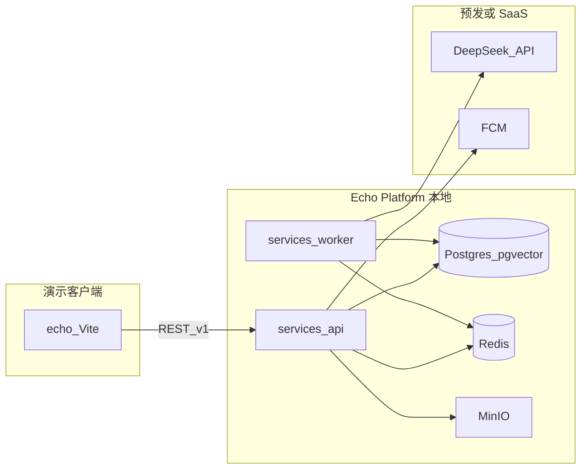

# Echo — Phase 1 全功能演示路线图

| 字段 | 值 |
|------|-----|
| **文档版本** | 1.1.0 |
| **状态** | 生效中 |
| **最后更新** | 2026-05-28 |
| **相关文档** | [PRD](./PRD-Echo.md)、[软件架构](./Software-Architecture-Echo.md)、[部署与组件边界](./Deployment-and-Component-Boundaries-Echo.md)、[校园试点发布计划](./Campus-Pilot-Launch-Plan-Echo.md)、[术语表](./glossary.md) |

**语言：** 简体中文（镜像）。英文 canonical：[`../docs/Phase1-Demo-Roadmap-Echo.md`](../docs/Phase1-Demo-Roadmap-Echo.md)。

---

## 1. 目标与顺序

1. **全功能演示** — 本地和/或预发环境具备**真实 API + 数据 + Worker**（非仅 Mock）。调试客户端：[`echo/`](../echo/)（`VITE_API_BASE_URL`），之后 [`apps/android`](../apps/android/)。
2. **验证** — 在演示环境确认产品与交互；按 §3 的 **`API` / `Worker` / `Web` / `APK`** 分列更新状态。
3. **APK** — 校园侧载 / 商店发布前，须满足 §3.3 **发布门槛**（各适用列均为 `done`，不能仅「后端有接口」）。

**「一个功能一个功能做」的单一事实来源：** §3 矩阵。[`echo/docs/PHASE1-SCOPE-MAP.zh-CN.md`](../echo/docs/PHASE1-SCOPE-MAP.zh-CN.md) 仅作 Sprint 级摘要并链接本文。

> **v1.1.0 说明：** 旧版单一 `done` 列高估了客户端与 APK 完成度；现按部署层拆分（代码审计：2026-05-26）。

---

## 2. 运行时拓扑（本地演示）

**本地：** `infra/docker-compose.yml` — `docker compose up -d` 启动 Postgres、Redis、MinIO；在宿主机或容器内运行 `services/api`、`services/worker`。

**线上（预发）：** HTTPS API、Firebase（FCM）、LLM 密钥仅通过环境变量配置；勿提交密钥。

---

## 3. 功能矩阵

**每次只实现一行。** 仅更新发生变化的列。

### 3.1 状态列（按层）

| 列 | 范围 | `done` 含义 |
|----|------|-------------|
| **API** | `services/api` REST + DB | 主路径在本地/预发可验证（如 `curl` 或集成测试）。 |
| **Worker** | `services/worker` 任务 | 队列/定时任务在真实 Postgres + Redis + LLM 上跑通；无异步则填 `n/a`。 |
| **Web** | [`echo/`](../echo/) 原型 | 配置 `VITE_API_BASE_URL` 后主流程走真实 API；仅 API 不可达或空响应时可 Mock（§4）。 |
| **APK** | [`apps/android`](../apps/android/) | 真机/模拟器上对真实 API 可走通用户流程；纯平台行填 `n/a`。 |

**取值：** `todo` | `doing` | `done` | `blocked` | `n/a`

**已废弃：** 整行单一 `done` — 新进展勿再使用。

### 3.2 能力行

| ID | 能力 | FR | 客户端（演示） | 同步 API | 异步 / Worker | 实现位置 | API | Worker | Web | APK | 备注 |
|----|------|-----|----------------|----------|---------------|----------|-----|--------|-----|-----|------|
| P1-00 | 开发基础设施 | — | — | — | — | `infra/` | done | n/a | n/a | n/a | `docker-compose.yml`：Postgres、Redis、MinIO |
| P1-01 | API 壳 + 库表 | FR-001+ | — | `GET /health` | — | `services/api` | done | n/a | n/a | n/a | Prisma 迁移 |
| P1-02 | 注册 / OTP / 登录 | FR-001–004 | `echo` 认证壳 | `POST /auth/*`、`GET /auth/me` | — | `services/api`、`echo` | done | n/a | done | n/a | Web 需配置 `VITE_API_BASE_URL` |
| P1-03 | 入驻问卷 + 对话 + 定稿 | FR-010–014 | `echo` 向导 | `POST /onboarding/*` | API 内 LLM | `services/api`、`echo` | done | n/a | done | n/a | 见 [入驻问卷设计](./Onboarding-Survey-Design-Echo.md) |
| P1-04a | 分身查看 + 暂停/恢复 | FR-020、FR-023–024 | `echo` 分身 Tab | `GET /clones/me`、pause/resume | — | `services/api`、`echo` | done | n/a | done | n/a | Web：暂停/恢复已接；persona 只读展示 |
| P1-04b | 编辑 persona 文案 | FR-021–022 | `echo` 分身 Tab | `PUT /clones/me`（`personaText`） | — | `services/api`、`echo` | done | n/a | done | n/a | `updateClonePersona` + 分身 Tab 编辑器 |
| P1-04c | 配置社交边界 | FR-021–022 | `echo` 分身 Tab | `GET/PUT /clones/me`（`boundaries`） | LLM prompt 注入边界 | `services/api`、`services/worker`、`echo` | done | done | done | n/a | `forbiddenWords` + `topicsToAvoid`；Worker `formatBoundariesClause` |
| P1-05 | 动态阅读 | FR-030–034 | `echo` 广场 | `GET /feed`、`GET /posts/{id}` | — | `services/api`、`echo` | done | n/a | done | n/a | `loadFeed()` — 仅无 `VITE_API_BASE_URL` 时用 Mock；空列表/错误不回填 Mock |
| P1-06 | 定时发帖 + 审核 | FR-030–034、FR-033 | 动态 + 详情 | — | `post-draft`、`moderation` | `services/worker`、`echo` | n/a | done | done | n/a | `POST /posts/draft` + 分身「让分身发帖」+ 广场轮询；活动记录 `moderation_status` |
| P1-07 | 匹配列表 + 忽略 + 拉黑 | FR-040–044 | `echo` 匹配 Tab | `GET /matches`、dismiss、`POST /blocks` | `match-daily` | `services/api`、`services/worker` | done | done | done | n/a | `loadMatches()` + 匹配 Tab 忽略/拉黑；列表排除已拉黑用户 |
| P1-08 | 智能体会话 + 消息（只读） | FR-050–054 | 匹配 / 记录 | `GET /sessions`、`GET /sessions/{id}/messages` | `agent-turn` | `services/*`、`echo` | done | done | doing | n/a | `loadSessionMessages` 可用；匹配详情对话仍为静态文案 |
| P1-09 | 好感度 + Handoff | FR-060–065 | `echo` 缘分详情 | `GET/POST /handoffs/*` | 每轮好感度 | `services/*`、`echo` | done | done | doing | n/a | 有 `handoffId` 时可 `respondHandoff`；详情大量 Mock |
| P1-10 | 活动审计日志 | FR-070–072 | `echo` 记录 Tab | `GET /audit/events`、`GET /clones/me/activity` | 写 AuditEvent | `services/api`、`echo` | done | doing | doing | n/a | 记录 Tab 用 activity API + Mock 回退 |
| P1-11 | 举报 | FR-080–082 | 设置 / 举报 | `POST /reports` | 审核队列（规划） | `services/api`、`echo` | done | todo | todo | n/a | `SettingsView` 无举报入口 |
| P1-12 | WebSocket 实时（可选） | — | `echo` 可选 | `wss://.../v1/ws` | Redis pub/sub | `services/api` | todo | n/a | todo | n/a | 可选；未开始 |
| P1-13 | 演示客户端 API 集成 | — | `echo` 各 Tab | `VITE_API_BASE_URL` | — | `echo/src/api/*` | n/a | n/a | doing | n/a | 各 Tab 成熟度不一；未配 env 时大量 Mock |
| P1-14 | Android 壳 + 导航 | — | APK | 与 API 相同 REST | — | `apps/android` | n/a | n/a | n/a | todo | `MainActivity` 仅占位文案；无 Tab |
| P1-15 | 加固 + 签名 release APK | — | 正式包 | — | — | `apps/android`、CI | n/a | n/a | n/a | todo | CI 仅 **debug** 包（`.github/workflows/android-apk.yml`） |

### 3.3 发布门槛（校园就绪前须满足）

| 门槛 | 行 | 适用列须全部为 `done` |
|------|-----|------------------------|
| **本地全栈演示** | P1-00–P1-11（不含 P1-12） | `API` + `Worker`（若非 `n/a`） |
| **Web 产品走查** | P1-02–P1-11、P1-13 | `Web`（主路径无静默 Mock，§4） |
| **校园侧载 APK** | P1-04a–c、P1-07–P1-11、P1-14、P1-15 | `APK`；P1-15 为 **release 签名** 产物，非仅 debug |

---

## 4. Mock 策略（演示阶段）

| 允许 | `Web` = `done` 时不允许 |
|------|-------------------------|
| API 不可达时客户端降级 Mock | 整项仅有 Mock、无 `services/*` 实现 |
| API 返回空列表时临时 Mock（在备注中跟踪） | `echo` 生产构建写入 `VITE_*` 密钥 |
| 本地 Postgres 种子数据 | 主界面仍用写死演示数据却标 `Web` = `done` |

**API** = `done`：平台主路径须走真实本地/预发接口。**Web** = `done`：配置 `VITE_API_BASE_URL` 后验证主界面无 Mock 替代。

---

## 5. 治理（Agent / CI）

| 层级 | 作用 |
|------|------|
| Skill **echo-deployment-boundaries** | 部署拓扑 + Phase 1 演示规则 |
| Hook **phase1-context-nudge.py** | 写入 `echo/`、`services/`、`infra/`、`apps/`、路线图后提醒 |
| **本文件** | 实现功能时更新 `API` / `Worker` / `Web` / `APK` |
| 未来 CI（可选） | 校园门槛行 `APK` 非 `done` 则阻断发版；禁止生产 Web 包提交 `VITE_*` 密钥 |

Hook 与 Skill **不能**自动强制合规；PR 须核对 §3.2–3.3。

---

## 6. 变更记录

| 版本 | 日期 | 摘要 |
|------|------|------|
| 1.1.5 | 2026-05-26 | P1-07 Web 完成：匹配列表真实 API、忽略/拉黑 UI、`candidate_user_id` |
| 1.1.4 | 2026-05-26 | P1-06 Web 完成：分身发帖、`feed` 轮询、活动记录审核中标签 |
| 1.1.3 | 2026-05-26 | P1-05 Web 完成：`loadFeed()` + 广场空态/错误/Mock 提示；`PostDetailView` `initialPost` |
| 1.1.2 | 2026-05-28 | P1-04c：社交边界 API/Web/Worker + 分身 Tab 编辑器 |
| 1.1.1 | 2026-05-27 | P1-04b Web 完成：`echo` 分身 Tab persona 编辑器 |
| 1.1.0 | 2026-05-26 | 状态拆为 API / Worker / Web / APK；P1-04 拆为 a/b/c；与代码库对齐的诚实审计 |
| 1.0.0 | 2026-05-20 | 初版：APK 前全功能演示功能矩阵 |
