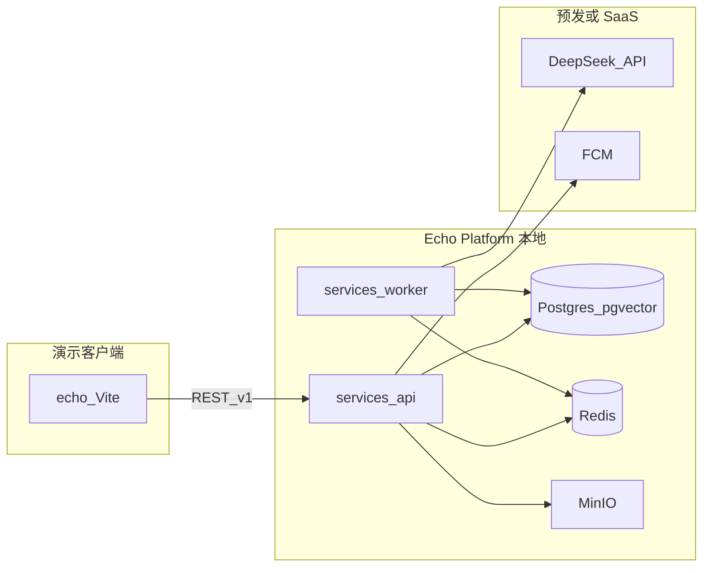

# Echo — Phase 1 全功能演示路线图

| 字段 | 值 |
|------|-----|
| **文档版本** | 1.0.0 |
| **状态** | 生效中 |
| **最后更新** | 2026-05-20 |
| **相关文档** | [PRD](./PRD-Echo.md)、[软件架构](./Software-Architecture-Echo.md)、[部署与组件边界](./Deployment-and-Component-Boundaries-Echo.md)、[术语表](./glossary.md) |

**语言：** 简体中文（镜像）。英文 canonical：[`../docs/Phase1-Demo-Roadmap-Echo.md`](../docs/Phase1-Demo-Roadmap-Echo.md)。

---

## 1. 目标与顺序

1. **全功能演示** — 本地和/或预发环境具备**真实 API + 数据 + Worker**（非仅 Mock）。调试用客户端：[`echo/`](../echo/) Web 原型（`VITE_API_BASE_URL`），之后可选 Android debug 包。
2. **验证** — 在演示环境确认产品与交互；每完成一项能力即更新本矩阵的 `status` 列。
3. **APK** — 仅当 MVP 所需矩阵行达到 `done` 且验收通过后，再推进 [`apps/android`](../apps/android/) 发布（见行 **P1-09** 及 **P1-14**、**P1-15**）。

**「一个功能一个功能做」的单一事实来源：** §3 矩阵。[`echo/docs/PHASE1-SCOPE-MAP.zh-CN.md`](../echo/docs/PHASE1-SCOPE-MAP.zh-CN.md) 仅作 Sprint 级摘要并链接本文。

---

## 2. 运行时拓扑（本地演示）

**本地：** `infra/docker-compose.yml`（规划中）— `docker compose up -d` 启动 Postgres、Redis、MinIO；在宿主机或容器内运行 `services/api`、`services/worker`。

**线上（预发）：** HTTPS API 域名、Firebase（FCM）、DeepSeek（或其他）API 密钥配置在 Worker/API 环境变量中；勿将密钥提交仓库。

---

## 3. 功能矩阵

**每次只实现一行。** 开始时将 `status` 设为 `doing`，在演示环境用真实 API 验证通过后设为 `done`（仅离线开发可保留文档化的 Mock 降级）。

| ID | 能力 | FR | 客户端（演示） | 同步 API | 异步 / Worker | 数据 | 本地 | 预发 / 线上 | 实现位置 | 状态 |
|----|------|-----|----------------|----------|---------------|------|------|-------------|----------|------|
| P1-00 | 开发基础设施 | — | — | — | — | Postgres、Redis、MinIO | `infra/docker-compose.yml`；`docker compose up -d` | 后续可用托管库 | `infra/` | done |
| P1-01 | API 壳 + 库表 | FR-001+ | — | 健康检查 `GET /health` | — | `services/api` 内迁移 | API `localhost:4000` | 预发部署 | `services/api` | done |
| P1-02 | 注册 / OTP / 登录 | FR-001–004 | `echo` 认证壳 | `POST /auth/register`、`/auth/otp`、`/auth/login`、`/auth/refresh` | — | `users` | 本地 API + JWT | 预发同一 API | `services/api` | done |
| P1-03 | 入驻问卷 + 对话 + 定稿 | FR-010–014 | `echo` 多步向导 | 同上 + `GET /auth/me` 跳过问卷 | `LlmAdapter` | `profiles`、`onboarding_sessions` | [入驻问卷设计](./Onboarding-Survey-Design-Echo.md) | 预发 | `services/api` | done |
| P1-04 | 数字分身 CRUD + 暂停/恢复 | FR-020–024 | `echo` 分身 Tab | `GET/PUT /clones/me`、pause/resume | — | `digital_clones`、`persona_prompts` | 本地 | 预发 | `services/api` | done |
| P1-05 | 动态阅读 | FR-030–034 | `echo` 广场 | `GET /feed`、`GET /posts/{id}` | — | `posts` | 本地 | 预发 | `services/api` | done |
| P1-06 | 定时发帖 + 审核 | FR-030–034、FR-033 | 动态 + 详情 | — | [分身运行时](./Clone-Runtime-and-Triggers-Echo.md) 触发 `post-draft` | `posts`、Redis meta | Worker + DeepSeek | 预发 | `services/worker` | done |
| P1-07 | 匹配列表 + 忽略 + 拉黑 | FR-040–044 | `echo` 匹配 Tab | `GET /matches`、dismiss、`POST /blocks` | 每日匹配任务 | `match_pushes`、pgvector | 本地 PG + 调度 | 预发 + FCM | `services/api`、`services/worker` | done |
| P1-08 | 智能体会话 + 消息（只读） | FR-050–054 | 匹配详情 / 会话 UI | `GET /sessions`、`GET /sessions/{id}/messages` | 多轮 Agent | `agent_sessions`、`agent_messages` | 本地 Worker + LLM | 预发 | `services/worker`、`services/api` | done |
| P1-09 | 好感度 + Handoff | FR-060–065 | `echo` 缘分详情 | `GET /handoffs/{id}`、`POST /handoffs/{id}/respond` | 每轮更新好感度 | `affinity_scores`、`handoffs` | 本地 | 预发 + FCM | `services/api`、`services/worker` | done |
| P1-10 | 活动审计日志 | FR-070–072 | `echo` 记录 Tab | `GET /audit/events` | 分身行为写 AuditEvent | `audit_events` | 本地 | 预发 | `services/api` | done |
| P1-11 | 举报 | FR-080–082 | 设置 / 举报入口 | `POST /reports` | 审核队列 | — | 本地 | 预发 | `services/api` | done |
| P1-12 | WebSocket 实时（可选） | — | `echo` 可选 | `wss://.../v1/ws` | — | Redis pub/sub | 本地 | 预发 | `services/api` | todo |
| P1-13 | 演示客户端对接 API | — | `echo` 各 Tab | 上文全部经 `VITE_API_BASE_URL` | — | — | `http://localhost:4000/v1` | 预发 URL | `echo/src/api/*` | done |
| P1-14 | Android 壳 + 导航 | — | APK | 与 §10 相同 REST | — | — | 模拟器 + 本地 API | 预发 API | `apps/android` | done |
| P1-15 | 加固 + 签名 APK | — | 正式包 | — | — | — | 本地 CI | 侧载 / Play | `apps/android`、`.github/workflows/` | done |

**状态取值：** `todo` | `doing` | `blocked` | `done`

---

## 4. Mock 策略（演示阶段）

| 允许 | 标为 `done` 时不允许 |
|------|----------------------|
| API 不可达时的客户端降级 Mock | 整项能力仅有 Mock、无 `services/*` 实现 |
| 本地 Postgres 种子数据 | 在 `echo` 生产构建中写入 `VITE_*` 密钥 |

某行 `done` 时，**主路径**必须走该行记载的真实本地（或预发）API。

---

## 5. 治理（Agent / CI）

| 层级 | 作用 |
|------|------|
| Skill **echo-deployment-boundaries** | 部署拓扑 + Phase 1 演示规则 |
| Hook **phase1-context-nudge.py** | 写入 `echo/`、`services/`、`infra/`、`apps/`、路线图文档后提醒 |
| **本文件** | 实现功能时更新 `status` |
| 未来 CI（可选） | 例如 P1-13 非 `done` 不可发版；禁止生产 Web 包带 `VITE_*` 密钥 |

Hook 与 Skill **不能**自动强制合规，仅降低疏漏；PR 评审应核对本矩阵。

---

## 6. 变更记录

| 版本 | 日期 | 摘要 |
|------|------|------|
| 1.0.0 | 2026-05-20 | 初版：APK 前全功能演示功能矩阵 |
