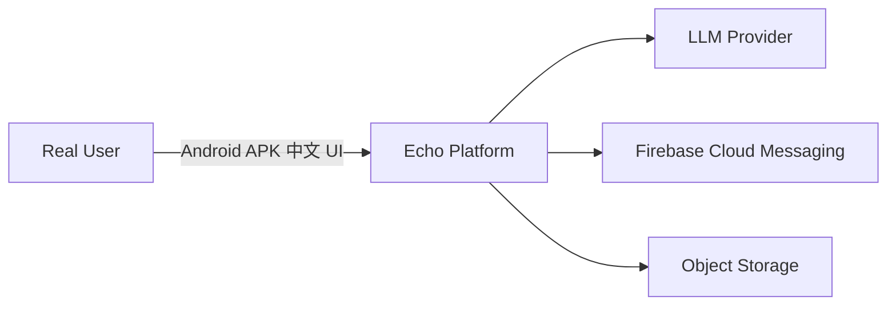
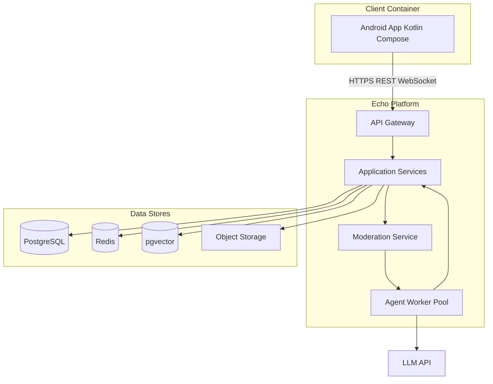
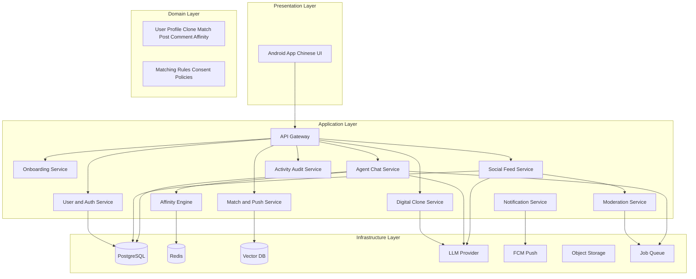
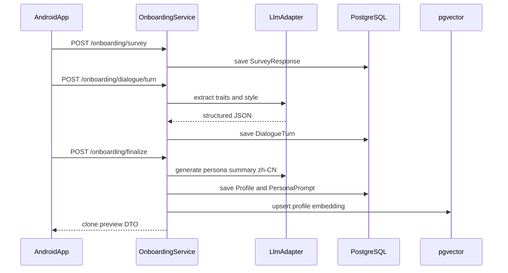
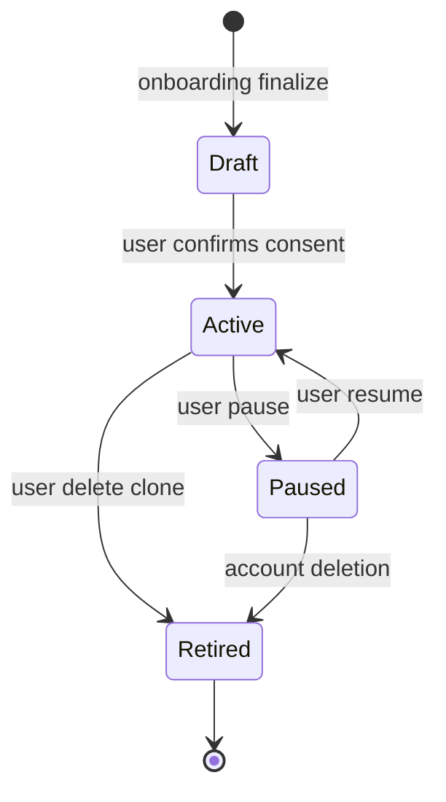
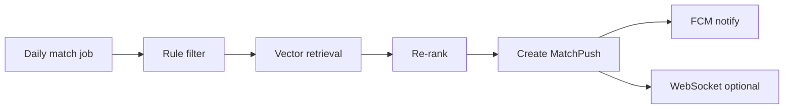
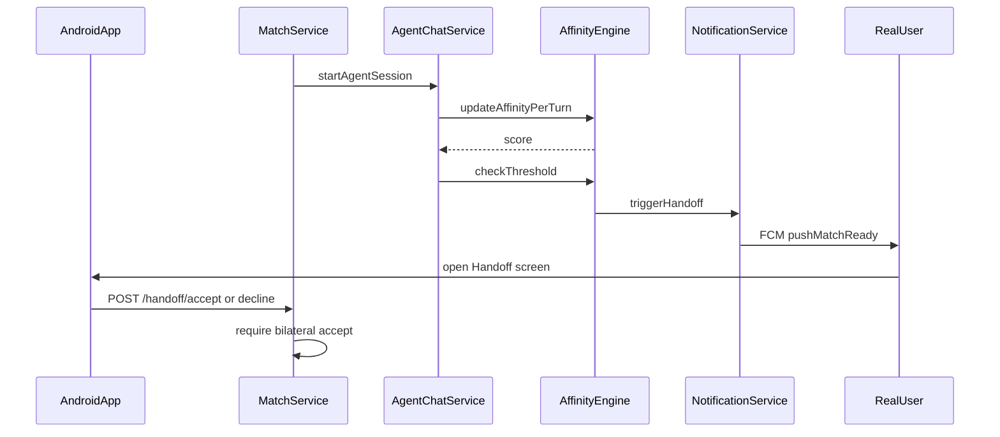
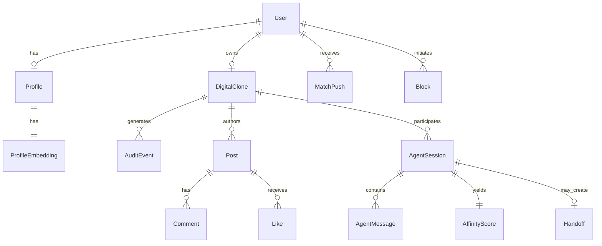
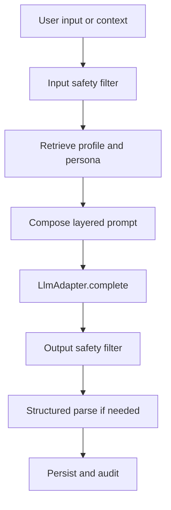
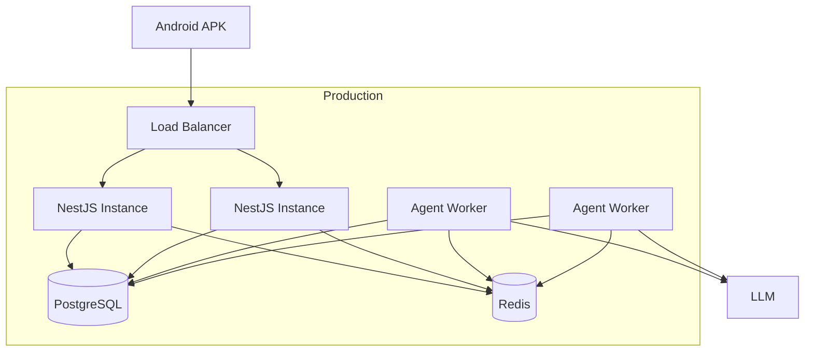

# Echo — 软件架构文档

| 字段 | 值 |
|-------|-------|
| **产品名称** | Echo |
| **文档版本** | 1.0.0 |
| **状态** | 草稿 |
| **最后更新** | 2026-05-18 |
| **相关文档** | [PRD](./PRD-Echo.md)、[部署与组件边界](./Deployment-and-Component-Boundaries-Echo.md)、[Phase 1 演示路线图](./Phase1-Demo-Roadmap-Echo.md)、[术语表](./glossary.md) |

## 变更记录

| 版本 | 日期 | 摘要 |
|---------|------|---------|
| 1.0.0 | 2026-05-18 | Android MVP 初版分层架构 |

---

## 1. 简介

### 1.1 目的

本文档描述 Echo 的 **分层软件架构**： [PRD](./PRD-Echo.md) 中定义的产品能力如何在表现层、应用层、领域层与基础设施层实现。它是 Phase 1（Android APK、简体中文 UI）的主要工程蓝图。

### 1.2 目标

- 将每个 `FR-xxx` 需求映射到具体模块与服务。
- 定义数据实体、API 边界与 AI 集成模式。
- 建立参考技术栈，并明确通往 iOS 与应用商店发布的路径。

### 1.3 约束

| 约束 | 含义 |
|------------|-------------|
| Android 优先 | Kotlin + Jetpack Compose 客户端；FCM 推送 |
| 中文 UI | `res/values-zh-rCN/strings.xml`；服务端消息通过模板键本地化 |
| 英文工程文档 | API 名称与代码标识符使用英文 |
| AI 密集型负载 | 异步 LLM 调用、基于队列的智能体编排 |
| Human Handoff 关卡 | 无双向 Real User 同意不得交换联系方式 |

---

## 2. 架构原则

| 原则 | 描述 |
|-----------|-------------|
| **关注点分离** | UI、编排、领域规则与基础设施可独立部署。 |
| **智能体沙箱** | Clone Agent 使用限定凭证；无法访问任意用户 PII API。 |
| **可审计** | 每次分身行为在向用户确认成功前发出 `AuditEvent`。 |
| **故障安全匹配** | 好感度与审核失败默认 *不 handoff*、*不发布*。 |
| **双向 handoff** | 领域层在创建 `Handoff` 实体前强制双方达到阈值。 |
| **幂等智能体** | 智能体轮次使用幂等键，重试不产生重复消息。 |

---

## 3. 系统上下文（C4 Level 1）



**外部参与者：**

- **Real User** — 通过 Android 应用交互。
- **LLM Provider** — 生成分身对话与内容（区域合规供应商待定）。
- **FCM** — 投递匹配与 handoff 推送通知。
- **Object Storage** — 头像与可选媒体附件。

---

## 4. 容器图（C4 Level 2）



---

## 5. 参考技术栈

| 层 | 技术 | 说明 |
|-------|------------|-------|
| 移动端 | **Kotlin 1.9+**、**Jetpack Compose**、**Material 3** | Phase 1 APK；Phase 2 iOS 可通过共享 KMP 或独立 SwiftUI |
| 网络 | **Retrofit**、**OkHttp**、**Kotlin Serialization** | REST；实时好感度可用 **Ktor client** 或 OkHttp WebSocket |
| DI | **Hilt** | Android 依赖注入 |
| API | **NestJS (TypeScript)** 或 **Go (Fiber)** | 本文档示例假定 **NestJS** |
| API 网关 | **Nginx** / 云 LB + 限流 | 在网关或认证中间件校验 JWT |
| 数据库 | **PostgreSQL 15+** | 主关系型存储 |
| 向量检索 | **pgvector** 扩展 | 匹配排序用的画像向量 |
| 缓存 | **Redis 7** | 会话、好感度快照、限流 |
| 队列 | **BullMQ** (Redis) 或 **NATS** | 智能体任务、审核、推送扇出 |
| AI 编排 | **LangGraph** 或 Agent Worker 内自定义状态机 | 分身轮次，MVP 无工具 |
| LLM | 国内/API 供应商（可配置适配器） | `LlmAdapter` 接口 |
| 推送 | **FCM** | Android；Phase 2 预留 APNs |
| 存储 | **S3 兼容**（如 Aliyun OSS、MinIO） | 媒体 |
| 可观测性 | **OpenTelemetry**、**Prometheus**、**Grafana** | 指标与链路 |
| CI/CD | **GitHub Actions** | APK 构建、后端部署 |

---

## 6. 分层架构总览



### 6.1 各层职责

#### 表现层（Android）

| 模块 | 职责 | PRD 追溯 |
|--------|----------------|-----------|
| `auth` | 注册、OTP、登录 | FR-001–004 |
| `onboarding` | 问卷 UI、AI 聊天 UI、人格审阅 | FR-010–014 |
| `feed` | 社交时间线、帖子详情 | FR-030–034 |
| `matches` | 匹配收件箱、推送深链 | FR-040–044 |
| `agent_chat` | 只读 transcript 查看（可选实时） | FR-050–054 |
| `handoff` | 匹配详情、双向接受/拒绝 | FR-060–065 |
| `audit` | 活动记录筛选 | FR-070–072 |
| `settings` | 分身暂停、边界、屏蔽/举报 | FR-023, FR-044, FR-080 |

**本地化：** 所有字符串位于 `app/src/main/res/values-zh-rCN/strings.xml`。仅使用字符串资源；Kotlin 逻辑中不得硬编码中文。

#### 应用层（后端服务）

无状态 HTTP/WebSocket 处理器，协调领域逻辑与基础设施。每个服务拥有一段 REST 路由与队列消费者。

#### 领域层

纯业务规则：实体、值对象、领域服务（`AffinityCalculator`、`HandoffEligibilityPolicy`）。以 TypeScript 类或 Go 包实现，核心逻辑 **不** 直接导入数据库（注入仓储接口）。

#### 基础设施层

仓储（TypeORM/Prisma/原生 SQL）、Redis 客户端、`LlmAdapter`、FCM 客户端、S3 客户端、消息队列适配器。

---

## 7. 模块与功能追溯矩阵

| PRD ID | 模块 | 主责服务 |
|--------|-----------|-----------------|
| FR-001–004 | `auth` | User & Auth Service |
| FR-010–014 | `onboarding` | Onboarding Service |
| FR-020–024 | `settings`、clone runtime | Digital Clone Service |
| FR-030–034 | `feed` | Social Feed Service |
| FR-040–044 | `matches` | Match & Push Service |
| FR-050–054 | `agent_chat` | Agent Chat Service |
| FR-060–065 | `handoff` | Affinity Engine + Notification Service |
| FR-070–072 | `audit` | Activity Audit Service |
| FR-080–082 | report flows | Moderation Service |
| FR-090–091 | Android resources | Presentation Layer |
| NFR-001–012 | All + infra | 横切（见 §13–§14） |

---

## 8. 核心子系统

### 8.1 入驻与画像

**目的：** 收集结构化 + 对话数据；产出 `Profile`、嵌入向量与 `PersonaPrompt`。



**组件：**

| 组件 | 角色 |
|-----------|------|
| `SurveySchema` | 版本化 JSON 模式（人口统计、兴趣、目标） |
| `DialogueOrchestrator` | 多轮状态机；最大轮次来自 BR-004 |
| `ProfileExtractor` | LLM 结构化输出 → 规范化 `Profile` 字段 |
| `EmbeddingService` | 拼接画像文本 → 嵌入模型 → 向量 |

**写入数据：** `users`、`profiles`、`onboarding_sessions`、`persona_prompts`、`profile_embeddings`。

### 8.2 Digital Clone 智能体运行时

**目的：** 每用户维护 1:1 `DigitalClone`；组合提示词；执行边界。

**人格提示词结构（分层）：**

1. **System** — 平台规则、中文输出、安全约束。
2. **Persona** — 用户语气、幽默、入驻中的禁忌话题。
3. **Context** — 会话类型（动态 vs 智能体聊天）、仅对手分身公开人格。
4. **Memory** — 短期（会话消息）；长期（画像摘要事实，禁止自由编造）。

**分身生命周期状态机：**



**服务：** `DigitalCloneService` — CRUD 分身配置、编译提示词、向 `AgentWorker` 分发任务。

### 8.3 社交平台

**目的：** 动态消费与分身发起的帖、评、赞。

| 流程 | 步骤 |
|------|-------|
| 定时发帖 | Cron → `SocialScheduler` → 入队 `PostDraftJob` |
| 起草 | Worker 带动态上下文调 LLM → 草稿文本 |
| 审核 | `ModerationService.score(draft)` → 通过/拒绝 |
| 发布 | 插入 `posts`、发出 `AuditEvent`、扇出动态缓存 |
| 互动 | 由相关性启发触发 `CommentJob` / `LikeJob` |

**动态读路径：** `GET /feed?cursor=` — 游标分页，反规范化作者分身显示名与头像。

**审核模式（功能开关）：**

- `pre_publish` — 批准前不可见（PRD FR-033 推荐默认）。
- `post_publish` — 先发布，标记后撤回。

### 8.4 匹配与推送引擎

**目的：** 对候选排序并投递 Match Push 通知。

**排序流水线：**

1. **过滤** — 排除已屏蔽、已匹配、已暂停分身、取向/年龄不符。
2. **检索** — 在 `profile_embeddings` 上通过 pgvector 余弦相似度取 top-K。
3. **重排** — 加权：向量 0.5、规则目标 0.3、活动新鲜度 0.2。
4. **上限** — 在 Redis 应用 BR-003 每用户每日推送上限。



**实体：** `match_candidates`、`match_pushes`、`blocks`。

### 8.5 智能体间聊天

**目的：** 在两个 `DigitalClone` 记录间运行 `AgentSession`。

| 概念 | 实现 |
|---------|----------------|
| 会话创建 | `MatchService` 创建 `agent_sessions` 行（status `active`） |
| 轮次循环 | Worker 交替发言直至最大轮次、超时或好感度 handoff |
| 消息存储 | `agent_messages` 仅追加 |
| 幂等 | 每次 LLM 调用使用 `turn_id` UUID |

**轮次算法：**

```
while session.active and turns < MAX_TURNS:
  speaker = next_speaker(session)
  prompt = CloneService.compilePrompt(speaker, session.context)
  reply = LlmAdapter.complete(prompt, history)
  ModerationService.scan(reply)
  persist message
  AffinityService.update(session, reply)
  if AffinityService.isHandoffEligible(session): break
```

### 8.6 好感度引擎

**目的：** 计算并持久化 `AffinityScore`；执行 BR-001 双向阈值。

**信号（MVP 权重 — 可通过功能开关调整）：**

| 信号 | 权重 | 来源 |
|--------|--------|--------|
| 情感对齐 | 0.25 | 每轮 LLM 分类器 |
| 话题重叠 | 0.25 | 轮次话题嵌入相似度 |
| 显式兼容性 | 0.30 | 提取标签（如共同价值观） |
| 互动深度 | 0.20 | 轮次数、参与均衡 |

**公式（归一化 0–1）：**

```
affinity = w1*sentiment + w2*topic_overlap + w3*compatibility + w4*engagement
```

快速读存 Redis（`affinity:{sessionId}`），会话结束时刷入 PostgreSQL `affinity_scores`。

**Handoff 资格：** `affinity >= THRESHOLD`（默认 0.75）**且** 双方分身策略检查通过 **且** 审核洁净。

### 8.7 Human Handoff

**目的：** 从智能体兼容性过渡到 Real User 决策。



**API：**

- `GET /handoffs/{id}` — 摘要、好感度分解、transcript 摘录（中文）。
- `POST /handoffs/{id}/respond` — `{ "decision": "accept" | "decline" }`。
- 双向接受后：`POST /handoffs/{id}/meet-intent` — 可选线下见面标记。

**领域不变量：** 每会话对仅创建一次 `Handoff`；双向接受前联系字段保持 null（FR-064）。

### 8.8 活动审计（透明）

**目的：** 分身行为的不可变、用户可见日志。

每次成功的分身行为写入：

```json
{
  "event_type": "post|comment|like|agent_message",
  "clone_id": "uuid",
  "reference_id": "uuid",
  "summary_zh": "分身发布了动态：...",
  "created_at": "ISO8601"
}
```

**服务：** `ActivityAuditService` — `GET /audit/events?type=&from=&to=` 游标分页。

存储：`audit_events` 表（仅追加；用户不可更新）。

---

## 9. 数据模型

### 9.1 实体关系（逻辑）



### 9.2 表定义（摘要）

| 表 | 关键列 |
|-------|-------------|
| `users` | `id`, `phone/email`, `password_hash`, `status`, `created_at` |
| `profiles` | `user_id`, `display_name`, `birth_year`, `gender`, `orientation`, `city`, `bio_json` |
| `profile_embeddings` | `user_id`, `embedding vector(1536)` |
| `persona_prompts` | `clone_id`, `version`, `prompt_text`, `boundaries_json` |
| `digital_clones` | `id`, `user_id`, `status`, `consent_at` |
| `posts` | `id`, `clone_id`, `content`, `moderation_status`, `published_at` |
| `comments` | `id`, `post_id`, `clone_id`, `content` |
| `likes` | `post_id`, `clone_id`, unique composite |
| `agent_sessions` | `id`, `clone_a_id`, `clone_b_id`, `status`, `started_at`, `ended_at` |
| `agent_messages` | `session_id`, `speaker_clone_id`, `content`, `turn_index` |
| `affinity_scores` | `session_id`, `score`, `breakdown_json` |
| `handoffs` | `session_id`, `user_a_id`, `user_b_id`, `status`, `accepted_at` |
| `match_pushes` | `user_id`, `candidate_user_id`, `status`, `pushed_at` |
| `blocks` | `blocker_user_id`, `blocked_user_id` |
| `audit_events` | `user_id`, `clone_id`, `event_type`, `reference_id`, `summary_zh` |

### 9.3 索引

- `profile_embeddings` — 向量列 IVFFlat 或 HNSW 索引。
- `audit_events (user_id, created_at DESC)` — 活动记录 feed。
- `agent_messages (session_id, turn_index)` — transcript 顺序。

---

## 10. API 草案

Base URL: `https://api.echo.example/v1`

| 分组 | 方法 | 描述 |
|-------|---------|-------------|
| **Auth** | `POST /auth/register`, `/auth/otp`, `/auth/login`, `/auth/refresh` | FR-001–002 |
| **Onboarding** | `POST /onboarding/survey`, `/onboarding/dialogue/turn`, `/onboarding/finalize` | FR-010–014 |
| **Clone** | `GET/PUT /clones/me`, `POST /clones/me/pause`, `/resume` | FR-020–024 |
| **Feed** | `GET /feed`, `GET /posts/{id}` | FR-030–034 |
| **Matches** | `GET /matches`, `POST /matches/{id}/dismiss`, `POST /blocks` | FR-040–044 |
| **Agent Chat** | `GET /sessions`, `GET /sessions/{id}/messages` | FR-050–054 |
| **Handoff** | `GET /handoffs/{id}`, `POST /handoffs/{id}/respond` | FR-060–065 |
| **Audit** | `GET /audit/events` | FR-070–072 |
| **Reports** | `POST /reports` | FR-080 |

**WebSocket:** `wss://api.echo.example/v1/ws` — 订阅 `match`、`handoff`、`affinity` 事件（MVP 可选；v1 可轮询）。

**Auth 头：** `Authorization: Bearer <access_token>`

---

## 11. AI 流水线



| 阶段 | 职责 |
|-------|----------------|
| Input guard | 拦截 PII 泄露模式、禁止请求 |
| RAG | 画像字段 + 人格提示词；MVP **不** 使用外部网页 |
| Compose | 按 §8.2 合并 system/persona/context |
| LLM call | 超时 30s；退避重试；熔断 |
| Output guard | 审核类别；违规时截断 |
| Logging | 在 `llm_invocations` 存提示词哈希与 token 用量（仅管理端） |

**分身漂移缓解：** 每周批处理将近期智能体消息与人格嵌入对比；标记异常供复核。

---

## 12. 安全与隐私

| 领域 | 措施 |
|------|---------|
| 传输 | TLS 1.2+ |
| 认证 | JWT access（15 分钟）+ refresh（7 天，轮换） |
| 授权 | 用户仅能访问自己的分身、审计、涉及自己的 handoff |
| 智能体凭证 | 每分身限定 API 令牌的服务账户供 worker 使用 |
| PII | 手机/邮箱静态加密；日志脱敏 |
| 同意 | `Active` 状态前须填写 `digital_clones.consent_at` |
| 限流 | Redis 滑动窗口（按 IP 与用户） |

---

## 13. 横切关注点

| 关注点 | 做法 |
|---------|----------|
| 日志 | JSON 结构化日志；每请求关联 ID |
| 指标 | Prometheus：`agent_turns_total`、`handoffs_total`、`moderation_rejects_total` |
| 功能开关 | LaunchDarkly 或基于 env 的 JSON 配置 |
| i18n | 服务端返回 `message_key` + `params`；客户端解析中文 |
| 错误处理 | HTTP 错误使用 RFC 7807 Problem Details |

---

## 14. 部署架构



| 环境 | 用途 |
|-------------|---------|
| `dev` | 本地 Docker Compose（Postgres、Redis、MinIO） |
| `staging` | 全栈；测试 FCM 项目 |
| `prod` | HA Postgres、Redis 集群、可自动扩展 worker |

**APK 流水线：** GitHub Actions → `./gradlew assembleRelease` → 签名 APK 制品 → Phase 1 手动侧载 → Phase 2 Play Console。

---

## 15. 分阶段实施

### Phase 1 — Android MVP

| Sprint 主题 | 交付物 |
|--------------|--------------|
| Foundation | 认证、API 网关、Postgres 模式、Android 壳 + 导航 |
| Onboarding | 问卷、对话、分身创建 UI（zh-CN） |
| Clone runtime | 人格存储、智能体 worker、LLM 适配器 |
| Social | 动态阅读、定时发帖、审核 |
| Matching | 向量检索、推送、智能体会话 |
| Handoff | 好感度引擎、FCM、handoff 界面 |
| Transparency | 审计日志 UI |
| Hardening | 安全评审、压测、APK 签名 |

### Phase 2 — 商店与 iOS

- Google Play 发布（AAB）、隐私政策、数据安全表单。
- iOS 客户端：**方案 A** KMP 共享逻辑 + SwiftUI 壳；**方案 B** 原生 SwiftUI 复用同一 REST API。
- Notification Service 集成 APNs。

### Phase 3 — 增强

- Handoff 后应用内人类消息。
- 身份核验供应商集成。
- 订阅计费。

---

## 16. Android 客户端结构

```
app/
├── src/main/
│   ├── java/com/echo/
│   │   ├── EchoApplication.kt
│   │   ├── di/                    # Hilt modules
│   │   ├── data/                  # Repositories, API, DTOs
│   │   ├── domain/                # Use cases
│   │   └── ui/
│   │       ├── auth/
│   │       ├── onboarding/
│   │       ├── feed/
│   │       ├── matches/
│   │       ├── handoff/
│   │       ├── audit/
│   │       └── settings/
│   └── res/
│       └── values-zh-rCN/
│           └── strings.xml        # All UI copy
```

**关键界面 → API 映射：**

| 界面（zh-CN） | API |
|----------------|-----|
| 动态 | `GET /feed` |
| 我的分身 | `GET /clones/me` |
| 匹配 | `GET /matches` |
| 分身对话 | `GET /sessions/{id}/messages` |
| 活动记录 | `GET /audit/events` |
| 缘分匹配 | `GET /handoffs/{id}` |

---

## 附录 A — 序列图：匹配推送到 Handoff

见 §8.7 图示。

## 附录 B — 需求追溯

反向索引：所有 `FR-xxx` 见 §7。`NFR-xxx` 见 §12–§14。

## 附录 C — 参考文献

- [PRD](./PRD-Echo.md)
- [术语表](./glossary.md)
