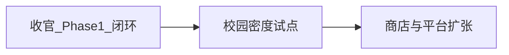
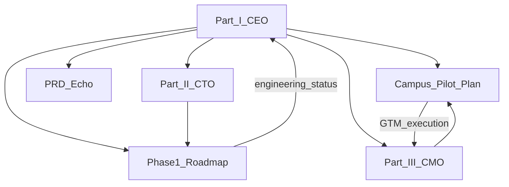
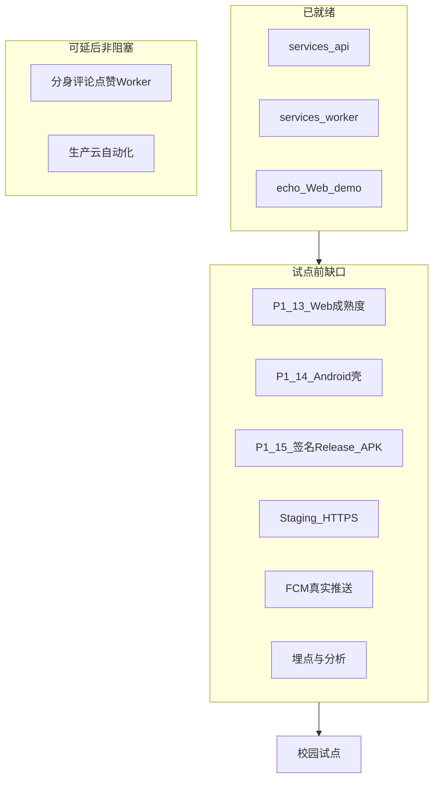
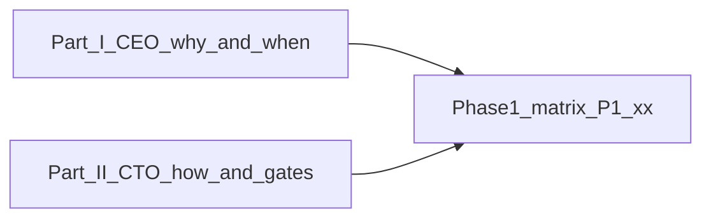
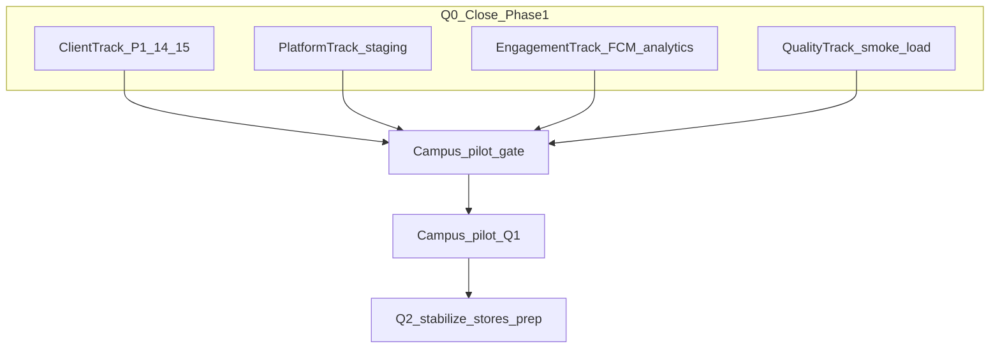
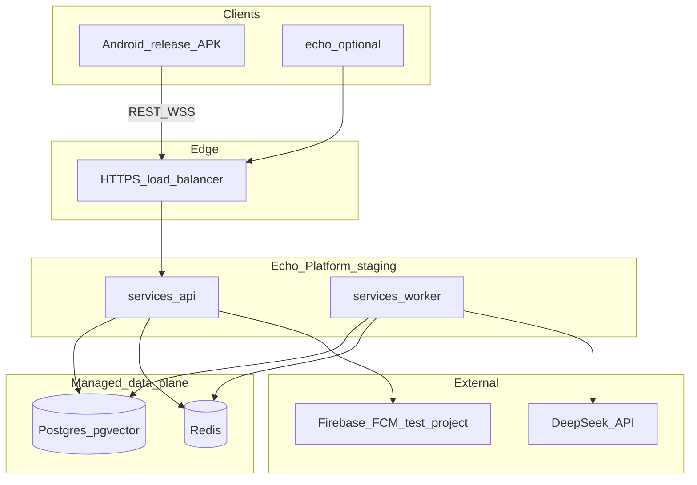
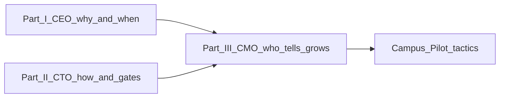
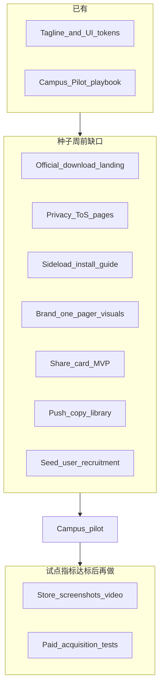
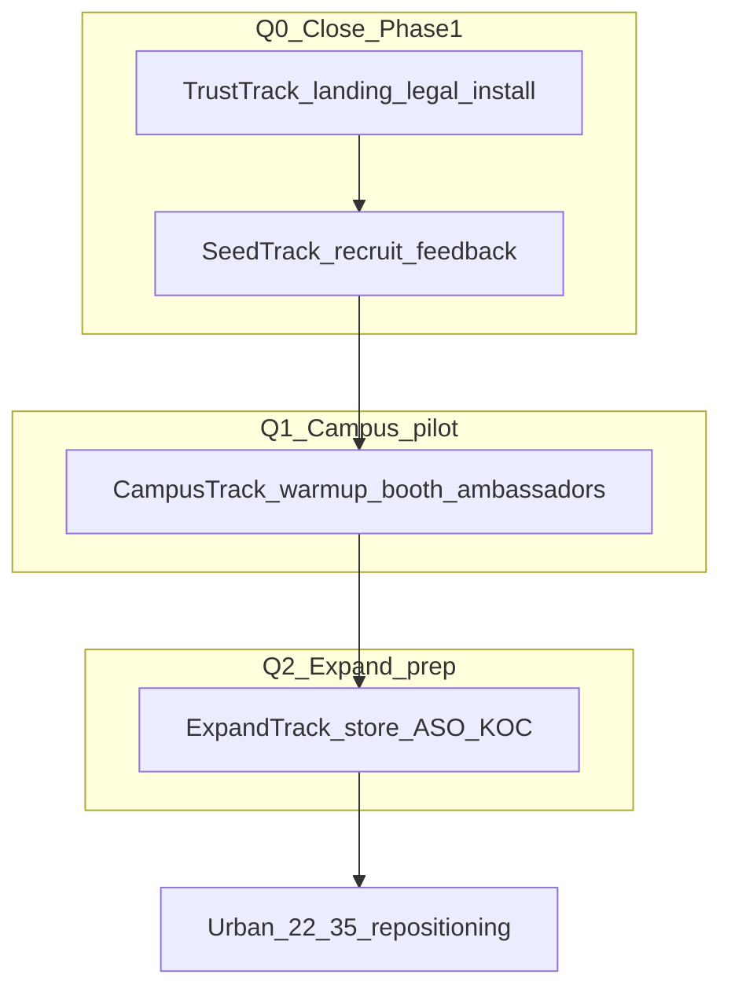
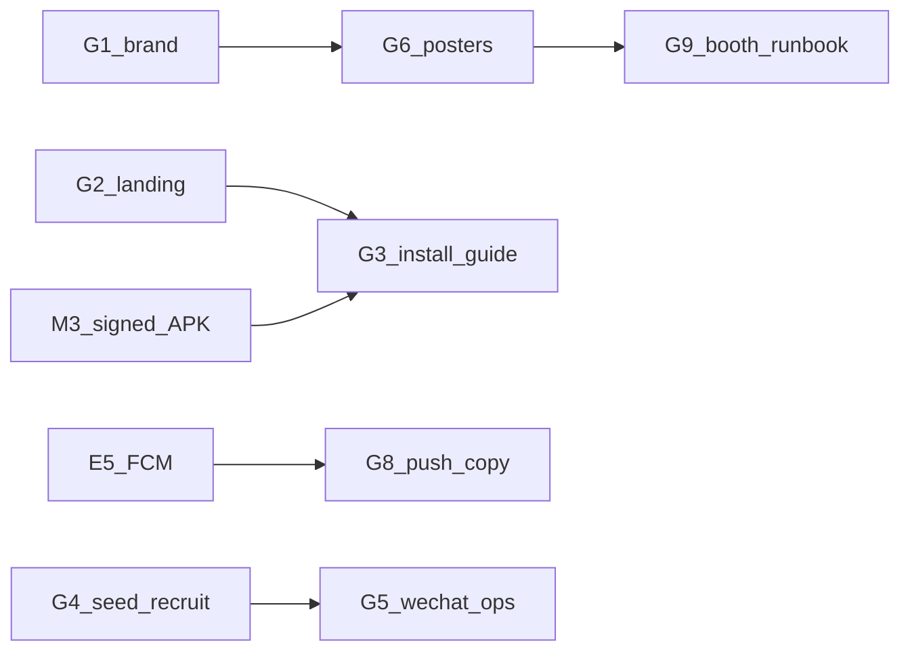

# Echo — 战略更新计划

| 字段 | 值 |
|------|-----|
| **产品名称** | Echo |
| **文档版本（Part I）** | 1.1.0 |
| **状态** | Active |
| **最后更新** | 2026-05-29 |
| **作者** | 管理层 / 产品负责人（Part I）；CTO（Part II）；CMO（Part III） |
| **受众** | 创始人、产品、工程、增长、投资人 |
| **相关文档** | [PRD](./PRD-Echo.md)、[Phase 1 演示路线图](./Phase1-Demo-Roadmap-Echo.md)、[校园试点发布计划](./Campus-Pilot-Launch-Plan-Echo.md)、[软件架构](./Software-Architecture-Echo.md)、[部署与组件边界](./Deployment-and-Component-Boundaries-Echo.md)、[术语表](./glossary.md) |

**语言：** 英文 canonical 见 [`../docs/Strategic-Update-Plan-Echo.md`](../docs/Strategic-Update-Plan-Echo.md)。本文件为简体中文镜像。

### 文档结构

| Part | 章节 | 视角 |
|------|------|------|
| **Part I** | §1–§13 | CEO — 为何、排期、门槛、跨职能风险 |
| **Part II** | §14–§26 | CTO — 如何交付、工程阻塞项、技术门槛 |
| **Part III** | §27–§41 | CMO — 市场就绪、GTM、增长闭环、扩张门槛 |

---

## 1. 执行摘要

**产品 slogan：** *AI 替你破冰，心动留给真实。*

Echo 是一款 **AI 分身社交发现** 产品。用户通过快速入驻创建 **Digital Clone（数字分身）**；分身在广场发帖、与其他分身匹配并互聊。当双向 **Affinity（好感度）** 达到阈值时，**Human Handoff（真人转接）** 邀请双方真人决定是否线下建立联系。

### 1.1 当前位置（2026 年 5 月）

| 维度 | 评估 |
|------|------|
| **技术验证** | 已过拐点 — 本地全栈演示可跑通（`services/api`、`services/worker`、配置 `VITE_API_BASE_URL` 的 [`echo/`](../echo/)） |
| **产品验证** | 尚未开始 — 无签名 release APK、无真实用户、无 staging 环境 |
| **战略位置** | Phase 1 后半段 — 平台本地可演示；有意义校园试点前须闭合 **三条就绪轴线** |

**三条就绪轴线（CEO 视角）：**

| 轴线 | 当前状态 | 细节 |
|------|----------|------|
| **工程交付** | 可演示、尚未可试点 | APK、staging HTTPS、FCM、埋点未齐 — 见 Part II §15 |
| **市场就绪** | 尚未市场就绪 | 无官方落地页、法务页、侧载安装指南 — 见 Part III §28 |
| **可衡量试点** | 规模化衡量尚不可用 | M3 + M4 须一并落地后种子周才有意义 — 见 Part II §15.3 |

### 1.2 战略主线

1. **闭环可交付** — 发布能在真实 API 上跑通完整 MVP 的签名 Android APK。
2. **校园验证** — 用 20–50 名种子用户、再扩至一所学校，验证留存与 Handoff 机制。
3. **扩张** — 国内安卓商店，再 iOS（Phase 2）；商业化与深度功能（Phase 3）须等产品验证信号。

**Part I** 是接下来 **6–18 个月** 的 **CEO 级总纲**。它**不替代** [Phase 1 功能矩阵](./Phase1-Demo-Roadmap-Echo.md) 的日常工程勾选，而是说明 **为何、按何顺序、如何衡量成功**。工程与市场执行细节分别见 **Part II** 与 **Part III**。

---

## 2. 文档体系中的角色

| 文档 | 角色 | 本计划补充的内容 |
|------|------|------------------|
| [PRD](./PRD-Echo.md) | 产品能力、`FR-xxx` 范围 | 相对范围的进度与阶段门槛 |
| [Phase 1 演示路线图](./Phase1-Demo-Roadmap-Echo.md) | 工程清单（`P1-xx`，分列 `API` \| `Worker` \| `Web` \| `APK`） | 单行之上的战略优先级 |
| [校园试点发布计划](./Campus-Pilot-Launch-Plan-Echo.md) | GTM：侧载、增长、留存、商店扩张 | 与工程 gate 绑定的 Go / Kill 标准 |
| [软件架构](./Software-Architecture-Echo.md) §15 | Phase 2/3 要点列表 | 资源顺序与决策原则 |
| **Part I（本文档）** | 跨职能战略 | 排期、指标、风险、组织原则 |
| **Part II（§14–§26）** | CTO 工程展望 | 交付泳道、技术债务、E1–E8 任务 |
| **Part III（§27–§41）** | CMO 市场展望 | 品牌、信任、渠道、G1–G10 任务 |

---

## 3. 现状诚实盘点

对齐 [Phase 1 演示路线图 §3.2](./Phase1-Demo-Roadmap-Echo.md)（v1.1.0，2026-05-28）。

### 3.1 已就绪部分

| 层级 | 状态 | 依据 |
|------|------|------|
| **基础设施** | `done` | `infra/docker-compose.yml`；Windows 可走 Neon/Upstash |
| **API** | P1-00–P1-12 `API` = `done` | 认证、入驻、分身、广场、匹配、会话、Handoff、审计、举报、WebSocket |
| **Worker** | 适用行 `done` | 队列：`post-draft`、`moderation`、`match-daily`、`agent-turn`、`report-triage`；Clone Runtime + LLM |
| **Web 演示** | P1-02–P1-12 `Web` = `done` | [`echo/`](../echo/) 已接 REST + `/v1/ws`；P1-13 = `doing` |

**优势：** 本地可演示端到端闭环；Agent 机制文档齐全（[Agent 行为机制](./Agent-Behavior-and-Mechanics-Echo.md)、[Clone 运行时](./Clone-Runtime-and-Triggers-Echo.md)）；Windows 一键演示（`start-echo-demo.cmd`）。

### 3.2 关键缺口

| 缺口 | 影响 | 负责方 |
|------|------|--------|
| **P1-14** Android 壳（`APK` = `todo`） | 无 Phase 1 客户端；校园侧载受阻 | 工程 |
| **P1-15** 签名 release APK（`APK` = `todo`） | CI 仅 debug；无法可信分发 | 工程 + DevOps |
| **P1-13** Web 集成成熟度（`Web` = `doing`） | 演示打磨；APK 为主时不阻塞试点 | 工程 |
| **Staging HTTPS** | 种子用户无法脱离 localhost | 工程 + 基础设施 |
| **FCM** | Handoff 推送为 stub；再触达弱 | 工程 |
| **Analytics** | 无埋点则无法衡量试点 | 产品 + 工程 |
| **分身评论/点赞（Worker）** | PRD 范围；Schema 有但无生成逻辑 | 工程（试点后或有余力并行） |
| **市场信任包** | 无官方触点则侧载转化低 | 增长 + 设计 — 见 Part III §28.2 |
| **分享卡片 MVP** | 病毒循环无法启动；大使 KPI 不可见 | 产品 + 工程 — 见 Part III §33（CMO P0） |
| **工程债务登记** | 若不管控则有回归与规模化风险 | 工程 — 见 Part II §21 |

### 3.3 不可妥协的原则

| 原则 | 理由 |
|------|------|
| **不以 Web 替代 APK** | PRD Phase 1 客户端为 Android；[`echo/`](../echo/) 仅设计/演示（[部署边界 §6](./Deployment-and-Component-Boundaries-Echo.md)） |
| **不以客户端 Mock 替代 `services/*`** | 标 `done` 前平台须真实（[Phase 1 §4](./Phase1-Demo-Roadmap-Echo.md)） |
| **一次只做一项功能** | 避免并行扩 scope；按行更新路线图列 |
| **先过校园 gate 再规模化** | 未达 [Phase 1 §3.3](./Phase1-Demo-Roadmap-Echo.md) 校园 APK gate 前不广泛侧载 |
| **试点启动须跨职能** | 校园试点 = 工程 gate（§5.3）+ 平台包（M4）+ 市场信任最小集（§5.4）— 非仅 APK |

---

## 4. 战略优先级（接下来四个季度）

### 4.1 阶段概览

| 阶段 | 时间框 | 目标 | 关键交付 | 追踪文档 |
|------|--------|------|----------|----------|
| **Q0：收官 Phase 1** | 立即 – 4 周 | 可侧载的签名 APK | P1-13 `done`；P1-14/15 `done`；staging API | [Phase 1 §3.3](./Phase1-Demo-Roadmap-Echo.md) |
| **Q1：校园试点** | 第 4–10 周 | 验证核心 loop 与留存 | 20–50 种子用户；埋点；反馈闭环 | [校园试点计划](./Campus-Pilot-Launch-Plan-Echo.md) |
| **Q2：稳定与扩张** | 第 10–20 周 | 留存迭代 + 国内商店筹备 | Play 合规；FCM + 埋点成熟；匹配调优 | 本计划 §6 + 未来 Phase 2 清单 |
| **Q3+：Phase 2** | 6 个月+ | 商店 + iOS | AAB；APNs；iOS 技术选型 | [软件架构 §15](./Software-Architecture-Echo.md) |

### 4.2 资源聚焦顺序（CEO 决策）

**两条轨道自第 1 天起并行**；校园第 5 周峰值前须全部完成。

**工程轨（阻塞试点）：**

1. **Android 客户端** — Phase 1 唯一正式客户端路径（[`apps/android`](../apps/android/)）
2. **Staging + 发布流水线** — 侧载与试点前提
3. **推送 + 埋点** — Handoff 与留存触达（M4）

**市场轨（阻塞转化）：**

1. **品牌 one-pager + 落地页 / 法务 URL** — 信任基础（与 M3 并行）
2. **侧载安装指南** — M3 签名 APK 之后（对应 Part III G3）
3. **种子招募（20–50 人）** — 种子周前填满队列（对应 Part III G4）

**产品协商项（CMO P0，非扩 `echo/` scope）：**

- **分享卡片 MVP** — 种子周前与 Android 排期；规格见 Part III §33

**不变优先级：**

4. **Web 演示** — 仅设计/API 契约参考；**不扩 scope**（Part II §16.1）
5. **Phase 2 iOS** — 校园数据满足 Go 标准（§6.3）后再立项

### 4.3 明确不优先（未来 12 个月）

依据 [PRD §4.2](./PRD-Echo.md)：

- 视频 / 语音通话
- 正式 Web 客户端
- 广告驱动变现
- 政府身份核验（Phase 3）
- 在 Android 试点结论前启动 iOS

---

## 5. Phase 1 收官计划

工程细节留在 [Phase 1 矩阵](./Phase1-Demo-Roadmap-Echo.md)。CEO 里程碑如下：

### 5.1 里程碑

| ID | 里程碑 | 成功标准 | 目标时间 |
|----|--------|----------|----------|
| M1 | **P1-13 Web 成熟度** | 各主 Tab 在 `VITE_API_BASE_URL` 下验证；已知限制记入路线图 Notes | 第 1–2 周 |
| M2 | **P1-14 Android 壳** | Tab 导航 + 认证 → 入驻 → 动态/匹配/分身/记录/设置；与 `echo/` REST 对等 | 第 2–4 周 |
| M3 | **P1-15 Release APK** | `assembleRelease` + 签名；CI 产物；隐私政策 + 用户协议 URL 上线 | 第 3–4 周 |
| M4 | **试点平台包** | Staging HTTPS；Handoff/匹配 FCM；最小埋点（[校园试点 §2.3](./Campus-Pilot-Launch-Plan-Echo.md)） | 第 4 周 |

### 5.2 P1-14 范围指引

**完整目标：** [`echo/`](../echo/) 在 P1-02–P1-11 上的 happy path 功能对等。

**试点最小可行（若排期吃紧）：**

- 3 个 Tab：动态、匹配、分身
- 认证 + 入驻 + 匹配详情中的 Handoff
- 活动记录与设置可在种子周版本中迭代（[校园试点 §3.3](./Campus-Pilot-Launch-Plan-Echo.md)：2–3 次快速 APK 构建）

### 5.3 发布门槛（不可妥协）

来自 [Phase 1 §3.3](./Phase1-Demo-Roadmap-Echo.md) — **校园侧载** 要求：

| 行项 | 要求 |
|------|------|
| P1-04a–c、P1-07–P1-11、P1-14、P1-15 | `APK` = `done` |
| P1-15 特别要求 | 签名 **release** 产物，非仅 debug CI |

### 5.4 跨职能校园试点启动门槛（CEO 决策）

进入 §6.2 **种子测试峰值**（第 3 周起规模化）前，须满足下表全部行。本门槛 **补充** §5.3，不替代 Part II / Part III 细节。

| 维度 | 门槛 | 权威来源 |
|------|------|----------|
| **客户端** | P1-14/15 `APK` = `done`（签名 release） | §5.3 |
| **平台** | Staging HTTPS + FCM + 最小埋点（M4） | Part II §15.2、§20 |
| **市场** | 落地页 + 隐私 / 用户协议 URL + 侧载安装指南 + 20–50 种子队列 | Part III §28.2、§40（G1–G4） |
| **质量** | Staging smoke 通过；校园第 5 周前压测 | Part II §20.4 |

**交叉引用：** CEO §11 #7（法务页）与 Part III **G2** 为同一交付物。§11 #8（种子招募）与 **G4** 对齐。

---

## 6. 校园试点 — 产品验证

执行细节：[校园试点发布计划](./Campus-Pilot-Launch-Plan-Echo.md)。

### 6.1 北极星指标

| 指标 | 意义 |
|------|------|
| **Handoff 转化率** | 证明 AI 代理发现能导向真人意愿 |
| **第 2 周留存** | 证明不只靠新奇感 |
| **分身创建率** | 证明入驻 + 分身质量 |
| **每 DAU 消息数** | 证明 Agent 会话有粘性 |

基线目标：[校园试点 §1.2](./Campus-Pilot-Launch-Plan-Echo.md)（如第 2 周留存 > 35%，激活账号中分身创建率 > 70%）。

**完整漏斗（认知 → Handoff）：** Part III §36。**关键事件服务端审计规则：** Part II §20.2。

### 6.2 试点节奏

| 周次 | 活动 | 门槛 |
|------|------|------|
| 1–3 | MVP 验证、招募 20–50 种子用户 | M3 + M4 完成 |
| 3 | 种子测试、2–3 版 APK | 种子设备上可接受的零崩溃率 |
| 4 | 预热（海报、预约） | — |
| 5–6 | 校园推广（线下 + 线上） | Staging 负载下稳定 |
| 7–8 | 指标复盘、访谈、商店素材 | Release candidate APK |

### 6.3 Go / Kill 标准（试点末评估）

| 结果 | 条件 | 行动 |
|------|------|------|
| **Kill / 转向** | 入驻完成率 < 50% **或** 第 2 周留存 < 20% | 优先迭代入驻与分身质量；**不**扩校、不启动 Phase 2 iOS |
| **Iterate 迭代** | 指标参差但高于 Kill 线 | 调好感度阈值、推送文案、任务体系（[校园试点 §4.3](./Campus-Pilot-Launch-Plan-Echo.md)） |
| **Go 扩张** | 达到 §1.2 基线 **且** 安装 → 入驻 → Handoff 漏斗连续 7 天以上可观测 | 启动国内安卓商店筹备；匹配算法迭代；规划 Phase 2 路线图文档 |

---

## 7. Phase 2 与 Phase 3 方向

Phase 2+ 的详细工程清单**尚未建立**；本节设定**战略优先级**，待校园数据后细化。

### 7.1 Phase 2 — 商店与 iOS

依据 [软件架构 §15](./Software-Architecture-Echo.md) 与 [PRD §4.2](./PRD-Echo.md)：

| 举措 | 优先级 | 说明 |
|------|--------|------|
| Google Play AAB + 数据安全表单 | 高 | 试点稳定后 |
| 国内主流安卓商店（华为、小米、OPPO、vivo、应用宝） | 高 | [校园试点 §6](./Campus-Pilot-Launch-Plan-Echo.md) |
| APNs（与 FCM 对称） | 高 | iOS Handoff 必需 |
| iOS 客户端 | 中（Go 之后） | **倾向 Option B**（原生 SwiftUI，同一 REST API），除非 Android 已积累可共享 KMP 模块 |
| 商店隐私 / AI 内容声明 | 高 | 对齐审核 + 举报流程（FR-080–082） |

**Go 后待建交付物：** `Phase2-Roadmap-Echo.md`，采用与 Phase 1 相同的分层追踪方式。

### 7.2 Phase 3 — 深度与商业化

| 举措 | 时机 | PRD 参照 |
|------|------|----------|
| Handoff 后真人应用内消息 | Handoff loop 验证后 | Phase 1.5 optional → 正式化 |
| 身份验证服务商接入 | 规模需要信任时 | v1 范围外 |
| 订阅计费 | 留存验证后 | v1 范围外 |

### 7.3 试点中要验证的产品假设

| 假设 | 如何验证 |
|------|----------|
| AI 代理社交比传统交友 App 摩擦更低 | Handoff 率 vs 行业基线；定性访谈 |
| 透明（活动记录）建立信任 | 每周活动记录查看率（PRD G3） |
| 校园密度优于广撒网 | 试点校在读生 DAU 占比 |

---

## 8. 组织与运作原则

### 8.1 工程治理

| 实践 | 机制 |
|------|------|
| 一次一行 | [Phase 1 矩阵](./Phase1-Demo-Roadmap-Echo.md) §3.2 |
| 部署边界 | Skill **echo-deployment-boundaries**；[部署文档](./Deployment-and-Component-Boundaries-Echo.md) |
| 状态诚实 | 分列 `API` \| `Worker` \| `Web` \| `APK` — 不用整行单一 `done` |
| 演示顺序 | 真实 API + Worker → `echo/` 验证 → 交付 `apps/android` APK |

### 8.2 Monorepo 结构（不变）

| 单元 | 理由 |
|------|------|
| `services/api` + `services/worker` | 共享 Prisma schema；部署时可独立扩缩 |
| `apps/android` | 独立 Gradle 模块；APK 签名生命周期 |
| `echo/` | 非生产演示；不并入 APK scope 膨胀 |

### 8.3 文档治理

| 变更类型 | 更新对象 |
|----------|----------|
| 功能落地 | 仅 Phase 1 矩阵列 |
| 战略调整 | 本计划 + 必要时 PRD 版本 |
| GTM 战术 | 校园试点发布计划 |
| 新阶段 | 新路线图（如 Phase 2）随阶段启动 |

### 8.4 侧载前合规

- 隐私政策与用户协议 URL（公开可访问）
- 内容审核 + `report-triage` 可演示（P1-06、P1-11）
- 入驻中明确的数字分身授权（FR-010–014）
- 双向 Handoff 同意（FR-060–065）

---

## 9. 风险与应对

| 风险 | 影响 | 应对 |
|------|------|------|
| Android 交付滞后 | 试点受阻、战略停滞 | 最小 P1-14 范围（§5.2）；每周里程碑复盘 |
| LLM 成本/延迟 | Agent 体验差 | Worker 并发限制；prompt 优化；试点日对话配额 |
| 校园冷启动 | 密度不足 | 种子计划 + 校园大使（[校园试点 §3–4](./Campus-Pilot-Launch-Plan-Echo.md)） |
| 侧载信任门槛 | 安装率低 | 安装指南；KOL 协助安装；尽快转商店 |
| 监管/内容安全 | 下架、舆情 | 审核队列；举报分拣；广泛推广前人工复核 |
| 上线峰值压垮服务 | 注册高峰宕机 | Staging 压测；限流；`agent-turn` 队列背压 |
| 校园 vs PRD 人群偏差 | 全国 GTM 话术漂移 | 试点面向在校生；全国推广对齐 22–35 城市职场人群（[校园试点 §1.3](./Campus-Pilot-Launch-Plan-Echo.md)） |
| Android 与 `echo/` 契约漂移 | 双端缺陷、工程浪费 | P1-13 审计；共享 REST 契约 — Part II §24 |
| 侧载无信任触点 | APK 就绪仍安装转化低 | 官方落地页 + 安装指南 — Part III §38 |
| 产品无分享卡片 | 病毒 loop 断裂；大使预算盲目 | 种子周前 P0 对齐 — Part III §33 |

---

## 10. 各阶段成功定义

| 阶段 | 成功定义 |
|------|----------|
| **Phase 1 收官** | 签名 release APK 通过校园 gate；种子用户在 **staging**（非 localhost）完成完整 loop；官方下载链路可访问 |
| **校园试点** | 第 2 周留存与 Handoff 达基线；3–5 个病毒式 UGC 案例（若分享卡片 MVP 未上线则为 3–5 个授权截图/leak 案例 — Part III §33）；崩溃率稳定 |
| **商店扩张** | 国内安卓商店上线且评分可接受；每 DAU LLM 成本在预算内 |
| **Phase 2** | iOS 核心 loop 对等；APNs + FCM 可用 |
| **Phase 3** | 在不损害 Handoff 信任前提下验证付费转化假设 |

---

## 11. 近期行动（30 天）

以下为 CEO 级行动。工程分解：**Part II §25（E1–E8）**。市场分解：**Part III §40（G1–G10）**。每周联席复盘议程：Part II §23.1 与 Part III §39.2。

| # | 行动 | 负责方 | 依赖 | 对应 |
|---|------|--------|------|------|
| 1 | 集成审计后将 P1-13 `Web` 标为 `done` | 工程 | — | E1 |
| 2 | 实现 Android 导航壳（P1-14） | 工程 | `apps/android` REST 客户端 | E2 |
| 3 | 配置 release 签名 + CI `assembleRelease`（P1-15） | 工程 | Keystore 密钥（不入库） | E3 |
| 4 | 搭建 staging HTTPS API | 工程 / 基础设施 | `infra/` 环境模板 | E4 |
| 5 | 为匹配 + Handoff 接入 FCM | 工程 | Firebase 项目 | E5 |
| 6 | 实现最小埋点事件集 | 产品 + 工程 | [校园试点 §2.3](./Campus-Pilot-Launch-Plan-Echo.md) | E6（配合 E5/E4） |
| 7 | 发布隐私政策 + 用户协议落地页 | 法务 / 增长 | — | G2 |
| 8 | 招募 20–50 名种子用户 | 增长 / 产品 | M3 进行中 | G4 |

**委派说明：** Sprint 工具中勿重复 Part II/III 任务表 — 以 **E1–E8** 与 **G1–G10** 为可派工权威来源。

---

## 12. 变更记录

| 版本 | 日期 | 摘要 |
|------|------|------|
| 1.1.0 | 2026-05-29 | CEO Part I 修订以对齐 Part II/III；Part II 与 Part III 未改动 |
| 1.0.0 | 2026-05-29 | 初版战略更新计划（CEO 视角）；对齐 Phase 1 路线图 v1.1.0 |

---

## 13. 范围说明（Part I — CEO 章节）

Part I **不展开**下列项的执行细节。这**不等于**公司无需做这些工作。

| Part I 不展开 | 阅读位置 |
|---------------|----------|
| 营销创意 **执行清单与模板**（海报、贴纸、视频剪辑） | Part III §28–§40 |
| 工程 **runbook、CI 步骤与 API 参考** | Part II §14–§25；`services/*/README.md` |
| 新增 `FR-xxx` 或 PRD 范围变更 | [PRD](./PRD-Echo.md) |
| 单项功能实现状态 | [Phase 1 演示路线图 §3.2](./Phase1-Demo-Roadmap-Echo.md) |

---

# Part II — CTO 工程展望

| 字段 | 值 |
|------|-----|
| **视角** | 首席技术官（CTO） |
| **文档版本（Part II）** | 1.1.0 |
| **最后更新** | 2026-05-29 |
| **受众** | 工程、基础设施、Android、后端、产品协作方 |
| **状态** | Active — 续写附录；Part I（§1–§13）未改动 |

---

## 14. 如何阅读 CTO 视角

Part I（§1–§13）为 **CEO 总纲**：排期、资源聚焦、校园 Go/Kill 标准、跨职能风险。Part II 为 **CTO 工程展望**：如何交付、何种技术阻塞发布、技术债务偿还顺序、工程门槛。

**一致性：** CTO 认同 CEO 主线 — 收官 Phase 1 → 校园试点 → 商店扩张。本 Part 的价值在于 **实现细节**、**并行泳道边界**、以及 **规模化前须偿还的技术债务**。

**行级状态权威来源：** [Phase 1 演示路线图 §3.2](./Phase1-Demo-Roadmap-Echo.md)。本 Part 不替代分列 `API` \| `Worker` \| `Web` \| `APK` 的逐行更新。

| 问题 | 读 Part I | 读 Part II |
|------|-----------|------------|
| 是否开展校园试点？ | §6 | §15–§16（就绪度） |
| 未来 4 周交付什么？ | §5、§11 | §18、§25 |
| 何时启动 iOS？ | §7.1 | §22 |
| 如何衡量试点成功？ | §6.1 | §20（SLO + 埋点基础设施） |

---

## 15. 技术现状评估

对齐 CEO §3 与 [Phase 1 演示路线图](./Phase1-Demo-Roadmap-Echo.md) v1.1.0。本节在 **代码级证据** 与 **工程阻塞项** 上更深入。

### 15.1 已验证的技术资产

| 资产 | 依据 | CTO 评估 |
|------|------|----------|
| **同步 API** | `services/api` — 认证、入驻、分身、广场、匹配、会话、Handoff、审计、举报、WebSocket | MVP 形态已具备；happy path 可在本地验证 |
| **异步平台** | `services/worker` — `post-draft`、`moderation`、`match-daily`、`agent-turn`、`report-triage` | 分身核心 loop 可运行 |
| **实时更新** | Redis `echo:live` → `GET /v1/ws` | 已在 [`echo/`](../echo/) 验证；Android 应在 W4 接入 |
| **Agent 机制** | [Agent 行为机制](./Agent-Behavior-and-Mechanics-Echo.md)、[Clone 运行时](./Clone-Runtime-and-Triggers-Echo.md) | 有 as-built 文档；MVP 与目标差距已标明 |
| **本地演示易用性** | `infra/docker-compose.yml`、`start-echo-demo.cmd`、Neon/Upstash 路径 | 开发体验好；不能替代 staging |

### 15.2 工程阻塞项（CTO 视角）

| 项 | 依据 | CTO 判定 | 是否阻塞试点？ |
|----|------|----------|----------------|
| **P1-14 Android 壳** | [`MainActivity.kt`](../apps/android/app/src/main/java/com/echo/app/MainActivity.kt) — 仅占位文案 | **P0** — 无正式客户端 | **是** |
| **P1-15 签名 release** | [`.github/workflows/android-apk.yml`](../.github/workflows/android-apk.yml) — 仅 `assembleDebug` | 未达校园 gate | **是** |
| **Staging HTTPS** | `infra/` — 本地 Compose + Windows 原生指引；无 staging 部署 runbook | 种子用户无法脱离 localhost | **是** |
| **FCM** | `handoffs.service.ts` — `[FCM stub]` 控制台日志 | Handoff 再触达不可用 | **是**（M4） |
| **埋点管道** | 校园试点 §2.3 事件未端到端接通 | 无法可靠衡量 CEO §6.1 指标 | **是**（M4） |
| **集成测试** | `services/*` 下无 `*.spec.ts` / `*.test.ts` | APK 迭代回归风险 | 否（用 smoke 脚本缓解） |
| **FR-032 评论/点赞** | Feed schema 已有；无 Worker 生成逻辑 | 社交密度假设未验证 | 否（试点第 3 周再评估） |
| **Affinity / 匹配 stub** | [Agent 行为 §5.5](./Agent-Behavior-and-Mechanics-Echo.md) — 线性轮次公式；列表与会话分不一致 | 调优空间有限；非上线阻塞 | 否 |

### 15.3 CTO 小结 vs CEO §3.2

CEO 正确指出 **客户端交付是瓶颈**。CTO 补充：平台处于 **可演示、尚未可试点** 状态，须 **签名 APK + staging + FCM + 最小埋点** 一并落地（CEO M3 + M4）。将其中任一视为可选，会导致无法衡量或无法再触达的试点。

---

## 16. 工程泳道（Q0–Q2）

四条泳道并行，依赖关系明确。CEO §4.2 资源顺序对应 **ClientTrack** 与 **PlatformTrack** 优先；**EngagementTrack** 与 **QualityTrack** 须在校园第 5 周前完成。

| 泳道 | 范围 | 主路径 | 退出标准 |
|------|------|--------|----------|
| **ClientTrack** | P1-14 导航 + REST 对等；P1-15 release | [`apps/android`](../apps/android/) | 校园 APK gate 相关行 `APK` = `done` |
| **PlatformTrack** | Staging HTTPS、环境模板、密钥规范 | `infra/`、`services/api`、`services/worker` | 种子设备可访问共享 API URL |
| **EngagementTrack** | 真实 FCM；最小埋点事件 | `services/api`、Android 客户端 | Handoff 推送 E2E；§2.3 事件贯通 |
| **QualityTrack** | Smoke 测试、staging 压测、队列背压 | `services/*`、CI | Staging smoke 通过；第 5 周前完成压测报告 |

### 16.1 对 CEO 决策的 CTO 补充

| CEO 立场（Part I） | CTO 立场（Part II） |
|------------------|---------------------|
| Web 演示不扩 scope（§4.2） | **同意。** 冻结 `echo/` 功能范围。完成 **P1-13 集成审计清单**，将 [`echo/src/api/*`](../echo/src/api/) 作为 Android 的 **唯一 REST 契约**，避免双端漂移。 |
| 评论/点赞延后（§3.2） | **同意用于上线。** **试点第 3 周** 再评估：若 feed 互动平淡，在商店扩张前优先 `post-comment` / `post-like` Worker。 |
| Go 后再做 Phase 2 iOS（§4.2） | **同意。** 默认 **Option B** — 原生 SwiftUI + 同一 REST（[软件架构 §15](./Software-Architecture-Echo.md)）。Android `data/` 层稳定前不启动 KMP 抽取（§22）。 |
| 一次一项功能（§3.3） | **同意用于矩阵行。** 例外：**PlatformTrack + EngagementTrack** 可与 ClientTrack 并行，因部署单元不同且均为 M4 前提。 |

---

## 17. 平台架构与 Staging

遵循 [部署与组件边界](./Deployment-and-Component-Boundaries-Echo.md)：staging/prod 使用托管 Postgres 与 Redis；无状态 API 与 Worker 池独立扩缩；LLM 与 FCM 保持外部 SaaS。

### 17.1 Staging 最小拓扑

### 17.2 Staging 交付物（工程）

| 交付物 | 负责方 | 说明 |
|--------|--------|------|
| Staging 环境模板 | 基础设施 | 如 `infra/staging.env.example` — 连接串、公开 API URL、特性开关；**密钥不入库** |
| OTP 策略 | 后端 | Staging 禁用 `OTP_DEV_CODE`；使用真实短信或种子用户白名单 |
| JWT 密钥 | 基础设施 | 与本地 dev 分离；各环境独立签名密钥 |
| Worker 限流 | Worker | 环境变量：`agent-turn` 并发上限、每分身日轮次配额、`LLM_TIMEOUT_MS` |
| 部署 runbook | 基础设施 | 记录 API + Worker 启动顺序；健康检查 `GET /v1/health` |

### 17.3 侧载前安全基线

- 客户端构建不得包含生产 LLM 密钥（`echo` 的 `VITE_*` 仅 dev，见部署边界）。
- 结构化日志不得包含 OTP、refresh token 或完整 persona prompt。
- 校园第 5 周流量前，对认证与入驻端点启用限流。

---

## 18. Android 交付技术方案

目标结构见 [软件架构 §16](./Software-Architecture-Echo.md)。**不移植** [`echo/`](../echo/) 的 React/Vite 代码。**复用** [`echo/src/api/`](../echo/src/api/) 的 REST 路径与响应形态。

### 18.1 四周交付节奏

| 周次 | 重点 | 交付物 |
|------|------|--------|
| **W1** | 数据层 + 认证 | Hilt 模块；Retrofit + OkHttp；`BuildConfig.API_BASE_URL`；Token 存储；模拟器上 `POST /auth/*`、`GET /auth/me` |
| **W2** | 核心 Tab | 动态（`GET /feed`）、匹配（`GET /matches`、忽略、拉黑）、分身（`GET/PUT /clones/me`、暂停/恢复、`POST /posts/draft`） |
| **W3** | 完整 loop | 入驻 8 步；匹配详情 + 好感度 + Handoff；活动记录；举报；设置（退出） |
| **W4** | Release 加固 | `assembleRelease` + 签名；可选 WebSocket live；崩溃上报钩子；简体中文 UI |

### 18.2 API 基址策略

| 构建 | `API_BASE_URL` |
|------|----------------|
| 本地模拟器 | `http://10.0.2.2:4000/v1` |
| Staging | 通过 `build.gradle.kts` product flavor 或 `buildConfigField` 配置 HTTPS 主机名 |
| Release 侧载 | 与 staging 相同，直至切生产 |

### 18.3 CI 升级（P1-15）

| 当前 | 目标 |
|------|------|
| `assembleDebug` 产物 | 签名 `assembleRelease` APK |
| 未签名 debug 上传 | Keystore 经 GitHub Actions secrets |
| 产物名 `echo-debug-apk` | `echo-release-{short_sha}.apk` |

### 18.4 试点最小范围（CEO §5.2 — 工程视角）

若排期吃紧，按以下顺序交付（每层须走真实 API）：

1. 认证 + 入驻 finalize → 分身存在
2. 动态读取 + 匹配列表
3. 匹配详情 + Handoff 响应
4. 分身暂停 + 手动发帖草稿
5. 活动记录、设置、WebSocket — 种子周 **快速跟进** 构建

---

## 19. Worker 与 Agent 运行时演进

路线图源自 [Agent 行为 §5.5](./Agent-Behavior-and-Mechanics-Echo.md) 与 [Clone 运行时](./Clone-Runtime-and-Triggers-Echo.md)。CEO §9 指出 LLM 成本风险；本节定义 **实现方式**。

### 19.1 优先级矩阵

| 优先级 | 项 | 时机 | 理由 |
|--------|-----|------|------|
| **P0** | 替换 FCM stub；Handoff + 匹配推送 | M4 前 | CEO 北极星指标的再触达 |
| **P0** | `agent-turn` 背压 + 超时强制 | M4 前 | 防止注册尖峰压垮队列 |
| **P1** | 可配置好感度阈值 + 匹配调优 env | 种子周 1–2 | CEO §6.3 Iterate 路径 |
| **P1** | Persona prompt 版本化（`persona_prompts` 审计轨迹） | 种子周 2–3 | 分身质量回退时可安全回滚 |
| **P2** | 匹配列表真实 pgvector embedding | Go 之后 | 替换 MVP embedding stub |
| **P2** | 多信号 Affinity Engine（架构 §8.6） | Phase 2 筹备 | 超越线性轮次公式 |
| **P3** | `post-comment` / `post-like` Worker（FR-032） | Feed 密度数据之后 | CEO 延后；CTO 以第 3 周指标 gate |

### 19.2 LLM 成本治理

| 控制项 | 机制 |
|--------|------|
| 并发上限 | Worker env — `agent-turn` 最大并行任务数 |
| 每分身日配额 | 超配额时调度器跳过入队 |
| 重试策略 | 指数退避；N 次失败后死信 |
| 预算告警 | 记录每日 token/费用估算；超试点每 DAU 预算则告警 |

### 19.3 双边 Handoff（BR-001）

当前实现为单条 `Handoff` 记录、单次 `respond` 路径。**试点可接受**（产品文案须清晰）。**商店扩张前须偿还**：每用户独立接受状态，避免一方代双方接受。

---

## 20. 可观测性、埋点与 SRE

CEO §6.1 定义 **衡量什么**。本节定义 **工程如何落地**。

### 20.1 试点最小可观测性

| 层级 | 最小集 |
|------|--------|
| **API** | 含 `request_id`、`user_id` 的结构化 JSON 日志；`GET /health` |
| **Worker** | 每任务日志：`queue`、`job_id`、`clone_id`、`duration_ms`、`outcome` |
| **客户端** | 无崩溃会话率；网络错误对用户可见（API 路径不静默 Mock） |

[软件架构](./Software-Architecture-Echo.md) 中的完整 OpenTelemetry + Prometheus **延后至 Go** — 试点阶段用轻量日志 + 手工看板。

### 20.2 埋点实现

对齐 [校园试点 §2.3](./Campus-Pilot-Launch-Plan-Echo.md)：

| 事件 | 发送方 | 说明 |
|------|--------|------|
| `app_activate` | Android | 安装后首次打开 |
| `onboarding_complete` | API（权威）+ 客户端 | 服务端事件防止仅客户端造假 |
| `agent_message_sent` | Worker 或 API 读模型 | 会话深度 |
| `match_view` / `match_dismiss` | Android | 发现漏斗 |
| `handoff_view` / `handoff_respond` | Android + API | Handoff 漏斗 |
| `d1_return` / `d7_return` | 由 `app_activate` 队列推导 | 留存 |

**CTO 规则：** 种子周前，至少 **onboarding_complete** 与 **handoff_respond** 须有服务端审计记录。

### 20.3 SLO 草案（staging → 试点）

| SLO | 目标 |
|-----|------|
| API p95 延迟（非 LLM 路径） | < 500 ms |
| `agent-turn` 任务成功率 | 24 小时内 > 95% |
| Staging 注册尖峰 | 100 并发注册无 5xx |
| WebSocket 连接成功率 | 有效 token 下 > 99% |

### 20.4 压测门槛

在 **校园第 5 周前** 于 staging 执行：

1. 突发注册（10 分钟内 100 用户）
2. 全队列 `match-daily` 批处理
3. 在 Worker 并发上限下的并发 `agent-turn`

记录结果；若 SLO 未达标，在扩大侧载前降低并发并增加入队延迟。

---

## 21. 技术债务登记

集中记录 CEO §3.2 提及但未展开项。每项标注 **是否阻塞试点** 与 **何时须偿还**。

| ID | 债务 | 阻塞试点？ | 偿还时限 |
|----|------|------------|----------|
| TD-01 | 无自动化 API 集成测试 | 否 | 首次商店提交前 |
| TD-02 | FCM stub | **是** | M4 |
| TD-03 | Affinity — 线性轮次 stub vs §8.6 多信号 | 否 | Phase 2 |
| TD-04 | 匹配列表 embedding 与会话好感度不一致 | 否 | 匹配调优 sprint（Q1） |
| TD-05 | 双边 Handoff（BR-001）— 单次 respond | 否 | 国内商店筹备前 |
| TD-06 | `POST /internal/jobs/match-daily` 未实现；Worker 自调度 | 否 | 需要外部 cron 时 |
| TD-07 | Clone 评论/点赞 Worker 缺失（FR-032） | 否 | 第 3 周 feed 指标复盘 |
| TD-08 | Redis `affinity:{sessionId}` 缓存未实现 | 否 | Phase 2 |
| TD-09 | `echo/` — 无路由、Settings 占位 | 否 | **不修复**（非生产路径） |
| TD-10 | CI 无 `assembleRelease` | **是** | P1-15 |

---

## 22. Phase 2 工程门槛

将 CEO §7.1 转化为 **工程开工条件**。门槛未过不开 Phase 2 行项。

| 门槛 | 开工条件 |
|------|----------|
| **创建 `Phase2-Roadmap-Echo.md`** | 校园 Go（CEO §6.3）+ staging 连续 4 周稳定 |
| **Google Play AAB** | `assembleRelease` 流水线成功 ≥ 3 次；隐私政策 URL 已上线 |
| **国内安卓商店** | 审核 + 举报流程可演示；有签名 release 历史；数据安全问卷草案完成 |
| **APNs** | 先在 Android 验证 FCM 生产路径 |
| **iOS 客户端** | **默认 Option B** — SwiftUI + 同一 REST API。仅当 Android `data/` 仓库抽取并稳定后再评估 KMP Option A |
| **Handoff 后真人应用内消息** | Handoff 转化达基线；在 Phase 2 文档中新增矩阵行 |

---

## 23. 团队与执行模型

### 23.1 每周工程复盘（CTO 节奏）

| 议程项 | 来源 |
|--------|------|
| Phase 1 矩阵增量 | [路线图 §3.2](./Phase1-Demo-Roadmap-Echo.md) |
| M1–M4 阻塞项 | CEO §5.1 |
| LLM 成本 vs 试点预算 | §19.2 |
| TD 登记变动 | §21 |
| 种子周崩溃报告 | Android + API 日志 |

### 23.2 建议角色（当前阶段可兼职）

| 角色 | 重点 |
|------|------|
| **Android 工程师** | P1-14、P1-15、客户端埋点 |
| **后端 / Worker 工程师** | FCM、队列、好感度调优、API smoke 测试 |
| **基础设施 / DevOps** | Staging、CI 签名、压测 |
| **Web（`echo/`）** | 仅 P1-13 审计 + 契约参考 — 不扩功能 |

### 23.3 完成定义（工程）

路线图某行 **工程完成** 当且仅当：

1. 矩阵中适用层列 = `done`
2. 在 **staging**（非仅 localhost）验证并有记录步骤
3. 对 `APK` 行：真机对 staging API 通过 smoke
4. Happy path 无已知 P0 崩溃

---

## 24. 工程风险（CTO 视角）

在 CEO §9 基础上补充系统层缓解措施。

| 风险 | 影响 | CTO 缓解 |
|------|------|----------|
| **Android 与 `echo/` 契约漂移** | 双端缺陷、重复实现 | P1-13 审计清单；共享端点表；试点后考虑 NestJS OpenAPI 导出 |
| **LLM 供应商单点** | 故障导致 Agent 对话停摆 | Worker 内 `LlmAdapter` 抽象；文档化备用供应商 env（试点无需切换代码） |
| **BullMQ 队列堆积** | Agent 回复延迟、体验差 | 监控队列深度；动态降并发；告警阈值 |
| **侧载无法热更新** | 修 bug 周期长 | 自动化 release CI；计划种子周 2–3 版构建（CEO §6.2） |
| **Staging 与 prod 拓扑不一致** | 规模化前误判 | 在含托管 PG/Redis 的 staging 压测，非笔记本 Compose |
| **日志中的 PII** | 合规事故 | 种子周前做日志脱敏审查；info 级日志不含 persona 全文 |

---

## 25. CTO 近期行动（30 天）

可分配的工程任务，对应 CEO §11。编号 **E1–E8** 可直接派工。

| # | 行动 | 产出 | 负责方 | 依赖 |
|---|------|------|--------|------|
| E1 | P1-13 集成审计 | 清单：各 `echo/` Tab 在 `VITE_API_BASE_URL` 下 happy path 为 `source=api` | 后端 + Web | — |
| E2 | Android `data/` + 认证模块 | 模拟器 + 一台真机：登录 → `GET /auth/me` | Android | — |
| E3 | Release 签名 + CI | GitHub Actions 产出 `assembleRelease` | Android + 基础设施 | Keystore secrets |
| E4 | Staging 首次部署 + runbook | 文档化公开 HTTPS API 基址 | 基础设施 | 托管 PG/Redis |
| E5 | FCM 替换 stub | Staging 上 Handoff 推送 E2E | 后端 | Firebase 项目 |
| E6 | API smoke 测试脚本 | 覆盖 P1-02–P1-11 happy path（对 staging） | 后端 | E4 |
| E7 | `agent-turn` 限流 + 队列深度日志 | 在 Worker README 中记录 env | Worker | — |
| E8 | 隐私 / 合规技术清单 | Android 最小权限；日志脱敏；审计保留说明 | Android + 后端 | 法务 URL（CEO #7） |

**排期：** E4 与 E2 可第 1 天并行。E5、E6 依赖 E4。E3 可在 E4 完成前用本地签名推进。E1 应在 W2 Android 功能开发前完成。

---

## 26. 变更记录（CTO 附录）

| 版本 | 日期 | 摘要 |
|------|------|---------|
| 1.1.0 | 2026-05-29 | CTO 工程展望（Part II §14–§26）；Part I（CEO §1–§13）未改动 |

---

# Part III — CMO 市场与增长展望

| 字段 | 值 |
|------|-----|
| **视角** | 首席营销官（CMO） |
| **文档版本（Part III）** | 1.2.0 |
| **最后更新** | 2026-05-29 |
| **受众** | 增长、品牌、设计、校园运营、产品协作方 |
| **状态** | Active — 续写附录；Part I（§1–§13）与 Part II（§14–§26）未改动 |

---

## 27. 如何阅读 CMO 视角

Part I（§1–§13）为 **CEO 总纲**：排期、资源聚焦、校园 Go/Kill 标准、跨职能风险。Part II（§14–§26）为 **CTO 工程展望**：交付方式、发布阻塞项、工程门槛。Part III 为 **CMO 市场与增长展望**：品牌基础、分发信任、渠道策略、病毒循环与扩张就绪度。

**一致性：** CMO 认同 CEO 主线 — 收官 Phase 1 → 校园试点 → 商店扩张。本 Part 的价值在于 **市场就绪度**、**增长类产品依赖**、以及 **GTM 何时可规模化** 而不浪费获客预算。

**行级工程状态权威来源：** [Phase 1 演示路线图 §3.2](./Phase1-Demo-Roadmap-Echo.md)。**GTM 战术执行**（海报、摊位脚本、周次节奏）：[校园试点发布计划](./Campus-Pilot-Launch-Plan-Echo.md)。

| 问题 | 读 Part I | 读 Part II | 读 Part III |
|------|-----------|------------|-------------|
| 是否开展校园试点？ | §6 | §15–§16（就绪度） | §28、§31（市场就绪度） |
| 未来 4 周交付什么？ | §5、§11 | §18、§25 | §29、§40（G1–G10） |
| 何时扩张至商店？ | §7.1 | §22 | §35（营销门槛） |
| 如何衡量试点成功？ | §6.1 | §20（SLO + 埋点） | §36（完整漏斗） |
| 缺哪些创意资产？ | §13（范围外） | — | §28–§29、§40 |

---

## 28. 市场现状评估

对齐 CEO §3.2 与 CTO §15.2。本节评估 **GTM 就绪度** — 校园试点前及试点期间市场侧须建设的内容。

### 28.1 当前已有

| 维度 | 现状 | CMO 判定 |
|------|------|----------|
| **品牌资产** | Slogan「AI 替你破冰，心动留给真实」；[`echo/`](../echo/) 设计 token（`echo-blue`、`echo-orange`、深色 UI） | **尚无** 品牌手册、商店素材、统一视觉体系 |
| **分发基础设施** | 无公开落地页；隐私政策 / 用户协议 URL 待上线（CEO §11 #7） | **侧载转化阻塞项** — 无官方触点则用户难以信任并完成安装 |
| **增长产品化** | [校园试点 §2.3](./Campus-Pilot-Launch-Plan-Echo.md) 列出 `share_card_generated`；产品中 **未实现** | 病毒循环无法启动 |
| **社区运营** | 校园试点文档有微信反馈群与大使计划；**无运营 SOP** | 冷启动依赖临时人力；不可复制 |
| **渠道验证** | 零真实用户；零付费或自然渠道数据 | 所有渠道假设未验证 |
| **人群叙事** | 校园试点比 [PRD §5.1](./PRD-Echo.md)（22–35 城市）更年轻；见 [校园试点 §1.3](./Campus-Pilot-Launch-Plan-Echo.md) 刻意设计 | 全国扩张前须 **双轨话术** |

### 28.2 种子周前关键营销缺口

| 缺口 | 影响 | 负责方 |
|------|------|--------|
| **官方下载落地页 + 安装指南** | 侧载转化低；信任摩擦 | 增长 + 设计 |
| **隐私政策 + 用户协议可访问 URL** | 无法可信招募种子用户；商店提交受阻 | 法务 / 增长（CEO #7） |
| **品牌 one-pager + 双轨话术** | 海报、推送、社媒文案不一致 | CMO / 品牌 |
| **分享卡片 MVP** | 无有机放大；大使 KPI 不可测 | 产品 + 工程 + 增长 |
| **推送文案库** | FCM 上线但无法优化文案转化 | 增长（依赖 E5） |
| **种子队列（20–50 人）** | APK 迭代期无定性信号 | 增长 / 产品 |
| **商店营销包** | 延误 Go 后商店提交 | 设计 + 增长（Q2） |

### 28.3 CMO 小结 vs CEO §3.2 / CTO §15.3

CEO 与 CTO 正确指出 **客户端交付** 与 **M3 + M4 平台包** 为瓶颈。CMO 补充：产品在 **可演示、尚未可市场试点** 状态下，须并行落地 **信任与分发最小包** — 落地页、法务页、安装指南、种子招募与品牌基线。无这些触点的 APK 无法可靠转化种子用户。

---

## 29. 品牌与定位基础（Q0）

### 29.1 定位陈述（对内）

**Echo** 是 **AI 代理社交发现** 产品 — 不是泛 AI 陪聊，也不是传统左滑约会 App。

**一句话价值：** 由 Digital Clone 代为探索与筛选，降低认识合拍的人所需的时间与情绪成本；真人通过 Human Handoff 决定线下结果。

### 29.2 竞品差异化

| 维度 | 传统约会 App | AI 陪聊类 | Echo |
|------|-------------|-----------|------|
| 发现方式 | 真人直接匹配 | 无真实社交闭环 | 分身互聊 → Handoff |
| 用户时间成本 | 高（重复寒暄） | 低但无线下转化 | 低探索 + 真人决策 |
| 信任机制 | 资料卡 | 弱 | 活动记录透明 + 双向同意 |
| 控制权 | 不一 | 与约会无关 | 可暂停分身；可查看全部 Agent 活动 |

### 29.3 Q0 品牌交付物（CMO 负责）

**不**阻塞 M3（签名 APK），但 **阻塞** M4 之后高效种子周：

| # | 交付物 | 内容 |
|---|--------|------|
| 1 | **品牌 one-pager** | 调性；认可表述；**禁用话术**（如「AI 替你谈恋爱」「自动配对」「未经同意见面」） |
| 2 | **视觉基线** | Logo 变体；应用图标草案；一套海报模板（源自 `echo-blue` / `echo-orange` / 深色 UI） |
| 3 | **信息架构** | 3 条用户利益支柱 + 3 条信任支柱（透明、边界、双向 Handoff） |
| 4 | **双轨话术包** | `campus` — 玩梗、社交实验、 meme 友好；`urban` — 省时、高效、可控（PRD Persona A/B/C） |

### 29.4 话术护栏（合规 + 品牌）

| 始终强调 | 切勿暗示 |
|----------|----------|
| 真人决策；双向 Handoff 同意（FR-060–065） | AI 替代人类关系 |
| 活动记录全程可查（FR-070–072） | 自动安排线下见面 |
| 用户配置分身边界（FR-020–024） | 未经用户授权代其发言 |
| 须标注处标明 AI 生成内容 | 保证恋爱结果 |

---

## 30. 市场泳道（Q0–Q2）

四条市场泳道并行，依赖关系明确；与 CTO §16 工程泳道对齐 — **TrustTrack** 与 **SeedTrack** 须在校园第 5 周峰值前完成。

| 泳道 | 范围 | 主责 | 退出标准 |
|------|------|------|----------|
| **TrustTrack** | 隐私 / 用户协议页；AI 与内容声明；侧载安装指南；官方下载落地页 | 增长 + 设计 + 法务 | 种子用户无歧义完成安装并理解分身授权 |
| **SeedTrack** | 招募 20–50 人；创始激励；微信反馈群；访谈脚本 | 增长 + 校园运营 | 队列满员；周同步机制运行 |
| **CampusTrack** | 预热 → 线下摊位 → 大使 → 线上 UGC（战术见 [校园试点 §4](./Campus-Pilot-Launch-Plan-Echo.md)） | 校园运营 + 内容 | 试点校 DAU 达 [校园试点 §1.2](./Campus-Pilot-Launch-Plan-Echo.md) 目标区间 |
| **ExpandTrack** | 商店截图 / 视频；ASO 关键词；短视频剪辑；KOC 矩阵（[校园试点 §6](./Campus-Pilot-Launch-Plan-Echo.md)） | 增长 + 设计 | Go 后 2 周内可提交国内安卓商店包 |

---

## 31. 对 CEO / CTO 决策的 CMO 补充

| CEO / CTO 立场 | CMO 立场 |
|----------------|----------|
| 客户端交付是瓶颈（CEO §3.2） | **同意。** 侧载分发与品牌信任是 **并列瓶颈** — APK 就绪但无落地页与安装指南仍无法转化 |
| Web 演示不扩 scope（CEO §4.2） | **同意。** [`echo/`](../echo/) 仅作内部 demo 录屏；**不作为** 主要对外分发渠道 |
| FCM + 埋点为 M4 前提（CTO §15.2） | **同意。** 另须 **推送文案库**（Handoff / 匹配 / 留存）与 A/B 计划 — 工程推送无文案无法优化转化 |
| 校园先于全国（CEO §6） | **同意。** 试点期全力 **campus 话术**；Go 后 4 周内完成 **urban 话术切换**，避免品牌固化为「大学生玩具」 |
| 产品尚无 `share_card` | **补充：** 病毒增长为 **P0 营销依赖**；种子周前与产品锁定分享卡片 MVP（水印 + 二维码 + 默认文案 + `share_card_generated` 事件） |
| CEO §13 / 校园试点 §9 — 创意资产在工程文档范围外 | **澄清：** 指 **工程文档范围外**，非公司可不做事 — 这些资产是当前最大市场缺口 |

---

## 32. 校园试点 — 营销决策（战略层）

战术细节仍在 [校园试点发布计划](./Campus-Pilot-Launch-Plan-Echo.md)。本节记录第 4 周预热前须 **CMO 拍板** 的决策。

### 32.1 试点校选择标准

| 标准 | 理由 |
|------|------|
| 单一校区（非多城） | 匹配质量与口碑所需的密度 |
| 院系均衡（理工 + 人文） | 分身多样性；更广 UGC 吸引力 |
| 社团 / 活动活跃 | 大使管道；线下摆摊许可 |
| 允许线下设摊 | 核心 first-touch 依赖现场演示 |
| 与核心团队同城（优先） | 种子周与上线峰值现场支持 |

### 32.2 节奏对齐（CEO §6.2）

| 周次 | 营销阶段 | CMO 重点 |
|------|----------|----------|
| 1–3 | 产品准备 + 种子招募 | 完成 TrustTrack + SeedTrack；G4 队列填充 |
| 3 | 种子测试 | 精选 leak 内容（5–10 条授权分身对话截图）；统一 hashtag 与水印 |
| 4 | 预热 | Teaser 海报；预约表单；全触点倒计时 |
| 5–6 | 校园推广峰值 | 线下摊位；大使推荐；分享卡片活动 |
| 7–8 | 复盘 + 素材采集 | 用户证言；商店截图素材；访谈归纳 |

### 32.3 核心线下 demo 脚本

**唯一 mandatory first-touch 体验**（[校园试点 §4.2](./Campus-Pilot-Launch-Plan-Echo.md)）：

1. 在演示机上创建分身（约 5 分钟入驻高光）。
2. 与第二台设备上好友的分身配对 — 现场 agent-to-agent 对话。
3. 展示好感度上升，并解释 Handoff 为「由你决定是否见面」。

所有摊位人员统一此脚本；禁止暗示 AI 替代真人选择的替代话术。

### 32.4 留存营销（与产品联动）

| 机制 | 营销角色 | 产品依赖 |
|------|----------|----------|
| 7 日入驻任务 | 每日推送 + 社群提醒 | 任务体系（[校园试点 §4.3](./Campus-Pilot-Launch-Plan-Echo.md)） |
| 每周 persona 模板 | 「新脚本周五」社媒帖 | 产品 / 内容侧模板投放 |
| 官方用户社群 digest | _highlight 最佳分身对话；「晒你的分身」文化 | 社群运营（微信） |
| 创始驯养师称号 | 种子专属；适合截图传播 | 轻量装饰 / 徽章 |

---

## 33. 增长闭环与产品接口

CMO 所需的 **产品化增长能力**，按优先级供与工程协商：

| 优先级 | 能力 | 营销用途 | 工程依赖 |
|--------|------|----------|----------|
| **P0** | 分享卡片导出 | 朋友圈 / 小红书 / 微博传播 | 客户端能力 + `share_card_generated` 埋点 |
| **P0** | 大使 / 邀请归因码 | 大使 KPI；渠道 ROI | 简易邀请码字段或 deep link |
| **P1** | Handoff 故事卡 | 社交证明 — 「双方分身都想让你们见面」 | Handoff 成功后可选分享 |
| **P1** | 分身装饰 / 称号 | 种子激励；任务奖励 | 轻量装饰系统 |
| **P2** | 校友圈 / 兴趣圈入口 | 多校复制（[校园试点 §6.4](./Campus-Pilot-Launch-Plan-Echo.md)） | Phase 2 功能 |

**CMO 规则：** **P0 分享卡片** 未上线前不放大使预算 — 否则有机传播与归因均不可见。

---

## 34. 渠道策略

### 34.1 校园试点（Q1）

| 渠道 | 角色 | 主 KPI |
|------|------|--------|
| 线下摊位 | 转化 + 信任 | 现场安装率；分身创建率 |
| 校园大使 / KOC | 密度 + 内容 | 每大使安装数；UGC 条数 |
| 微信朋友圈 / 群 | 传播 | 分享卡片点击（上线后） |
| 小红书 / 微博 | Teaser + 预约 | 表单提交；话题曝光 |

**预算姿态：** Q1 近零付费投放；优化密度与精选 UGC，非盲目买量。

### 34.2 商店扩张（Q2，Go 之后）

| 渠道 | 角色 | 说明 |
|------|------|------|
| 国内安卓商店 ASO（华为、小米、OPPO、vivo、应用宝） | 自然发现 | ≥ 5 张截图强调 Clone loop；AI 内容合规文案 |
| 抖音 / B站 短视频 | 放大试点 UGC | 剪辑「分身对话名场面」+ 商店链接 |
| KOC 矩阵（10–20 人） | 付费 / 置换获客 | [校园试点 §6.3](./Campus-Pilot-Launch-Plan-Echo.md) |
| 校园社团合作 | 多校复制 | AI 社团活动包（[校园试点 §6.4](./Campus-Pilot-Launch-Plan-Echo.md)） |

### 34.3 全国扩张（Phase 2+）

| 转变 | 从（校园试点） | 到（PRD §5.1–5.2） |
|------|----------------|---------------------|
| 话术 | 玩梗、密度、社交实验 | 省时、可控、职场感 |
| Persona | 在校生 | 忙碌 Lin / 安静 Mei / 务实 Jun |
| 渠道 | 摊位、班级群、校园 KOC | 知乎 / 脉脉内容、职场 KOL、地铁 / 写字楼轻量测试 |
| 证明点 | 搞笑分身对话 | Handoff 效率；审计透明；触达 Handoff 天数 |

**付费获客：** 仅在满足 Go 标准（CEO §6.3）后启动，CAC 上限与每 DAU LLM 成本挂钩（CEO §10）。

---

## 35. Phase 2 营销门槛

将 CEO §7.1 与 CTO §22 转化为 **营销开工条件**。

| 门槛 | 开工条件 |
|------|----------|
| **国内安卓商店上架包** | 3–5 条授权用户证言；≤ 90s 演示视频；AI 声明文案定稿 |
| **Urban 重新定位** | §29 双轨话术包完成；校园 hashtag 与全国 campaign 分离 |
| **iOS 上线传播** | 安卓商店评分稳定；崩溃率可接受；APNs 推送文案与安卓库对齐 |
| **多校复制** | 单校 playbook 文档化（耗时、成本、转化率）；大使培训 1 页纸 |
| **付费 UA 测试** | Handoff 率与第 2 周留存达 Go；定义 CAC 上限 vs LLM 成本 / DAU 预算 |

**Go 后待建交付物：** 全国规模化启动时更新 [校园试点 §6](./Campus-Pilot-Launch-Plan-Echo.md) 或单独 `Phase2-GTM-Playbook-Echo.md` — 须有试点数据后再写。

---

## 36. 营销指标与衡量

CEO §6.1 定义产品北极星指标。本节补充 **完整营销漏斗**。

### 36.1 漏斗层级

| 层级 | 指标 | 来源 |
|------|------|------|
| **认知** | 落地页 / 预约页 UV；社媒曝光 | 落地页分析；平台后台 |
| **获取** | 下载完成；侧载安装成功 | 下载页 + `app_activate` |
| **激活** | 入驻完成；分身创建率 | `onboarding_complete` |
| **参与** | 分享率；大使归因安装占比 | `share_card_generated`；邀请码 |
| **留存** | D1 / D7 回访；社群活跃 | 队列事件 + 微信运营 |
| **转化** | Handoff 率；访谈 NPS | `handoff_respond`；定性访谈 |

### 36.2 CMO 运营指标（试点期每周）

| 指标 | 低于目标时的动作 |
|------|------------------|
| 落地页 → 安装转化 | 修订安装指南；加视频；大使一对一协助 |
| 安装 → 入驻完成 | 缩短入驻文案；与产品修复流失步骤 |
| 入驻 → 首次 Agent 会话 | 优化匹配通知；推送文案 A/B |
| 分享率 | 上线或改进分享卡片；优化默认文案 |
| 大使每周安装数 | 调整激励；更新 KOC brief |
| Handoff 率 | 与产品协调好感度阈值 + 通知文案 |

### 36.3 CMO 规则（对齐 CTO §20.2）

种子周前，团队须能读取 **安装 → 入驻 → Handoff** 三段漏斗。漏斗连续 7 天以上可见且基线稳定前，**不加渠道预算**。

---

## 37. 品牌安全与对外叙事

在 CEO §9 与 [校园试点 §8](./Campus-Pilot-Launch-Plan-Echo.md) 基础上补充 **对外话术纪律**。

### 37.1 认可叙事框架

- Echo 是 **早期探索的代理**，非人类关系的替代品。
- **真人** 始终在 Handoff 后决定是否建立联系。
- **透明** — 用户可随时查看全部分身活动。
- **控制** — 用户可暂停或恢复分身；边界由用户配置。

### 37.2 危机响应（草案姿态）

| 场景 | 响应 |
|------|------|
| 负面 UGC 或骚扰举报 | 24h 公开回应模板；引用举报流程（FR-080–082）与审核队列 |
| 媒体误标「AI 约会」 | 更正为「带 Human Handoff 的 AI 代理发现」；提供发言人 FAQ |
| 监管问询 | 指向隐私政策、分身授权（FR-010–014）、双向 Handoff（FR-060–065）、活动记录（FR-070–072） |
| 分身生成冒犯内容 | 引用审核（FR-033）+ 用户暂停；不淡化问题 |

### 37.3 商店与线下合规文案

- 商店 listing、落地页、摊位物料统一 **AI 生成内容** 标识。
- 隐私政策须说明 LLM 使用与画像 embedding — 与法务（CEO §11 #7）及 CTO E8 对齐。

---

## 38. 市场风险（CMO 视角）

在 CEO §9 与 CTO §24 基础上补充 GTM 专项缓解措施。

| 风险 | 影响 | CMO 缓解 |
|------|------|----------|
| 侧载信任摩擦 | 安装转化低 | 官方下载页；视频安装教程；大使一对一 |
| 「AI 约会」负面标签 | 品牌受损；商店审核难 | 定位「代理探索」；透明叙事 |
| 校园品牌固化 | 全国扩张受阻 | Go 前准备 urban 素材包（§29） |
| 低质 UGC | 病毒反效果 | 种子周精选 leak；审核默认分享文案 |
| 竞品快速跟进 | 差异化模糊 | 主打 Handoff + 审计透明故事 |
| 无分享卡片产品 | 病毒 loop 断裂 | 与工程 P0 对齐（§33） |
| 大使刷量（假安装） | 激励浪费 | 归因码 + 以分身创建为结算门槛 |
| 校园 → urban 话术漂移 | 全国受众困惑 | 双轨话术；Go 后 4 周内硬切换 |

---

## 39. 团队与运作模型

### 39.1 建议角色（当前阶段可兼职）

| 角色 | 重点 |
|------|------|
| **增长负责人** | 种子招募；漏斗看板；渠道 ROI |
| **品牌 / 设计** | 图标；海报；商店素材；分享卡模板 |
| **校园运营** | 大使；线下摊位；社群 digest |
| **内容** | 短视频剪辑；社媒日历；用户访谈 |
| **产品联络** | 增长功能排期（分享卡片、任务、推送文案） |

### 39.2 每周营销复盘（CMO 节奏）

与 CTO §23.1 工程复盘同一周次、分议程：

| 议程项 | 来源 |
|--------|------|
| 漏斗指标（§36） | 埋点 + 落地页 |
| 大使 KPI | 校园运营 |
| 资产管线（G1–G10 状态） | §40 |
| 推送文案实验 | 增长 + FCM 配置 |
| 社群情绪 / 舆情 | 校园运营 + 内容 |
| 即将到来的校园周活动 | [校园试点时间线](./Campus-Pilot-Launch-Plan-Echo.md) §7 |

### 39.3 完成定义（营销）

营销里程碑 **完成** 当且仅当：

1. 资产或页面对外 **可公开访问**（线下则已印刷 / 分发）
2. 按适用情况从落地页或活动触点可链入
3. 负责人在周会中登记；种子周不接受「只在某人电脑里的草稿」

---

## 40. CMO 近期行动（30 天）

可分配的营销任务，对应 CEO §11 与 CTO §25。编号 **G1–G10** 可直接派工。

| # | 行动 | 产出 | 负责方 | 依赖 |
|---|------|------|--------|------|
| G1 | 品牌 one-pager + 双轨话术包 | 对内文档（`campus` + `urban`） | CMO / 品牌 | — |
| G2 | 官方下载落地页（含隐私 / 用户协议链接位） | 可公开 URL | 增长 + 设计 | CEO #7 法务文案 |
| G3 | Android 侧载安装指南（图文 + 视频） | 落地子页 + 应用内帮助入口 | 增长 | M3 签名 APK |
| G4 | 种子用户招募帖 + 筛选问卷 | 20–50 人队列 | 增长 | — |
| G5 | 微信反馈群 + 周同步议程模板 | 运营 SOP | 校园运营 | 种子入群 |
| G6 | 预热海报 + teaser 文案（一套） | 可印刷 / 发朋友圈素材 | 设计 | G1 |
| G7 | 与产品对齐分享卡片 MVP 需求 | 校园试点或 backlog 中的规格说明 | 增长 + 产品 | 工程排期 |
| G8 | 推送文案库 v1（Handoff / 匹配 / 留存各 3 条） | 供 FCM 配置的文案文档 | 增长 | E5 FCM 上线 |
| G9 | 线下摊位执行手册（1 页） | Demo 脚本 + 物资清单 | 校园运营 | G6 |
| G10 | 试点访谈脚本（5–10 人） | 定性反馈表 | 产品 + 增长 | 种子周 |

**排期：** G1、G2、G4 可第 1 天并行。G3 依赖 M3。G8 依赖 E5。G6、G9 须在第 4 周预热前完成。

**跨职能映射：**

---

## 41. 变更记录（CMO 附录）

| 版本 | 日期 | 摘要 |
|------|------|------|
| 1.2.0 | 2026-05-29 | CMO 市场与增长展望（Part III §27–§41）；Part I（CEO §1–§13）与 Part II（CTO §14–§26）未改动 |
