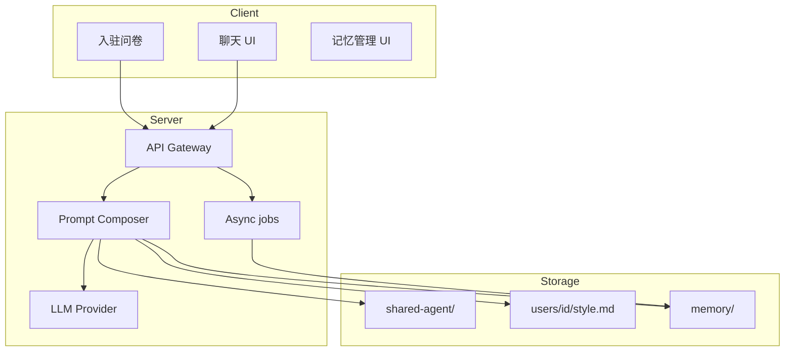
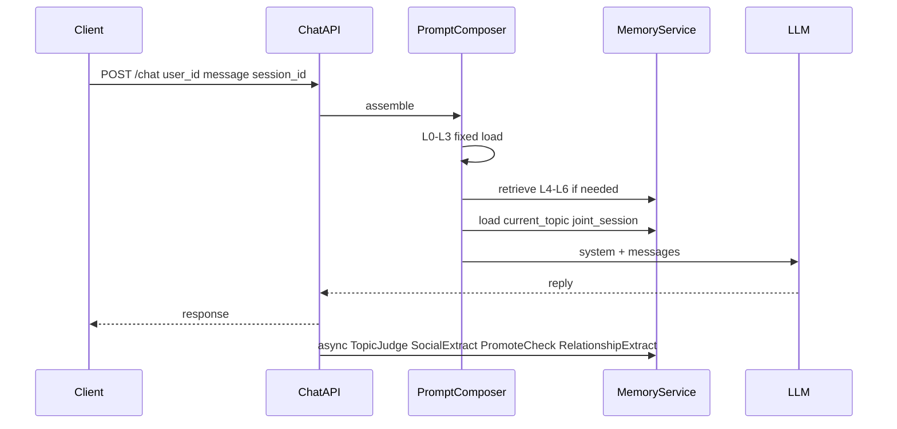
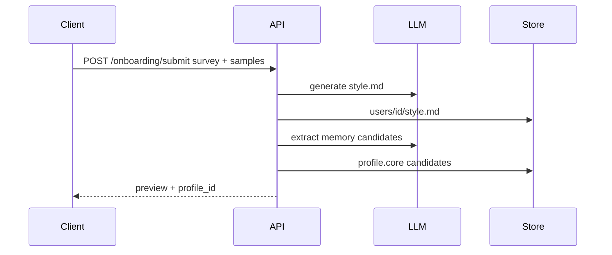
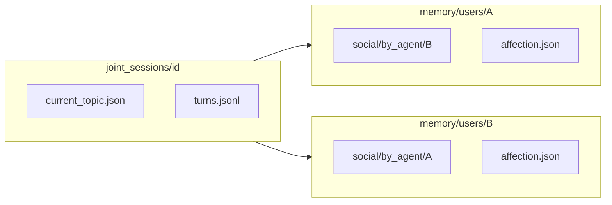

# Agent 平台架构

| 字段 | 值 |
|------|-----|
| **相关** | [README](./README.md)、[mechanisms.md](./mechanisms.md)、[echo-mapping.md](./echo-mapping.md) |

---

## 1. 三大域

| 域 | 路径 | 职责 |
|----|------|------|
| **共享 Skill 底座** | `shared-agent/` | 全平台 Agent 能力、安全、协议、工具、评测 |
| **用户风格** | `users/{id}/style.md` | 该用户如何说话（语气、用词、few-shot） |
| **用户记忆** | `memory/users/{id}/`、`memory/joint_sessions/` | 用户所知、社交记忆、主题、好感 |

**运行时中枢：** `Prompt Composer` 组装分层 prompt → 调用 LLM → 异步任务更新记忆、主题、好感。

---

## 2. 设计原则

| 原则 | 说明 |
|------|------|
| **共享底座 + 用户 overlay** | 全员一份 `shared-agent/`；每用户仅 `style.md` + memory |
| **风格与记忆分离** | 风格 = 怎么说；记忆 = 知道什么 |
| **观察者相对社交记忆** | A 对 B 的认知存在 A 的命名空间下 |
| **渐进式披露** | 固定小层 + 检索记忆；不全量灌入 |
| **服务端 Skill Loader** | 读 skill 文件拼 prompt；非 IDE 自动发现 |
| **事件驱动好感** | LLM 抽关系事件；规则引擎改分 |

---

## 3. 端到端聊天流程

---

## 4. 入驻流程

风格生成在**服务端**执行（API Key 不下放客户端）。

---

## 5. 联合 Agent 会话（A ↔ B）

- 联合会话 **一份** `current_topic.json`。
- **两份** 观察者相对社交记忆（A 关于 B，B 关于 A）。
- **两份** 好感快照（A→B，B→A）。

---

## 6. 代码布局（目标）

| 组件 | 建议路径 |
|------|----------|
| 共享 skill 运行时 | `services/worker/src/agent-platform/shared/` |
| Prompt Composer | `services/worker/src/agent-platform/composer/` |
| Memory 服务 | `services/api/src/agent-platform/memory/` |
| Topic / affection 任务 | `services/worker/src/agent-platform/jobs/` |
| API 控制器 | `services/api/src/agent-platform/` |

Phase 1 路径见 [echo-mapping.md](./echo-mapping.md)。

---

## 7. 相关文档

- [mechanisms.md](./mechanisms.md) — 完整机制列表
- [prompt-layers.md](./prompt-layers.md) — L0–L8 组装
- [storage-schema.md](./storage-schema.md) — 磁盘/DB 形态
- [implementation-milestones.md](./implementation-milestones.md) —  rollout 顺序
