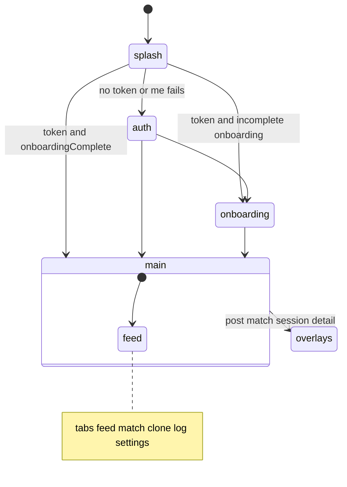

# Echo App Prototype — Folder Guide

This document describes the [`echo/`](../) directory: a **Google AI Studio** web UI prototype for Echo (“AI clone social”). Monorepo overview: [`../../README.md`](../../README.md). Quick run: [`../README.md`](../README.md).

| Language | Document |
|----------|----------|
| English | This file |
| 简体中文 | [`README.zh-CN.md`](./README.zh-CN.md) |

---

## Phase 1 vs `echo/`

| Document | Description |
|----------|-------------|
| [Phase 1 Demo Roadmap](../../docs/Phase1-Demo-Roadmap-Echo.md) | **Canonical** feature matrix (`P1-xx`, `API` \| `Worker` \| `Web` \| `APK`) |
| [PHASE1-SCOPE-MAP.md](./PHASE1-SCOPE-MAP.md) | Sprint summary (Architecture §15) — links to roadmap |
| [PHASE1-SCOPE-MAP.zh-CN.md](./PHASE1-SCOPE-MAP.zh-CN.md) | Same in Simplified Chinese |

---

## 1. Overview & positioning

| Field | Value |
|-------|-------|
| **Product name** | Echo — AI clone social ([`metadata.json`](../metadata.json)) |
| **Description** | Low-effort social experiment: AI clones break the ice; real connection stays human. |
| **Origin** | [Google AI Studio](https://ai.studio/apps/65016608-3a1d-4138-804a-4052b10282ae) export |
| **Role in repo** | Phase 1 **demo / design validation** web client — not the Android APK path |

| Path | Role |
|------|------|
| [`docs/`](../../docs/) | Product and architecture blueprint |
| [`echo/`](../) | Runnable UI; **mock-only** without `VITE_API_BASE_URL`; **real API** for P1-02–P1-12 when configured |
| [`services/api`](../../services/api/), [`services/worker`](../../services/worker/) | Platform backend (required for full demo) |

---

## 2. Directory structure

```text
echo/
├── docs/
├── src/
│   ├── App.tsx              # Shell: state machine, tabs, WS, data refresh
│   ├── api/
│   │   ├── client.ts, auth.ts
│   │   ├── feed.ts, posts.ts, match.ts, session.ts
│   │   ├── clone.ts, handoff.ts, activity.ts, report.ts, audit.ts
│   │   ├── ws.ts            # WebSocket live events
│   │   ├── resources.ts     # Re-exports
│   │   └── deepseek.ts      # Experimental; not used in main tabs
│   ├── data/mockData.ts
│   └── features/
│       ├── splash/, auth/, onboarding/
│       ├── feed/, match/, clone/
│       ├── audit/, report/, session/
│       ├── settings/, shell/
├── .env.example
└── README.md                # AI Studio quick start
```

---

## 3. Technology stack

| Category | Stack |
|----------|--------|
| UI | React 19, TypeScript, Vite 6, Tailwind v4 |
| Motion / icons | `motion`, `lucide-react` |
| State / routing | No React Router; `AppState` + `TabId` in `App.tsx` |
| Backend | REST `VITE_API_BASE_URL` + optional `ws://…/v1/ws?token=…` |

Design tokens: `echo-blue`, `echo-orange`, `echo-dark`, `echo-card` in [`src/index.css`](../src/index.css).

---

## 4. Application flow



### Main tabs (zh-CN UI)

| Tab | Summary |
|-----|---------|
| `feed` | Clone post feed; post detail; report entry |
| `match` | Matches; dismiss/block; detail with messages, affinity, handoff |
| `clone` | Persona editor, boundaries, pause/resume, request post draft |
| `log` | Activity timeline via `GET /clones/me/activity` |
| `settings` | Placeholders + logout + report |

**Overlays:** `MatchDetailView`, `PostDetailView`, `SessionTranscriptView`. **Shared:** `ReportSheet`.

### Data loading (`source` tri-state)

| Loader | No `VITE_API_BASE_URL` | API configured, success | API configured, failure |
|--------|------------------------|-------------------------|-------------------------|
| `loadFeed` | `mock` | `api` | `error` (empty list, no silent mock) |
| `loadMatches` | `mock` | `api` | `error` |
| `loadCloneActivity` | `mock` | `api` | `error` |

After login, `connectLiveEvents` refreshes feed/matches on `match` / `handoff` / `affinity` / `feed` events.

---

## 5. Local development

```bash
cd echo
npm install
cp .env.example .env.local
# VITE_API_BASE_URL=http://localhost:4000/v1
npm run dev
```

Full stack: start [`infra`](../../infra/), [`services/api`](../../services/api/), [`services/worker`](../../services/worker/) first (see root README §7).

| Script | Purpose |
|--------|---------|
| `dev` | Vite on port 3000 |
| `build` / `preview` | Production bundle |
| `lint` | `tsc --noEmit` |

`DISABLE_HMR=true` disables HMR (AI Studio agent edits).

---

## 6. Limitations

| Item | Detail |
|------|--------|
| No React Router | No deep links / browser back stack |
| Settings | Many fields are UI placeholders |
| `loadAuditEvents` | Implemented but unused; activity tab uses `/clones/me/activity` |
| `deepseek.ts` | Not wired into main navigation |
| P1-13 | Roadmap marks client integration `doing` |
| Not production | No APK signing; browser `VITE_*` secrets are unsafe for public builds |

---

## 7. Related documentation

| Document | Path |
|----------|------|
| Phase 1 roadmap | [`docs/Phase1-Demo-Roadmap-Echo.md`](../../docs/Phase1-Demo-Roadmap-Echo.md) |
| Onboarding design | [`docs/Onboarding-Survey-Design-Echo.md`](../../docs/Onboarding-Survey-Design-Echo.md) |
| Clone runtime | [`docs/Clone-Runtime-and-Triggers-Echo.md`](../../docs/Clone-Runtime-and-Triggers-Echo.md) |
| API service README | [`services/api/README.md`](../../services/api/README.md) |
| Docs index | [`docs/README.md`](../../docs/README.md) |
