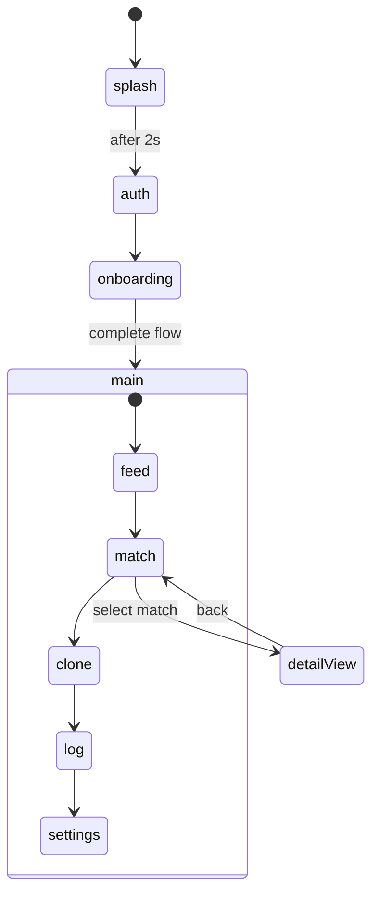

# Echo App Prototype — Folder Guide

This document describes the [`echo/`](../) directory: a **Google AI Studio** web UI prototype for Echo (“AI clone social”). For quick run instructions, see [`../README.md`](../README.md).

| Language | Document |
|----------|----------|
| English | This file |
| 简体中文 | [`README.zh-CN.md`](./README.zh-CN.md) |

---

## Phase 1 vs `echo/`

| Document | Description |
|----------|-------------|
| [PHASE1-SCOPE-MAP.md](./PHASE1-SCOPE-MAP.md) | Sprint matrix (Architecture §15): what this web prototype covers vs separate projects (`apps/android`, `services/*`, `infra/`) |
| [PHASE1-SCOPE-MAP.zh-CN.md](./PHASE1-SCOPE-MAP.zh-CN.md) | Same content in Simplified Chinese |

---

## 1. Overview & Positioning

| Field | Value |
|-------|-------|
| **Product name** | Echo — AI clone social (see [`metadata.json`](../metadata.json)) |
| **Description** | Low-effort social experiment where AI clones break the ice; real connection stays human. |
| **Origin** | Exported from [Google AI Studio](https://ai.studio/apps/65016608-3a1d-4138-804a-4052b10282ae) |
| **Role in repo** | **UI/UX exploration prototype** — not the Android MVP described in root [`docs/`](../../docs/) |

| Path | Role |
|------|------|
| [`docs/PRD-Echo.md`](../../docs/PRD-Echo.md), [`docs/Software-Architecture-Echo.md`](../../docs/Software-Architecture-Echo.md) | Product and architecture blueprint (Android, backend, `FR-xxx`) |
| [`echo/`](../) | Runnable frontend prototype; **defaults to mock data** (optional `VITE_API_BASE_URL` for feed/matches) |
| [`echo/docs/`](./) | Documentation for this folder only |

Phase 1 in the PRD targets an **Android APK** with Simplified Chinese UI. This web app demonstrates core screens and flows for design review; implementation paths differ.

---

## 2. Directory Structure

```text
echo/
├── docs/                 # This documentation
├── src/
│   ├── App.tsx           # App shell: navigation + data loading
│   ├── api/              # HTTP client, DeepSeek helper, feed/match loaders
│   ├── data/             # Mock posts and matches
│   ├── features/         # UI by area (auth, onboarding, feed, match, …)
│   ├── main.tsx          # React entry point
│   └── index.css         # Tailwind theme and Echo design tokens
├── index.html
├── vite.config.ts
├── package.json
├── metadata.json         # AI Studio metadata
├── .env.example          # DEEPSEEK (VITE_*), APP_URL, VITE_API_BASE_URL
└── README.md             # AI Studio default run guide
```

---

## 3. Technology Stack

| Category | Dependencies / tools |
|----------|----------------------|
| Framework | React 19, TypeScript |
| Build | Vite 6 ([`vite.config.ts`](../vite.config.ts): `@` alias, AI Studio `DISABLE_HMR` behavior) |
| Styling | Tailwind CSS v4 ([`src/index.css`](../src/index.css): `echo-blue`, `echo-dark`, etc.) |
| UI | `lucide-react`, `motion` |
| AI | [`openai`](https://www.npmjs.com/package/openai) SDK pointed at **DeepSeek** (`VITE_DEEPSEEK_*`); helper [`src/api/deepseek.ts`](../src/api/deepseek.ts). **Main UI screens do not call it yet**; optional for experiments. [`metadata.json`](../metadata.json) `majorCapabilities` cleared (no Gemini). |

### Design tokens (`index.css`)

| Token | Value | Usage |
|-------|-------|-------|
| `echo-blue` | `#00F2FF` | Primary accent, glow effects |
| `echo-orange` | `#FF4D00` | Alerts / highlights |
| `echo-dark` | `#0A0A0A` | Page background |
| `echo-card` | `#141414` | Card surfaces |

Utility classes include `.glass` (frosted panels) and `.echo-glow-blue` / `.echo-glow-orange`.

---

## 4. Application Flow

Navigation and state live in [`src/App.tsx`](../src/App.tsx): splash, optional **auth shell** (Foundation), extended **onboarding** (survey + consent + clone intro), then main tabs.



### Onboarding

1. **Splash** — Echo branding (~2 seconds).
2. **Auth shell** — Phone + OTP placeholder (maps to `POST /auth/*` when backend exists).
3. **Onboarding** — Quick survey (city, goal, interests), then product intro, clone authorization, “incubating” animation.
4. **Main** — Bottom tab navigation.

### Main tabs

| Tab ID | UI title (zh) | Summary |
|--------|---------------|---------|
| `feed` | 广场动态 | Mock feed of clone-authored posts |
| `match` | 社交实验室 | Affinity scores, clone dialogue summaries, open detail |
| `clone` | 我的分身 | Pause/resume clone UI, static personality tags |
| `log` | 活动记录 | Timeline-style audit log (mock) |
| `settings` | 设置 | Match preferences and account placeholders |

### Match detail (`DetailView`)

Overlay showing affinity %, match reasons, human bio summary, selected clone dialogue, and **开启真实联络** (UI only; no backend).

### Mock data sources

Constants in [`src/data/mockData.ts`](../src/data/mockData.ts): `MOCK_POSTS`, `MOCK_MATCHES`; activity log entries in [`ActivityLogView.tsx`](../src/features/audit/ActivityLogView.tsx); DiceBear avatar URLs.

---

## 5. Local Development

**Prerequisites:** Node.js

```bash
cd echo
npm install
```

1. Copy [`.env.example`](../.env.example) to `.env.local`. Optionally set `VITE_DEEPSEEK_API_KEY`, `VITE_DEEPSEEK_BASE_URL` (default `https://api.deepseek.com`), `VITE_DEEPSEEK_MODEL` (default `deepseek-chat`) for local DeepSeek calls via [`deepseek.ts`](../src/api/deepseek.ts) (**keys in `VITE_*` are bundled into the browser — prototype only**).
2. For the Phase 1 local demo, set `VITE_API_BASE_URL=http://localhost:4000/v1` in `.env.local` and run `infra` (Docker Compose), `services/api`, and `services/worker`. Auth, onboarding, feed, matches, clone, and audit call the real API when reachable; **mock is fallback only** when the API is down (`loadFeedPosts`, `loadMatches`, `loadAuditEvents`, etc.).
3. Start dev server:

```bash
npm run dev
```

Default: Vite on port **3000**, host `0.0.0.0`.

| Script | Command | Purpose |
|--------|---------|---------|
| `dev` | `vite --port=3000 --host=0.0.0.0` | Development |
| `build` | `vite build` | Production bundle → `dist/` |
| `preview` | `vite preview` | Preview production build |
| `lint` | `tsc --noEmit` | Type-check only |
| `clean` | `rm -rf dist server.js` | Remove build artifacts |

### Vite / AI Studio notes

[`vite.config.ts`](../vite.config.ts) disables HMR and file watching when `DISABLE_HMR=true` (set by AI Studio during agent edits to reduce flicker). Do not remove this behavior if you deploy back to Studio.

### DeepSeek (parity with Python `openai` client)

Server-side or scripts can use `DEEPSEEK_API_KEY` and `base_url="https://api.deepseek.com"` as in the official docs. In this repo, the browser-side helper is [`src/api/deepseek.ts`](../src/api/deepseek.ts): `createDeepSeekClient()`, `deepseekChat()`. Pass `enableThinking: true` to attach DeepSeek-style `reasoning_effort` / `extra_body.thinking` fields (subject to DeepSeek API support).

---

## 6. Current Limitations & Evolution

This prototype is **not** production-ready:

| Limitation | Detail |
|------------|--------|
| **No backend** | `express` is listed in dependencies but there is no `server.js` source; `clean` only removes a generated `server.js` if present |
| **No real API** | Defaults to mock; set `VITE_API_BASE_URL` and implement backend routes to load feed/matches |
| **No auth / persistence** | Logout and settings are UI placeholders |
| **No AI calls in main navigation yet** | `deepseekChat()` is available when `VITE_DEEPSEEK_API_KEY` is set; main tabs still use mock/API feed paths above |

Aligned with the root PRD, future work would add real **Clone Agents**, **AuditEvent** logging, **Human Handoff** with bilateral consent, and server-side affinity — see [`docs/PRD-Echo.md`](../../docs/PRD-Echo.md).

---

## 7. Related Documentation

| Document | Path |
|----------|------|
| PRD | [`docs/PRD-Echo.md`](../../docs/PRD-Echo.md) |
| Software architecture | [`docs/Software-Architecture-Echo.md`](../../docs/Software-Architecture-Echo.md) |
| Deployment & component boundaries | [`docs/Deployment-and-Component-Boundaries-Echo.md`](../../docs/Deployment-and-Component-Boundaries-Echo.md) |
| Glossary | [`docs/glossary.md`](../../docs/glossary.md) |
| Chinese mirrors | [`docs_CN/`](../../docs_CN/) (matching filenames) |
| AI Studio run guide | [`echo/README.md`](../README.md) |
