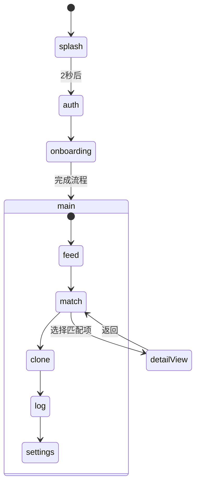

# Echo 应用原型 — 目录说明

本文档说明仓库中的 [`echo/`](../) 目录：面向 Echo「AI 分身社交」的 **Google AI Studio** Web UI 原型。快速运行步骤见 [`../README.md`](../README.md)。

| 语言 | 文档 |
|------|------|
| English | [`README.md`](./README.md) |
| 简体中文 | 本文件 |

---

## Phase 1 与 `echo/`

| 文档 | 说明 |
|------|------|
| [PHASE1-SCOPE-MAP.zh-CN.md](./PHASE1-SCOPE-MAP.zh-CN.md) | Sprint 对照表（架构 §15）：Web 原型覆盖范围 vs 独立项目 |
| [PHASE1-SCOPE-MAP.md](./PHASE1-SCOPE-MAP.md) | 英文版同上 |

---

## 1. 概述与定位

| 字段 | 值 |
|------|-----|
| **产品名称** | Echo — AI 分身社交（见 [`metadata.json`](../metadata.json)） |
| **产品描述** | 基于 AI 分身的低负担社交实验。AI 替你破冰，心动留给真实。 |
| **来源** | 自 [Google AI Studio](https://ai.studio/apps/65016608-3a1d-4138-804a-4052b10282ae) 导出 |
| **在仓库中的角色** | **UI/UX 探索原型** — 非根目录 [`docs/`](../../docs/) 所描述的 Android MVP |

| 路径 | 角色 |
|------|------|
| [`docs/PRD-Echo.md`](../../docs/PRD-Echo.md)、[`docs/Software-Architecture-Echo.md`](../../docs/Software-Architecture-Echo.md) | 产品与架构蓝图（Android、后端、`FR-xxx`） |
| [`echo/`](../) | 可运行的前端原型；**默认 Mock**（可配置 `VITE_API_BASE_URL` 拉取动态/匹配） |
| [`echo/docs/`](./) | 仅说明本目录的文档 |

PRD 中 Phase 1 的目标是 **Android APK** 与简体中文 UI。本 Web 应用用于演示核心界面与流程，供设计评审；与正式实现路径不同，可对照阅读。

---

## 2. 目录结构

```text
echo/
├── docs/                 # 本说明文档
├── src/
│   ├── App.tsx           # 应用壳：导航与数据加载
│   ├── api/              # HTTP 客户端、DeepSeek 封装、动态/匹配加载
│   ├── data/             # Mock 帖子与匹配
│   ├── features/         # 按模块划分的 UI（auth、onboarding、feed、match 等）
│   ├── main.tsx          # React 入口
│   └── index.css         # Tailwind 主题与 Echo 设计 token
├── index.html
├── vite.config.ts
├── package.json
├── metadata.json         # AI Studio 元数据
├── .env.example          # DeepSeek（VITE_*）、APP_URL、VITE_API_BASE_URL
└── README.md             # AI Studio 默认运行说明
```

---

## 3. 技术栈

| 类别 | 依赖/工具 |
|------|-----------|
| 框架 | React 19、TypeScript |
| 构建 | Vite 6（[`vite.config.ts`](../vite.config.ts)：`@` 别名、AI Studio 的 `DISABLE_HMR` 行为） |
| 样式 | Tailwind CSS v4（[`src/index.css`](../src/index.css)：`echo-blue`、`echo-dark` 等） |
| UI | `lucide-react`、`motion` |
| AI | 使用 [`openai`](https://www.npmjs.com/package/openai) 客户端指向 **DeepSeek**（`VITE_DEEPSEEK_*`）；封装见 [`src/api/deepseek.ts`](../src/api/deepseek.ts)。**主导航界面尚未调用**；仅供实验。[`metadata.json`](../metadata.json) 已清空 `majorCapabilities`（不再声明 Gemini）。 |

### 设计 token（`index.css`）

| Token | 值 | 用途 |
|-------|-----|------|
| `echo-blue` | `#00F2FF` | 主色、光晕 |
| `echo-orange` | `#FF4D00` | 提醒/高亮 |
| `echo-dark` | `#0A0A0A` | 页面背景 |
| `echo-card` | `#141414` | 卡片背景 |

工具类包括 `.glass`（毛玻璃面板）以及 `.echo-glow-blue` / `.echo-glow-orange`。

---

## 4. 应用流程

导航与状态在 [`src/App.tsx`](../src/App.tsx)：启动页、**认证壳**（Foundation）、**入驻引导**（问卷 + 授权 + 介绍），再进入主 Tab。



### 引导流程

1. **启动页（Splash）** — Echo 品牌展示（约 2 秒）。
2. **认证壳** — 手机号 + 验证码占位（有后端时映射 `POST /auth/*`）。
3. **入驻引导** — 快速问卷（城市、目标、兴趣）→ 产品介绍 → 分身授权 →「孵化中」动画。
4. **主界面（Main）** — 底部 Tab 导航。

### 主界面 Tab

| Tab ID | 界面标题 | 功能摘要 |
|--------|----------|----------|
| `feed` | 广场动态 | 分身发布的 Mock 帖子流 |
| `match` | 社交实验室 | 契合度、分身对话摘要、进入详情 |
| `clone` | 我的分身 | 暂停/启动分身 UI、静态性格标签 |
| `log` | 活动记录 | 时间线式审计日志（Mock） |
| `settings` | 设置 | 匹配偏好与账号占位项 |

### 匹配详情（`DetailView`）

全屏层展示契合度、匹配理由、真人简介摘要、分身对话精选，以及 **开启真实联络** 按钮（仅 UI，无后端）。

### Mock 数据来源

Mock 数据位于 [`src/data/mockData.ts`](../src/data/mockData.ts)；活动记录在 [`ActivityLogView.tsx`](../src/features/audit/ActivityLogView.tsx)；DiceBear 头像 URL。

---

## 5. 本地开发

**前置条件：** Node.js

```bash
cd echo
npm install
```

1. 将 [`.env.example`](../.env.example) 复制为 `.env.local`。可选：配置 `VITE_DEEPSEEK_API_KEY`、`VITE_DEEPSEEK_BASE_URL`（默认 `https://api.deepseek.com`）、`VITE_DEEPSEEK_MODEL`（默认 `deepseek-chat`），通过 [`deepseek.ts`](../src/api/deepseek.ts) 在本地调用 DeepSeek（**`VITE_*` 会打入浏览器包，仅限原型**）。
2. 推荐本地全功能演示：在 `.env.local` 设置 `VITE_API_BASE_URL=http://localhost:4000/v1`，并启动 `infra`（Docker Compose）、`services/api`、`services/worker`。认证、入驻、广场、匹配、分身、活动记录会在有 API 时走真实接口；**仅当 API 不可达**时回退 Mock（`loadFeedPosts` / `loadMatches` / `loadAuditEvents` 等）。
3. 启动开发服务器：

```bash
npm run dev
```

默认：Vite 端口 **3000**，主机 `0.0.0.0`。

| 脚本 | 命令 | 用途 |
|------|------|------|
| `dev` | `vite --port=3000 --host=0.0.0.0` | 开发 |
| `build` | `vite build` | 生产构建 → `dist/` |
| `preview` | `vite preview` | 预览生产构建 |
| `lint` | `tsc --noEmit` | 仅类型检查 |
| `clean` | `rm -rf dist server.js` | 清理构建产物 |

### Vite / AI Studio 说明

[`vite.config.ts`](../vite.config.ts) 在 `DISABLE_HMR=true` 时会关闭 HMR 与文件监听（AI Studio 在 Agent 编辑期间设置，以减少闪烁）。若需回传 Studio，请勿删除该逻辑。

### DeepSeek（与 Python OpenAI SDK 对应）

服务端或脚本可使用环境变量 `DEEPSEEK_API_KEY` 与 `base_url="https://api.deepseek.com"`（见官方文档）。本仓库前端封装为 [`src/api/deepseek.ts`](../src/api/deepseek.ts)：`createDeepSeekClient()`、`deepseekChat()`；可选 `enableThinking: true` 时附带与 Python 示例类似的 `reasoning_effort` / `extra_body.thinking` 字段（以 DeepSeek 当前 API 为准）。

---

## 6. 当前限制与演进方向

本原型 **不具备** 生产环境能力：

| 限制 | 说明 |
|------|------|
| **无后端** | 依赖中有 `express`，但无 `server.js` 源码；`clean` 仅删除可能生成的 `server.js` |
| **无真实 API** | 默认 Mock；配置 `VITE_API_BASE_URL` 且后端实现对应路由时可拉取动态/匹配 |
| **无认证/持久化** | 退出登录、设置等为 UI 占位 |
| **主导航尚未直连 AI** | 配置 `VITE_DEEPSEEK_API_KEY` 后可调用 `deepseekChat()`；主 Tab 仍走 Mock / `GET /feed` 等 |

与根目录 PRD 对齐的后续工作包括真实 **Clone Agent**、**AuditEvent** 审计、双边同意的 **Human Handoff** 及服务端契合度计算 — 见 [`docs/PRD-Echo.md`](../../docs/PRD-Echo.md)。

---

## 7. 相关文档索引

| 文档 | 路径 |
|------|------|
| 产品需求 | [`docs/PRD-Echo.md`](../../docs/PRD-Echo.md) |
| 软件架构 | [`docs/Software-Architecture-Echo.md`](../../docs/Software-Architecture-Echo.md) |
| 部署与组件边界 | [`docs/Deployment-and-Component-Boundaries-Echo.md`](../../docs/Deployment-and-Component-Boundaries-Echo.md) |
| 术语表 | [`docs/glossary.md`](../../docs/glossary.md) |
| 中文镜像 | [`docs_CN/`](../../docs_CN/)（同名文件） |
| AI Studio 运行说明 | [`echo/README.md`](../README.md) |
